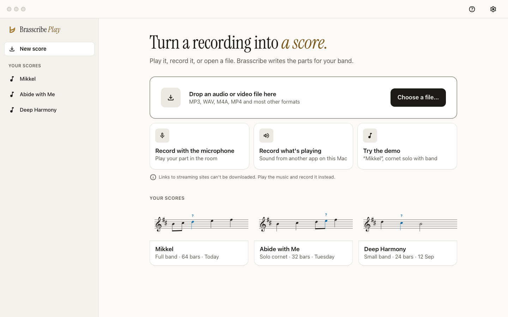

# Brasscribe design

This folder is the single source for how Brasscribe Play and Studio look, sound and behave.
- [`system.md`](system.md): components, patterns, layout, navigation and the screen map
- [`brand/brand.md`](brand/brand.md): name, mark, icon, typeface, voice and copy rules
- [`mockups/png/`](mockups/png/): the key screens (phone and desktop, light and dark, two screens in Norwegian, and Studio)
- [`claude/`](claude/README.md): the design system as a Claude artifact, generated from this folder



## Principles

1. **Easy before impressive.** A brass-band player of any age should be able to finish without help: one decision per screen, one primary button, and words from the band room.
2. **Calm is the premium.** Warm paper and ink, generous space, one serif for headings, and brass used sparingly. Nothing flashes, bounces or competes with the music.
3. **The score owns colour.** The accessibility palette (uncertain, very uncertain, loop, cursor) appears only on the notation. Everything around it is neutral.
4. **Never colour alone.** Every state carries a shape or a word as well: "?", a boxed "?", dashed bars, a bold part name.
5. **Native first, brand second.** Use each platform's own controls, fonts, icons and navigation. The brand shows only through the tokens, the button shape, the display face and the mark.
6. **Honest and on your side.** Say what the app is unsure of, and give every error a way forward. Recordings stay on your own devices.

## Tokens

- **Source:** [`tokens/tokens.json`](tokens/tokens.json), in W3C Design Tokens (DTCG 2025.10) format.
  - Colour roles are sibling groups `color.light`, `color.dark`, `color.high-contrast` (on a dark ground), `color.high-contrast-light` (on a light ground), and the hidden `color.pink` / `color.pink-dark` (§10 of system.md).
  - Studio's `brasscribe.css` picks the high-contrast palette that matches the resolved theme under `prefers-contrast: more`. Compose gets `BrasscribeHighContrastLightColors`, but `BrasscribeTheme` still chooses the dark one. The Apple asset catalog and WinUI (system colours) are unchanged.
  - Typography roles name their Dynamic Type style, Material role and Windows ramp style.
- **Icons:** [`tokens/icons.json`](tokens/icons.json) lists every action with its en and nb label and its SF Symbol, Material Symbol and Segoe Fluent glyph.

```sh
uv run design/tokens/build.py            # regenerate every brand's dist and docs/accessibility/design-tokens.json
uv run design/tokens/build.py --check    # CI: exit 1 if anything is stale
uv run --with pytest pytest design/tokens
uv run qa/tools/contrast.py --brands     # every brand in every mode (Brasscribe: 76 pairs x 6 modes), exit 1 on failure
uv run design/brand/build.py             # mark, lockups, app icons (needs rsvg-convert)
node design/mockups/render.mjs           # mockup PNGs (Playwright from studio/node_modules, or PLAYWRIGHT_MODULE=…)
```

**One generator, every brand.** [`tokens/README.md`](tokens/README.md) says how the generator serves any number of brands on every platform, and has the naming rule: a small set of neutral names (`Scribe…`, `--scribe-…`) that are the same in every brand's files, and each brand's own names for everything else.

**Fretscribe** has its own design in [`fretscribe/`](fretscribe/): brand, tokens, the rules it changes ([`fretscribe/system.md`](fretscribe/system.md)), flows and mockups. The same generator writes its Apple, Android, Windows and web files into `fretscribe/dist`. Its Android theme still has the Kotlin names above, so the two Android apps share their screens; [`fretscribe/tokens/README.md`](fretscribe/tokens/README.md) has the map from those names to Fretscribe's tokens. No Apple or Windows app uses Fretscribe's files yet.

```sh
uv run design/tokens/build.py --brand fretscribe [--check]
uv run design/fretscribe/brand/build.py  # Fretscribe's Android launcher icon (needs rsvg-convert)
```

**Contrast:** all 456 pairs pass (76 pairs in each of the six modes, the hidden Pink pair included). See [`qa/reports/contrast-design-tokens.md`](../qa/reports/contrast-design-tokens.md).

**Accessibility compatibility:**
- `docs/accessibility/design-tokens.json` is generated from these tokens in its existing shape. The score hues are unchanged; the neutrals are warmer.
- Its report, [`qa/reports/contrast-tokens.md`](../qa/reports/contrast-tokens.md), shows 84 of 84 pairs passing.

### Using the tokens per platform

Each app copies (or links) from `design/dist/`. The generator never edits `apps/`.

| Platform | Copy | Use |
|---|---|---|
| Apple | `dist/apple/BrasscribeDesign.xcassets`, `BrasscribeDesign.swift`, `Fonts/InstrumentSerif-Regular.ttf` (add it to `UIAppFonts` / `ATSApplicationFontsPath`), and `dist/icons/apple/AppIcon.appiconset` into the app's asset catalog | `Color.Scribe.primary`, `Font.Scribe.display`, `ScribeDesign.Space.s4`, `ScribeDesign.Motion.animation(reduceMotion:)` for what every brand has; `Color.Brasscribe.cursor`, `BrasscribeDesign.Score`, `BrasscribeIcon.loop.systemName` for Brasscribe's own. The colour sets carry dark and high-contrast appearances. |
| Android | `dist/android/kotlin/no/brasscribe/design/*.kt`, `dist/android/res/drawable/ic_bc_*.xml`, `res/font/instrument_serif.ttf`, and `dist/icons/android/res/**` (the launcher icons) | `BrasscribeTheme(display = FontFamily(Font(R.font.instrument_serif))) { … }`, `BrasscribeTheme.colors.uncertain`, `BrasscribeButtonShape`, `painterResource(R.drawable.ic_bc_play)` |
| Windows | `dist/windows/BrasscribeTheme.xaml` → `Themes/`, `Assets/Fonts/…`, and `dist/icons/windows/Assets/*` | Merge the dictionary into `App.xaml`. Use `{ThemeResource BcTextBrush}`, `{StaticResource BcTitle1TextBlockStyle}`, `FontIcon Glyph="{StaticResource BcIconPlay}"`. Contrast themes use the user's system colours. |
| Studio | `dist/web/brasscribe.css` (+ `fonts.css`, `icons.js`, `icons/*.svg`) and `dist/icons/web/*` | `var(--scribe-text)` for what every brand has, `var(--bc-cursor)` for Brasscribe's own. Handles `data-theme`, dark mode, `prefers-contrast`, `forced-colors` and `prefers-reduced-motion`. |

## Implementation checklist

These are the changes each app needs. The ones marked **(drift)** are places where the app today differs from the agreed accessibility spec.

### All apps
- [ ] Replace the hand-copied colours with the generated tokens (Apple `Color.Scribe.*`, Android `BrasscribeTheme`, Windows `BrasscribeTheme.xaml`).
- [ ] Mark uncertainty with a "?" above the note, and a boxed "?" below 0.4, in the note colour. Remove rings, diamonds and brackets. **(drift)**
- [ ] Use one primary button per screen, with 12 px corners. No pill shapes and no platform accent colour.
- [ ] Use the display face only for screen titles of 28 pt and up and for the wordmark.
- [ ] Put the app icon from `dist/icons/<platform>` in place.
- [ ] Put the copy through the voice rules in `brand/brand.md`, and use the glossary for both en and nb. Rename "companion engine" and "motor" to "Brasscribe on your computer" / "Brasscribe på datamaskinen".
- [ ] Give every error a title, a reason and a recovery button (`mockups/png/error-*`).
- [ ] Follow the player-bar order: Play first, bar fields for the loop, a beat counter that never flashes, and "Mute my part".
- [ ] Transcribing shows the plain-language steps, the percentage and, for a score made on the device, the time left, and Cancel. Announce at most every 10% or 10 s.
- [ ] Check reduced motion, 200% text and high contrast against the mockups.

**From the usability review** (`reviews/usability-review.md`; the specs in `system.md` and `brand/brand.md` are updated):
- [ ] Take the new tokens: `focus` is now ink / paper / white (it was blue, like `uncertain`), `adlib-tint` is a neutral warm grey (it was pale blue), dark `secondary` is one step lighter and the dark `loop-tint` lighter in weight.
- [ ] Mixer: labelled **Mute** / **Only this** toggles (nb **Demp** / **Bare denne**), never M/S, Solo or Lyd av. Icons from `icons.json` (`mute`, `solo`).
- [ ] Every on/off toggle (Count-in, Metronome, Mute my part, Mute, Only this): **on = tonal fill + 1.5 px ink edge + ✓**. Ink fill is only for the one primary.
- [ ] Phone player: practice chips in **two rows** (Speed · Repeat · Count-in / Metronome · Mute my part) or a **Practice ▾** sheet. Nothing clips or scrolls behind a fade.
- [ ] Part view: the same player as the score view. Play is the only primary; **Mute my part** (headphones) is on by default; Speed and Repeat are there. Desktop gets a **Full score** back button.
- [ ] Review: **Finish later (N left)** with the confirm dialog (`mockups/png/finish-later-*`), **Skip** on phone, "Written G, minim" + "it could also be an A", the list sorted by part then bar with "+ N more".
- [ ] Score view: the status line **"N notes marked ? · Check them"** (re-opens Review); "?" marks are tappable (44 pt).
- [ ] Share or print: title **Share or print**, default **Solo Cornet (you) + PDF** (1 file), **Print** as the primary, the same scope labels everywhere (Solo Cornet (you) / Every part / Conductor's score), a **Show ? marks** switch, a legend in the PDF footer. No ✕ when there's a Cancel.
- [ ] The new **How should the score be?** screen (`mockups/png/choose-output-*`): Which band? / How hard? (with the tip) / Key, primary **Show the score**.
- [ ] Touch targets ≥ 44 pt everywhere, **48 pt** for the player and the review buttons; previous/next bar get a visible 48 pt hit area.
- [ ] Errors: commands, addresses and codes only inside **Details for the band's tech person** (collapsed). The desktop primary is bottom right.
- [ ] Cancel while transcribing confirms: "Stop making this score? The recording stays in Your scores."
- [ ] Copy: apply the glossary in `brand/brand.md` (Open a recording, Repeat bars / Stop repeating, Spill av, Behold, Read aloud / Les opp, Show video, As written for B♭ / Concert pitch, Laying out the pages, "62%" / "62 %", no "we", no "DRM", no "Transcribed").

### Apple (`apps/apple`)
- [ ] `FlowViews.swift`: change "Uncertain notes are marked with an open diamond and an orange colour." to the "?" legend. **(drift)**
- [ ] `NotationView.swift`: draw the "?" / boxed "?" instead of the open diamond. **(drift)**
- [ ] Align "This decides how the music is taken apart…" with the other platforms' "Your answer decides how Brasscribe listens. It never guesses."
- [ ] Home: `NavigationSplitView` with the library in the sidebar on iPad and macOS; one primary Import button; the other ways in as list rows.
- [ ] Make the pairing copy command-free (the command moves under "Details for the band's tech person").
- [ ] The player bar tint becomes `Color.Scribe.primary`, not the system blue.

### Android (`apps/android`)
- [ ] `strings.xml` and `values-nb`: `legend_uncertain` and `legend_very_uncertain` (rings and brackets) become the "?" legend. **(drift)**
- [ ] `NoteGlyph.kt`: draw the "?" mark instead of the rings. **(drift)**
- [ ] Theme: switch from `PlayTheme` to `BrasscribeTheme` (not dynamic colour). The primary purple `#6B3FA0` is the score **cursor** colour and must not be used for buttons. **(drift)**
- [ ] Home: one filled button (**Open a recording**) instead of three; add the streaming tip and a Help button beside Settings.
- [ ] nb: use "Gjenta" / "Slutt å gjenta" consistently (not "Repetisjon"), "Spill av" (not "Spill"), "Demp" and "Demp stemmen min" (not "Lyd av"), and "På datamaskinen din" (not "motoren").
- [ ] Use the adaptive icon with the monochrome layer.

### Windows (`apps/windows`)
- [ ] Merge `BrasscribeTheme.xaml`, and retire the colour keys in `Themes/Tokens.xaml`.
- [ ] Use `NavigationView` with the library, and a `Frame` for the flow steps.
- [ ] Replace the `Assets/` logos with `dist/icons/windows/Assets/*`, including the unplated target sizes.
- [ ] Use `FontIcon` glyphs from `BcIcon*`, and `PathIcon` (`BcIconPath*`) for the custom metronome, count-in and only-this glyphs.
- [ ] Mixer toggles are 40 epx tall on touch.

### Studio (`studio/`)
- [ ] Load `brasscribe.css` and then Studio's own `tokens.css`, and delete the colour blocks in `styles.css`.
- [ ] Put the lockup in the header, the favicon set in place, and the page title in the display face.
- [ ] Map the piano-roll colours onto `model-1` to `model-4`, and keep the patterns.
- [ ] Validator issues (range, crossing) use the warning icon, not the "?" glyphs, which mean uncertain notes in Play.

## Open questions

1. Do brass-band players read "?" and a boxed "?" as "check this note"? This is carried over from `docs/accessibility/visual-design-tokens.md`.
2. On Apple and Android, more contrast in light mode still switches to the dark high-contrast palette. `high-contrast-light` now exists (Studio uses it) and is not yet wired into the asset catalog's `high` appearance or `BrasscribeTheme`; test it with low-vision users first.
3. Instrument Serif at 28 pt with Dynamic Type AX sizes: confirm on a device that the relative scaling to `largeTitle` stays readable.
4. The Windows XAML is checked for well-formed XML only; it has not been compiled with WinUI on this machine (no Windows).
