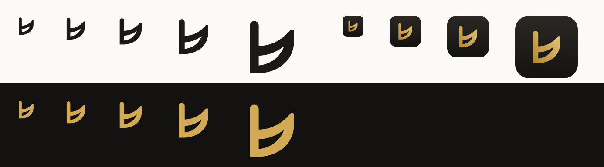

# Brasscribe brand

## Name

- **Brasscribe** is one word with a capital B. Never write BrassScribe, BRASSCRIBE or brass-scribe. The CLI command `brasscribe` is the only lower-case form.
- The two products are **Brasscribe Play**, the musician app, and **Brasscribe Studio**, the workbench.
  - Inside the apps, say "Brasscribe": "Brasscribe wasn't sure about these notes".
  - Use the product name only where both products appear together: store listings, About, the docs.
- The names are the same in Norwegian. They are not translated or inflected ("Brasscribes partitur" is wrong; write "partituret fra Brasscribe").

## Mark

The mark is a **flat sign whose bowl flares open like a bell**. It stands for three things at once:
- **B-flat and E-flat.** Every brass-band instrument is pitched in one of these keys.
- **The letter b** of Brasscribe.
- **Notation and the instrument together:** a notation symbol that is also a bell.

The mark is drawn on a 64-unit grid as a single even-odd path, so every platform can reuse it: SVG, Android `pathData` and XAML `Path.Data`. It stays legible at 16 px (see `legibility.png`).

| File | Use |
|---|---|
| `logo/mark.svg` | Ink on light backgrounds |
| `logo/mark-brass.svg`, `logo/mark-on-dark.svg` | Brand moments: onboarding, About, splash |
| `logo/mark-white.svg` | Monochrome contexts: Android themed icons, embossing |
| `logo/wordmark.svg`, `logo/wordmark-on-dark.svg` | "Brasscribe" set in Instrument Serif, converted to outlines |
| `logo/lockup-play*.svg`, `logo/lockup-studio*.svg` | Mark + wordmark + product name in brass italic |

**Rules**
- **Clear space:** keep at least the width of the mark's stem (9/64 of its height) free on every side.
- **Minimum size:** the mark at 16 px; the lockup at 20 px tall.
- **Colour:** ink, brass or white only. No gradients except in the app icon. No outlines, shadows or rotation.
- **Placement:** the mark never appears inside the score, and it never replaces an icon for an action.

## App icon

- **Design:** a warm ink tile (`#2B2824` to `#141311`, top to bottom) with the mark in a brushed-brass gradient (`#E7C77E` to `#B48633`).
- **Masters:** `icon/icon-full-bleed.svg` is used for iOS, Android and Windows tiles; `icon/icon-macos.svg` is the rounded tile with its shadow baked in; `icon/icon-small.svg` has a larger mark for 16–32 px.
- **Build:** `uv run design/brand/build.py` renders every export into `design/dist/icons/`:

| Platform | Files |
|---|---|
| Apple | `apple/AppIcon.appiconset/`: iOS 1024 single-size, macOS 16–512 @1x/@2x, `Contents.json`. Compiles with `actool`. |
| Android | `android/res/`: adaptive icon (vector foreground inside the 66 dp safe zone, `@color/ic_launcher_background`, monochrome layer for themed icons), legacy `mipmap-*/ic_launcher.png`, and `play-store-512.png` |
| Windows | `windows/Assets/`: `Square44x44Logo` at scale-100 to 400, plus `targetsize-16` to `256` including `altform-unplated` and `altform-lightunplated`. Also `Square150x150Logo`, `Wide310x150Logo`, `SmallTile`, `LargeTile`, `StoreLogo` and `AppIcon.ico`. |
| Web | `web/`: `favicon.svg`, `favicon.ico`, 16/32/48 PNG, `apple-touch-icon.png` (180), 192/512 |

## Typeface

- **Display: Instrument Serif** (SIL Open Font License 1.1, `fonts/OFL.txt`), regular and italic.
  - Why: it has the contrast and calm of an engraved concert programme, which gives Brasscribe a premium feel that the system fonts can't.
  - Use it only for the wordmark, the product names and large headings (28 px and up): the home greeting, "What is this?", step titles, "Check 12 notes".
  - Never use it for body text, labels, buttons or numbers.
- **Everything else: the platform's own UI face.** SF Pro on Apple, Roboto on Android, Segoe UI Variable on Windows, `system-ui` in Studio. These scale with the system text size and read best for older eyes.

## Voice

Brasscribe talks like a **good section leader**: calm, specific and on your side. It never talks like software.

1. **Say what happens, in the musician's words.** Use bar, part, beat, cornet, "the band". Say "Writing down the notes", not "Transcribing (stage 4: pitch estimation)".
2. **One idea per sentence, and no more than two sentences before a choice.**
3. **Start with the verb** on buttons: Open, Record, Continue, Keep, Try again, Print, Share. The label says what happens, and the accessible name contains the visible label.
4. **Be honest about uncertainty.** Say "Brasscribe wasn't sure about these". Never write "AI", "magic", "smart", "powered by" or model names. Model names belong in Studio.
5. **Every error says what to do next.** The title says what went wrong, the body gives one or two reasons, and the buttons offer the way out. Never blame the user, and never show a code without a sentence.
6. **Refer to shape and text, never colour alone** (WCAG 1.3.3). Write "notes marked ?", not "the blue notes".
7. **No jargon in Play**: engine, companion, pipeline, profile, stem, inference, model, quantise. Studio may use technical terms and monospace identifiers.
8. **English and Norwegian are both first-class.** Write the Norwegian, don't translate it. Use bokmål, «» quotes, a space before % ("75 %"), and dates like "26. september".

### Words we use

| Concept | English | Norsk (bokmål) | Avoid |
|---|---|---|---|
| The finished notation | score | partitur | sheet, transcription (in Play) |
| One player's music | part | stemme | track, voice, stem |
| A measure | bar | takt | measure |
| Make notation from audio | write down the notes / make a score | skrive ned tonene / lage partitur | transcribe, transcribed, infer |
| The last making step | Laying out the pages | Setter opp sidene | engraving |
| Open a file (home primary) | Open a recording | Åpne et opptak | import, import audio or video |
| Repeat a passage | Repeat bars [12] to [13] · off: **Stop repeating** · chip: Repeat | Gjenta takt [12] til [13] · off: **Slutt å gjenta** · chip: Gjenta | Loop, Repetisjon, A–B |
| Playback speed | Speed 75% | Tempo 75 % (space before %) | rate |
| Before playing | Count-in (tip: "One bar of clicks before the music starts.") | Inntelling («Én takt med klikk før musikken starter.») | pre-roll |
| Start playback (button) | Play | Spill av | Spill (also a noun, and sits beside "Spill inn") |
| Silence one part | Mute | Lyd av | M, Demp (the physical mute in the bell) |
| Hear one part alone | Only this | Bare denne | S, Solo (collides with Solo Cornet, Solo Horn) |
| Play along | Mute my part (headphones icon) | Lyd av min stemme | Play along (with a microphone icon: reads as "records you") |
| Which audio plays | Hear: Band / Recording | Hør: Band / Opptak | Score / Original |
| Doubtful note | uncertain / very uncertain · "notes marked ?" | usikker / svært usikker · «toner merket ?» | low confidence, "the blue notes" |
| Confirm a note | Keep | Behold | accept, approve, Merk som kontrollert |
| Leave the review | Finish later (9 left) | Fortsett senere (9 igjen) | Done, Ferdig (they silently abandon notes) |
| Note name in review | Written G, minim (en-GB) · G, half note (en-US) | Notert G, halvnote | bare "G" (written or concert?) |
| Free time | no steady beat (ad lib.) | ingen fast puls (ad lib.) | free time, rubato |
| The desktop helper | Brasscribe on your computer | Brasscribe på datamaskinen | companion engine, motor, server |
| Transposed view | As written for B♭ / Concert pitch (phone: As written / Concert) | Notert for B♭ / Klingende | Written pitch, transposing score |
| Talking score (toolbar) | Read aloud (format name in Share or print stays "Talking score") | Les opp | Talking score in the toolbar |
| Video | Show video | Vis video | Video |
| Output (hand the score over) | Share or print ("Export" only in the desktop menu bar) | Del eller skriv ut | Export, Eksporter |
| Export scope | Solo Cornet (you) / Every part / Conductor's score | Solokornett (deg) / Alle stemmer / Dirigentpartitur | My part, All parts, Full score |
| Choose output | How should the score be? · Which band? · How hard? (Easier / As played) · Key | Hvordan skal partituret bli? · Hvilket band? · Hvor vanskelig? (Enklere / Som spilt) · Toneart | lineup, difficulty, faithful |
| Where it runs | Made on this Mac. Nothing goes online. | Lages på denne Macen. Ingenting sendes til nettet. | Transcribed on this Mac |
| Streaming blocked | Streaming apps usually block recording. | Strømmeapper stopper som regel opptak. | DRM, protected stream |
| Technical details | Details for the band's tech person | Detaljer for den tekniske i bandet | commands in body text |

The voice never says "we": write "Brasscribe will tell you when the score is ready."

### Before and after (from the current apps)

| Where | Before | After |
|---|---|---|
| Android, What is this? | "Your answer decides how Play listens. It never guesses." | "Your answer decides how Brasscribe listens. It never guesses." |
| Apple, What is this? | "This decides how the music is taken apart. Brasscribe never guesses." | "Your answer decides how Brasscribe listens. It never guesses." (one sentence on every platform) |
| Android, where to transcribe | "On my computer (companion engine)" · nb "På datamaskinen min (motoren)" | "On your computer" · "På datamaskinen din" |
| Apple, pairing | "Start Brasscribe on your computer with “brasscribe serve --host 0.0.0.0” and type the six-digit code it shows." | "Open Brasscribe on your computer and choose **Pair a phone**. Scan the code, or type the six digits." The command moves under "Details for the band's tech person". |
| Apple, review legend | "Uncertain notes are marked with an open diamond and an orange colour." | "Notes Brasscribe isn't sure about have a “?” above them. A boxed “?” means very unsure." |
| Android, review legend | "Uncertain: blue, with an open ring" · "Very uncertain: orange, in brackets, with a filled ring" | "Uncertain: “?” above the note" · "Very uncertain: boxed “?” above the note". Rings mean *open* to brass players, and brackets mean *optional*. |
| Android nb, loop | "Repetisjon" / "Gjenta takter" / "Fjern repetisjon" | "Gjenta" / "Gjenta takt 12–16" / "Slutt å gjenta" (one word for one thing) |
| Apple, import error | "Couldn't open this file." | "This file can't be opened." plus "Try an MP3, WAV, M4A or MP4 file." and the buttons [Choose another file] [Record instead] |
| Apple, silent capture | "Nothing was heard. Either nothing was playing, recording permission was refused, or the app plays protected (DRM) audio, which the system does not let anyone record." | Title "Nothing was heard", then two short reasons as a list, then [Import a file instead] [Record with the microphone]. See `mockups/png/error-phone-light.png`. |
| Android home | Three filled purple buttons (Import, Record, Record this phone) | One primary button (Import audio or video). The other ways in become list rows. See `mockups/png/home-phone-light.png`. |
| Apple, output | "Lineup, difficulty and key are sent to your computer; older versions of Brasscribe may ignore them." | "Your computer arranges the score with these choices." If the computer is too old, say so once, with "Update Brasscribe on your computer". |
| Score, mixer | "M" / "S" toggles | Labelled **Mute** / **Only this** · **Lyd av** / **Bare denne** |
| Review | "Done" / "Done checking" | **Finish later (9 left)**, with a confirm step and a way back from the score ("9 notes marked ? · Check them") |
| Export | "Export" · All parts + PDF + MusicXML = 12 files, no Print | **Share or print** · Solo Cornet (you) + PDF = 1 file, **Print** as the primary |
| Transcribing | "Engraving the score" · "62 percent" · "we'll tell you" | "Laying out the pages" · "62%" · "Brasscribe will tell you" |
| What is this? | "The soloist becomes the solo part; the rest becomes brass band." | "You get the solo part, plus the accompaniment arranged for brass band." + "Not sure? Choose Brass band. You can change it later." |
