# Fretscribe user flows

The screens and the order a player meets them in. Evidence and reasoning are in
[`differences.md`](differences.md) and [`docs/fretscribe/research/`](../../docs/fretscribe/research/). Copy here is the working English; Norwegian is
written, not translated, when the glossary is done.

## Screen map

```mermaid
flowchart LR
  FR[First run<br/>free · on this device · no account] --> YI[Your instrument<br/>instrument · strings · tuning · hand · what you read]
  YI --> H
  H[Home<br/>Record · Open a recording · Your songs · Ideas] --> PF
  SH[Share sheet / Open with] --> W
  PF[Record<br/>level · tuner check · tuning chip] --> W
  H --> W
  W[What is this?<br/>Just my instrument · A full song] -->|full song| WP[Which part?<br/>guitar · bass · …]
  W -->|just my instrument| T
  WP --> T
  T[Writing down the notes<br/>steps · time left · Cancel] --> SC
  T -->|problem| E[Error with a way forward]
  SC[Check the song<br/>tuning · reference pitch · capo · octave · key · tempo] --> R
  R[Check the notes<br/>pitch first, one at a time] -->|last note / Finish later| P
  P[Practice<br/>tab · repeat · speed · follow] <--> ED[Fix a note<br/>pitch · place]
  P --> X[Share or print<br/>PDF · MusicXML · MIDI · text tab · playing instructions]
  P -->|9 notes marked ? · Check them| R
  H -->|open a song| P
```

## 1. First run

One screen, three points, **Get started**. No carousel, no account, no permissions yet.

> Tab from any recording. · Made on this phone. Nothing goes online. · Free, with nothing locked.

## 2. Your instrument

Asked once after the first run, kept in Settings, and **Not now** skips it with guitar in standard
tuning. One question per row, on one screen:

| Question | Choices | Default |
|---|---|---|
| Instrument | Guitar · Bass · Ukulele · Mandolin (Banjo later) | Guitar |
| Strings | Guitar 6/7/8 · Bass 4/5/6 · Ukulele (asked as Size): soprano, concert or tenor / baritone | 6 · 4 · soprano, concert or tenor |
| Usual tuning | Standard, E♭ standard, Drop D, DADGAD, Open G, …, **Custom** (per string, note name and Hz); a ukulele: High G / Low G | Standard · High G |
| Which hand is on the neck? | Left hand on the neck (most players) · Right hand on the neck (left-handed instrument) · Right hand on the neck (instrument upside down) | Left hand |
| You read | Tab · Tab and notation · Notation | Tab |

- The handedness row explains itself in one line: "Tab looks the same either way." Once there are
  chord boxes and a fretboard to draw, it adds "Chord boxes and the fretboard turn round."
- Level is not asked here. **Easier / As played** appears where it matters (Practice › Play this in…).
- Reference pitch (A = 440) lives in Settings, not here.

## 3. Home

- Primary: **Record**, one tap from opening the app (song ideas are lost in two).
- List rows: **Open a recording**, **Record what's playing** (Mac), **Your songs**, **Ideas**.
- Each song row: title, instrument, tuning chip, capo, "9 notes to check", the last speed reached.
- Ideas: quick recordings, named by date, key and tempo until renamed.

## 4. Record

- A live level meter with words: "Too quiet", "Good", "Too loud". A "noisy room" note after 2 s of noise.
- **Tuning chip** ("Standard · no capo") at the top, tap to change. Optional **Tune first** opens the tuner.
- Input: the phone's mic or a plugged-in interface, shown by name.
- When playback and recording overlap: "Use headphones, or the phone will hear itself."
- Screen readers stay silent while recording. Start and stop are confirmed with haptics and a large
  "Recording 0:42" label.

## 5. What is this?

Two choices, remembered per song. For a guitar or a bass nothing is pre-selected. For a ukulele or a mandolin
**Just my instrument** is: the computer finds them where it finds a guitar, so a full song is only reliable for
them when no guitar plays in it, and the choice they start on is the one that works.

- **Just my instrument**: one instrument playing. "Made on this phone."
- **A full song**: a band or a record. "Needs Bandroom on your computer." Shows whether the computer
  is found, with **Pair your computer** when it isn't. For a ukulele or a mandolin it says that this only
  works when no guitar is playing, and Just my instrument is the choice they start on.

A full song then asks **Which part?** (Guitar 1, Guitar 2, Bass, …) once the parts are separated.

## 6. Writing down the notes

As Brasscribe: plain steps, percentage and time left, Cancel confirms ("Stop? The recording stays in
Your songs."). The recording is playable while it runs.

## 7. Check the song

The most important screen. Nothing is shown in tab until it is confirmed, because one wrong answer here
makes every fret wrong. Each row shows what Fretscribe heard, with **Change** beside it:

| Row | Example | Change offers |
|---|---|---|
| Tuning | "Sounds like E♭ standard (half a step down)" | Use E♭ standard · Write it for standard tuning · Other… |
| Reference pitch | shown only when off: "Tuned 30 cents sharp of A = 440" | Keep · Ignore |
| Capo | guitar and ukulele: "No capo" · "Capo on fret 2", and under it "Changing the capo changes the frets. The notes stay the same." | Change the capo: No capo · fret 1 to 12 |
| Octave | shown when the notes were moved, for every instrument (a guitar line can be heard an octave off too): "Written one octave lower than it was heard." | Write it as it was heard · Let Fretscribe choose |
| Key and tempo | "G major · ♩ = 96, 4/4" | Change |

A capo change keeps the sound: the same notes, with the frets counted from the capo. The computer cannot yet
keep the shapes instead (the same frets, sounding higher), so the row says what will happen and does not ask.
It does not suggest a capo either.

Primary: **Show the tab**. "You can change this later. Your changes to notes are kept."

## 8. Check the notes

Steps through the doubtful notes one at a time, each in **Fix a note** (§10). Pitch comes first: the
card leads with the pitch question, and the place on the neck is there but secondary.

- Bar, beat and the note in words: "Bar 13, beat 2: 3rd string, fret 7 (D♭). It could also be a C."
- The bar repeats at 60% around the note while the card is open. **Listen** toggles it.
- Actions at the bottom: **Skip** and the primary **Keep, go to next**.
- Leaving is **Finish later (N left)**, and it confirms.

## 9. Practice

The home of a song. It reopens exactly where the player left it.

**Layout.** The tab fills the screen with a fixed cursor and the tab scrolling past, at least two bars
ahead. The header chip shows "E♭ standard · capo 2". Chrome hides after 3 s of playback and returns on
any tap, pedal or key. A **Lock the tab** control stops touches on the tab (pedals and keys still
work).

**Player.** In this order: Play (the primary), back to the repeat start, previous/next bar, "Bar 13, beat
2", then Speed, Repeat bars, Count-in, Metronome, Sound. Transport targets are 64 pt.

- **Speed:** steps of 5% (1% in the fine menu), pitch kept. **Speed trainer**: start at 60%, +5% after
  every N clean repeats, up to 100%.
- **Repeat bars [12] to [16]:** bar fields and section markers; dragging across the tab is only a
  shortcut. Saved repeats appear as a list.
- **Sound:** Recording (default) · Tab · Both. With a full song: **Mute the guitar**.
- **Metronome and count-in:** own volume. Visual beat is a small moving dot, never a flash. Haptic beat
  optional.

**Pedals and keys.** Two-pedal default: left = back to repeat start (hold: slower), right =
play/pause (hold: faster). Arrows and PgUp/PgDn work without setup. Everything is remappable in
Settings, and single-key shortcuts can be turned off.

**Layers.** A **View** menu: Notation, Chord names, Chord boxes, Techniques, Fingers, Show ? marks.

**Play this in…** For a selected phrase: Open position · Around fret [N] · On these strings · Easier /
As played. The phrase and its neighbours are re-solved and stay playable.

## 10. Fix a note

One screen, opened two ways: by **Check the notes**, which steps through the doubtful notes (Skip ·
Keep, go to next), and by tapping any fret number in Practice (Done). A fretboard strip shows every
place the pitch can be played (turned round for left-handed players).

- **Place:** tap another spot on the strip, or swipe left/right on the number. Neighbours re-solve.
  The note gets a pin, visible in edit mode.
- **Pitch:** **One lower / One higher**, or swipe up/down on the number. Each change plays the note,
  then the recording at that spot.
- **Techniques:** toggles for the selected note or pair: hammer-on, pull-off, slide, bend (amount),
  vibrato, palm mute, dead note, let ring.
- Undo and redo stay visible; **Back to Fretscribe's version** per bar.
- Every note keeps where it came from: written by Fretscribe, checked, or changed by you. Writing the
  song down again never overwrites your changes.

Bigger editing belongs on a tablet or computer, or in Guitar Pro or MuseScore via export.

## 11. Share or print

- **What:** the tab as shown (layers included), or **Chart** (one page: chords, sections and riffs).
- **As:** PDF (default) · MusicXML (keeps strings and frets) · MIDI · Text tab · Playing instructions
  (plain text for screen readers and braille) · Audio. Guitar Pro later.
- **Show ? marks** switch (on until every note is checked). Tuning and capo always print in the header.
- Phone primary **Print**; Share…; Save to Files.

## 12. Screen reader model for the tab

- One element per beat: "Beat 3. String 3, fret 7, D. Eighth note." Chords read as a shape name when
  one fits ("G chord, open"), with the strings on request.
- Bars are containers: "Bar 12 of 48, verse". Repeated bars: "Same as bar 8".
- Tuning, capo and string numbering are announced once per song. Frets are read from the capo.
- Rotor (iOS) and custom actions (TalkBack): Bars, Notes marked ?, Techniques, Play this beat, Play this
  bar.
- Detail: Short · Standard · Full, switchable from the rotor.
- During playback, speech waits for the gap between bars when **Announce between bars** is on.

## Deliberately left out of the first version

Banjo, Guitar Pro import and export, auto-detected hammer-ons and palm mutes, fingerpicking letters,
setlists, MIDI foot controllers, voice commands.
