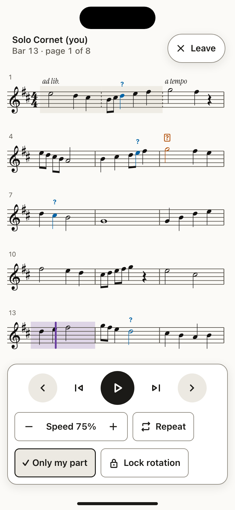
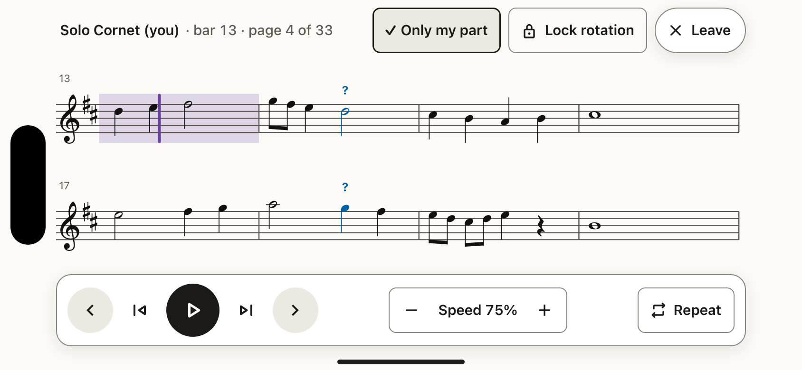
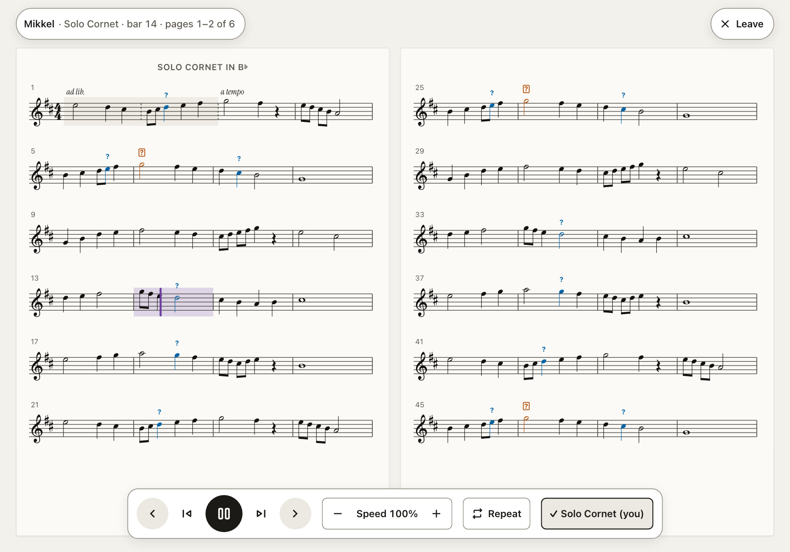
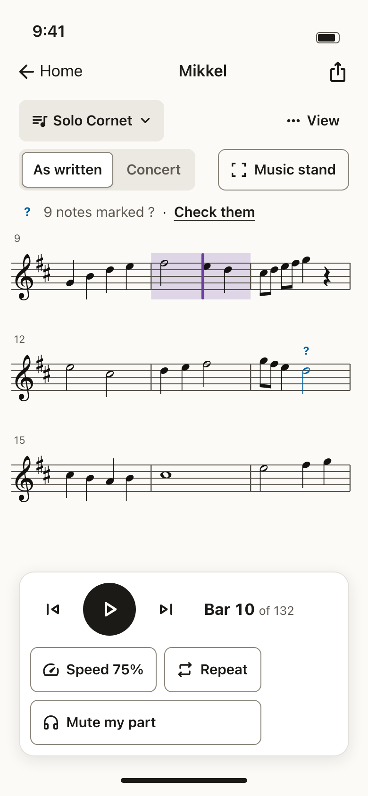
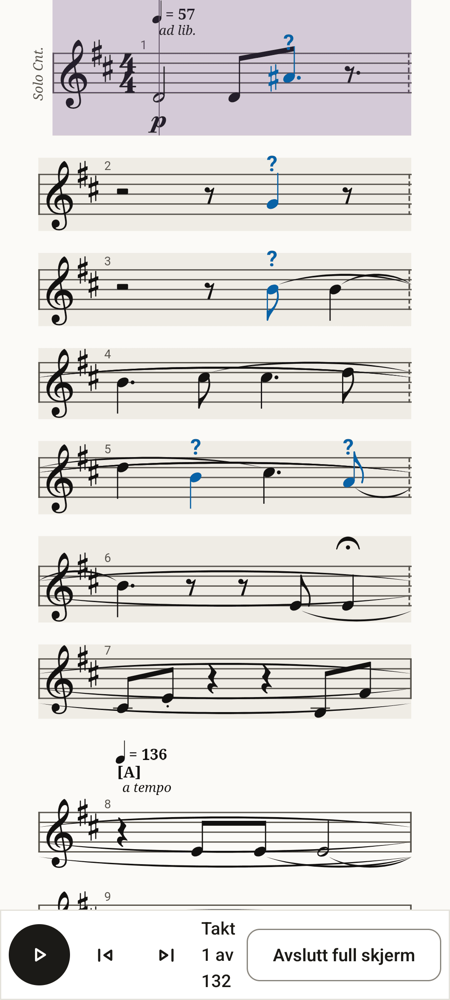
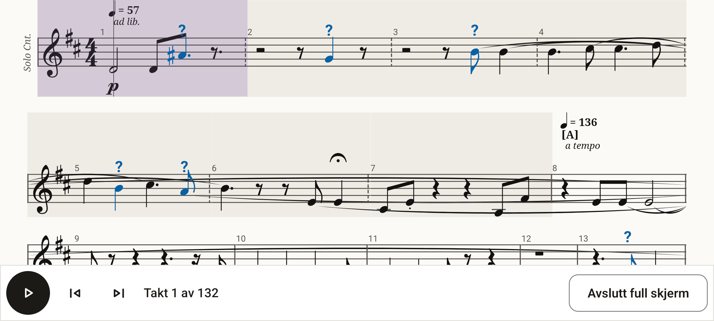
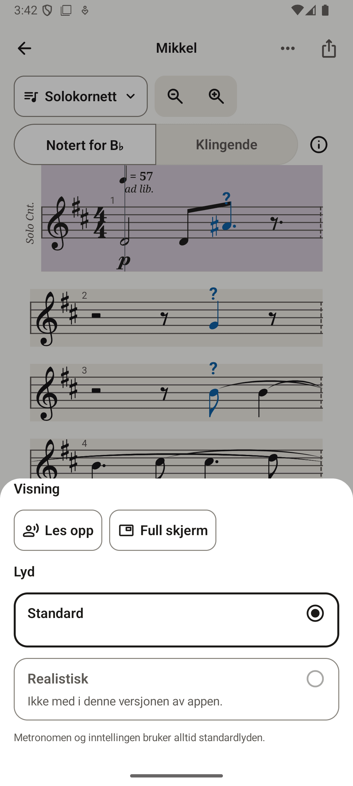

# Music stand

**Status:** built in Play for Android and Apple (iPhone, iPad, Mac). Not in Windows Play yet: it waits for a test run on Windows. §2 describes the apps as they were before the stand; the implementation plan (§11) still applies to Windows.

The music stand (nb **Notestativ**) is the score alone, for reading from a stand, a phone clip or a tablet on stage. It replaces Android's "Full screen" and comes to Apple and Windows, which have no such mode today. This spec follows [`system.md`](system.md), [`brand/brand.md`](brand/brand.md) and [`docs/accessibility/`](../docs/accessibility/), and targets WCAG 2.2 AA.

| Phone, upright | Phone, on its side | Tablet, on its side | The way in |
|---|---|---|---|
|  |  |  |  |

Mockups: `mockups/music-stand-{entry,phone,landscape,tablet}.html`, with a `?state=` of `shown`, `hidden`, `locked` or `turn`. Render them with `node design/mockups/render.mjs music-stand-entry music-stand-entry-nb music-stand-phone music-stand-phone-nb music-stand-landscape music-stand-tablet`.

## 1. Decisions

1. **The stand follows the device and never forces a rotation** (WCAG 1.3.4). Upright gives more systems; on its side gives more bars per system. On a phone, the player can lock the rotation from inside the stand.
2. **One tap in.** A visible **Music stand** button sits in the score toolbar on every platform (today Android needs two taps, More → Full screen). Keyboards get F (plus F11 on Windows). On the Mac, View › Music Stand is there too, and the green button stays the normal full screen. **Open on the music stand** on a score in the library is an optional extra.
3. **The stand has pages, not scrolling.** A page is whatever fits the screen. A turn keeps the last line in view, so the player never loses their place, and Bluetooth page turners work.
4. **Controls are one layer that hides itself, with two small pieces that always stay**: **Leave** and the bar number. They live in their own band at the top and never cover the music. The layer never covers the current system. It never hides while a screen reader, switch access or keyboard focus is in use.
5. **Double tap and pinch do not open the stand** (see §5.3). They collide with the score's own taps, and there is no pinch zoom to go "past".
6. **Owner decisions (§12):** the stand opens on your part; playback turns the pages by default, and Settings can turn that off; turning the phone sideways never opens the stand.

## 2. Today, and why it doesn't turn

Line numbers are at commit `fd41d61`; the in-flight branches will shift them.

### 2.1 Android: "Full screen" (Compose, alphaTab)

| Upright | On its side (the system lock set to landscape by hand) | The way in (More → Full screen) |
|---|---|---|
|  |  |  |

These shots come from the emulator (Pixel-size, 411 × 914 dp, with `band.musicxml` open). The app turns when the system turns. The trouble is what surrounds the turn:

| # | Cause | Where | Evidence |
|---|---|---|---|
| A1 | **Nothing turns while the system's auto-rotate is off, and the stand hides the system's own way to turn.** The activity has no orientation of its own, so it follows the system. That is right (1.3.4), but many players keep auto-rotate off, and the emulator does too (`accelerometer_rotation = 0`). With auto-rotate off, Android offers a rotate button in the navigation bar when you turn the phone. The stand hides the system bars, so that button very likely never appears, and the stand looks stuck upright. | `AndroidManifest.xml:30-34` (no `screenOrientation`, no `configChanges`); `ui/ScoreScreen.kt:261-279` (`PerformanceWindow` hides `systemBars()`) | The setting was verified. That the rotate button is hidden in immersive mode is likely, but it needs confirming on a real phone. |
| A2 | **A turn restarts the score.** Rotation recreates the activity. The `ScoreController` (the alphaTab view and synth) is `remember(r)`, so a new one is built. The old one is released on dispose, which stops playback, and the new one loads from bar 1 and engraves again. `performance` itself survives (`rememberSaveable`), but the music stops and the place is lost. | `ui/ScoreScreen.kt:109-113`, `:133` (`controller.release()` → `api.stop()`), `score/ScoreController.kt:488-492` | Read from the code. The live test was disturbed and proves neither way. |
| A3 | **The layout assumes the width it had.** Page layout at 100 % gives **one bar per system** on a phone held upright (the first shot). That is the "looks strange". Nothing chooses bars per system for the stand. | `score/ScoreController.kt:92` (`LayoutMode.Page`), `:366-371` (zoom is the only scale) | Screenshot |
| A4 | **The bar sits on top of the music.** `PerformanceBar` is an opaque overlay at the bottom of the notation. The notation has no inset for it, so on its side the bar covers the third system, and it can cover the current bar (2.4.11). With the padding set to 0, the notation also runs under a display cutout. | `ui/ScoreScreen.kt:175` (`PaddingValues(0.dp)`), `:231`, `:283-299` | Screenshot 2 |
| A5 | **The way in is two taps deep**: **More** (an icon), then **Full screen** in the View sheet. Upright, "Takt 1 av 132" wraps onto three lines beside **Avslutt full skjerm**. | `ui/ScoreScreen.kt:169`, `:251-252`, `:295-296`; `values/strings.xml:378-379`, `values-nb/strings.xml:376-377` | Screenshots 1 and 3 |

### 2.2 Apple: no stand at all (SwiftUI, Verovio)

- **Orientations.** Every orientation is allowed (`project.yml:97`, `App/Info-iOS.plist:98-104`), so the app turns with the device.
- **No stand mode.** Nothing hides the chrome, the status bar or the home indicator, and nothing keeps the screen awake. There is no `statusBarHidden`, `persistentSystemOverlays` or `isIdleTimerDisabled` anywhere in `App/`.
- **The chrome crowds the music on its side.** `PracticeView` stacks the toolbar, the status line and the score, then docks the `PlayerBar` with `.safeAreaInset(edge: .bottom)` (`App/Views/ScoreScreen.swift:94-116`). The player alone is about 330 pt tall on a phone (see `apps/apple/docs/screenshots/iphone-score-light.png`). An iPhone on its side is 390 pt tall, so the score gets almost nothing.
- **Plus and Pro Max phones on their side.** They report a regular width, so `wide` turns on (`ScoreScreen.swift:85-91`) and the inspector and zoom controls take space too.
- **The score scrolls continuously.** It is a vertical `ScrollView` of pages engraved to the width (`App/Views/NotationView.swift:19-31`). It engraves again on a width change (`:44-46`), so the score follows a turn, but nothing makes a page fit the screen.

### 2.3 Windows: no stand at all (WinUI 3, alphaTab)

- **Layout.** The Score page is four rows: toolbar, status, score and player (`Views/ScoreScreen.xaml:12-17`, `:20`, `:95`, `:114`, `:228`). There is no full-screen presenter.
- **Orientation.** The manifest sets no rotation preference (`Package.appxmanifest`), so on a tablet the app follows the device and engraves again when the width changes (`Views/ScoreScreen.xaml.cs:37`).
- **Keys.** **Esc** already means *leave the score* (`Core/ViewModels/ScoreKeyMap.cs:48`). The key map has no F, Page Up or Page Down (`:13-18`), and ← → move by note (`:37-38`). A page turner's arrows would move the note focus, not the page.

**In short:** only Android has a stand, and it fails for the four reasons A1–A4. Apple and Windows need the stand built, and the Android fixes for A2–A4 apply to them in spirit: keep playback across a turn, fit the layout to the screen, and never overlay the current system.

## 3. What the stand shows

The stand opens on **your part**: the seat's part from `docs/plan/my-instrument.md` §2.3, else the part shown. It shows one staff at a size chosen for reading at arm's length, in pages.
- The part's name is in the position line at the top, as **<your part> (you)**: "Solo Cornet (you)" / «Solokornett (deg)», the my-instrument §3.4 rule. When the shown part is not yours, it is the plain part name, or **All parts** / **Alle stemmer**.
- **Only my part** / **Bare stemmen min** is a toggle in the layer. On (the default) shows your part alone; off goes back to the parts you had before.
- **Seat none** (a conductor): there is no "your part". The stand opens on the parts shown, and **Only my part** is hidden, as **Mute my part** is (my-instrument §3.4).

**This table is the sizing contract.** Implementers size the stand from the bars per system and the systems per page below: the staff size follows from them and the screen, not the other way round. When the text size or zoom grows, drop bars per system first and keep at least 2 systems per page.

| Device and hold | Bars per system | Systems per page | A turn | Safe areas |
|---|---|---|---|---|
| Phone upright (≈ 390 × 844 pt) | 3 | about 7 | The next page starts with the last system of this one (one system overlaps) | The band under the camera holds **Leave** and the bar number. The home indicator stays clear. |
| Phone on its side (≈ 844 × 390 pt) | 4 | 2 | One system at a time: the bottom system moves to the top | 59 pt each side (the camera side changes with the turn), 21 pt at the bottom. The paper runs to the edges; notes and controls stay inside. |
| Tablet upright | 4 | 7–8 | A whole page, with one system overlapping | The system insets |
| Tablet on its side, desktop full screen | 4 | 5–6 on each of **two pages side by side** | One page at a time: the right page moves to the left, so the next line is always in view | The system insets |

- **Page number.** "page 4 of 33" is the page whose top system holds the current bar.
- **Following playback** (on by default; Settings → Display → **Turn the pages while playing** turns it off). The page turns when the cursor reaches the start of the last system on the page (tablet: the start of the right-hand page). It turns with a 200 ms cross-fade. With reduced motion there is no animation.
- **When the player turns the page,** the turn is announced (§6). Turns made by playback are not.
- **At 200 % text or zoom,** the stand keeps its page model: fewer bars per system, more pages. The talking score stays the reflow alternative (1.4.10), reachable from the score view as today.

## 4. The controls

### 4.1 Layout

| Where | Always (persistent) | Control layer |
|---|---|---|
| Phone upright | Top band: the position as plain text on two lines, **Solo Cornet (you)** over **Bar 13 · page 1 of 8**, at the leading edge; **✕ Leave** at the trailing edge | A card at the bottom, three rows: ‹ page · ⏮ bar · **Play** · bar ⏭ · page › / − **Speed 75%** + · **Repeat** / **✓ Only my part** · **Lock rotation** |
| Phone on its side | Top band: **Solo Cornet (you) · bar 13 · page 4 of 33** (one line of plain text) … **✕ Leave** | Top band, between those two: **Only my part** and **Lock rotation**, as system.md §1.1 toggles. A bottom card with one row: ‹ ⏮ **Play** ⏭ › · − Speed + · **Repeat** |
| Tablet, desktop | Top band: **Old Hundredth · Solo Cornet (you) · bar 14 · pages 1–2 of 6** (plain text) … **✕ Leave** | A floating card at the bottom centre, one row: ‹ ⏮ **Play** ⏭ › · − Speed + · **Repeat** · **Only my part**. No rotation lock on tablets (§4.4). |

- **Targets.** Everything is at least 48 pt / 48 dp / 48 epx, and Play is the round 56 pt ink primary: the only ink control (system.md §1). The page buttons have a tonal well, so they read differently from the bar buttons.
- **Speed.** It is two steppers around the value (2.5.7): −5 % and +5 %, at 25–150 %. Held down, a stepper keeps stepping (on Android every 0.1 s after 0.4 s) until it is let go or reaches the end; a tap is still one step. There is no slider in the stand.
- **Repeat.** A toggle for the last range. When no range is set yet, it opens the existing **Repeat bars [12] to [13]** sheet, with bar-number fields.
- **Where it was left.** On Android a score keeps its speed, its repeat and its bar, on the stand and off it, and opens there again, also after the app was closed (apps/android/README.md). "Play this bar" is not a repeat and is not kept as one.
- **Text size.** At the largest sizes the rows wrap, and the card grows upwards. It never clips (system.md §1.7).
- **The position is text, not a control.** It sits on the band in `text` (the place in `text-muted`) with no border or fill, so only **✕ Leave** looks like a button. It is a status element and is not focusable.
- **Toggles** (Only my part, Lock rotation, Repeat) use the system.md §1.1 style everywhere, the landscape top band included: off is an outline; on is the tonal `secondary` fill, a 1.5 px ink edge and a ✓ before the label.
- **High contrast.** The card and **Leave** are outlined in `border-strong` with no shadows. On/off is shown by ✓ and the 1.5 px ink edge, never by colour. See `music-stand-phone-phone-hc-shown.png`.

### 4.2 Showing and hiding

- **Showing.** A tap on the music shows the layer, on pointer-up (2.5.2), and so does Tab or Space. The page keys (arrows, Page Up/Down, Home/End) turn the page (or, while a repeat is set, play, pause and go back to its start, §7) and leave the layer as it is: a Bluetooth page turner is a keyboard that sends them, and a pedal press must not put controls over the music. A hardware keyboard being attached keeps nothing on screen by itself. The layer also shows on entry while the music is paused.
- **Hiding.**
  - A tap on the music hides the layer.
  - It also hides itself 4 s after the last touch, **only while the music plays**. While paused it stays.
  - It **never hides by itself** in these cases:
    - a screen reader is running (VoiceOver, TalkBack, Narrator, NVDA)
    - switch access is running (Switch Control, Switch Access)
    - Full Keyboard Access is on
    - focus is inside the layer
    - Tab or Space was pressed since the last touch
    - Settings → Display → **Keep the stand controls visible** is on

  So no one depends on a timer (2.2.1), and focus is never hidden (2.4.11).
- **A tap hides the layer while keyboard focus is in it** (someone using keyboard and touch together): focus moves to the score first, then the layer goes, so focus never lands on nothing (2.4.3, 2.4.11).
- **Hidden means gone.** A hidden layer is removed from the accessibility tree and the tab order, not just made transparent. The persistent **Leave** and the bar status stay reachable at all times.
- **First-time hint.** The first time the layer hides, a hint says **Tap the music to show the controls.** It goes on the first tap and does not come back (1.4.13: it does not move focus, and a tap dismisses it).
- **Motion.** The layer fades over `base` (200 ms). With reduced motion it appears and disappears at once.

### 4.3 Never over the current bar

This is the obscured-area contract.

- The stand knows the rectangle the control layer covers.
- When the layer shows, or the current bar moves, and the current bar's system would fall inside that rectangle, the page moves the visible window, not the layout, so that system sits above the card. Nothing is engraved again.
- Upcoming music may be covered while the layer shows. The current system never is. The persistent pieces have their own band and cover nothing.
- Each platform already has a hook for this:
  - Windows: `ScoreView.BottomObscuredHeight` (`ScoreView.cs:100-101`)
  - Apple: `.safeAreaInset`
  - Android: an inset passed to the overlay plus `bringIntoViewRequester`

### 4.4 Locking the rotation

A player who clips a phone to a stand does not want it to turn when they lean in. Locking is the user's own choice, so it is not an orientation restriction under 1.3.4.

- **The control.** **Lock rotation** / **Lås retningen** is a toggle in the layer. When it is on, the label reads **✓ Rotation locked** / **Retningen er låst**. It locks the orientation the phone has now, until the player turns it off or leaves the stand. Leaving always restores the system's own behaviour.
- **Phones only.** Both platforms ignore an app's orientation on large screens:
  - Android 16 ignores `screenOrientation` and `setRequestedOrientation()` for apps that target SDK 36 on displays of 600 dp and wider. Play targets 36.
  - iPadOS 26 overrides orientation requests from apps that support multitasking, and `UIRequiresFullScreen` is deprecated.

  So tablets, and the Mac, show no lock button. Help says how to use the system's rotation lock (§8).
- **Windows tablets.** They get the lock only when the device has an orientation sensor, and only if `AutoRotationPreferences` is honoured in full screen. Confirm this on a Surface before shipping.
- **Turn the music** (Android phones only). This answers A1. If the system's auto-rotate is off and the phone is held the other way up, the stand shows its own pill, **Turn the music** / **Snu notene**, in place of the system button it hid. A tap turns the stand to match the phone and locks it there while the stand is open. The player asks for it, so it is not a forced rotation. See `music-stand-phone-phone-light-turn.png`.

## 5. Ways in

### 5.1 Every path

| Path | Where | Notes |
|---|---|---|
| **Music stand** button | The score toolbar on every platform. Phone: on the pitch row, after **As written / Concert**. Desktop: before **View ▾**. | Outline style with the `music-stand` icon and a visible label. Tooltip: "The music alone, for playing from the stand (F)". Also listed in the **View** menu. |
| **F** | While the score has focus (all keyboards, including iPad and Android with a keyboard) | A single-key shortcut. It can be turned off or remapped in Settings → Keyboard, like the others (2.1.4). |
| **View › Music Stand** (with F) | Mac | The green button, ⌃⌘F and Globe+F stay the system's normal full screen of the window, with the ordinary score in it. Entering the stand in a window may also take the window full screen; leaving the stand then restores the window as it was. |
| **F11** | Windows | The Windows idiom for full screen, and it has a modifier-free sibling in F |
| **Open on the music stand** | A score's context menu in the library: long press on touch, right-click, Shift+F10 or the menu key | Opens the score and the stand in one step. It is a normal menu item, so it reaches every input. |

### 5.2 Gestures inside the stand

| Gesture | Does | Single-pointer / non-gesture equivalent |
|---|---|---|
| Tap on the music | Shows or hides the controls (on pointer-up). **It never moves the cursor in the stand.** | Tab or any key; with AT the controls are always shown |
| Horizontal swipe on the music, starting at least 24 pt from the screen edges | Previous or next page. A swipe from within 24 pt of an edge goes to the system (Android back, the iOS edge gestures) and never turns a page. | The ‹ › page buttons, ← → / Page Up / Page Down, the pedal (2.5.1) |
| System back (Android edge swipe or button), VoiceOver two-finger scrub (`accessibilityAction(.escape)`), Esc | Leave | **✕ Leave**, always visible |

### 5.3 Rejected, and why

| Proposal | Why not |
|---|---|
| Double tap on the score to enter | A single tap already acts on every platform: Apple goes to that bar (`NotationView.swift:257`), alphaTab moves the cursor (`enableUserInteraction`, `ScoreController.kt:95`), and Windows opens the "?" mark under the finger (`ScoreView.cs:83-91`). A double-tap recogniser makes every single tap wait about 300 ms. Its first tap would also seek during playback. |
| Pinch out past "fit" | No score uses pinch zoom today: zoom is buttons, and `ZoomMode.Disabled` on Windows. "Past fit" means nothing yet, and nobody would find it. Revisit if pinch zoom arrives. It would then still need the button (2.5.1). |
| Enter on turning sideways, always or as a setting | That changes the context on an orientation change the player did not ask for (3.2.1), and players turn phones for other reasons. The owner dropped the setting too: the toolbar button is one tap. |
| Edge tap zones for page turns | These are invisible targets that are easy to hit by accident on a stand clip. The visible page buttons and the swipe cover it. |

## 6. Entering, leaving, and what is announced

| Moment | Focus lands on | Announced (polite, 4.1.3) |
|---|---|---|
| Enter | **The score.** It is one accessibility element with its "bar n of m" description and the existing custom actions (Next/Previous bar, Play this bar), plus Next/Previous page. The next swipe or Tab reaches Play. With a keyboard the focus ring is on the current bar. | "Music stand. Solo Cornet (you), bar 13 of 132." With no screen reader running, add: "Tap the music to show the controls." |
| Page turn by the player | Stays where it is | "Page 4 of 33, bars 13 to 20." |
| Lock on / off | The toggle | "Rotation locked. The music stays this way up." / "The music turns with the phone again." |
| Leave | **The Music stand button** that opened it, or the library row when the stand was opened from the library (the system.md focus rule) | "Music stand closed." |

- **Esc.** It leaves the stand first. Only a second Esc leaves the score (Windows' `LeaveScore` stays, one layer down).
- **Android Back.** It leaves the stand first, as today.
- **VoiceOver.** The stand root takes `accessibilityAction(.escape)`, so the two-finger scrub leaves it.
- **Narrator and NVDA.** They get the announcements through `RaiseNotificationEvent` on the score's automation peer.

## 7. Keyboard and page turners

Inside the stand, arrow keys turn pages, not notes, because there is no note focus in the stand.

| Key | In the stand | Notes |
|---|---|---|
| → ↓ Page Down | Next page; **play / pause** while a repeat is set | The keys Bluetooth page turners (AirTurn, PageFlip and others) send in their arrow and page modes |
| ← ↑ Page Up | Previous page; **back to the repeat's first bar** while a repeat is set | A loop needs no page turn, so a two-button pedal runs it hands-free. The layer says so under Repeat, and Help too (Android). |
| Space | Play / pause | As in the score. A pedal in **Space** mode therefore starts and stops the music. Help says to use the arrow or page mode. |
| Home / End | First / last page | |
| Option+↓ ↑ (Mac), Ctrl+↓ ↑ (Windows, Android) | Next / previous bar | The existing bar shortcuts |
| F, F11 (Windows) | Leave the stand | F turns it on and off |
| Esc | Leave the stand | |
| Tab / Shift+Tab | Show the layer and move through it: Leave, then the layer in reading order | There is no trap (2.1.2). The stand is a screen, not a modal. |

- **Mac.** The **Playback** menu binds ← and → as single-key shortcuts (`App/BrasscribePlayApp.swift:229-231`). Menu shortcuts fire before the view's handlers, so in the stand those commands turn pages (`model.stand ? nextPage() : nextBar()`).
- **Mac page keys.** AppKit turns Page Up, Page Down, Home and End into scroll commands before the view's `onKeyPress` sees them, so on the Mac the stand binds them as key equivalents (`App/Views/MusicStandView.swift`).
- **iPad.** With VoiceOver and Quick Nav on, VoiceOver takes the arrows. That is the user's setting. The pedal still works with Quick Nav off.

## 8. Platform idioms

| | iPhone | iPad | Mac | Android phone | Android tablet | Windows |
|---|---|---|---|---|---|---|
| Hide chrome | `.toolbar(.hidden, for: .navigationBar)`, `.statusBarHidden()`, `.persistentSystemOverlays(.hidden)` | the same | The stand hides the chrome in the window. It may call `toggleFullScreen` on entry when the window is not already full screen, and undo that on leaving. The green button is never rewired. | `WindowInsetsControllerCompat.hide(systemBars())`, `BEHAVIOR_SHOW_TRANSIENT_BARS_BY_SWIPE` (as today) | the same | `AppWindow.SetPresenter(AppWindowPresenterKind.FullScreen)` |
| Screen awake | `isIdleTimerDisabled` (only while the stand is open) | the same | `ProcessInfo.beginActivity(.idleDisplaySleepDisabled)` | `keepScreenOn` (as today) | the same | `DisplayRequest.RequestActive()` |
| Rotation lock | `supportedInterfaceOrientations` mask + `requestGeometryUpdate` + `setNeedsUpdateOfSupportedInterfaceOrientations()` | none: Help → Control Centre | none | `requestedOrientation = SCREEN_ORIENTATION_LOCKED`; restore `UNSPECIFIED` | none: Help → Quick Settings | `DisplayInformation.AutoRotationPreferences` when a sensor exists (confirm) |
| Leave | ✕ Leave, Esc, two-finger scrub | the same | ✕ Leave, Esc, F (the green button only leaves full screen) | ✕ Leave, Back, Esc | the same | ✕ Leave, Esc, F11 |
| AT detection (controls stay) | `UIAccessibility.isVoiceOverRunning`, `isSwitchControlRunning`, plus focus in the layer | the same | `NSWorkspace.isVoiceOverEnabled`, `isSwitchControlEnabled`, focus | `AccessibilityManager.isTouchExplorationEnabled` or any enabled service with `FEEDBACK_SPOKEN` / switch | the same | `AutomationPeer.ListenerExists`, `SPI_GETSCREENREADER`, focus |

**Icons** to add to `tokens/icons.json` (the mockups carry them inline in `mockups/music-stand.js`). Confirm the Segoe codes against the font before adding them.

| Key | SF Symbol | Material Symbol | Segoe Fluent |
|---|---|---|---|
| `music-stand` | `arrow.up.left.and.arrow.down.right` | `fullscreen` | FullScreen `E740` |
| `rotation-lock` | `lock.rotation` | `screen_lock_rotation` | Lock `E72E` |
| `rotate` | `rotate.right` | `screen_rotation` | Rotate `E7AD` |
| `page-prev` / `page-next` | `chevron.left` / `chevron.right` | `chevron_left` / `chevron_right` | `E76B` / `E76C` |
| `minus` / `plus` | `minus` / `plus` | `remove` / `add` | `E738` / `E710` |

## 9. Copy deck

"Music stand" / «Notestativ» joins the words table in `brand/brand.md`. It replaces "Full screen" / «Full skjerm».

| Key | English | Norsk (bokmål) |
|---|---|---|
| `stand_enter` (button, menu item) | Music stand | Notestativ |
| `stand_enter_tip` | The music alone, for playing from the stand (F) | Bare notene, til å spille fra notestativet (F) |
| `stand_open_from_library` | Open on the music stand | Åpne på notestativet |
| `stand_leave` (visible) | Leave | Gå ut |
| `stand_leave_name` (accessible name) | Leave the music stand | Gå ut av notestativet |
| `stand_part_yours` | Solo Cornet (you) | Solokornett (deg) |
| `stand_position` | Bar 13 · page 4 of 33 | Takt 13 · side 4 av 33 |
| `stand_position_line` (on its side) | Solo Cornet (you) · bar 13 · page 4 of 33 | Solokornett (deg) · takt 13 · side 4 av 33 |
| `stand_position_tablet` | Old Hundredth · Solo Cornet (you) · bar 14 · pages 1–2 of 6 | Old Hundredth · Solokornett (deg) · takt 14 · side 1–2 av 6 |
| `stand_prev_page` / `stand_next_page` | Previous page / Next page | Forrige side / Neste side |
| `stand_prev_bar` / `stand_next_bar` | Previous bar / Next bar | Forrige takt / Neste takt |
| `play` / `pause` | Play / Pause | Spill av / Pause |
| `stand_speed` | Speed 75% | Tempo 75 % |
| `stand_slower` / `stand_faster` | Slower / Faster | Saktere / Raskere |
| `stand_repeat` / on | Repeat / Repeat 13–14 | Gjenta / Gjenta 13–14 |
| `stand_pedals_repeat` (under Repeat while a repeat is set) | Pedals: right plays and pauses, left goes back to bar 13. | Pedaler: høyre spiller av og pauser, venstre går tilbake til takt 13. |
| `stand_back_to_repeat` (announcement) | Back to bar 13. | Tilbake til takt 13. |
| `stand_only_mine` (toggle; hidden with no seat) | Only my part | Bare stemmen min |
| `stand_lock` / on | Lock rotation / Rotation locked | Lås retningen / Retningen er låst |
| `stand_turn` | Turn the music | Snu notene |
| `stand_turn_name` | Turn the music to fit the phone | Snu notene så de passer telefonen |
| `stand_hint` | Tap the music to show the controls. | Trykk på notene for å vise knappene. |
| `stand_entered` (announcement) | Music stand. Solo Cornet (you), bar 13 of 132. | Notestativ. Solokornett (deg), takt 13 av 132. |
| `stand_entered_touch` (added without a screen reader) | Tap the music to show the controls. | Trykk på notene for å vise knappene. |
| `stand_page_turned` | Page 4 of 33, bars 13 to 20. | Side 4 av 33, takt 13 til 20. |
| `stand_locked` | Rotation locked. The music stays this way up. | Retningen er låst. Notene blir stående slik. |
| `stand_unlocked` | The music turns with the phone again. | Notene snur seg med telefonen igjen. |
| `stand_left` | Music stand closed. | Notestativet er lukket. |
| `settings_stand_controls` | Keep the stand controls visible | Vis alltid knappene på notestativet |
| `settings_stand_follow` (on by default) | Turn the pages while playing | Bla om mens musikken spiller |
| `help_stand_pedal` | Page turners and pedals work when they send arrow keys or Page Up and Page Down. Space starts and stops the music. While a repeat is set, the pedals don't turn pages: right (Page Down) plays and pauses, and left (Page Up) goes back to the start of the repeat. | Sidevendere og pedaler virker når de sender piltaster eller Page Up og Page Down. Mellomrom starter og stopper musikken. Når noe gjentas, blar ikke pedalene: høyre (Page Down) spiller av og pauser, og venstre (Page Up) går tilbake til starten av det som gjentas. |
| `help_stand_tablet_lock` | To keep a tablet one way up, use the rotation lock in Control Centre (iPad) or Quick Settings (Android). | Bruk retningslåsen i kontrollsenteret (iPad) eller hurtiginnstillingene (Android) for å holde nettbrettet i én retning. |

## 10. WCAG 2.2 AA mapping

| Criterion | How the stand meets it |
|---|---|
| 1.3.4 Orientation | Both orientations work everywhere. The app never locks on its own; the lock is the player's own toggle, and leaving the stand releases it. |
| 1.4.3 / 1.4.11 Contrast | Tokens only, with **Leave** and the card on `surface-raised` with a `border-strong` edge (every pair passes: `qa/tools/contrast.py --tokens`). The HC variant has no tints or shadows. |
| 1.4.4 / 1.4.10 Resize, reflow | The layer's rows wrap. The stand is a two-dimensional exception; the talking score is the reflow alternative, as for the score (checklist Q1). |
| 1.4.13 Content on hover or focus | The first-time hint takes no focus, a tap dismisses it, and it does not return |
| 2.1.1 / 2.1.2 Keyboard, no trap | Every control can be reached by Tab; F / Esc enter and leave; arrow and page keys turn pages (§7) |
| 2.1.4 Character key shortcuts | F works only while the score has focus, and Settings → Keyboard turns it off or remaps it |
| 2.2.1 Timing adjustable | Auto-hide runs only during playback, never with AT, switch access or focus in the layer, and a setting turns it off |
| 2.2.2 / 2.3.3 Motion | Page turns cross-fade over 200 ms, with no animation under reduced motion; nothing starts moving without the player's Play |
| 2.4.3 Focus order | Enter → the score; Tab → Leave, then the layer in reading order; a tap that hides the layer moves focus to the score first; leave → the opener (§6) |
| 2.4.7 Focus visible | The ink/paper ring of system.md, around the current bar when the score has focus |
| 2.4.11 Focus not obscured | The obscured-area contract (§4.3); the persistent band never covers music |
| 2.5.1 Pointer gestures | Swipe has buttons and keys; no gesture is the only way to do anything. Swipes start ≥ 24 pt from the edges, so they never fight the system's edge gestures. |
| 2.5.2 Pointer cancellation | Taps act on pointer-up |
| 2.5.3 Label in name | Each accessible name contains its visible label ("Leave" → "Leave the music stand") |
| 2.5.4 Motion actuation | Enter-on-turn is a setting, off by default, and the button does the same |
| 2.5.7 Dragging | Speed uses steppers; Repeat uses bar fields |
| 2.5.8 Target size | 48 pt / dp / epx, and Play is 56 |
| 3.2.1 / 3.2.2 On focus, on input | Focus never changes the view; a turn changes context only when the player turned that setting on |
| 4.1.2 Name, role, value | Toggles expose on/off (✓ and the selected state); the position line is a status, not a control |
| 4.1.3 Status messages | Enter, leave, page turn and lock are announced without moving focus (§6) |

**Universell utforming.** The Norwegian regulation (forskrift §4b) cites EN 301 549, which covers these criteria. EN 301 549 V4.1.1 also asks for the shortcut list in Help (12.1). Add F, F11 and the page keys to `qa/screen-reader-scripts/keyboard-desktop.md`.

## 11. Implementation plan

The plan is sized for one workstream per platform. The first step on each platform is independent of the others. Each workstream rebases on `main` first. The settings step comes last because the my-instrument work adds a **You** section to the same screens.

### Shared, before any platform (design, small)

1. Add the six icons to `design/tokens/icons.json`, then run `uv run design/tokens/build.py`. Also add "Music stand / Notestativ" to the brand table. *Done when:* `build.py --check` passes.
2. Add the §9 keys to each app's strings. Add the stand keys to `qa/screen-reader-scripts/keyboard-desktop.md` and the TalkBack/VoiceOver/Narrator scripts: enter, leave, pedal and lock.

### Android (`apps/android`): fix what exists

1. **Keep playing across a turn (A2).** Add `android:configChanges="orientation|screenSize|screenLayout|smallestScreenSize|keyboardHidden"` to `MainActivity`. The app has no `-land` resources, and Compose recomposes on the new configuration. The `AlphaTabView` then keeps its activity context. Hoisting the controller into the ViewModel would leak it instead. *Done when:* rotating during playback keeps playing, and the bar is unchanged (a new `PlayFlowA11yTest` case with `UiDevice.setOrientation*`).
2. **Stand layout (A3), sized from the §3 table.** Add `ScoreController.setStandLayout(barsPerRow)`, using alphaTab `display.barsPerRow` (3 upright, 4 on the side). Page the view to whole systems with a one-system overlap, and auto-turn on the last system. Put the page count in `ScoreUiState`.
3. **Controls (A4, A5).** Replace `PerformanceBar` with the persistent top band (`statusBarsPadding` / `displayCutoutPadding`) and the control layer (§4). Give the overlay an obscured inset, and use `bringIntoViewRequester` for the current system. Add auto-hide with the AT rule (`AccessibilityManager`). The tap on the notation toggles the layer; `enableUserInteraction = false` while in the stand. Swipe turns pages.
4. **Entry.** Add the **Music stand** chip to the score toolbar `FlowRow` (`ScoreScreen.kt:177-200`) and keep it in the View sheet. Add F / Esc / page keys via `onPreviewKeyEvent` on the stand root. Rename `performance_enter/exit` to the §9 strings, and keep the `performance*` test tags.
5. **Rotation.** Add **Lock rotation** (`requestedOrientation = SCREEN_ORIENTATION_LOCKED`), shown only below `sw600dp`. Add **Turn the music**: an `OrientationEventListener` plus `Settings.System.ACCELEROMETER_ROTATION == 0`, which sets `SCREEN_ORIENTATION_SENSOR_LANDSCAPE`/`PORTRAIT` while in the stand. Restore `UNSPECIFIED` on leaving.
6. **Library and settings (last).** Add **Open on the music stand** to the score row's menu, then the three Display settings (§9: enter on turn, keep controls visible, turn the pages while playing) in `SettingsScreen` (`ui/ProblemScreen.kt`).

*Likely conflicts:* `ui/ScoreScreen.kt` (the my-instrument plan rewrites `:89-91`, `:140`, `:442-455`; kvartett rewrites `:91`), `res/values*/strings.xml` (both), `AndroidManifest.xml`, and `ui/ProblemScreen.kt` (`SettingsScreen`, my-instrument). Keep the stand in a new file, `ui/MusicStand.kt`, and touch `ScoreScreen.kt` only at the toolbar and the `if (performance)` branch.

### Apple (`apps/apple`): build it

1. **Stand state and chrome.** Add `PracticeModel.stand` (and `standOpenedByTurn`). In `PracticeView`, when `stand` is set, hide the toolbar, status line and `PlayerBar`. Also apply `.toolbar(.hidden, for: .navigationBar)`, `.statusBarHidden()`, `.persistentSystemOverlays(.hidden)` and `isIdleTimerDisabled`. On the Mac, the stand may take the window full screen on entry and restore it on leaving; the green button stays the normal full screen.
2. **Paged layout, sized from the §3 table.** Add `model.viewHeight`, and engrave Verovio pages at the viewport height with a fixed number of bars per system. `NotationView` shows one page (on a tablet or the Mac, two pages side by side) and turns with the one-system overlap. Keep the continuous scroll outside the stand.
3. **Controls.** A new `MusicStandView.swift` holds the persistent band and the layer (§4), with `.safeAreaInset` for the obscured area. Add auto-hide with the AT rule, the tap on the music to toggle (the bar-seek `onTapGesture` is off in the stand), the swipe, and `accessibilityAction(.escape)`.
4. **Keys.** Add `onKeyPress` for F, Esc, `.pageUp`/`.pageDown` and the arrows on the stand root. `PlaybackCommands` (`BrasscribePlayApp.swift:229-231`) routes ←/→ to pages in the stand. Add a **Music Stand** item (F) to the View menu; do not bind ⌃⌘F.
5. **Entry.** Add the **Music stand** button to `ScoreToolbar` (`ScoreScreen.swift:212-305`) on the pitch row on phones, before **View** when wide. Add **Open on the music stand** to the library row's `contextMenu`.
6. **Rotation lock (iPhone only).** In an `AppDelegate` (`UIApplicationDelegateAdaptor`), `supportedInterfaceOrientationsFor` returns a stored mask. The toggle sets the mask, then calls `requestGeometryUpdate` and `setNeedsUpdateOfSupportedInterfaceOrientations()`. It is hidden when `userInterfaceIdiom != .phone`.
7. **Settings (last).** Add the three Display rows in `SettingsView.swift`. The enter-on-turn setting uses `UIDevice.orientationDidChangeNotification` (phone only).

*Likely conflicts:* `App/Views/ScoreScreen.swift` (my-instrument `:221-226`, `:511-516`, `:625`, `:648-653`), `App/Views/NotationView.swift` (my-instrument `:40`), `App/PracticeModel.swift` (my-instrument `:84`), `App/Localizable.xcstrings` (both), `App/Views/SettingsView.swift` (my-instrument), `App/BrasscribePlayApp.swift` (my-instrument `:18`, `:97`, `:101`). Keep the new code in `MusicStandView.swift` and a `PracticeModel+Stand.swift` extension.

### Windows (`apps/windows`): build it

1. **Stand state.** Add `ScoreViewModel.IsStand` and a `ToggleStand` command. When it is set, collapse rows 0, 1 and 3 of `ScoreScreen.xaml`, call `AppWindow.SetPresenter(FullScreen)` and `DisplayRequest.RequestActive()`. Undo all three on leaving, and when the page is navigated away from.
2. **Paged layout, sized from the §3 table.** Add a stand mode to `ScoreRendering` / `ScoreScreen.xaml.cs:242`: alphaTab Page layout with `BarsPerRow` at 4, paged to the viewport height, two pages side by side when wide. `ScoreView` pages instead of scrolling while in the stand.
3. **Controls.** Add a `MusicStandOverlay` user control: the persistent band and the layer. It sets `ScoreView.BottomObscuredHeight` (`ScoreView.cs:101`) to the layer's height. Add auto-hide with the AT rule and the Narrator notifications.
4. **Keys.** Add `F`, `PageUp` and `PageDown` to `ScoreKey` (`ScoreKeyMap.cs:13-18`) and new `ScoreCommand`s (`ToggleStand`, `NextPage`, `PreviousPage`). In the stand, the arrows map to pages and Esc to `LeaveStand` before `LeaveScore` (`:48`). Add F11 as a page `KeyboardAccelerator`. Include unit tests in `Brasscribe.Play.Core.Tests`.
5. **Entry.** Add a **Music stand** button before `ViewMenuButton` (`ScoreScreen.xaml:60`) and an item in its flyout (`:62-91`). Add **Open on the music stand** to the library item's context flyout.
6. **Rotation lock and settings (last).** Show the lock only when `SimpleOrientationSensor.GetDefault()` is not null, and confirm on hardware. Add the three settings to `Dialogs/SettingsDialog.xaml`.

*Likely conflicts:* `Views/ScoreScreen.xaml` (my-instrument `:188-193`, `:316-320`), `Views/ScoreScreen.xaml.cs` (my-instrument `:157-158`), `ViewModels/ScoreViewModel.cs` (my-instrument `:151`, `:250-297`), `Strings/*/Resources.resw` (both, through `gen_resw.py`), `Dialogs/SettingsDialog.xaml` (my-instrument `:13`), `MainWindow.xaml.cs` (kvartett `:115`, my-instrument `:93`). `ScoreKeyMap.cs` and `ScoreView.cs` are free.

### Checks for every platform

- Screen-reader walk: enter → the announcement → swipe to Play → play → leave → focus back on the button.
- Keyboard-only run with a pedal emulated by arrow and page keys.
- Rotate during playback.
- 200 % text.
- High contrast.
- New screenshots of the stand upright and on its side, next to these mockups.

## 12. Owner decisions

1. **What opens on the stand:** your part (the seat's part, else the part shown). With no seat, the parts shown, and **Only my part** is hidden.
2. **Turning pages during playback:** on by default. Settings → Display → **Turn the pages while playing** / «Bla om mens musikken spiller» turns it off.
3. **Opening on turning the phone sideways:** not offered, not even as a setting (§5.3).
