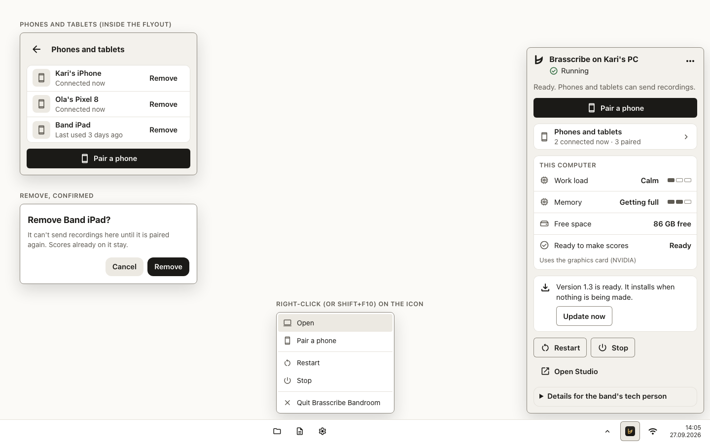
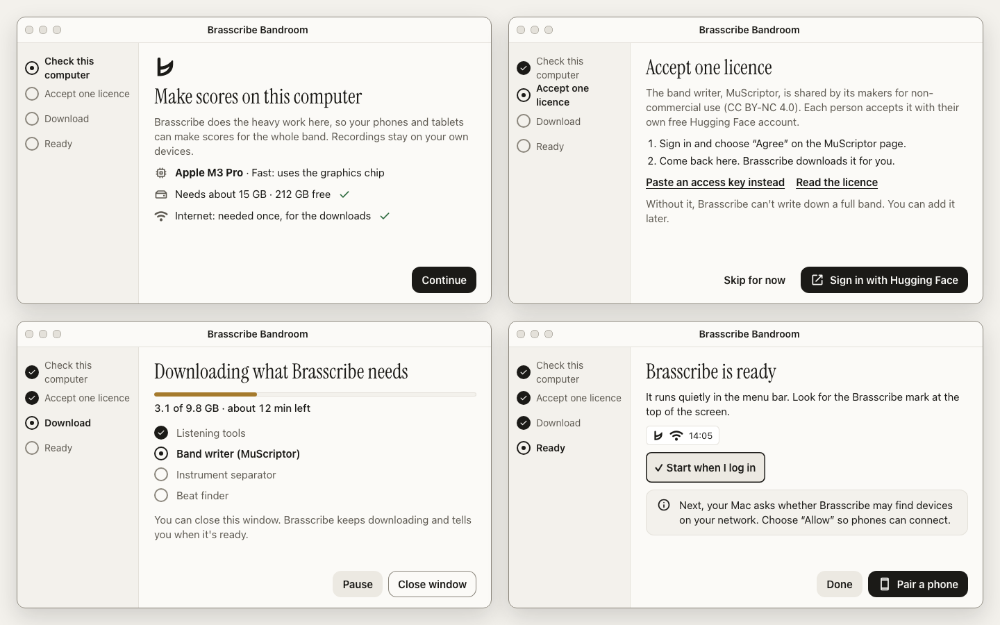
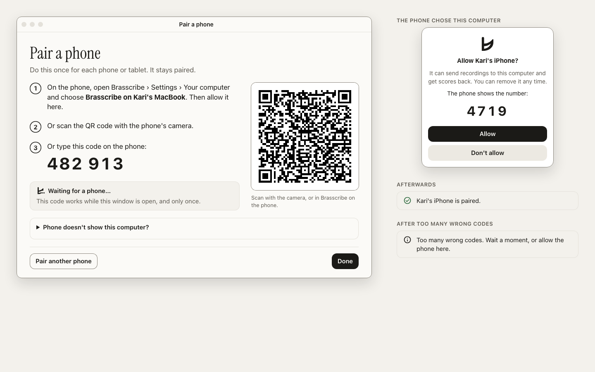
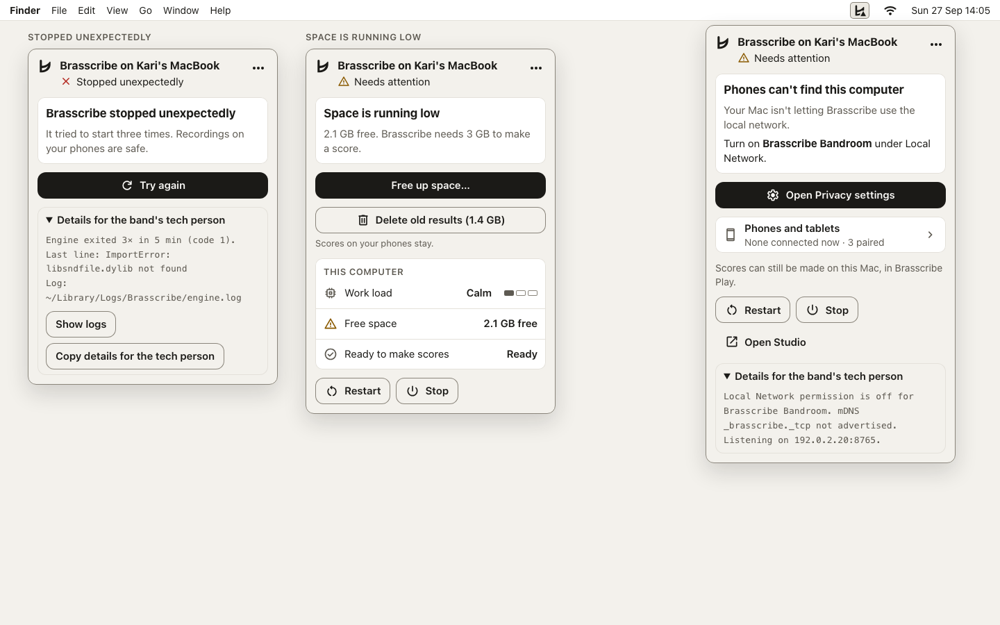
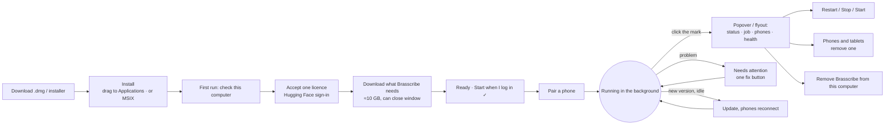

# Brasscribe Bandroom: the part that runs on your computer

Brasscribe Bandroom installs Brasscribe's engine on a Mac or Windows PC, keeps it running in the background, and lives in the menu bar (macOS) or the taskbar corner (Windows).
- One click shows whether it is working and what it is doing.
- It shows how to connect a phone, and lets you restart or stop it.
- Nobody types a command.

This spec follows [`system.md`](system.md), [`brand/brand.md`](brand/brand.md) and [`../docs/accessibility/wcag-2.2-aa-checklist.md`](../docs/accessibility/wcag-2.2-aa-checklist.md). Where they already decide something, this file points to them rather than repeating them.

| Menu bar (macOS) | Taskbar corner (Windows) | First run | Pair a phone | Needs attention |
|---|---|---|---|---|
|  |  |  |  |  |

## 1. Name

**Brasscribe Bandroom** is the third product, after Brasscribe Play and Brasscribe Studio.

- **Why this name:**
  - "Server", "companion engine" and "motor" are on the brand's avoid list (`brand.md`, Words we use).
  - The band room is where the band's work happens and where everyone comes together. That describes a computer the whole band's phones connect to.
  - It uses the band-room words the voice is built on, and it doesn't clash with Play's **Home** screen or with **Studio**.
  - It is one word with a capital B, like Brasscribe, and is not translated: «Brasscribe Bandroom» in Norwegian too.
- **Where the product name appears:**
  - the installer
  - Applications and the Start menu
  - Login Items and Startup apps
  - the About window
  - the store or download page
- **Inside the app:**
  - The header names the computer, exactly as phones see it: **Brasscribe on Kalli's MacBook** / **Brasscribe på Kallis MacBook**.
  - The glossary phrase **Brasscribe on your computer / Brasscribe på datamaskinen** stays the name for this helper in Play.
- **Lockup:** "Brasscribe *Bandroom*": the mark, the wordmark and the product name in brass italic, like the Play and Studio lockups. It is used in the installer and the About window only.
- **Considered and dropped:**
  - Brasscribe Server: on the avoid list.
  - Brasscribe Home: clashes with Play's Home.
  - Brasscribe Desktop: sounds like Play for desktop.
  - Brasscribe Helper: reads as a hidden system part nobody should open.

## 2. Who uses it and why

| Person | What they know | Jobs to be done |
|---|---|---|
| **Band member** (the main user): a cornet player, secretary or conductor who owns the computer the band uses. | Can install an app from a download and click Allow. Doesn't know what a port, a token or Python is. Will not read a manual. | 1. "Get this running once and forget about it." 2. "Get my phone (and the section's phones) connected." 3. "Tell me whether it's working when a score doesn't arrive." 4. "Stop it when I need the computer for something else." |
| **The band's tech person**: often a family member, sometimes Kalli. | Comfortable with settings, logs and addresses. | 1. "See the address, version and logs without a terminal." 2. "Fix the firewall or network when phones can't connect." 3. "Remove a lost phone." 4. "Open Studio to look at a run." |
| **Musician with only a phone** (indirect user) | Never touches the computer. | "My phone can make full-band scores, because the band's computer is on." |

**The rule this app lives by:** everything the band member needs is in plain words on the first view. Everything else sits under **Details for the band's tech person** (system rule 8).

## 3. Journeys



### 3.1 Install
- **macOS:** a signed, notarised `.dmg` with the usual "drag Brasscribe Bandroom to Applications" window. It needs no administrator password.
  - It refuses to run on an Intel Mac or on macOS older than 14. `pixi.toml` only solves for `osx-arm64` with macOS 14 or later.
  - The refusal is one plain sentence: "Brasscribe needs a Mac with Apple silicon (M1 or newer) and macOS 14 or later."
- **Windows:** an MSIX package, installed per user with no administrator prompt (§5.3).
  - Windows 10 22H2 or later and Windows 11, x64 only. `win-64` is the only Windows platform in `pixi.toml`. On an Arm PC it says so plainly.
- The installer is small, **about 60 MB (target, not measured)**: a native shell plus the pinned `pixi` binary and the lockfile. Everything else comes in the first run.

### 3.2 First run: a four-step setup window
This is one window, not a wizard of dialogs, and it has **one decision per step** (system rule 5). The steps are listed on the left so people know how long it is. Mockup: `mockups/png/server-first-run-*`.

1. **Check this computer.** Three lines, each with a word and an icon, never colour alone:
   - the computer and its speed: "Apple M3 Pro · Fast: uses the graphics chip". On Windows with no NVIDIA card: "Slower: no NVIDIA graphics card. It still works; full-band scores take longer."
   - space: "Needs about 15 GB · 212 GB free"
   - internet: "Needed once, for the downloads"

   If space is short, this step says so and offers **Choose another disk…**, for example an external drive. Primary: **Continue**.
2. **Accept one licence.** This is the one place the app names a model (see §3.2.1).
   - Primary: **Sign in with Hugging Face**. It opens the browser. The user accepts the MuScriptor licence there, and the app gets a read-only key back through a loopback redirect.
   - **Verify** that a Hugging Face OAuth app with a loopback redirect gets a token that can read a gated repo the user has accepted. If it can't, **Paste an access key** becomes the primary, with a button that opens the "new read token" page.
   - Fallback: **Paste an access key instead** reveals a labelled field. It allows paste (WCAG 3.3.8) and has a **Paste** button.
   - **The terms, and a box to tick.** Under the key: "By downloading it, you confirm you have the rights to the music you have Brasscribe write down. Its makers ask you to take responsibility for that." Then a checkbox: "I'll use it only non-commercially, and only for music I have the rights to." **Continue** stays disabled until it is ticked, with a new key or a saved one, because the band writer downloads next. On Windows, where the key is entered in Settings (Hugging Face access), the same text and checkbox sit on that card, and **Save** stays disabled until it is ticked.
   - **Skip for now** (plain) says what is lost: "Without it, Brasscribe can't write down a full band. You can add it later."
   - The key is stored in the macOS Keychain or the Windows Credential Manager, never in a file.
   - Reading the key never holds up the app or the engine. On macOS the saved key is read in the background at launch; the engine waits at most two seconds for it, then starts without it and restarts with it when it comes (after the score being made, if one is). An ad-hoc-signed Bandroom is a new app to the Keychain after every update, so macOS may ask before handing the key over. If the answer is Deny, Bandroom runs without the key and the panel says so, with **Try again** and **Enter the key again** (setup, at this step). Suppressing the prompt (`kSecUseAuthenticationUIFail`) would lose the key without a word after every update. The data-protection Keychain, which wouldn't prompt, needs a Team ID entitlement that ad-hoc signing lacks (Apple TN3137), so it waits for Developer ID signing. On Windows, `CredRead` never shows UI, so there is nothing to wait for.
3. **Download.** One brass progress bar (the one working brand moment, system §5), "3.1 of 9.8 GB · about 12 min left", and a short list of what is coming, in plain words, each with its size and a word (Waiting, Downloading, Done, Stopped):
   - "Listening tools" (the environments `pixi install` builds, beat finder included)
   - "Soloist separator" (BS-RoFormer SW, 0.7 GB)
   - "Instrument separator" (Mega-53, 1.4 GB)
   - "Band writer (MuScriptor)" (1.2 GB)

   "You can close this window. Brasscribe keeps downloading and tells you when it's ready." **Pause** / **Resume** is secondary. There is no primary, because nothing needs deciding.
   - **Where the files come from** (apps-plan §7). The separators have no stated licence, so the user's own app fetches them from the original release URLs (GitHub releases of python-audio-separator and Music-Source-Separation-Training) into `<data>/models/separator` and `<data>/models/mega53`, the folder the engine gets as `BRASSCRIBE_MODELS`. A caption says so: "The separators have no stated licence, so Brasscribe doesn't pass them on: this Mac downloads them from where their makers publish them." MuScriptor comes from Hugging Face with the user's key, into the Hugging Face cache (`HF_HUB_CACHE`, else `HF_HOME/hub`, else `~/.cache/huggingface/hub`) in `huggingface_hub`'s own layout, pinned to one revision, because the adapter always asks the hub for `MuScriptor/muscriptor-medium`.
   - **Checks:** free space per disk before any byte (the downloads plus 1 GB), then each file's size and the SHA-256 upstream publishes (GitHub's release asset digest, Hugging Face's `X-Linked-Etag`). A stopped or paused file continues where it was with an HTTP Range request.
   - **Errors, each with its own fix:** no key → "The band writer needs your Hugging Face access key" [Add an access key]; 401 → "Hugging Face didn't accept the access key" [Paste a new key]; 403 → "Accept the licence on Hugging Face, then try again" [Open the MuScriptor page]; not enough space [Free up space…]; a damaged file (deleted, fetched afresh on Try again); the network ("It continues where it stopped"). **Continue without it** carries on; the popover then says what is missing.
   - **Finish setting up** later opens this step with **only the missing downloads** (or the licence step first, when the band writer is missing and there is no key).
4. **Ready.**
   - "Brasscribe is ready. It runs quietly in the menu bar: look for the Brasscribe mark." On Windows: "…in the corner of the taskbar. If you don't see it, choose ^ (Show hidden icons)", with **Keep it visible**, which opens `ms-settings:taskbar`.
   - The switch **Start when I log in** is on, visible and labelled.
   - A one-line heads-up before the OS asks: "Next, your Mac asks whether Brasscribe may find devices on your network. Choose **Allow** so phones can connect."
   - Primary: **Pair a phone**. Secondary: **Done**.

#### 3.2.1 The licence step and the voice rules
Voice rule 4 says model names belong in Studio. The licence step is the **one exception**: the user accepts a licence that names MuScriptor on Hugging Face, so the app must name it too, or the browser page makes no sense.
- The name appears once, with what it does: "Band writer (MuScriptor)".
- The name is never used anywhere else in Bandroom except the About window's attributions (apps-plan §7).
- **The licence is shown, not paraphrased away:** "The band writer, MuScriptor, is free for non-commercial use (CC BY-NC 4.0)."
- **So are its makers' conditions.** The model card adds to the licence: no music may be put in and written down without the rights to it, and the user indemnifies its makers (Kyutai and Mirelo). The app says this in plain words (setup.2.terms), and the user ticks setup.2.agree before anything downloads. The full text is behind **Read the full terms**, which opens the model card.

### 3.3 Running in the background
- **Supervision:** the Bandroom app is the login item, and it **starts and supervises the engine** as a child process (§5.1).
  - If the engine exits unexpectedly, the app restarts it with a back-off.
  - After three failures in five minutes, it shows **Error**.
- **Sleep:** while a score is being made, the app holds a "don't idle-sleep" assertion: `IOPMAssertion` on macOS, `SetThreadExecutionState` on Windows. It never blocks lid-close or a sleep the user asks for.
- **Menu bar or taskbar icon:** the mark, plus a small shape badge per state (§6.1).
- **When the icon is hidden:** open the app again from Finder, Launchpad, Spotlight, the Dock or the Start menu. That opens the same content in a normal window, **Brasscribe on this Mac** / **Brasscribe på denne Macen** (the setup window while the first run isn't finished). This matters:
  - macOS hides menu-bar icons behind the notch or in its menu-bar settings.
  - Windows hides tray icons under ^ by default.
- **macOS: noticing it.** A few seconds after launch Bandroom looks at its status item's window: none, not visible (occlusion), mostly off every screen, or under the notch counts as hidden. Then it opens the window once with a notice: "The Brasscribe mark may be hidden behind the camera notch. Open Brasscribe from Launchpad any time, or make room in System Settings › Menu Bar." [Open Menu Bar settings] (`x-apple.systempreferences:com.apple.ControlCenter-Settings.extension`: Menu Bar on macOS 26, Control Centre on 14–15) [Show in the Dock] [Got it]. **Got it** hides it for good.
- **Settings › Show in the Dock** (off by default) makes Bandroom a regular app with a Dock icon, as a fallback.

### 3.4 Connect a phone (pair once)
The model: each phone pairs **once** and gets its own long-lived credential, which can be removed from the computer. The engine-side contract is in `docs/plan/pairing-and-remote-access.md`, which lands with the engine's device-pairing work. The facts this design relies on are listed in §11. Mockup: `mockups/png/server-pair-*`.

The **Pair a phone** window offers three ways, easiest first. They all end in the same place.

1. **Choose this computer on the phone, then allow it here.** No code at all: this is the WCAG 3.3.8 path, and it also works for VoiceOver and TalkBack users.
   - The phone lists "Brasscribe on Kalli's MacBook", found over the local network (mDNS, `_brasscribe._tcp`).
   - The user taps it, and the computer asks **Allow Kari's iPhone?**
   - The dialog shows a four-digit match number that the phone also shows. The user compares the numbers but never copies one.
   - A request waits 2 minutes, and at most three can wait at once (a phone that asks again replaces its own waiting request). If it lapses, the dialog says "This request has expired. Choose this computer on the phone again."
   - If the Pair window is closed, the request arrives as an actionable notification (§6.3).
2. **Scan the code** with the phone's camera or with Play. The QR holds the pairing link: the addresses, the server id and the code.
3. **Type the code:** six digits, shown as `482 913`.
   - It is read aloud digit by digit: "4 8 2, 9 1 3".
   - The phone field accepts paste and one-time-code autofill (3.3.8).

**Time limits (WCAG 2.2.1):**
- The code works **while the Pair window is open**, and each code works **once**. The window says exactly that: "This code works while this window is open, and only once."
- Behind the scenes, the app opens the engine's pairing window while the window is open, and closes it when the window closes. Windows opens it with no expiry. The Mac opens it for 10 minutes and extends it in the background while the window stays open, so a code can't outlive a Bandroom that quit or crashed with the window open. Either way, the user never sees a timer or races one.
- **Pair another phone** in the window issues the next code.
- The code never changes under the user. After 5 wrong codes from one address, the engine locks code entry for that address for 30 s, and the lock grows up to 15 min; after 20 from all addresses together it locks entry for everyone the same way. A new code lifts every lock. The window then says, politely: "Too many wrong codes. Wait a moment, or allow the phone here." Way 1 still works during a lockout, so a stranger on the network can't block pairing.

**After pairing:**
- The window shows "Kari's iPhone is paired", and focus moves to that line, which is announced.
- The phone stays paired through restarts, updates, IP changes and port changes. The server id is stable, and it isn't tied to the address.

**When the phone doesn't list the computer:** under **Phone doesn't show this computer?** (a disclosure, not tech-only):
- "Check that both are on the same Wi-Fi."
- "Or type this address in Brasscribe on the phone: 192.168.1.20, port 8765." It is spoken as "192 dot 168 dot 1 dot 20, port 8765".

### 3.5 Play on the same computer
Play for macOS and Windows uses Bandroom over loopback, where it is **trusted and needs no pairing** (`api.py`).
- Play finds the port through a small status file in the data folder: `engine.json`, holding the port, the pid and the server id.
- If Bandroom isn't installed, Play's "Where it runs" shows **Get Brasscribe for this Mac** and links to the download.
- Play never starts the engine itself. It asks Bandroom to, so there is only ever one engine.

### 3.6 Check health
- One click on the mark shows the status line, what is being made now, the connected phones and "This computer" in words: Work load, Memory, Free space, Ready to make scores (§7).
- The tech person opens **Details for the band's tech person** for the addresses, the version, the device (MPS, CUDA or CPU), the data folder, logs and **Copy diagnostics**.

### 3.7 Restart, stop, start
- **Restart:** restarts the engine. Phones reconnect by themselves.
- **Stop:** stops the engine. The icon stays, showing Stopped, so it can be started again. **Quit Brasscribe Bandroom** in the More menu removes the icon until the next login.
- **While a score is being made, both confirm** (system rule 9). Stop asks:

  > "Stop while “Old Hundredth” is being made? Kari's iPhone keeps the recording and can send it again."
  >
  > [Keep going] [Stop now]

  Restart asks:

  > "Restart when “Old Hundredth” is done?"
  >
  > [Cancel] [Restart now] [**Restart when done**]

  **Restart when done** is the primary.

### 3.8 Update
- **macOS:** Sparkle 2 (signed appcast), outside the App Store.
- **Windows:** App Installer auto-update from the `.appinstaller` file.
- **How it runs:**
  - The update downloads in the background.
  - It installs **only when nothing is being made**, or when Bandroom quits.
  - Only the packages that changed in the new lockfile are fetched.
  - The downloads (models) are kept.
- **What the user sees:**
  - A row in the popover: "Version 1.3 is ready. It installs when nothing is being made." **Update now** is secondary.
  - While updating, the state is **Updating**: "Back in about a minute. Phones reconnect by themselves."
- **An update never unpairs a phone.** The device credentials live in the data folder, not in the app bundle.
- **As built today.** Neither Sparkle nor App Installer is wired up: an update is a new download that replaces the app. On its next launch Bandroom compares the stamp of the engine workspace in the data folder (`envs/.brasscribe-workspace.json`: a hash of the files and the commit, written last) with the one in the app. When they differ it shows **Updating**, stops the engine, swaps the code folders in all at once (a journal makes the swap safe to interrupt) and reinstalls environments only when `pixi.lock` changed; models, runs and paired phones stay. `/v1/health` reports which build is running. After updating an ad-hoc-signed Mac build, macOS asks once for the Keychain password before Bandroom can read the saved Hugging Face key (§3.2).

### 3.9 Remove a phone
- Open **Phones and tablets**, then choose **Remove** on a row.
- It confirms: "Remove Kari's iPhone? It can't send recordings here until it is paired again. Scores already on it stay." [Cancel] [**Remove**]
- The phone learns this on its next request and says so in its own words.

### 3.10 Uninstall
- **macOS:** More › **Remove Brasscribe from this Mac…**
  - "Remove Brasscribe from this Mac? Phones can't make full-band scores here after this."
  - ☑ "Also delete the downloads (9.8 GB)", on by default.
  - "Scores on your phones stay."
  - [Cancel] [**Remove**]
  - It unregisters the login item, deletes the data folder and moves the app to the Bin. The downloads are the models folder and the band writer in the Hugging Face cache. A data or logs folder moved elsewhere (`BRASSCRIBE_DATA`, `BRASSCRIBE_LOGS`) loses only what Brasscribe put there.
  - Dragging the app to the Bin also works. macOS drops the login item, but the data folder (`~/Library/Application Support/Brasscribe`) stays, and the download page says so.
- **Windows:** Settings › Apps › Installed apps › Brasscribe Bandroom › Uninstall. MSIX removes the package and its redirected app data (§5.3). The More menu has the same **Remove Brasscribe from this PC…**, which opens that Settings page.

## 4. Platform surfaces

| | macOS | Windows | Linux |
|---|---|---|---|
| Shell | SwiftUI app with `LSUIElement` (no Dock icon), `MenuBarExtra(…) { … }.menuBarExtraStyle(.window)` | WinUI 3 (Windows App SDK) app with no main window, a notification-area icon and a flyout window. WinUI has no tray API: use Shell_NotifyIcon through H.NotifyIcon.WinUI (MIT) or direct interop | Headless: no shell |
| Icon | Template image (monochrome, follows the menu bar), 16–18 pt, the mark plus a shape badge | 16/20/24/32 px `.ico` from `icon-small.svg` plus badge overlays; light and dark taskbar variants | – |
| Panel | Popover window 360 pt wide, height to fit, scrolls past 80 % of the screen height | Flyout 360 epx wide above the tray, Mica background, 8 px corners (Windows 11 flyout idiom), light dismiss | – |
| Same content as a window | Opening the app again shows **Brasscribe on this Mac** as a normal, resizable window | Opening from Start shows **Brasscribe on this PC** as a normal window | – |
| Keyboard way in | Control-F8 moves focus to the status menus, arrows reach the mark, Space or Return opens it. VoiceOver: VO-M twice | Win+B focuses the notification area, arrows reach the icon, Enter opens the flyout, Shift+F10 or the Menu key opens the context menu | – |
| Context menu (right-click or Control-click) | – (menu-bar extras open on click) | Open · Pair a phone · Restart · Stop · Quit | – |
| Start at login | `SMAppService.mainApp.register()`; appears in System Settings › General › Login Items | MSIX `windows.startupTask` (`uap5:StartupTask`); the user can turn it off in Task Manager › Startup apps, and the app reads and shows that state | `systemd --user` unit (below) |
| Settings | `Settings` scene: Start when I log in · Where downloads are kept · Hugging Face access · Updates · About | Settings page in the window: the same groups, `SettingsCard` | environment variables |
| Installer | Notarised `.dmg`, Developer ID signed | MSIX, signed; installed with App Installer or winget | `pixi run serve-lan` |

**Linux** gets no shell (apps-plan §2: no Linux Play; Studio covers Linux). The docs give the tech person a user unit:

```ini
# ~/.config/systemd/user/brasscribe.service
[Unit]
Description=Brasscribe on this computer
[Service]
WorkingDirectory=%h/brasscribe
ExecStart=%h/.pixi/bin/pixi run serve-lan
Restart=on-failure
[Install]
WantedBy=default.target
```

- Enable it with `systemctl --user enable --now brasscribe`. Use `loginctl enable-linger` to keep it running without a login.
- Status, the pairing code and paired devices are then in **Studio › This computer**, a Studio page with the same content as the popover (a follow-up for Studio).

## 5. How the engine gets onto the computer

### 5.1 Options

| Option | What ships | Pros | Cons |
|---|---|---|---|
| **A. First-run bootstrap (recommended)** | Signed native shell + a pinned `pixi` binary + `pixi.toml`/`pixi.lock` + engine and adapter source. On first run, `pixi install` builds the environments in the per-user data folder; models download after the licence step. | The installer is small (apps-plan §4 already chose "installed on first run"). One lockfile gives reproducible environments. The GPU choice (CUDA or not) is made on the real machine. Updates fetch only changed packages. Nothing we can't redistribute is bundled (MuScriptor, BS-RoFormer SW and Mega-53 weights come from their own sources: apps-plan §7). | Needs internet on first run, but the models need it anyway. It depends on conda-forge and PyPI being reachable. The first run takes 10–30 min on home broadband (estimate). A failed download must resume, not restart. |
| B. Pre-built environment in the installer (conda-pack or `constructor`) | Full environments inside the `.dmg`/MSIX | Works offline after download; no solve on the user's machine | Installer is **≈ 5–7 GB** per platform, and two Windows variants (CUDA/CPU). **Notarisation must sign every Mach-O** in the environment (thousands of `.so`/`.dylib` files), which is slow and brittle. Updates are full re-downloads. |
| C. Embedded Python (python-build-standalone) + wheels on first run | A relocatable CPython in the app; `uv pip install` on first run | Smallest installer; Python itself is signed with the app | Loses pixi's conda packages (CUDA toolkit, ffmpeg and others come from conda-forge today). Two environment systems to keep in sync with `pixi.toml`. The Basic Pitch adapter needs Python 3.10 alongside 3.12. |
| D. Docker | – | – | No Metal GPU in Docker Desktop (apps-plan §2); too much for a non-tech user. Linux benchmark runners only. |

**Recommendation: A.**
- Ship a small signed native shell that runs `pixi install` from the committed lockfile into the per-user data folder on first run, then supervises the engine as a child process.
- It is the plan's existing packaging decision. It keeps the installer small and the GPU choice correct. It avoids re-hosting weights we may not redistribute.

### 5.2 What the shell sets for the engine
`config.py` derives its defaults from `REPO_ROOT`, which does not exist once installed. The shell always sets the environment variables `config.py` already reads:

| Variable | macOS | Windows |
|---|---|---|
| `BRASSCRIBE_DATA` | `~/Library/Application Support/Brasscribe` | `%LOCALAPPDATA%\Brasscribe` |
| `BRASSCRIBE_MODELS` | `<data>/models` | `<data>\models` |
| `BRASSCRIBE_ADAPTERS` | `Brasscribe Bandroom.app/Contents/Resources/adapters` | `<package>\adapters` |
| `BRASSCRIBE_GPU_LOCK` | default (`/tmp/brasscribe-gpu-<uid>.lock`) | default (temp folder) |
| `BRASSCRIBE_TOKEN` | unset: per-device credentials replace it (§11) | unset |
| `BRASSCRIBE_COMPUTER_NAME` | `ComputerName` from System Settings › General › About, e.g. "Kalli's MacBook"; Settings › Name shown to phones replaces it when it looks machine-made ("DDPW3GWFDK") | the device name from Settings › System › About; the same setting for "DESKTOP-4F2K9QZ" |

- **Environments** go in `<data>/envs`, as a pixi workspace copied from the app, with `PIXI_CACHE_DIR=<data>/cache/pixi`.
- **Engine command:** `pixi run -e <env> brasscribe serve --lan --port <p>`. The first free port from 8765 to 8775 is used. mDNS advertises the actual port, so phones find it.
- **Status file:** the shell writes `engine.json` with the port, pid and server id, for Play on the same computer (§3.5).
- **Adapters on Windows:** they use `ml/adapters/run_adapter.py`, not `run.sh`. There is no shell on a clean Windows install.

### 5.3 Platform packaging decisions and flags

| Topic | Decision | Flag (verify before building) |
|---|---|---|
| macOS format | `.dmg`, drag to Applications, no admin. Not `.pkg`: a `.pkg` needs an admin password and could install a LaunchAgent we don't need. | – |
| macOS login | `SMAppService.mainApp` (the app itself), not a separate `SMAppService.agent` LaunchAgent for the engine. One process tree, one item in Login Items, and Stop means stop. | If the shell crashes, the engine child goes with it. That is acceptable: the next login or a relaunch restores it. |
| macOS signing | Developer ID + hardened runtime + notarisation for the shell and the bundled `pixi` binary. | Environments built at runtime by pixi are **not quarantined**, so Gatekeeper doesn't assess them. Verify that nothing in the chain sets `com.apple.quarantine`. The engine runs as a separate process, so library validation in the shell doesn't apply to it. |
| macOS Local Network | `NSLocalNetworkUsageDescription` and `NSBonjourServices` = `_brasscribe._tcp` in the shell's Info.plist. The setup step warns before the prompt appears. | Verify that the prompt and the permission are attributed to the shell, the responsible process, when the Python child registers the mDNS service and listens on the LAN. |
| macOS firewall | Off by default. If it is on, the first LAN listen prompts for **python3.12** (unsigned by us), and the prompt names Python, not Brasscribe. | Bad for non-tech users. See "LAN front door" below. |
| Windows format | MSIX with `runFullTrust`, per user, no admin. `uap5:StartupTask` for login. App Installer (`.appinstaller`) for auto-update; also listed in winget. | The **Microsoft Store is not recommended**: its policy on apps that download and run code that changes their function (pixi environments) is a risk. Distribute signed MSIX from the download page. |
| Windows data | `%LOCALAPPDATA%\Brasscribe`. MSIX redirects AppData writes into the package's own store, which is **deleted on uninstall**. That is what we want for 10 GB of downloads. | Verify that the redirected path is what the Python child sees (it inherits the package context when launched by the packaged shell) and that the engine's `engine.json` is reachable by Play. |
| Windows GPU | Detect an NVIDIA adapter (vendor 0x10DE through DXGI) with a CUDA 12-capable driver (≥ 525), and pick the `win-64-cuda12` environment; otherwise `win-64` (CPU). AMD and Intel GPUs use the CPU: the engine has no DirectML path. | The CUDA environment's size is **not measured** (larger than CPU). |
| Windows firewall | The first LAN listen by `python.exe` raises the Windows Defender Firewall prompt, naming **Python**. On a network set to *Public*, phones can't reach the computer at all. | Setup warns before the prompt. **Needs attention** covers "blocked" and "Public network" (§6). |
| LAN front door (optional, later) | The signed shell owns the LAN socket and the mDNS advertisement, and forwards to the engine on loopback. Firewall and Local Network prompts then name Brasscribe Bandroom. | **Security:** the engine trusts loopback clients today (`api.py`). A proxy must not make every LAN client look local: it would have to talk to the engine over a Unix socket or named pipe, or the engine must stop trusting loopback by default. Decide this with the pairing work before building it. |
| Signing accounts | Apple Developer Program (Developer ID) for macOS; a code-signing certificate (e.g. Azure Trusted Signing) for MSIX. | Costs money: open question 2. |

### 5.4 Sizes (measured on this Mac, osx-arm64)

| What | Size |
|---|---|
| Engine environment (`.pixi/envs/default`) | 0.55 GB |
| Adapter environments (basic-pitch, beat-this, mega53, muscriptor, panns, separator, swift-f0) | ≈ 4.8 GB together |
| MuScriptor medium + its assets | 2.3 + 0.4 GB |
| Instrument separator (`models/separator`) | 0.67 GB |
| Mega-53 | 1.3 GB |
| HT-Demucs | 0.16 GB |
| **Total** | **≈ 10 GB**; setup asks for **15 GB free** to leave room for results |

MuScriptor **large** (10 GB) is not downloaded by default. Download sizes (compressed) and the Windows CUDA sizes are **not measured**.

## 6. States

### 6.1 One table for every state
The icon badge is a **shape**, so the state never relies on colour (1.4.1). The menu-bar template image is monochrome anyway. The accessible name and tooltip always spell the state out.

| State | Icon (mark +) | Tooltip / accessible name (en) | Status line | Primary button | Notification |
|---|---|---|---|---|---|
| **Setting up** (first run not finished) | small ↓ arrow | "Brasscribe: setting up, 32 %" | "Setting up · Downloading 3.1 of 9.8 GB" | **Finish setting up** (opens the setup window) | Once, when the downloads finish while the window is closed |
| **Starting** | three dots | "Brasscribe: starting" | "Starting…" | none (Stop stays available) | – |
| **Running, idle** | nothing (mark alone) | "Brasscribe: running · 2 phones connected" | "Running · Ready for recordings" | **Pair a phone** | – |
| **Busy** (making a score) | small filled pie showing progress, in 8 steps | "Brasscribe: making a score, 62 %" | "Running · Making a score" + the job block | **Pair a phone** (it stays put) | – (the phone tells the musician) |
| **Needs attention** | small triangle with ! | "Brasscribe needs attention: phones can't find this computer" | "Needs attention" + the problem title | **The fix** (per problem, below) | Once per problem per day, if it lasts over 1 min |
| **Stopped** | small square | "Brasscribe: stopped" | "Stopped · Phones can't send recordings" | **Start Brasscribe** | – |
| **Updating** | circular arrow | "Brasscribe: updating" | "Updating · Back in about a minute" | none | – |
| **Error** (engine keeps stopping) | small ✕ in a circle (the status line uses ✕ too, never the triangle) | "Brasscribe stopped unexpectedly" | "Stopped unexpectedly" | **Try again** | Once |

- **Order of precedence** when more than one applies: Error › Needs attention › Updating › Busy › Starting › Running › Stopped. When Busy and a Needs-attention problem coexist, the badge shows the triangle, and the job block still shows the progress.
- **High contrast and colour:** in the popover, the status icon uses `success`, `warning` or `error` **on the icon only**. The words stay in `text` (system §5, Errors).

### 6.2 Needs attention: the problems and their fixes

| Problem | Title (en) | Why, one sentence | Primary (the fix) | Secondary | Details for the band's tech person |
|---|---|---|---|---|---|
| macOS Local Network denied | Phones can't find this computer | Your Mac isn't letting Brasscribe use the local network. | **Open Privacy settings** (`x-apple.systempreferences:com.apple.preference.security?Privacy_LocalNetwork`; verify the pane URL on macOS 14–26) | – | "Local Network permission is off for Brasscribe Bandroom. mDNS `_brasscribe._tcp` not advertised." |
| Windows firewall blocked | Phones can't find this computer | Windows Firewall is blocking Brasscribe on this network. | **Allow on private networks** (runs an elevated helper; Windows asks for permission) | – | "Inbound TCP 8765 blocked for python.exe (profile: Private)." |
| Network is Public (Windows) | Phones can't find this computer | This network is set to Public, so Windows hides this PC. If it's your home or band-room Wi-Fi, set it to Private. | **Open network settings** (`ms-settings:network-status`) | – | "Active profile: Public." |
| Low disk | Space is running low | 2.1 GB free. Brasscribe needs 3 GB to make a score. | **Free up space…** (the system storage settings) | Delete old results (1.4 GB) | data folder path and size per folder |
| Missing download or licence | Full-band scores need one more step | Names what is missing: "The soloist separator isn't downloaded yet.", "The soloist separator and the band writer aren't downloaded yet." (the band writer, the soloist separator, the instrument separator) | **Finish setting up** (only the missing downloads) | – | the missing files, the models folder and the Hugging Face cache path, the last download error |
| Access key refused | Hugging Face didn't accept the access key | The key may have been deleted or expired. | **Sign in again** | Paste a new key | "HTTP 401 from huggingface.co for MuScriptor/muscriptor-medium." |
| No free port | Brasscribe can't start | Another program on this computer is in the way. | **Restart** | – | "Ports 8765–8775 in use (8765: pid 4121 node)." |
| Engine not answering (Mac) | Brasscribe isn't answering | It is running but hasn't answered for a while. Restarting it usually helps. | **Restart** | – | the state and the last exit; shown after three status checks in a row get no answer |

- The warning thresholds for low disk: warn under **10 GB** free, and stop taking new jobs under **3 GB**. Phones get the error "Your computer is out of space."
- A busy port is fixed **silently**: the next free port is used and advertised. It only becomes a problem when all ten are taken.

### 6.3 Notifications
Notifications are sparse. They respect Focus and Do Not Disturb, and Windows Focus Assist.

- **Send a notification:**
  - The first-run downloads finish while the setup window is closed.
  - A Needs-attention problem lasts over a minute and the user hasn't opened the popover since. At most once per problem per day.
  - **A phone asks to pair while the Pair window is closed**, as an actionable notification: "Kari's iPhone wants to use this computer." [Allow] [Don't allow].
  - The engine stops unexpectedly (Error).
- **Never:** a job starts or finishes (Play tells the musician), a phone connects, an update is available (it is a row in the popover), or restarts.

## 7. The popover and flyout

Mockups: `mockups/png/server-mac-popover-*` and `mockups/png/server-win-flyout-*`. The content, top to bottom, is also the reading and focus order:

1. **Header:**
   - The mark (ink, 20 px) and **Brasscribe on Kalli's MacBook** as the heading.
   - Below it, the **status line**: an icon (check circle, triangle, square, dots) and the word (Running, Needs attention, Stopped, Starting).
   - A **More** (⋯) menu button at the right, holding:
     - Open Studio
     - Settings…
     - Check for updates
     - Start when I log in ✓
     - About Brasscribe Bandroom
     - Remove Brasscribe from this Mac…
     - Quit Brasscribe Bandroom
2. **Now** (only when busy): "Writing down the notes", then "“Old Hundredth” from Kari's iPhone".
   - A brass progress bar, with "62 % · about 3 min left".
   - "1 more waiting" when there is a queue.
   - The step names are Play's: Getting the recording ready, Finding the beat, Separating the soloist from the band, Writing down the notes, Arranging for brass band, Laying out the pages.
   - When idle, a single line takes its place: "Ready. Phones and tablets can send recordings."
3. **Primary button** (full width): the state's primary from §6.1, usually **Pair a phone**.
4. **Phones and tablets** row: "2 connected now · 3 paired", with a chevron. It opens the list (§8) inside the popover, with a Back button.
5. **This computer**: four rows, each an icon, a label, a word, and for the first two a neutral 3-segment meter. The meter never uses brass or a status colour.

   | Row | Words (en) | Rule |
   |---|---|---|
   | Work load (CPU and GPU, the higher of the two, 30 s average) | Calm · Busy · Very busy | < 40 % · 40–85 % · > 85 % |
   | Memory | Plenty free · Getting full · Almost full | > 25 % free · 10–25 % · < 10 % |
   | Free space | "212 GB free" | numbers are fine here: people know GB from their phones |
   | Ready to make scores | Ready · "Missing one download" · "Missing 2 downloads" | the three downloads present (names and sizes; checksums once, after downloading) |
   | Speed (one caption under the group) | "Uses the graphics chip" / "Processor only: slower" | MPS or CUDA versus CPU |

6. **Update row** (only when an update is waiting): "Version 1.3 is ready. It installs when nothing is being made." [Update now]. This is a secondary button, not a second primary.
7. **Actions row:** [Restart] [Stop] as outline buttons, and **Open Studio** as a plain button with the open-in-new icon.
8. **Details for the band's tech person** (collapsed), with a monospace block holding:
   - the addresses
   - the port
   - the version
   - the device (MPS, CUDA 12.4 on an RTX 4070, or CPU)
   - the server id (first 8 characters)
   - the data folder

   Below the block: [Show logs] [Copy diagnostics].

**Sizes:**
- Popover buttons are 36 pt tall on macOS (the pointer idiom). The Windows flyout uses 40 epx, touch-friendly because Windows laptops have touch screens.
- Every target is ≥ 24 px (2.5.8), and every row is ≥ 44 px.
- The body text is the platform's (13 pt on macOS menus is too small for this audience). Use 15 pt `callout`/`body` in the popover and 14 epx `Body` on Windows, and let the system text size scale it (§9).

## 8. Phones and tablets

- **Rows:** a phone or tablet icon, the device name ("Kari's iPhone"), a subtitle, and a **Remove** text button (44 px target) on the right.
  - The subtitle is "Connected now", "Last used 3 days ago" or "Last used 26. september" (the nb date form, per `brand.md`).
- **Order:** connected devices first, then by last use.
- **Empty state:** "No phones yet. Pair a phone to make full-band scores from it." [Pair a phone].
- **Remove** confirms (§3.9). Focus returns to the next row, or to the heading if the list is now empty.
- Behind the tech disclosure: the device id, the platform, and when it was paired.

## 9. Accessibility (WCAG 2.2 AA, universell utforming)

| Criterion | What Bandroom does |
|---|---|
| 1.3.1, 4.1.2 Name, role, value | The status is text, not just an icon. The menu-bar item's accessible name is the tooltip in §6.1. Meters expose their word as the value ("Work load, Calm"), not a percentage. |
| 1.4.1 Use of colour | State = badge **shape** plus word. Status colours sit only on icons. The progress bar has the percentage in text beside it. |
| 1.4.3, 1.4.11 Contrast | All colours are tokens. New pairs used here: `success`/`warning`/`error` on `surface` (popover ground), `brass` on `surface-raised` (progress on a card), `text-muted` on `surface-raised`. They are added to the token contrast list and pass in light, dark and high contrast (`qa/reports/contrast-design-tokens.md`). |
| High contrast | macOS **Increase Contrast** uses the `high-contrast` tokens (white on black, no tints). Windows **contrast themes** use system colours (`forced-colors`). **The QR code always stays black on a white plate** with a 4-module quiet zone and a 1 px border, because many scanners can't read inverted codes; it is an image, not text. |
| 1.4.4 Resize text, 1.4.10 Reflow | The popover width is fixed (360) but its height grows, and the text wraps; it scrolls past 80 % of the screen height. Past 150 % Windows text scale, the tray click opens the **window** form instead of the flyout. The macOS window form should follow the system text size; **verify** whether macOS's per-app text size applies to a third-party SwiftUI window. If it doesn't, add a text-size setting. No text is in images except the QR. |
| 1.4.13 Content on hover | The tray tooltip is also available through the accessible name. Nothing essential is only in a tooltip. |
| 2.1.1 Keyboard, 2.4.3 Focus order | See §4 "Keyboard way in". In the popover, **VoiceOver starts on the status line** and **keyboard focus starts on the primary button**. Tab order is the list in §7. Esc closes the panel and returns focus to the menu-bar item or tray icon. In sub-views, Back is first. |
| 2.2.1 Timing adjustable | The pairing code has no visible time limit (§3.4). Dialogs never time out. Downloads pause and resume. |
| 2.3.3 / reduced motion | No pulsing or spinning icon. The busy badge is a static pie that changes in 8 steps. With reduced motion, the progress bar updates in steps and panels cross-fade (≤ 150 ms). |
| 2.4.6 Headings and labels | The header is a heading. "Now", "Phones and tablets" and "This computer" are group headings. Buttons start with a verb. |
| 2.4.7, 2.4.11 Focus | System focus rings are kept (`.focusEffect` on macOS; `UseSystemFocusVisuals` on Windows with `BcFocusBrush`). The popover scrolls a focused control into view. |
| 2.5.8 Target size | ≥ 24 px everywhere; 36–44 pt used (§7). |
| 3.3.8 Accessible authentication | The no-code path (choose the computer on the phone, then Allow here) and the QR. Code entry allows paste and autofill. The Hugging Face step uses sign-in in the browser (password managers work) or a pasted key; nobody retypes a key. |
| 4.1.3 Status messages | These are announced politely, without moving focus: state changes (once), job progress (at most every 10 s or 10 %), "Kari's iPhone is paired", and "Too many wrong codes". |
| Language | nb-NO and en from the first build. The app follows the system language; the copy deck is §10. Percent is "62%" (en) and "62 %" (nb); dates follow `brand.md`. |
| Screen-reader scripts | Add a "Bandroom" section to `qa/screen-reader-scripts/`: open from the keyboard, read the state, pair with no code, remove a device, stop while busy. |

## 10. Copy deck

The Norwegian is written, not translated (brand.md voice rule 8). `{host}` is the computer's user-visible name (macOS ComputerName, Windows device name), never the DNS hostname.

### 10.1 Popover and flyout

| Key | English | Norsk (bokmål) |
|---|---|---|
| header | Brasscribe on {host} | Brasscribe på {host} |
| window-title.mac | Brasscribe on this Mac | Brasscribe på denne Macen |
| window-title.win | Brasscribe on this PC | Brasscribe på denne PC-en |
| status.running | Running | Kjører |
| status.running.idle | Ready. Phones and tablets can send recordings. | Klar. Telefoner og nettbrett kan sende opptak. |
| status.starting | Starting… | Starter … |
| status.attention | Needs attention | Må sjekkes |
| status.stopped | Stopped | Stoppet |
| status.stopped.sub | Phones can't send recordings until you start it. | Telefonene kan ikke sende opptak før du starter den. |
| status.updating | Updating | Oppdaterer |
| status.updating.sub | Back in about a minute. Phones reconnect by themselves. | Tilbake om et minutt. Telefonene kobler seg til igjen selv. |
| status.setup | Setting up | Gjøres klar |
| status.error | Stopped unexpectedly | Stoppet uventet |
| now.heading | Now | Nå |
| now.step | Writing down the notes | Skriver ned tonene |
| now.source | “{title}” from {device} | «{title}» fra {device} |
| now.progress | {n}% · about {m} min left | {n} % · omtrent {m} min igjen |
| now.queue | {n} more waiting | {n} til venter |
| primary.pair | Pair a phone | Koble til en telefon |
| primary.start | Start Brasscribe | Start Brasscribe |
| primary.finish-setup | Finish setting up | Gjør ferdig oppsettet |
| primary.try-again | Try again | Prøv igjen |
| devices.heading | Phones and tablets | Telefoner og nettbrett |
| devices.summary | {c} connected now · {p} paired | {c} tilkoblet nå · {p} sammenkoblet |
| devices.summary.none | None connected now · {p} paired | Ingen tilkoblet nå · {p} sammenkoblet |
| devices.connected | Connected now | Tilkoblet nå |
| devices.last-used | Last used {when} (3 days ago · 26 September) | Sist brukt {when} (for 3 dager siden · 26. september) |
| devices.remove | Remove | Fjern |
| devices.empty | No phones yet. Pair a phone to make full-band scores from it. | Ingen telefoner ennå. Koble til en telefon for å lage partitur for fullt band fra den. |
| back | Back | Tilbake |
| play-still-works.mac | Scores can still be made on this Mac, in Brasscribe Play. (only when Play is installed) | Du kan fortsatt lage partitur på denne Macen, i Brasscribe Play. (bare når Play er installert) |
| play-still-works.win | Scores can still be made on this PC, in Brasscribe Play. (only when Play is installed) | Du kan fortsatt lage partitur på denne PC-en, i Brasscribe Play. (bare når Play er installert) |
| computer.heading | This computer | Denne datamaskinen |
| health.load | Work load | Arbeidsmengde |
| health.load.values | Calm · Busy · Very busy | Rolig · Travel · Svært travel |
| health.memory | Memory | Minne |
| health.memory.values | Plenty free · Getting full · Almost full | God plass · Begynner å bli fullt · Nesten fullt |
| health.disk | Free space | Ledig plass |
| health.disk.value | {n} GB free | {n} GB ledig |
| health.ready | Ready to make scores | Klar til å lage partitur |
| health.ready.values | Ready · Missing one download · Missing {n} downloads | Klar · Mangler én nedlasting · Mangler {n} nedlastinger |
| health.speed.gpu | Uses the graphics chip | Bruker grafikkbrikken |
| health.speed.nvidia | Uses the graphics card (NVIDIA) | Bruker grafikkortet (NVIDIA) |
| health.speed.cpu | Processor only: slower | Bare prosessoren: tregere |
| update.row | Version {v} is ready. It installs when nothing is being made. | Versjon {v} er klar. Den installeres når ingenting lages. |
| update.now | Update now | Oppdater nå |
| action.restart | Restart | Start på nytt |
| action.stop | Stop | Stopp |
| action.open-studio | Open Studio | Åpne Studio |
| more | More | Mer |
| more.settings | Settings… | Innstillinger … |
| more.updates | Check for updates | Se etter oppdateringer |
| more.login | Start when I log in | Start når jeg logger på |
| more.about | About Brasscribe Bandroom | Om Brasscribe Bandroom |
| more.remove.mac | Remove Brasscribe from this Mac… | Fjern Brasscribe fra denne Macen … |
| more.remove.win | Remove Brasscribe from this PC… | Fjern Brasscribe fra denne PC-en … |
| more.quit | Quit Brasscribe Bandroom | Avslutt Brasscribe Bandroom |
| tray.open | Open | Åpne |
| settings.title | Settings | Innstillinger |
| settings.login | Start when I log in | Start når jeg logger på |
| settings.dock.mac | Show in the Dock | Vis i Dock |
| settings.dock.mac.note | For when the Brasscribe mark is hidden in the menu bar, for example behind the camera notch. | Til når Brasscribe-merket er skjult i menylinjen, for eksempel bak kamerahakket. |
| settings.name | Name shown to phones (only when the computer's name looks machine-made: capitals, digits and hyphens, 8+ characters, a digit; or once set) | Navnet telefonene ser |
| settings.name.note | Phones list this Mac as “Brasscribe on {name}”. | Telefonene viser denne Macen som «Brasscribe på {name}». |
| settings.name.use | Use this name | Bruk dette navnet |
| hidden.notice.mac | The Brasscribe mark may be hidden behind the camera notch. Open Brasscribe from Launchpad any time, or make room in System Settings › Menu Bar. | Brasscribe-merket kan være skjult bak kamerahakket. Du kan alltid åpne Brasscribe fra Launchpad, eller gi plass i Systeminnstillinger › Menylinje. |
| hidden.settings.mac | Open Menu Bar settings | Åpne innstillingene for menylinjen |
| hidden.ok | Got it | OK |
| settings.data | Where downloads are kept | Hvor nedlastingene lagres |
| settings.data.change | Change… | Endre … |
| settings.hf | Hugging Face access | Tilgang til Hugging Face |
| settings.hf.change | Sign in again… | Logg inn på nytt … |
| settings.updates | Updates | Oppdateringer |
| settings.updates.auto | Install updates automatically | Installer oppdateringer automatisk |
| settings.about | About | Om |
| tech.summary | Details for the band's tech person | Detaljer for den tekniske i bandet |
| tech.address | Address | Adresse |
| tech.version | Version | Versjon |
| tech.device | Runs on | Kjører på |
| tech.data | Data folder | Datamappe |
| tech.logs | Show logs | Vis logger |
| tech.copy | Copy diagnostics | Kopier diagnose |
| tooltip.running | Brasscribe: running · {c} phones connected | Brasscribe: kjører · {c} telefoner tilkoblet |
| tooltip.busy | Brasscribe: making a score, {n}% | Brasscribe: lager partitur, {n} % |
| tooltip.attention | Brasscribe needs attention: {problem} | Brasscribe må sjekkes: {problem} |
| tooltip.stopped | Brasscribe: stopped | Brasscribe: stoppet |
| tooltip.starting | Brasscribe: starting | Brasscribe: starter |
| tooltip.updating | Brasscribe: updating | Brasscribe: oppdaterer |
| tooltip.setup | Brasscribe: setting up, {n}% | Brasscribe: gjøres klar, {n} % |

### 10.2 Confirmations

| Key | English | Norsk (bokmål) |
|---|---|---|
| stop.busy.title | Stop while “{title}” is being made? | Stoppe mens «{title}» lages? |
| stop.busy.body | {device} keeps the recording and can send it again. | {device} beholder opptaket og kan sende det på nytt. |
| stop.busy.keep | Keep going | Fortsett |
| stop.busy.stop | Stop now | Stopp nå |
| restart.busy.title | Restart when “{title}” is done? | Starte på nytt når «{title}» er ferdig? |
| restart.busy.now | Restart now | Start på nytt nå |
| restart.busy.later | Restart when done | Start på nytt når den er ferdig |
| cancel | Cancel | Avbryt |
| remove-device.title | Remove {device}? | Fjerne {device}? |
| remove-device.body | It can't send recordings here until it is paired again. Scores already on it stay. | Den kan ikke sende opptak hit før den kobles til igjen. Partitur som allerede ligger på den, blir liggende. |
| remove-device.ok | Remove | Fjern |
| uninstall.title.mac | Remove Brasscribe from this Mac? | Fjerne Brasscribe fra denne Macen? |
| uninstall.body | Phones can't make full-band scores here after this. Scores on your phones stay. | Etterpå kan ikke telefonene lage partitur for fullt band her. Partitur på telefonene blir liggende. |
| uninstall.downloads | Also delete the downloads ({n} GB) | Slett også nedlastingene ({n} GB) |

### 10.3 Pair a phone

| Key | English | Norsk (bokmål) |
|---|---|---|
| pair.title | Pair a phone | Koble til en telefon |
| pair.lead | Do this once for each phone or tablet. It stays paired. | Gjør dette én gang per telefon eller nettbrett. Den forblir tilkoblet. |
| pair.way1 | On the phone, open Brasscribe › Settings › Your computer and choose **Brasscribe on {host}**. Then allow it here. | Åpne Brasscribe på telefonen › Innstillinger › Datamaskinen din, og velg **Brasscribe på {host}**. Godkjenn den her etterpå. |
| pair.way2 | Or scan the QR code with the phone's camera. | Eller skann QR-koden med kameraet på telefonen. |
| pair.qr.caption | Scan with the camera, or in Brasscribe on the phone. | Skann med kameraet, eller i Brasscribe på telefonen. |
| pair.way3 | Or type this code on the phone: | Eller skriv inn denne koden på telefonen: |
| pair.code.a11y | Code: {d1} {d2} {d3}, {d4} {d5} {d6} | Kode: {d1} {d2} {d3}, {d4} {d5} {d6} |
| pair.qr.a11y | QR code for pairing with Brasscribe on {host}. It holds the same code: {code}. | QR-kode for å koble til Brasscribe på {host}. Den inneholder den samme koden: {code}. |
| pair.limit | This code works while this window is open, and only once. | Koden virker så lenge dette vinduet er åpent, og bare én gang. |
| pair.waiting | Waiting for a phone… | Venter på en telefon … |
| pair.waiting.a11y | Waiting for a phone. | Venter på en telefon. |
| pair.done | {device} is paired. | {device} er koblet til. |
| pair.another | Pair another phone | Koble til en telefon til |
| pair.lockout | Too many wrong codes. Wait a moment, or allow the phone here. | For mange feil koder. Vent litt, eller godkjenn telefonen her. |
| pair.help.summary | Phone doesn't show this computer? | Ser ikke telefonen denne datamaskinen? |
| pair.help.wifi | Check that both are on the same Wi-Fi. | Sjekk at begge er på samme wifi. |
| pair.help.address | Or type this address in Brasscribe on the phone: {ip}, port {port} | Eller skriv inn denne adressen i Brasscribe på telefonen: {ip}, port {port} |
| pair.close | Done | Ferdig |
| allow.title | Allow {device}? | Godkjenne {device}? |
| allow.body | It can send recordings to this computer and get scores back. You can remove it any time. | Den kan sende opptak til denne datamaskinen og få partitur tilbake. Du kan fjerne den når som helst. |
| allow.match | The phone shows the number: {nnnn} | Telefonen viser tallet: {nnnn} |
| allow.expired | This request has expired. Choose this computer on the phone again. | Forespørselen er utløpt. Velg denne datamaskinen på telefonen igjen. |
| allow.ok | Allow | Godkjenn |
| allow.no | Don't allow | Ikke godkjenn |
| notify.pair-request | {device} wants to use this computer. | {device} vil bruke denne datamaskinen. |

### 10.4 First run

| Key | English | Norsk (bokmål) |
|---|---|---|
| setup.steps | Check this computer · Accept one licence · Download · Ready | Sjekk datamaskinen · Godta én lisens · Last ned · Klar |
| setup.1.title | Make scores on this computer | Lag partitur på denne datamaskinen |
| setup.1.body | Brasscribe does the heavy work here, so your phones and tablets can make scores for the whole band. Recordings stay on your own devices. | Brasscribe gjør det tunge arbeidet her, så telefoner og nettbrett kan lage partitur for hele bandet. Opptakene blir på dine egne enheter. |
| setup.1.speed.gpu | Fast: uses the graphics chip | Rask: bruker grafikkbrikken |
| setup.1.speed.cpu | Slower: no NVIDIA graphics card. It still works; full-band scores take longer. | Tregere: fant ikke noe NVIDIA-grafikkort. Det virker likevel, men partitur for fullt band tar lengre tid. |
| setup.1.space | Needs about 15 GB · {n} GB free | Trenger omtrent 15 GB · {n} GB ledig |
| setup.1.space.short | Not enough space: needs about 15 GB, {n} GB free | Ikke nok plass: trenger omtrent 15 GB, {n} GB ledig |
| setup.1.other-disk | Choose another disk… | Velg en annen disk … |
| setup.1.internet | Internet: needed once, for the downloads | Internett: trengs én gang, til nedlastingene |
| setup.continue | Continue | Fortsett |
| setup.2.title | Accept one licence | Godta én lisens |
| setup.2.body | The band writer, MuScriptor, is free for non-commercial use (CC BY-NC 4.0). Each person accepts its licence with their own Hugging Face account. | Bandskriveren, MuScriptor, er gratis til ikke-kommersiell bruk (CC BY-NC 4.0). Hver person godtar lisensen med sin egen Hugging Face-konto. |
| setup.2.step1 | Sign in and choose **Agree** on the MuScriptor page. | Logg inn og velg **Agree** på MuScriptor-siden. |
| setup.2.step2 | Come back here. Brasscribe downloads it for you. | Kom tilbake hit. Brasscribe laster den ned for deg. |
| setup.2.signin | Sign in with Hugging Face | Logg inn med Hugging Face |
| setup.2.paste | Paste an access key instead | Lim inn en tilgangsnøkkel i stedet |
| setup.2.key.label | Access key from Hugging Face | Tilgangsnøkkel fra Hugging Face |
| setup.2.key.paste | Paste | Lim inn |
| setup.2.terms | By downloading it, you confirm you have the rights to the music you have Brasscribe write down. Its makers ask you to take responsibility for that. | Når du laster den ned, bekrefter du at du har rettighetene til musikken du lar Brasscribe skrive ned. De som laget den, ber deg ta ansvaret for det. |
| setup.2.agree | I'll use it only non-commercially, and only for music I have the rights to. | Jeg bruker den bare ikke-kommersielt, og bare til musikk jeg har rettighetene til. |
| setup.2.read | Read the full terms | Les alle vilkårene |
| setup.2.skip | Skip for now | Hopp over nå |
| setup.2.skip.note | Without it, Brasscribe can't write down a full band. You can add it later. | Uten den kan ikke Brasscribe skrive ned et fullt band. Du kan legge den til senere. |
| setup.2.signed-in | Signed in as {user}. Licence accepted. | Logget inn som {user}. Lisensen er godtatt. |
| setup.2.not-accepted | Signed in, but the licence isn't accepted yet. Choose **Agree** on the MuScriptor page, then try again. | Du er logget inn, men lisensen er ikke godtatt ennå. Velg **Agree** på MuScriptor-siden og prøv igjen. |
| setup.3.title | Downloading what Brasscribe needs | Laster ned det Brasscribe trenger |
| setup.3.progress | {a} of {b} GB · about {m} min left | {a} av {b} GB · omtrent {m} min igjen |
| setup.3.items | Listening tools · Soloist separator · Instrument separator · Band writer (MuScriptor) | Lytteverktøy · Solistskiller · Instrumentskiller · Bandskriver (MuScriptor) |
| setup.3.item-state | Waiting · Downloading · Done · Stopped | Venter · Laster ned · Ferdig · Stoppet |
| setup.3.paused | Paused · {a} of {b} GB | På pause · {a} av {b} GB |
| setup.3.licence-note | The separators have no stated licence, so Brasscribe doesn't pass them on: this Mac downloads them from where their makers publish them. | Skillerne har ingen oppgitt lisens, så Brasscribe deler dem ikke videre. Macen laster dem ned der de som laget dem, publiserer dem. |
| setup.3.no-key | The band writer needs your Hugging Face access key · Add the key, then try again. The separators download without it. · [Add an access key] | Bandskriveren trenger tilgangsnøkkelen din fra Hugging Face · Legg til nøkkelen, og prøv igjen. Skillerne lastes ned uten den. · [Legg til en tilgangsnøkkel] |
| setup.3.licence | Accept the licence on Hugging Face, then try again · Signed in, but the licence isn't accepted yet. Choose **Agree** on the MuScriptor page. · [Open the MuScriptor page] | Godta lisensen på Hugging Face, og prøv igjen · Du er logget inn, men lisensen er ikke godtatt ennå. Velg **Agree** på MuScriptor-siden. · [Åpne MuScriptor-siden] |
| setup.3.space | Not enough space · The downloads need about {n} GB; {m} GB is free. | Ikke nok plass · Nedlastingene trenger omtrent {n} GB, og {m} GB er ledig. |
| setup.3.damaged | A download arrived damaged · Brasscribe deleted it. Try again to fetch it afresh. | En nedlasting kom fram skadet · Brasscribe har slettet den. Prøv igjen for å hente den på nytt. |
| setup.3.network | The download stopped · Check the internet connection, then try again. It continues where it stopped. | Nedlastingen stoppet · Sjekk internettforbindelsen, og prøv igjen. Nedlastingen fortsetter der den stoppet. |
| setup.3.without | Continue without it | Fortsett uten |
| setup.3.leave | You can close this window. Brasscribe keeps downloading and tells you when it's ready. | Du kan lukke dette vinduet. Brasscribe fortsetter å laste ned og sier fra når alt er klart. |
| setup.3.pause | Pause | Pause |
| setup.3.resume | Resume | Fortsett |
| setup.3.close | Close window | Lukk vinduet |
| setup.4.title | Brasscribe is ready | Brasscribe er klar |
| setup.4.where.mac | It runs quietly in the menu bar. Look for the Brasscribe mark at the top of the screen. | Den kjører i det stille i menylinjen. Se etter Brasscribe-merket øverst på skjermen. |
| setup.4.where.win | It runs quietly in the corner of the taskbar. If you don't see it, choose ^ (Show hidden icons). | Den kjører i det stille i hjørnet av oppgavelinjen. Ser du den ikke, velger du ^ (Vis skjulte ikoner). |
| setup.4.keep-visible | Keep it visible | Hold den synlig |
| setup.4.login | Start when I log in | Start når jeg logger på |
| setup.4.heads-up.mac | Next, your Mac asks whether Brasscribe may find devices on your network. Choose **Allow** so phones can connect. | Nå spør Macen om Brasscribe får finne enheter på nettverket. Velg **Tillat** så telefonene kan koble seg til. |
| setup.4.heads-up.win | Next, Windows may ask whether Brasscribe may use the network. Tick **Private networks** and choose **Allow**. | Nå kan Windows spørre om Brasscribe får bruke nettverket. Kryss av for **Private nettverk** og velg **Tillat**. |
| setup.4.done | Done | Ferdig |
| setup.refuse.mac | Brasscribe needs a Mac with Apple silicon (M1 or newer) and macOS 14 or later. | Brasscribe trenger en Mac med Apple-brikke (M1 eller nyere) og macOS 14 eller nyere. |
| setup.refuse.win | Brasscribe needs a 64-bit Intel or AMD PC with Windows 10 (22H2) or Windows 11. | Brasscribe trenger en 64-biters PC med Intel eller AMD og Windows 10 (22H2) eller Windows 11. |

The macOS Local Network dialog is the system's own, so the heads-up names the button the user will see. That button is **Allow** in English. **Verify** the Norwegian label («Tillat» is assumed) on a Mac set to Norwegian, and the Windows firewall labels, before shipping.

### 10.5 Needs attention and errors

| Key | English | Norsk (bokmål) |
|---|---|---|
| lan.title | Phones can't find this computer | Telefoner finner ikke denne datamaskinen |
| lan.mac.why | Your Mac isn't letting Brasscribe use the local network. | Macen lar ikke Brasscribe bruke det lokale nettverket. |
| lan.mac.fix | Open Privacy settings | Åpne personverninnstillingene |
| lan.mac.how | Turn on Brasscribe Bandroom under Local Network. | Slå på Brasscribe Bandroom under Lokalt nettverk. |
| lan.win.why | Windows Firewall is blocking Brasscribe on this network. | Windows-brannmuren stopper Brasscribe på dette nettverket. |
| lan.win.fix | Allow on private networks | Tillat på private nettverk |
| lan.public.why | This network is set to Public, so Windows hides this PC. If it's your home or band-room Wi-Fi, set it to Private. | Dette nettverket er satt til Offentlig, så Windows skjuler denne PC-en. Er det wifi hjemme eller i øvingslokalet, setter du det til Privat. |
| lan.public.fix | Open network settings | Åpne nettverksinnstillingene |
| disk.title | Space is running low | Lite ledig plass |
| disk.why | {n} GB free. Brasscribe needs 3 GB to make a score. | {n} GB ledig. Brasscribe trenger 3 GB for å lage et partitur. |
| disk.fix | Free up space… | Frigjør plass … |
| disk.clear | Delete old results ({n} GB) | Slett gamle resultater ({n} GB) |
| disk.clear.note | Scores on your phones stay. | Partitur på telefonene blir liggende. |
| download.title | Full-band scores need one more step | Partitur for fullt band trenger ett steg til |
| download.why | The band writer isn't downloaded yet. · The soloist separator isn't downloaded yet. · The instrument separator isn't downloaded yet. · {list} aren't downloaded yet. (the soloist separator, the instrument separator, the band writer) · Brasscribe's own tools aren't installed yet. | Bandskriveren er ikke lastet ned ennå. · Solistskilleren er ikke lastet ned ennå. · Instrumentskilleren er ikke lastet ned ennå. · {list} er ikke lastet ned ennå. (solistskilleren, instrumentskilleren, bandskriveren) · Brasscribes egne verktøy er ikke installert ennå. |
| key.title | Hugging Face didn't accept the access key | Hugging Face godtok ikke tilgangsnøkkelen |
| key.why | The key may have been deleted or have expired. | Nøkkelen kan være slettet eller utløpt. |
| key.fix | Sign in again | Logg inn på nytt |
| key.paste | Paste a new key | Lim inn en ny nøkkel |
| port.title | Brasscribe can't start | Brasscribe kan ikke starte |
| port.why | Another program on this computer is in the way. | Et annet program på denne datamaskinen står i veien. |
| hung.title | Brasscribe isn't answering | Brasscribe svarer ikke |
| hung.why | It is running but hasn't answered for a while. Restarting it usually helps. | Den kjører, men har ikke svart på en stund. Som regel hjelper det å starte den på nytt. |
| hung.fix | Restart | Start på nytt |
| error.title | Brasscribe stopped unexpectedly | Brasscribe stoppet uventet |
| error.why | It tried to start three times. Recordings on your phones are safe. | Den prøvde å starte tre ganger. Opptakene på telefonene er trygge. |
| error.spawn.why | It couldn't be started. Recordings on your phones are safe. | Den kunne ikke startes. Opptakene på telefonene er trygge. |
| error.copy | Copy details for the tech person | Kopier detaljer til den tekniske i bandet |
| notify.ready | Brasscribe is ready. Phones and tablets can make full-band scores now. | Brasscribe er klar. Telefoner og nettbrett kan lage partitur for fullt band nå. |

## 11. What this design assumes from the engine
The engine contract for pairing is in `docs/plan/pairing-and-remote-access.md` §4. What this design relies on:

- **Owner endpoints** (`/v1/status`, `/v1/devices`, `/v1/pairing*`): the shell generates a random token at first run, starts the engine with `BRASSCRIBE_ADMIN_TOKEN=<token>` (or `BRASSCRIBE_ADMIN_TOKEN_FILE`, mode 0600) and sends `Authorization: Bearer <token>` on every owner call. While an admin token is set, loopback alone gets 403 there, so a proxy on the same computer cannot manage devices. Loopback trust for Studio stays on (`BRASSCRIBE_TRUST_LOCAL=1`, the default). See plan §4.10.
- **Status:** `GET /v1/status` returns `server_id`, `server_name`, `version`, `online_devices`, `paired_devices`, `pairing_open`, `jobs_running` and `jobs_queued`. Bandroom polls it every 5 s while the popover or flyout is open, and every 30 s otherwise. A device is online when it was seen in the last 60 s. Paired phones send a heartbeat every 20 s while the app is open.

- **The pairing window:** `POST /v1/pairing {ttl_s, single_use, extend}` returns the state: `open`, `code`, `expires_at`, `server_id`, `server_name`, `hosts`, `fingerprint` and `uri`.
  - `ttl_s: null` means no expiry. Bandroom for Windows uses that while the Pair window is open; Bandroom for Mac sends 600 and extends it.
  - `extend: true` keeps the code and moves the expiry.
  - `GET /v1/pairing` reads the state; `DELETE /v1/pairing` closes it when the window closes.
  - The engine ignores spaces, so "482 913" can be typed as shown.
- **The QR** is the `uri`: `brasscribe://pair?v=1&id=<server id>&name=<"Brasscribe on host">&h=<ip:port>[,…]&code=<6 digits>[&fp=<SPKI SHA-256>]`.
  - `id` is stable across address, port and restart.
  - `fp` appears once the engine serves TLS, and clients pin it.
- **Wrong codes:** after 5 from one address, code entry is locked for that address for 30 s, doubling up to 15 min (after 20 from all addresses, for everyone; a new code lifts every lock). The engine answers 429 with `Retry-After`. It never swaps the code silently.
- **Devices:** `GET /v1/devices` (device_id, name, platform, paired_at, last_seen, rotated_at, online) and `DELETE /v1/devices/{id}`. The CLI equivalent for Linux is `brasscribe devices list|revoke|reset`.
- **Approve on the computer:** the phone sends `POST /v1/pair/requests` and gets `{request_id, name, platform, match_code (4 digits), created_at, status, name_in_use}`.
  - `name_in_use` is true when a device already paired has the same name (ignoring case), so the apps can suggest another name.
  - Bandroom polls `GET /v1/pairing/requests` and calls `POST /v1/pairing/requests/{id}/approve` or `/deny`.
  - A request expires after 2 minutes, and at most three wait at once (429 beyond that).
- **Health:** `/v1/health` gives the version, device, `server_id` and `server_name`. Work load, memory and free space come from the **native shell** (host APIs), not the engine, so the engine needs no new endpoint for them. Job progress uses the existing `/v1/jobs` and SSE.
- **The computer's name:** the shell sets `BRASSCRIBE_COMPUTER_NAME` (§5.2). Without it, the engine uses the macOS ComputerName, else the host name. `BRASSCRIBE_SERVER_NAME` replaces the whole display name.
  - `server_name` in `/v1/health`, `/v1/pair`, `/v1/status`, the pairing state, the QR `name` and the mDNS instance name is always exactly "Brasscribe on <name>". The popover header uses that string as it is.
  - The engine cleans the name: control characters and "." become spaces, whitespace collapses, and the name is cut to fit one DNS label (about 49 bytes). If nothing is left, it falls back to the short host name.
  - The mDNS TXT record carries `host=<name>` and `id=<server id>`. Phones build "Brasscribe på <host>" from `host`. They never show the mDNS instance name, because a name collision can add " (2)" to it.
  - The SRV target stays the DNS-safe host name (`Kallis-MacBook-Pro.local.`).

## 12. Copy that has to change elsewhere
These still tell people to type a command, or use other words.

| Where | Today | Change to |
|---|---|---|
| Apple `SettingsView.swift` | "On the computer, start Brasscribe with “brasscribe serve --lan”. It shows the pairing code…" | "On your computer, click the Brasscribe mark in the menu bar (Mac) or the taskbar corner (Windows), and choose **Pair a phone**." The command moves under the tech disclosure. |
| Android `companion_tech_details` | "Start the server on the computer with “brasscribe serve --lan”…" | Tech disclosure: "Brasscribe Bandroom shows the address under Details for the band's tech person. Without it: `pixi run serve-lan`." |
| Windows `Resources.resw` (nb) | «Koble til en enhet» | «Koble til en telefon» (the same words as the computer) |
| `mockups/error.html` (desktop tech details) | "run `brasscribe serve --host 0.0.0.0`" | "Open Brasscribe Bandroom on the computer. Without it: `pixi run serve-lan`." |
| Play "Can't reach Brasscribe on your computer" steps | "Open Brasscribe on the computer." | "Check that Brasscribe on the computer says **Running**." |

## 13. Mockups

| Screen | Files | What it shows |
|---|---|---|
| macOS menu bar | `mockups/png/server-mac-popover-desktop-{light,dark,hc}.png` | The popover while busy (job, health, primary), the idle popover with the tech details open, the Stop confirmation, and the icon states strip |
| Windows taskbar corner | `mockups/png/server-win-flyout-desktop-{light,dark}.png` | The flyout above the tray (idle, with an update waiting), the Phones and tablets list, the context menu |
| First run | `mockups/png/server-first-run-desktop-{light,dark}.png`, `server-first-run-nb-desktop-light.png` | All four setup steps, with the licence step in full |
| Pair a phone | `mockups/png/server-pair-desktop-{light,dark,hc}.png`, `server-pair-nb-desktop-light.png` | The Pair window with the three ways, the Allow dialog with the match number, paired, and the wrong-code lockout |
| Needs attention | `mockups/png/server-needs-attention-desktop-{light,dark}.png` | Phones can't find this computer (macOS), Space is running low, Stopped unexpectedly |

## 14. Open questions for the owner

1. **One app or two on the computer?** Bandroom could live inside Play for macOS and Windows (a login-item helper plus the menu-bar icon), so there is one download.
   - This spec keeps it separate, for three reasons: people with only phones need it without Play, it updates on its own schedule, and Studio uses it too.
   - The cost is a second thing to install.
2. **Signing accounts.** Notarised macOS apps need the Apple Developer Program (yearly fee). Signed MSIX needs a code-signing certificate (e.g. Azure Trusted Signing, monthly fee).
   - Unsigned builds show Gatekeeper and SmartScreen warnings that non-technical users won't get past.
   - Is that cost acceptable, and in whose name?
3. **The LAN front door (§5.3).** Should the signed app own the network connection and forward to the engine?
   - Yes: the first firewall and Local Network prompts name "Brasscribe Bandroom". It costs a proxy layer, and the engine must stop trusting every loopback client.
   - No (the plan for the first version): the prompts name Python ("python.exe", "python3.12"), which non-technical users may refuse.
   - Deciding needs the owner and the pairing work together.

The name "Brasscribe Bandroom" (§1) is a decision, not an open question. If the owner would rather have another name, only the installer, the app lists and About change.
