# Brasscribe design system

One product on four platforms, plus Studio. The brand lives in a few places:
- the **warm paper and ink palette**
- the **serif display headings**
- the **one button shape** (12 px corners)
- the **brass mark** at brand moments
- the **words**

Everything else is the platform's own controls, so each app feels native and familiar.

- Tokens: [`tokens/tokens.json`](tokens/tokens.json)
- Generated code: [`dist/`](dist/)
- Icon map: [`dist/icon-map.md`](dist/icon-map.md)
- Voice and naming: [`brand/brand.md`](brand/brand.md)
- Mockups: [`mockups/png/`](mockups/png/)
- Brasscribe Bandroom (the engine on your computer, in the menu bar or taskbar corner): [`server-app.md`](server-app.md)

| Home | What is this? | Transcribing | Review | Choose output | Score | Part | Share or print |
|---|---|---|---|---|---|---|---|
| 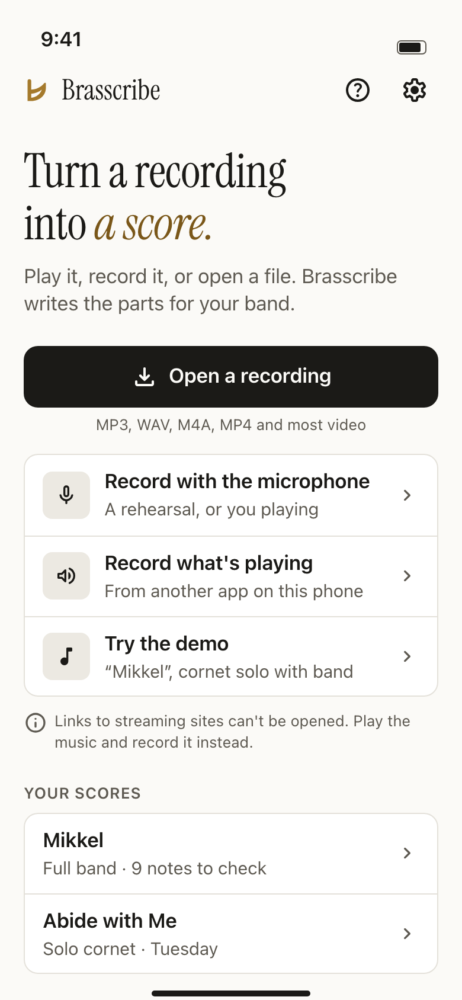 | 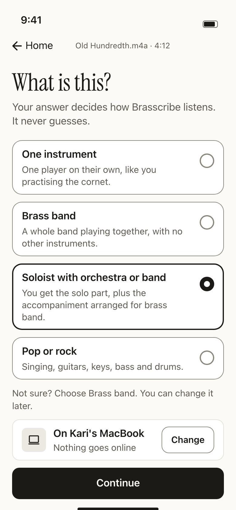 | 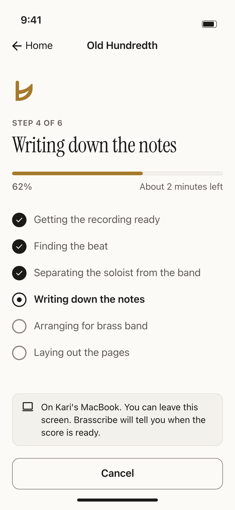 | 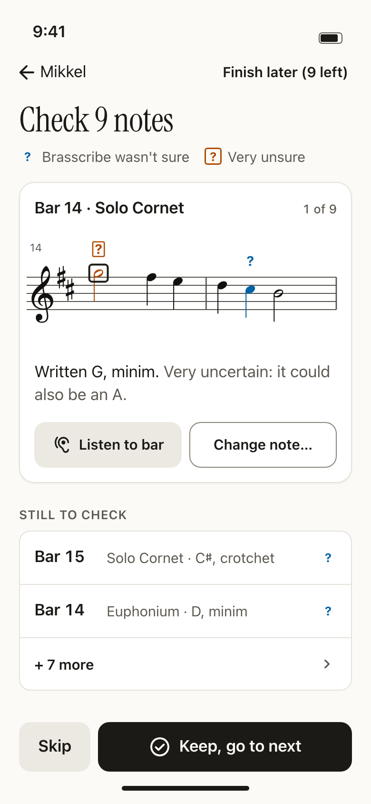 | 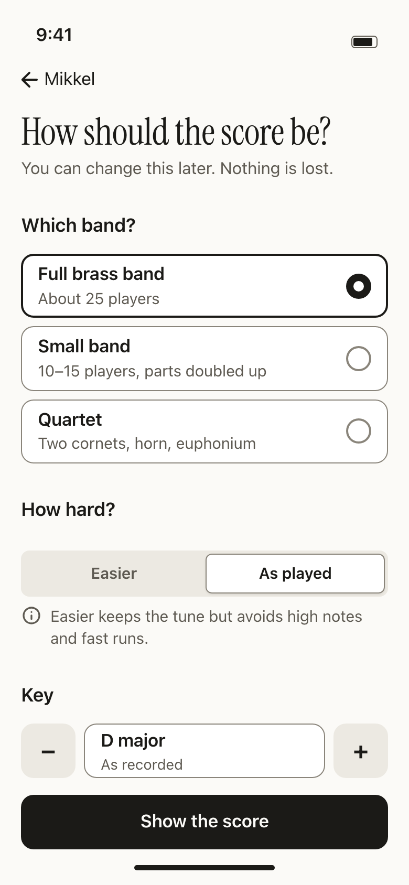 | 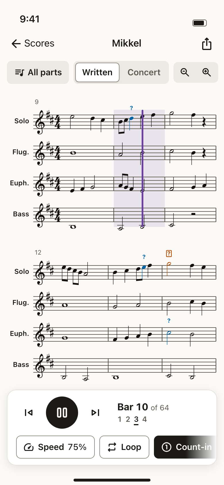 | 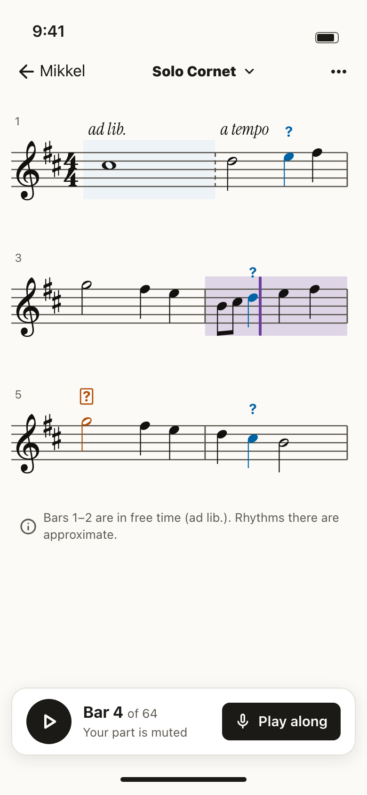 | 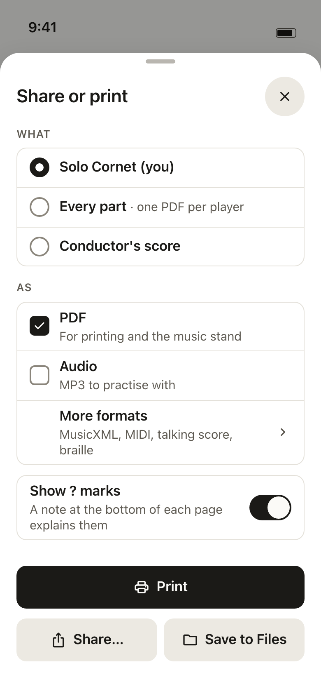 |

## 1. Rules that decide every doubt

1. **One primary button per screen.**
   - It is ink on light, paper on dark, 52 pt tall on phone, and uses radius `md`.
   - Everything else is secondary (tonal), outline or plain text.
   - In the player, the round Play button is the primary.
   - **On/off toggles are never ink-filled.** "On" is a tonal fill (`secondary`), a 1.5 px ink edge and a ✓ before the label; "off" is an outline. This keeps Count-in, Mute my part, Mute and Only this from looking like the primary.
2. **The score owns colour.**
   - Blue, orange, amber and purple mean uncertain, very uncertain, loop and cursor.
   - They appear nowhere else in Play, and UI chrome stays neutral (the one exception is the hidden Pink appearance, §10).
   - Brass is the brand colour. It is used only for the mark, the icon, the display italic, the progress bar and onboarding, never inside the score or the review list.
3. **Uncertainty is shape plus colour**: a "?" above the note, and a boxed "?" below 0.4 confidence (visual-design-tokens.md §2). Never rings, diamonds or brackets.
4. **Tints never stack.**
   - Inside a loop, the loop tint replaces the ad lib tint and the cursor-bar tint; the ad lib text and dashed bar lines stay.
   - High contrast has no tints at all, only outlines.
5. **One decision per step.** What is this?, then check the notes, then choose the output. Nothing is re-transcribed until the user presses a button (WCAG 3.2.2).
6. **Labels are visible.** Icons sit next to words. The only icon-only controls are in the transport row and the toolbar, and each has an accessible name that matches its tooltip.
7. **Touch targets.** At least 44 pt everywhere on phone and tablet, and 48 pt for the player controls (transport, practice chips) and the review buttons. Previous/next bar gets a visible 48 pt hit area. A control is never clipped: rows wrap, or move into a sheet.
8. **Nothing technical in the body text.** Commands, addresses, ports and error codes go behind a **Details for the band's tech person** disclosure, collapsed by default.
9. **Leaving never loses work silently.** Cancel while transcribing and Finish later in Review both confirm, and say how to get back.

## 2. Layout

| Size class | Width | Structure | Margins | Primary action |
|---|---|---|---|---|
| Phone | < 600 | One column, back button at top left | 20 pt / 16 dp | Full width, at the bottom above the home indicator |
| Tablet | 600–1023 | Sidebar (library, or the review list) plus content; the player floats as a card | 24 | In the content, bottom right |
| Desktop | ≥ 1024 | Sidebar 280 plus content. Reading content is at most 720 wide; the score is full width. The player is docked at the bottom. | 24–40 | Bottom right of the content, after Cancel |

- **Reading column:** at most 720 px (`size.content-max`).
- **Score view:** always full width. It reflows to one part and one staff, scrolling sideways, above 200% zoom.
- **Text size:** at 200% text size, the player bar collapses to Play plus a "Transport" menu button, and the chips wrap or move into the menu.
- **Mockups:** phone mockups show the iOS idiom and desktop mockups the macOS idiom. Android and Windows use the same structure with their own bars (see §4).

## 3. The Play flow

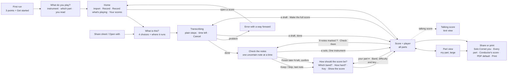
```mermaid
flowchart LR
  FR[First run<br/>3 points + Get started] --> MI[What do you play?<br/>instrument · which part · you read]
  MI --> H
  H[Home<br/>Import · Record · Record what's playing · Your scores] --> W
  SH[Share sheet / Open with] --> W
  W[What is this?<br/>4 choices + where it runs] --> T
  T[Transcribing<br/>plain steps · time left · Cancel] -->|done| R
  T -->|problem| E[Error with a way forward]
  E --> H
  R[Check the notes<br/>one uncertain note at a time] -->|Keep / Skip, last note| O
  R -->|Finish later N left, confirm| O
  R -->|a solo, One instrument| S
  O[How should the score be?<br/>Which band? · How hard? · Key · Show the score] --> S
  S -->|your part ▾ · Band, difficulty and key…| O
  S[Score + player<br/>all parts] <--> P[Part view<br/>my part, large]
  S --> X[Share or print<br/>Solo Cornet you · Every part · Conductor's score · PDF default · Print]
  S -->|9 notes marked ? · Check them| R
  P --> X
  H -->|open a score| S
  S -. talking score .-> TS[Talking score<br/>text view]
  S -->|a draft · Make the full score| T
  T -->|a draft, done| S
```

**Focus rules**
- When transcription finishes, focus moves to the "Check N notes" heading and the change is announced. A draft opens on the score instead (above): focus does not move, and "Score ready" is announced.
- After Check the notes, a solo ("One instrument") opens straight on the score at the player's part (Android): How should the score be? is not asked, and stays one tap away in the sheet of the "your part" chip (Band, difficulty and key…, or Write for another instrument… once the player's instrument is known). A band take asks it first.
- When a sheet closes, focus goes back to the button that opened it.
- The keyboard reaches a screen's content before the primary docked under it: the top bar, then the content, then the docked actions (WCAG 2.4.3).

### A band draft on the device

A brass band recording can be written down on the phone, tablet or Mac without the computer: a **draft**. It is quicker and rougher than the computer's score (the tune and the bass are right less often), so it is always called a draft, and the computer can make the full score from the same recording later. Play on iPhone, iPad, Mac and Android; not Windows yet.

**Where it runs.** Only for **Brass band** in What is this?. The other band choices still need the computer.
- The computer counts as there when one is paired and its connection is **Connected** or **Reconnecting**. Then Brass band goes to the computer, as before.
- With no computer paired, or one that is **Offline** or needs pairing again, Brass band is made on the device as a draft.
- The player can choose the draft anyway: Android's **Change** sheet in What is this? has it as a card; on Apple, **Change** opens Settings, which has the switch **Make band drafts on this device** («Lag bandutkast på denne enheten»).
- The where-it-runs row says it is a draft before anything starts. It is not a second primary: **Continue** stays the one primary.
- A finished draft opens on the **score**, not in Check the notes. Only Basic Pitch hears its tune, so every melody note is marked "?" and Check the notes would list them all; the draft notice already says it is rough. Check the notes stays a tap away on the score ("N notes marked ? · Check them"). Android does this; Apple still opens Check the notes.

**Words** (the voice rules in [`brand/brand.md`](brand/brand.md) apply; say *draft* / *utkast*, never preview, lite or beta):

| Where | English | Norsk |
|---|---|---|
| What is this?, where-it-runs row (Apple, one line) | A quick draft on this device. Your computer makes a better score. | Et raskt utkast på denne enheten. Datamaskinen lager et bedre partitur. |
| What is this?, where-it-runs row (Android title · subtitle) | On this phone: a quick draft · Your computer makes a better score. | På telefonen: et raskt utkast · Datamaskinen lager et bedre partitur. |
| Change sheet, the device card for a band (Android) | A quick draft. Nothing leaves the phone. | Et raskt utkast. Ingenting forlater telefonen. |
| Change sheet, a choice the device can't make (pop, soloist) | Only for one instrument or a brass band. | Bare for ett instrument eller et brassband. |
| Transcribing, where it runs | Android: On this phone, as a draft · Apple: On this device, as a draft. | Android: På telefonen, som utkast · Apple: På denne enheten, som utkast. |
| Transcribing, iPhone and iPad only | Keep Brasscribe open until the draft is ready. | Hold Brasscribe åpen til utkastet er klart. |
| Transcribing, a draft on Android (its service keeps it going) | On this phone, as a draft. You can switch to another app: the draft goes on, and it is on the screen when you come back. | På telefonen, som utkast. Du kan bytte til en annen app: utkastet lages videre, og det er på skjermen når du kommer tilbake. |
| Score, the draft notice (top of the score, an info note) | A quick draft made on this device. Your computer makes a better score, and results on the device can differ slightly from the computer's. (Android: *this phone*, *the phone*.) | Et raskt utkast laget på denne enheten. Datamaskinen lager et bedre partitur, og resultatet her kan bli litt annerledes enn på datamaskinen. (Android: *på telefonen*.) |
| Score, the draft notice's action (secondary, only when the computer is there) | Make the full score | Lag hele partituret |
| Score, the draft notice without the computer | Open Brasscribe Bandroom on your computer to make the full score from the same recording. | Åpne Brasscribe Bandroom på datamaskinen for å lage hele partituret fra det samme opptaket. |
| Your scores, the row's subtitle | Brass band · Draft · 32 bars | Brassband · Utkast · 32 takter |
| Too long for the device, title | Too long for a draft on this device (Android: *this phone*) | For langt for et utkast på denne enheten (Android: *på telefonen*) |
| Too long, body with the computer there | Your computer can make the score from this recording. | Datamaskinen kan lage partituret fra dette opptaket. |
| Too long, body with nothing paired | Your computer can make the score from this recording. Open Brasscribe there and choose Pair a phone (Apple: then connect in Settings here; Android: then connect it here with Connect your computer). Or choose a shorter recording. | Datamaskinen kan lage partituret fra dette opptaket. Åpne Brasscribe der og velg Koble til en telefon (Apple: og koble til i Innstillinger her; Android: og koble den til her med Koble til datamaskinen). Eller velg et kortere opptak. |
| Too long, body with the computer paired but away | Open Brasscribe Bandroom on your computer to make the score from this recording, or choose a shorter one. | Åpne Brasscribe Bandroom på datamaskinen for å lage partituret fra dette opptaket, eller velg et kortere. |
| Too long, the primary (only when the computer is there) | Make it on your computer | Lag det på datamaskinen |
| Too long, the primary with nothing paired (Android) | Connect your computer (opens the pairing screen) | Koble til datamaskinen |
| Too long, the note (Android) | Your recording is kept in Your scores. (Until it is, or when keeping it failed: Your recording is kept until you choose another.) | Opptaket ditt er tatt vare på i Partiturene dine. (Til det er det, eller når det ikke lot seg gjøre: Opptaket ditt er tatt vare på til du velger et annet.) |
| Too long, the secondary | Android: Choose another recording · Apple: Back | Android: Velg et annet opptak · Apple: Tilbake |

**Too long for a draft.** The refusal comes before anything runs, and the recording stays where it was: Back goes to What is this? with the same recording. With the computer there, the primary sends that recording to it as a Brass band score. Without it, and with nothing paired, the primary on Android is **Connect your computer**, which opens the pairing screen; with the computer paired but away there is no primary: the body says to open Brasscribe on the computer, and the primary appears when the computer does. **Try again** is not offered, since it would be refused again.

**The phone refuses the draft (Android).** When Android will not let the draft's service into the foreground (the day's time for such work is used up, for one), the draft stops and the problem screen says so: *The draft can't be made right now* («Utkastet kan ikke lages akkurat nå»), "The phone has stopped Brasscribe from working on it. Your computer can make the score, or try again later." With the computer there the primary is **Make it on your computer** and **Try again** is the secondary; without it **Try again** is the primary. The recording stays, as for a take that is too long.

**Draft now, better later.**
- A draft keeps its recording, so **Make the full score** sends that recording to the computer as a Brass band score. It runs like any other score (Transcribing, then Check the notes) and becomes a new score in Your scores; the draft stays until the player deletes it.
- Coming back before the full score is ready (Cancel, or back from a problem) shows the draft again. **Try again** after a failure asks the computer again; it never makes another draft in its place.
- Notes checked or changed in the draft do not carry over: the computer writes the notes afresh.
- **Make the full score** is a secondary (tonal) button in the notice, never the primary: on the score, the round Play button is the primary.

**Memory and time.**
- The device refuses a recording longer than its free memory can hold, before anything is written down (the same rule as a solo take), with the too-long words above.
- It runs in the foreground on iPhone and iPad (the models need the graphics chip, which the system stops in the background). On Android it runs in a foreground service with a notification, so it keeps going when the player leaves the app. Cancel works at every step.

### A recording without a score yet

A recording whose score was not made is kept in Your scores, so it outlives the app being closed: recorded at band practice, written down at home. Android does this; Apple does not yet.

- **Only what is so.** The notes say "in Your scores" only once the recording is there; a score that could not be opened has no recording, and its note says nothing about one.
- **When.** Whenever making the score did not finish: it failed, it was put off (too long for a draft, the phone refused the draft) or the player pressed Stop. A recording that gets its score leaves the list, and a recording opened from a score stays with that score (a draft keeps its own).
- **The row** sits among the scores by when it was kept: the recording's name, its length and *Not written down yet*, with the microphone's icon. A tap opens What is this? with the recording, as it was. Its ⋯ has only **Delete**, which asks first and removes the recording from the phone.
- **Storage.** Recordings are large: Settings says what the kept ones use, under the music stand's settings, while there are any. There is no limit; the player deletes them in Your scores.
- **Backup.** Kept recordings stay out of the phone's backup: they are large, and may be someone else's music.

| Where | English | Norsk |
|---|---|---|
| Your scores, the row's subtitle | 4:12 · Not written down yet | 4:12 · Ikke skrevet ned ennå |
| Delete, the question | Delete "Band practice 3 Oct"? The recording is removed from this phone. | Slette «Band practice 3 Oct»? Opptaket fjernes fra denne telefonen. |
| Settings, the storage line | Recordings kept in Your scores use 312 MB. | Opptakene i Partiturene dine bruker 312 MB. |
| Transcribing, Stop's question | Stop making this score? The recording stays in Your scores. You can start again from it. | Slutte å lage dette partituret? Opptaket blir liggende i Partiturene dine. Du kan starte på nytt fra det. |
| Transcribing, stopped | Stopped. The recording is in Your scores. | Stoppet. Opptaket ligger i Partiturene dine. |
| The score couldn't be made, the note | Your recording is kept in Your scores. You can try again now or later. | Opptaket ditt er tatt vare på i Partiturene dine. Du kan prøve igjen nå eller senere. |
| The score couldn't be made because nothing is paired (Android): the primary, then Try again as the secondary | Connect your computer | Koble til datamaskinen |
| The score couldn't be made because nothing is paired (Android), the body; the reason "connect first" goes once the computer is there | This recording needs your computer, and none is connected to this phone. | Dette opptaket trenger datamaskinen din, og ingen er koblet til denne telefonen. |

## 4. Navigation per platform

| | Apple (SwiftUI) | Android (Compose) | Windows (WinUI 3) | Studio (HTML) |
|---|---|---|---|---|
| Root | iPhone: `NavigationStack`. iPad and macOS: `NavigationSplitView`, with the library in the sidebar. | Single activity with Navigation Compose. On large screens, `NavigationSuiteScaffold` / `ListDetailPaneScaffold`. No bottom bar: Play has only two places, Home and a score. | `NavigationView` (`PaneDisplayMode="Left"`, compact below 1008 epx) with a `Frame` | Top bar (`<nav>` with `aria-current`): Runs, Score viewer, Compare, then a **Quality** menu for the maintainer pages; a **Menu** button below 768 px (so also at 200 % zoom) |
| Screen title | `.navigationTitle`, large on Home only | `TopAppBar`; `LargeTopAppBar` on Home | `TitleBar` with the app title plus the page `TextBlock` | `<h1>` plus `<title>` |
| Flow steps | `navigationDestination` push | `composable` routes | `Frame.Navigate` | hash routes |
| Sheets and dialogs | `.sheet` with `.presentationDetents([.medium, .large])`, `.confirmationDialog` | `ModalBottomSheet`, `AlertDialog` | `ContentDialog` | `<dialog>` |
| Back | System back plus the leading back button | System back gesture (predictive back) | `BackButton` in the title bar, and Alt+← | Browser back |

## 5. Components

Each component lists the native control to use, and where the brand shows.

| Component | Rule | SwiftUI | Compose | WinUI 3 | Studio HTML | Brand expression |
|---|---|---|---|---|---|---|
| **Primary button** | One per screen. The label is a verb. Min 52 pt on phone. | `Button` + `.buttonStyle(.borderedProminent)`, `.tint(Color.Brasscribe.primary)`, `.buttonBorderShape(.roundedRectangle(radius: 12))`, `.controlSize(.large)` | `Button(shape = BrasscribeButtonShape)` (colours from the scheme) | `Button Style="{StaticResource AccentButtonStyle}"` with `CornerRadius="{StaticResource BcRadiusMd}"` and `BcPrimaryBrush` | `<button class="primary">` | Ink or paper fill instead of the platform's blue or purple; 12 px corners everywhere |
| **Secondary / outline / plain** | Tonal for the second-most-likely action; outline in dialogs; plain for Cancel and Skip | `.bordered` / `.borderless` | `FilledTonalButton` / `OutlinedButton` / `TextButton` | `Button` (default), `HyperlinkButton` for plain | `.secondary` / `.outline` / `.plain` | Neutral warm greys (`secondary`, `border-strong`) |
| **List rows** | Min 60 high. Title (headline) plus one subtitle line. Chevron only when the row navigates. | `List` / `Form` `.insetGrouped`, `LabeledContent` | `ListItem` inside a `Surface(shape = medium)` | `ListView` with `ItemContainerStyle` for 60 epx rows; `SettingsCard` pattern | `<ul>` of `<a>`/`<button>` | 40 px icon well in `secondary`; hairline dividers |
| **Cards** | Group related content, never nest | `GroupBox` or `VStack` + `.background(.Brasscribe.surfaceRaised)` + `RoundedRectangle(16)` | `Card` / `OutlinedCard` | `Border` with `BcSurfaceRaisedBrush`, `CornerRadius=16` | `.card` | Elevation 1 only in light; hairline in dark |
| **Sheets and dialogs** | A title, one sentence, then actions. Destructive actions ask first. | `.sheet` / `.alert` | `ModalBottomSheet` / `AlertDialog` | `ContentDialog` (`PrimaryButtonText` is the verb) | `<dialog>` + `showModal()` | 24 px top corners; the display face for the sheet title on desktop |
| **"What is this?" chooser** | Four options, one sentence each, nothing pre-selected on the first run. The selection is remembered per song (3.3.7). | `Picker(.inline)` inside a `Form`, or custom `Button` rows with `.accessibilityAddTraits(.isSelected)` in a radio group | `Column(Modifier.selectableGroup())` of `Row(Modifier.selectable(role = Role.RadioButton))` cards | `RadioButtons` with a card `ItemTemplate` | `<fieldset>` + `<input type="radio">` inside `<label class="choice">` | Serif question, cards with a 2 px ink ring when chosen |
| **Progress with steps** | The current step in plain words as a heading, a percentage *and* the time left, all steps listed, Cancel always available. The time left is shown only for a score made on the device: a job on the computer has stages of very different lengths and no progress inside them, so its estimate would stand still and then jump; it shows the step and the percentage. Nothing tells the player when a score is ready while the app is away, so the screen says to keep the app open and stays on: "On Kari's Mac. Keep Brasscribe open until the score is ready." («På Karis Mac. Hold Brasscribe åpen til partituret er klart.»). A band draft on Android is the exception (above). **Cancel confirms**: "Stop making this score? The recording stays in Your scores." [Stop] [Keep going]. Announce every 10% or 10 s at most. Percent is written "62%" (en) and "62 %" (nb). | `ProgressView(value:)` + `.accessibilityValue`; the step list is a `List`; `.confirmationDialog` for Cancel | `LinearProgressIndicator(progress = …)` + `semantics { liveRegion = Polite }`; `AlertDialog` for Cancel | `ProgressBar` + `AutomationProperties.LiveSetting="Polite"`; `ContentDialog` for Cancel | `<progress>` + `aria-live="polite"` | Brass bar fill: the one working brand moment. Reduced motion means a static bar that updates in steps. |
| **Review list** | One note at a time: bar, part, "Written G, minim" (en-GB; en-US "G, half note"; nb "Notert G, halvnote"), the level in words **plus the alternative** ("it could also be an A"), [Listen to this bar] and [Change note…] (48 pt), [Skip] (secondary) and the primary [Keep, go to next]. **Change note… → Save stays on the note**: the score gets the new pitch, the card says "Changed to D5 (was C5)" / «Endret til D5 (var C5)» with [Undo change], Listen plays the bar with the new note, and the note keeps its "?" until [Keep, go to next]. The remaining notes are sorted by part, then bar, with "+ N more". Leaving is **Finish later (N left)** / **Fortsett senere (N igjen)**, never "Done"; it confirms: "9 notes keep their ? marks. You can check them any time from the score." [Finish later] [Keep checking]. Back (the top bar names the score) goes to the score, which is already saved with what was checked, also when Check the notes was opened from Your scores; on Android What is this? stays under the score, so its answer can still be changed, but Back from Check the notes never lands there. See `mockups/png/review-*` and `finish-later-*`. | `List(selection:)` in the sidebar + detail; accessibility rotor "Uncertain notes"; `.alert` for Finish later | `ListDetailPaneScaffold`; `LazyColumn` with a `CustomAccessibilityAction` for Keep; `AlertDialog` | `ListView` + detail; `AutomationProperties.Name` carries "uncertain"; `ContentDialog` | `<ol>` + `aria-current`; `<dialog>` | "?" / boxed "?" glyphs in the list; the ink focus ring on the note |
| **"What do you play?" (my instrument)** | Asked once after the first run and kept in Settings: **Instrument** (the band's seats, Trumpet included, or **I conduct or listen**), **Which part?** where a seat has several, and **You read** (treble clef in B♭ or E♭, or bass clef as it sounds) where a seat reads more than one clef. **Not now** skips it. The score then opens on that part in its clef, **Mute my part** mutes it, and each score keeps the seat it was made for when the instrument changes later. A seat the lineup has no part for says which part it gets ("The full brass band has no trumpet part. You get the Solo Cornet part, written for trumpet."). nb **Hva spiller du?** | `Form` with `Picker`s | `selectableGroup` radio rows | not yet on Windows | – | Serif question as the screen title |
| **"How should the score be?" (choose output)** | Three questions on one screen, remembered per song: **Which band?** (Full brass band / Small band / Quartet, each with a player count), **How hard?** (Easier / As played, with the tip "Easier keeps the tune but avoids high notes and fast runs."), **Key** (− / + stepper around "D major · As recorded"). "You can change this later. Nothing is lost." Primary: **Show the score**. Nothing re-arranges until it is pressed (3.2.2). nb: Hvilket band? / Hvor vanskelig? / Toneart / Vis partituret. See `mockups/png/choose-output-*`. | `Form` with `Picker(.inline)`, `Picker(.segmented)`, `Stepper` | `selectableGroup` cards, `SingleChoiceSegmentedButtonRow`, two `FilledTonalIconButton`s | `RadioButtons`, `Segmented`, `NumberBox` with spin buttons or two `Button`s | `<fieldset>`s | Serif question as the screen title; the tip as an ⓘ line, not a tooltip |
| **Score toolbar** | **All parts ▾** (part picker with a chevron), **As written for B♭ / Concert pitch** (phone: "As written / Concert"; the instrument key comes from the selected part; tip "Written is what you read on your part. Concert is how it sounds on a piano."), zoom − % + (phone: floating +/− over the score), and a **View ▾** menu holding **Read aloud** (talking score) and **Show video**. **Share or print** sits in the title bar. Below the toolbar, a status line: **"9 notes marked ? · Check them"**, which re-opens Review (the only way back after Finish later). | `ToolbarItemGroup`; `Menu` for parts and View; `Picker(.segmented)` | `TopAppBar` actions + `SingleChoiceSegmentedButtonRow`; `DropdownMenu` for parts and View | `CommandBar` + `DropDownButton` (parts, View) + `Segmented` (Toolkit) or `RadioButtons` | `role="toolbar"` | Segments in warm greys; no colour |
| **Player bar** | Order: Play/Pause first (1.4.2), previous/next bar (48 pt hit areas), the position "Bar 13, beat 2" with the beat counter "1 2 3 4" right beside it (never flashing), the tempo "♩ = 102 (slowed from 136)", **Hear: Band / Recording** (desktop), then the practice controls: **Speed** (visible word + slider or chip), **Repeat bars [12] to [13]** plus **Stop repeating** when on (bar fields, not drag only: 2.5.7), **Count-in**, **Metronome**, **Mute my part** (headphones). The practice chips **wrap onto a second row and never clip**; on phone they are two rows of 48 pt chips (Speed · Repeat · Count-in / Metronome · Mute my part), or a **Practice ▾** sheet when the text size leaves no room. The same player is used in the score view and the part view. It never covers the focused note. | `.safeAreaInset(edge: .bottom)` with a `ControlGroup`; chips are `Toggle(.button)`; speed is a `Slider` with `.accessibilityAdjustableAction`; repeat uses two `Stepper`s | `Surface` docked with `bringIntoViewRequester`; `FlowRow` of `FilterChip`s; `Slider` + `semantics { setProgress }` | Bottom `Grid` with `AppBarButton`s, a `Slider`, `NumberBox` × 2 and `ToggleButton`s in a wrapping `ItemsRepeater` | `role="toolbar"`, `<input type=range>`, `<input type=number>`, `button[aria-pressed]`, `flex-wrap` | Round 56 pt ink Play is the only ink control; chips get a tonal fill and a ✓ when on |
| **Mute / only this, part picker** | Every part is listed with two **labelled** toggles: **Mute** (speaker-slash) and **Only this** (target icon; tip "Only this: hear this part alone."). nb **Demp** / **Bare denne**. Never "M"/"S", "Solo" (it collides with Solo Cornet and Solo Horn) or "Lyd av" («Lyd av min stemme» reads as "the sound of my part"). The user's own part says "your part" and is muted by **Mute my part** (nb **Demp stemmen min**). The active part is bold with a leading bar, not just highlighted. 36 epx on desktop pointer, 44 pt on touch, 40 epx on Windows touch. | `Toggle(isOn:) { Label("Mute", systemImage:) }.toggleStyle(.button)` pairs in a `List` | `FilterChip(selected, label = { Text("Mute") }, leadingIcon)` pairs | `ToggleButton` pairs with icon + text | `button[aria-pressed]` with text | On = tonal fill + ✓, like every toggle |
| **Empty states** | One sentence that says what will appear, plus the action that fills it | `ContentUnavailableView` with an action | A centred `Column` with the icon, text and `Button` | `StackPanel` with the same | `<section>` | The mark in brass at 40 px, the display face for the line |
| **Errors with recovery** | Title = what happened. Body = why, as 1 or 2 bullets in plain words ("Streaming apps usually block recording", never "DRM"). Buttons = the way out: the most likely fix is the primary, bottom right on desktop after the secondary. The user's work is never lost, and they are told so. Commands, addresses and error codes go in a collapsed **Details for the band's tech person** disclosure. | Inline `ContentUnavailableView` or `.alert` for blocking errors; `DisclosureGroup` for details; `AccessibilityNotification.Announcement` | Full screen: `Column`; transient: `Snackbar` with an action; an expandable `ListItem` for details | `InfoBar` (`Severity=Error`) inline; `ContentDialog` when blocking; `Expander` for details | `role="alert"` region; `
` | Error colour only on the icon; the text stays in ink |
| **Settings** | Grouped: Sound, Display (Appearance (§10), text size, high contrast, reduced motion, "follow playback"), Keyboard (remap or turn off single-key shortcuts: 2.1.4), Your computer (pairing), Models, About. | `Settings` scene (macOS) / `Form` | Preference-style `LazyColumn` of `ListItem`s | `SettingsCard` / `SettingsExpander` (Community Toolkit) | `<form>` sections | The display face for the page title only |
| **Onboarding / first run** | One screen with three points and [Get started]. No carousel. Permissions are asked when first needed, not up front. | `.sheet` on first launch | Start destination with `rememberSaveable` | First-run `Page` | – | Brass-tint hero, a 56 px mark, a serif headline with the brass italic |
| **Uncertainty legend** | Shown on Review, on the **score view** as the status line "9 notes marked ? · Check them" (the ? marks are tappable, 44 pt, and open Review at that note), in the part-view overflow menu, and in the **PDF footer**: "? = Brasscribe wasn't sure. Boxed ? = very unsure." Share or print has a **Show ? marks** switch (on until every note is checked). | `Label` with custom glyph views | `Row` with `Text` glyphs | `StackPanel` | inline `` | Same "?" glyph as the score |
| **Share or print** | Title **Share or print** / **Del eller skriv ut** ("Export" only in the desktop menu bar). What: **Solo Cornet (you)** (the user's own part, default) / **Every part** ("one PDF per player") / **Conductor's score**, the same labels on every platform (nb **Solokornett (deg)** / **Alle stemmer** / **Dirigentpartitur**). "(you)" follows the user's part: the seat chosen in **What do you play?** (the part it maps to in this lineup), or the lineup's lead for "I conduct or listen", so a quartet says **1st Cornet (you)** / **1. kornett (deg)**. A quartet has no conductor: its third option is **Score (all 4 parts)** / **Partitur (alle 4 stemmer)**. As: **PDF** (default, alone), Audio, then More formats (MusicXML, MIDI, talking score, braille). The PDF says where it comes from: "From Brasscribe on your computer", or "Laid out on this phone" when the computer made none or a note was changed since (Android lays out its own; the pages may differ from the computer's). **Show ? marks** switch. Actions: phone **Print** (primary) · Share… · Save to Files; desktop Cancel · Save… · **Print…**. No ✕ when Cancel exists. | `.sheet` with `.presentationDetents([.large])`; `UIPrintInteractionController` / `NSPrintOperation`; `ShareLink` | `ModalBottomSheet`; `PrintManager`; `Intent.ACTION_SEND` | `ContentDialog`; `PrintManager` (WinRT); `DataTransferManager` | `<dialog>`; `window.print()` | Display face for the desktop dialog title |

**Focus.** On every platform the focus ring is 2 px in `focus` with a 2 px gap. `focus` is ink in light and paper in dark (white in high contrast), so a ring around a note can never be read as the uncertain blue or the very-uncertain orange/yellow. Keep the system focus ring wherever it exists: on Apple, `.focusEffect`; on Windows, `UseSystemFocusVisuals` plus the `FocusVisualPrimaryBrush` set to `BcFocusBrush`.

**Motion.**
- `fast` (120 ms) is for presses and toggles, `base` (200 ms) for sheets, and `slow` (320 ms) for screen changes, all on the standard curve.
- With reduced motion, transitions become cross-fades of at most 150 ms, the cursor jumps once per beat, and the score turns pages instead of scrolling.

## 6. Score view

- **Colours:** noteheads `ink`, staff `staff`, cursor `cursor` 3 px with the `cursor-tint` bar, loop `loop-tint` plus `loop-edge` brackets and the label "Loop 12–13", ad lib `adlib-tint` plus the italic text "ad lib." / "a tempo" and dashed bar lines, selection `selection-tint` plus a 1 px `selection-edge`, and the focus ring on the note.
- **Uncertainty marks:** the "?" and boxed "?" sit above the staff, outside the lines, at 1.6 staff spaces tall, in the note's colour.
- **Mockup rendering:** the mockups draw this with Bravura in [`mockups/mockup.js`](mockups/mockup.js). The apps get the same result by recolouring Verovio SVG or alphaTab output from the tokens and adding the "?" words directive.

## 7. Studio: the workbench variant

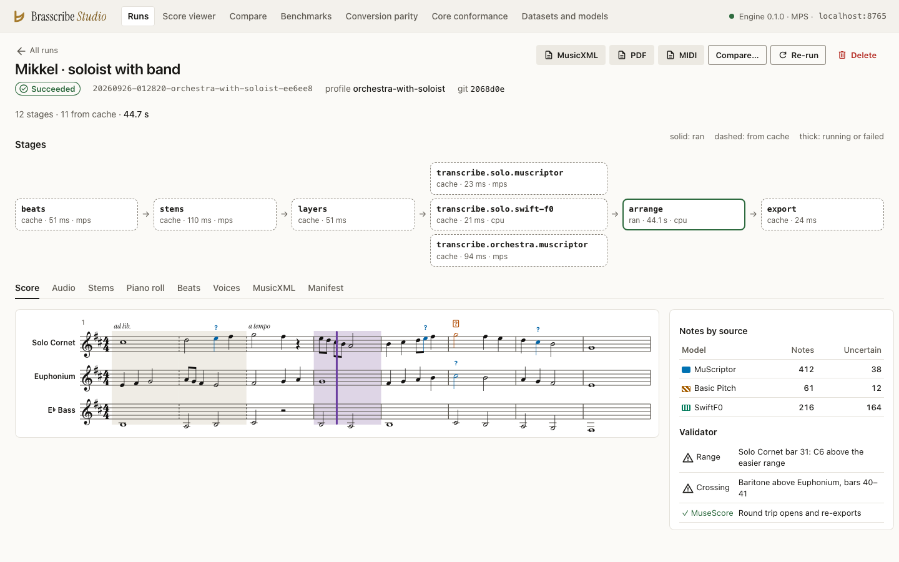

Studio uses the same tokens, the same mark and lockup ("Brasscribe *Studio*"), the same neutrals and the same "?" marks for uncertain notes (validator issues use the warning icon, never "?"). It shows more at once than Play, but it is read at the same comfortable size:

| | Play | Studio |
|---|---|---|
| Body | 17 pt / 16 dp / 18 epx | 16 px, line-height 1.5 (`studio-body`) |
| Tables | lists, not tables | 15 px, line-height 1.5, rows ≥ 44 px when they hold controls (`studio-table`) |
| Secondary text | `callout` / `caption` | 14 px (`studio-meta`); hints, metadata, legends, table headers |
| Identifiers | never shown | monospace 14 px (`studio-mono`) |
| Smallest text | `caption` | 14 px (`studio-meta`); nothing in Studio is smaller |
| Headings | platform styles | page title in the display face (`title-1`); h2 20 px (`studio-heading`); h3 17 px (`studio-subheading`) |
| Control height | 44–52 | 40 visible (`control-min-web`), 44 hit area (`touch-min-web`), 8 between targets (`target-gap-web`) |
| Radius | `md` 12 | `xs` 4 / `sm` 8 |
| Data colours | none | `model-1` … `model-4` (Okabe–Ito), always paired with a pattern or label |
| Display face | headings | only the wordmark and page titles |

Rules for every Studio screen:

- **Sizes in rem.** Text, spacing and control sizes are rem, so browser zoom to 200 % and the user's own font size work (WCAG 1.4.4). Only hairlines, focus rings and canvas strokes are px.
- **Reflow.** At 320 CSS px wide (1.4.10) nothing scrolls sideways except tables, the score and plots, each inside its own scroller. Text-spacing overrides (1.4.12: line-height 1.5, letter 0.12 em, word 0.16 em, paragraph 2 em) must not clip or overlap text, so no fixed heights on text.
- **One purpose, one primary.** Each view opens with its title and a single purpose line, and has one primary action.
- **Essentials first.** Status, the key numbers and the main action show; raw detail (hashes, manifests, per-stage files and logs, model lists, full tables) sits behind a disclosure (`details`), closed by default.
- **Plain labels.** Say what a thing does ("From the cache", "Repeat bars"). Where a term of art stays (profile, stem, round trip), an info tip (a toggle button with the explanation in words) explains it.
- **Few controls at once.** The score toolbar shows four groups, Play / Position / Repeat / View; speed, zoom, "Play bar" and the rest sit under **More**.
- **8 px rhythm.** Spacing is a multiple of `space-2` (8 px); edges align to the page gutter; headers hold the brand, the nav and one status, nothing else.
- Load `dist/web/brasscribe.css`, then `dist/web/studio-compat.css`. This maps Studio's current `--bg`, `--text`, `--ok`, `--m1`… variables, so the migration is a two-line change.

## 8. Brasscribe Bandroom: the engine on your computer

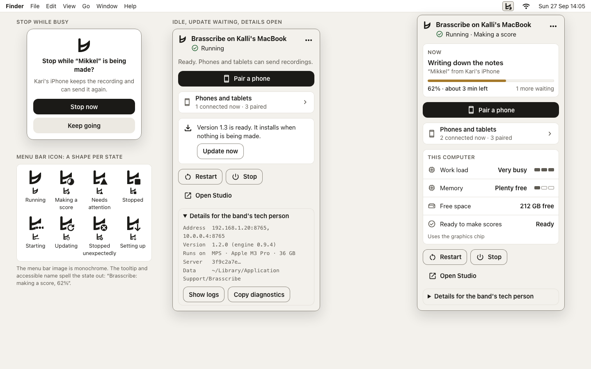

Bandroom installs the engine on a Mac or Windows PC, runs it in the background and lives in the menu bar or the taskbar corner. Its spec is [`server-app.md`](server-app.md): journeys, packaging, states, pairing, accessibility and the full nb/en copy deck. It follows every rule in §1, and these points are specific to it:
- **The same rules, in a small panel.** One primary per state (usually **Pair a phone**). Restart and Stop are outline buttons. Addresses, ports, versions and logs go only under **Details for the band's tech person**.
- **State is a shape.** The menu-bar and tray icon is the mark plus a badge shape per state, and the tooltip spells the state out. Status colours go on icons only.
- **Brass stays on the progress bar.** Health meters are neutral, and health is in words: Calm / Busy / Very busy, not percentages.
- **The QR code is always black on a white plate**, in every theme, with the six-digit code and a no-code "choose the computer on the phone, then Allow" path beside it.

## 9. Music stand

The score alone, for reading from a stand: one part, in pages, with a control layer that hides itself and a **Leave** that always stays. It follows the device's orientation, and a phone can lock it from inside. The way in is one **Music stand** button in the score toolbar, plus F (and F11 on Windows); on the Mac the green button stays the normal full screen. The spec, copy deck, WCAG mapping and platform plan are in [`music-stand.md`](music-stand.md).

## 10. Appearance

Settings › Display has one row, **Appearance** / «Utseende», that forces light or dark on this device.

- **Options:** **Match system** / «Følg systemet» (the default), **Light** / «Lyst», **Dark** / «Mørkt», and, once Pink is unlocked, **Pink light** / «Rosa lyst» and **Pink dark** / «Rosa mørkt» (see Pink below). No description line.
- **One choice, native picker.** It is never ink-filled or a row of toggles. The selected option shows the platform's ✓ or radio, and screen readers announce the row as a choice with its current value ("Appearance, Dark").

  | SwiftUI | Compose | WinUI 3 | Studio HTML |
  |---|---|---|---|
  | `Picker` in the `Form` (`.inline` or `.menu`); inside a `Menu`, an inline `Picker` gives the ✓ | A `ListItem` showing the current value that opens an `AlertDialog` of `selectableGroup` radio rows (the ListPreference pattern); the row has `Role.DropdownList` and a `stateDescription` | `ComboBox` in a `SettingsCard`, as in Windows Settings › Personalisation › Choose your mode | `<label>` + `<select>` |

- **Instant, per device.** It applies at once, with no restart, and keeps focus on the control. It is stored locally on the device and never synced.
- **The whole app follows it,** including dialogs, flyouts, title bars and the score. The score takes its semantic colours from the tokens for the resolved theme: in Dark, noteheads and staff are in paper tones, and uncertain, very uncertain, loop and cursor use their dark variants. Renderers read the app's resolved theme, never the system's directly.
- **Stays light whatever the choice:** PDFs, printouts, and the pairing QR code (black on a white plate).
- **System contrast always wins.**
  - Windows contrast themes and the browser's forced colours: the app follows the system completely, and the choice is ignored.
  - Increase Contrast (Apple), a high contrast level (Android) and `prefers-contrast: more`: the high-contrast tokens are used, in light or dark.
  - The picker stays enabled and the choice is kept for when contrast is turned off. While contrast is on, one line under the row says so:

  | Where | English | Norsk |
  |---|---|---|
  | Windows | Your contrast theme is on, so Windows chooses the colours. | Kontrasttemaet ditt er på, så Windows velger fargene. |
  | Studio (forced colours) | Your contrast theme is on, so your computer chooses the colours. | Kontrasttemaet ditt er på, så datamaskinen velger fargene. |
  | Apple (Increase Contrast) | Increase contrast is on, so Brasscribe uses its high-contrast colours. | Øk kontrast er på, så Brasscribe bruker høykontrastfargene. |
  | Android, Studio (more contrast) | Your contrast setting is on, so Brasscribe uses its high-contrast colours. | Kontrastinnstillingen din er på, så Brasscribe bruker høykontrastfargene. |

- **Bandroom** puts the row in its settings (the macOS Settings scene, the Windows settings page), not in the popover or the tray flyout.

### Pink (hidden)

Two more Appearance options, **Pink light** / «Rosa lyst» and **Pink dark** / «Rosa mørkt», that nobody sees until they find them. Pink is a small present for the players who poke around, not a feature to explain, so it is never mentioned in onboarding, help or release notes.

- **What it is.** A playful palette for the chrome: blush paper, plum text, a raspberry primary (bubblegum on dark), rose tonal fills. Pink light is Light in this palette and Pink dark is Dark in it: each keeps its mode whatever the system's is. It is the one exception to rule 2 ("UI chrome stays neutral"): the chrome may be pink, but **the notation keeps its own colours**. Noteheads and staff stay ink on near-white paper (paper tones on dark), and uncertain, very uncertain, loop and cursor keep their hues. Brass stays the brand colour. Pink dark moves `error` to coral so it stays apart from the pink primary.
- **System contrast still wins.** Increase Contrast, a high contrast level and `prefers-contrast: more` give the high-contrast palette, and Windows contrast themes and forced colours give the system's. Pink light or Pink dark stays chosen for when contrast is turned off, and more contrast keeps its light or dark. PDFs, printouts and the pairing QR code stay light, as for every choice.
- **How to find it.** In About, activate the version five times in a row, each within 1.5 s of the one before (a longer pause starts again). In Studio, which has no About, it is the Brasscribe Studio lockup in the header, activated on its own page (Runs).
  - Any activation counts: a tap, a click, Space or Enter, a VoiceOver or TalkBack double tap, Switch Control. The target is an ordinary button or link, so it is reachable from the keyboard, and nothing about it hints that it does more.
  - On the Mac, an Option-click (or Option with the keyboard activation) on the version unlocks at once.
  - On unlock, a small note says **🎺 Pink unlocked** / **🎺 Rosa låst opp** for a few seconds, and screen readers announce it once. Pink light and Pink dark then appear last in the Appearance picker, after Match system, Light and Dark. Each is an ordinary option named by its label. Nothing switches by itself.
- **Staying unlocked.** The unlock is kept on the device (never synced or backed up), like the choice itself. A device that has Pink light or Pink dark chosen counts as unlocked. To switch it off, choose any other option; both stay in the list.
- **Earlier versions.** They had one Pink that followed the system. The first time an updated app starts, that choice becomes Pink light or Pink dark to match the system's mode at that moment (Pink light if the app cannot tell), and the unlock is written down. The new choices are stored as `pink-light` and `pink-dark`, which an earlier version reads as Match system while still listing its Pink.
- **Where.** Play on Android, iOS, iPadOS, macOS and Windows, and Studio. Not in Bandroom yet.
- **Tokens.** `color.pink` and `color.pink-dark` in [`tokens/tokens.json`](tokens/tokens.json). Compose: `BrasscribeTheme(pink = true)`; SwiftUI: `BrasscribePalette.shared.isPink` switches `Color.Brasscribe.*` to the `BrasscribePink/` colour sets; web: `data-palette="pink"` on the root, with `data-theme` for light or dark; WinUI: `BrasscribePinkTheme.xaml` merged after the Brasscribe theme (Windows Play's `ThemeController`). In every app the mode comes from the choice, as for Light and Dark.

#### Palette

The roles that differ from Light and Dark. Everything else, including every score hue, `success`, `warning` and brass, is the same as in Light (Pink) or Dark (Pink dark).

| Role | Pink | Pink dark | Use |
|---|---|---|---|
| `bg` | `#FFF6F9` | `#1B1017` | window, page and score paper |
| `surface` | `#FCE9F0` | `#241620` | player bar, sidebars |
| `surface-raised` | `#FFFFFF` | `#2E1D28` | cards, sheets, menus |
| `text` | `#2B1420` | `#F8E9F0` | body text (plum) |
| `text-muted` | `#6B4558` | `#CDAABB` | secondary text |
| `border` | `#F2D3E0` | `#3F2835` | hairlines |
| `border-strong` | `#A0768A` | `#957082` | control edges |
| `primary` | `#AD1463` | `#FF9ECF` | the one primary button (raspberry / bubblegum) |
| `on-primary` | `#FFFFFF` | `#2B0F1E` | text on primary |
| `secondary` | `#F9DAE7` | `#44293A` | tonal buttons |
| `on-secondary` | `#2B1420` | `#F8E9F0` | text on secondary |
| `brass-tint` | `#FBE4ED` | `#33202B` | About and onboarding ground |
| `focus` | `#2B1420` | `#F8E9F0` | focus ring |
| `error` | `#B3261E` | `#FF8A7A` | error text and icon (coral on dark) |
| `adlib-tint` | `#F6E8EE` | `#261A21` | ad lib band |
| `selection-tint` | `#F3E0E8` | `#35242E` | selected bars |
| `cursor-tint` | `#E1D1E7` | `#3E2E42` | bar under the cursor (cursor at 20 %) |

| Foreground / background | Min | Pink | Pink dark |
|---|---|---|---|
| text / bg | 4.5:1 (1.4.3) | 16.18:1 | 15.80:1 |
| text / surface | 4.5:1 (1.4.3) | 14.75:1 | 14.79:1 |
| text / surface-raised | 4.5:1 (1.4.3) | 17.16:1 | 13.54:1 |
| text-muted / bg | 4.5:1 (1.4.3) | 7.57:1 | 8.88:1 |
| text-muted / surface | 4.5:1 (1.4.3) | 6.90:1 | 8.31:1 |
| text-muted / secondary | 4.5:1 (1.4.3) | 6.19:1 | 6.20:1 |
| text-muted / brass-tint | 4.5:1 (1.4.3) | 6.66:1 | 7.28:1 |
| on-primary / primary | 4.5:1 (1.4.3) | 6.87:1 | 9.28:1 |
| on-secondary / secondary | 4.5:1 (1.4.3) | 13.25:1 | 11.02:1 |
| brass-text / brass-tint | 4.5:1 (1.4.3) | 5.44:1 | 7.60:1 |
| success / bg | 4.5:1 (1.4.3) | 6.02:1 | 10.49:1 |
| warning / bg | 4.5:1 (1.4.3) | 5.59:1 | 9.72:1 |
| error / bg | 4.5:1 (1.4.3) | 6.16:1 | 8.09:1 |
| error / surface | 4.5:1 (1.4.3) | 5.62:1 | 7.57:1 |
| border-strong / bg | 3.0:1 (1.4.11) | 3.63:1 | 4.34:1 |
| border-strong / surface | 3.0:1 (1.4.11) | 3.31:1 | 4.06:1 |
| primary / bg | 3.0:1 (1.4.11) | 6.48:1 | 9.75:1 |
| focus / bg | 3.0:1 (2.4.13) | 16.18:1 | 15.80:1 |
| focus / surface | 3.0:1 (1.4.11) | 14.75:1 | 14.79:1 |
| ink / bg | 3.0:1 (1.4.11) | 17.79:1 | 16.27:1 |
| ink / cursor-tint | 3.0:1 (1.4.11) | 13.00:1 | 11.01:1 |
| staff / bg | 3.0:1 (1.4.11) | 7.22:1 | 7.29:1 |
| uncertain / bg | 3.0:1 (1.4.11) | 5.94:1 | 8.03:1 |
| very-uncertain / bg | 3.0:1 (1.4.11) | 5.18:1 | 8.68:1 |
| cursor / bg | 3.0:1 (1.4.11) | 6.96:1 | 9.06:1 |
| loop-edge / loop-tint | 3.0:1 (1.4.11) | 5.37:1 | 8.08:1 |

| Must stay apart | Pink | Pink dark |
|---|---|---|
| ink / uncertain | 34 | 29 |
| ink / very-uncertain | 39 | 28 |
| uncertain / very-uncertain | 47 | 47 |
| focus / uncertain | 36 | 35 |
| error / primary | 22 | 21 |
| success / error | 56 | 54 |
| warning / error | 26 | 30 |
| success / warning | 33 | 29 |

Every one of the 72 checked pairs passes in both modes; the full list is in [`qa/reports/contrast-design-tokens.md`](../qa/reports/contrast-design-tokens.md). The last table is the CIEDE2000 difference under normal vision (20 or more reads as distinct; shape and words carry the meaning as well).

#### Screenshots

Screenshots are in [`pink/`](pink/).

| | Pink | Pink dark |
|---|---|---|
| Android score | 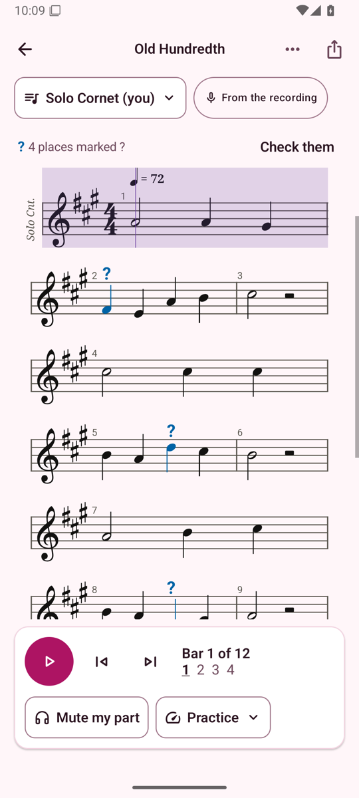 | 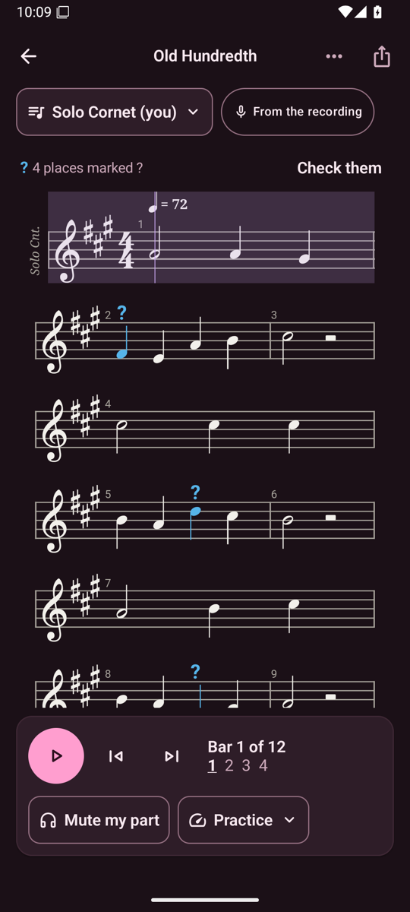 |
| Android settings | 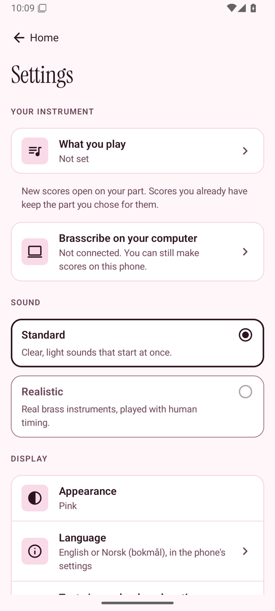 | 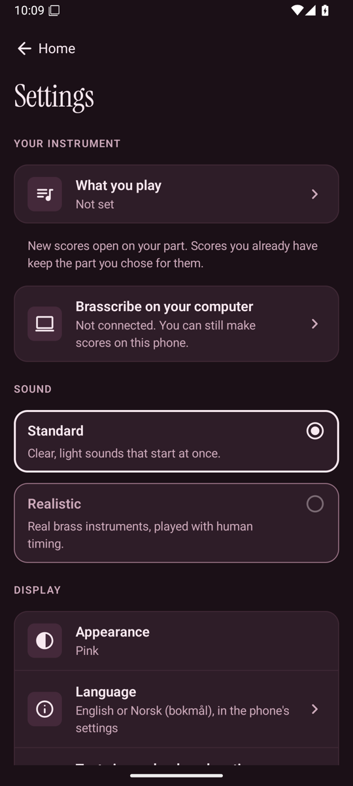 |
| macOS home | 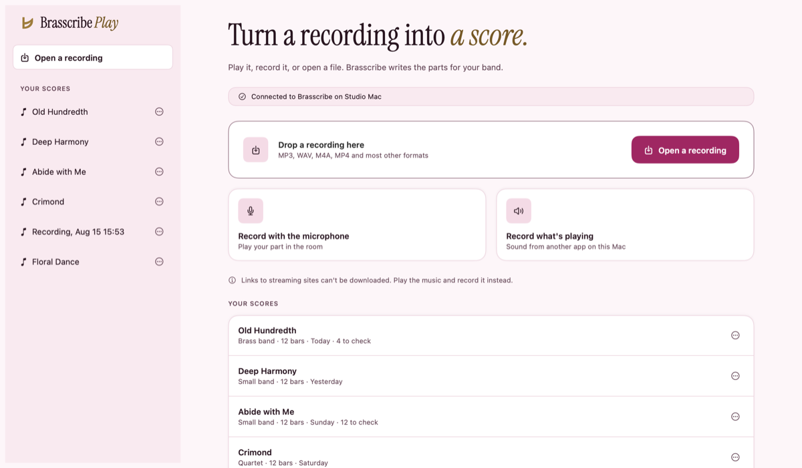 | 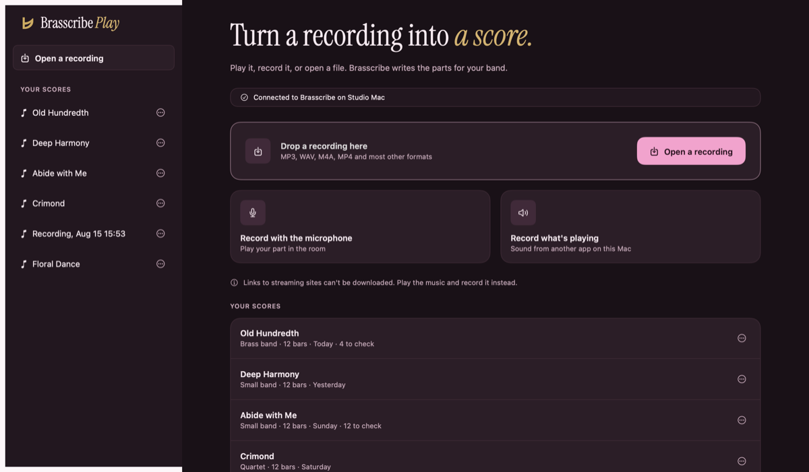 |
| macOS score | 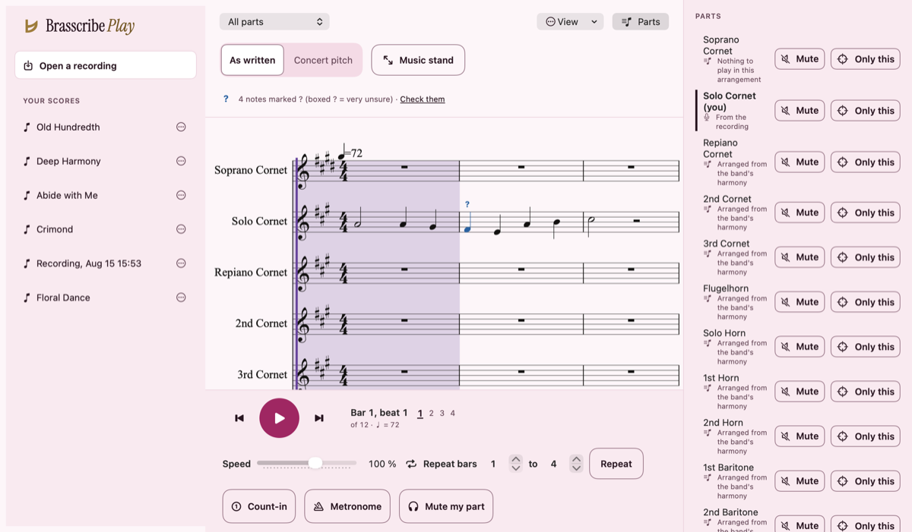 | 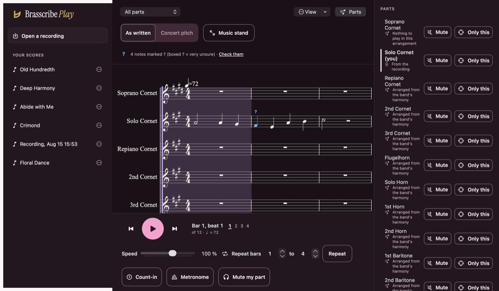 |
| macOS settings | 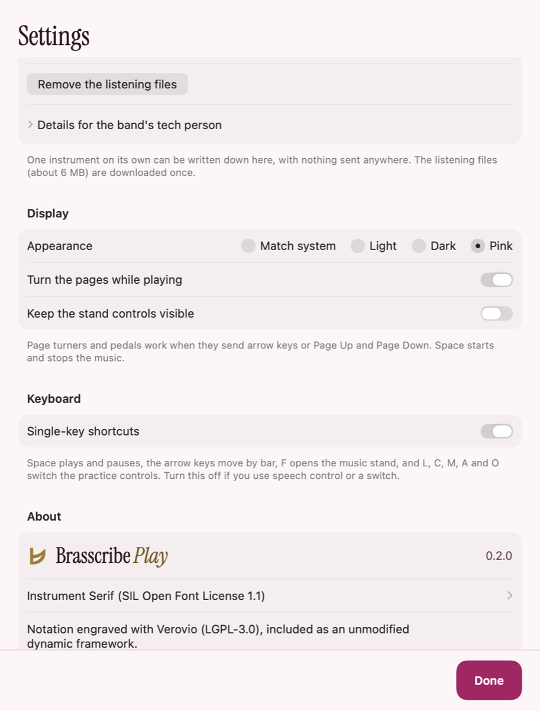 | 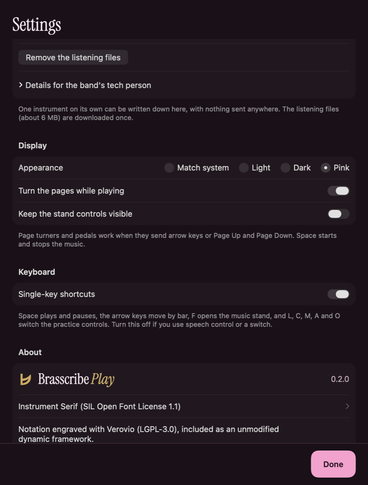 |
| Studio score viewer | 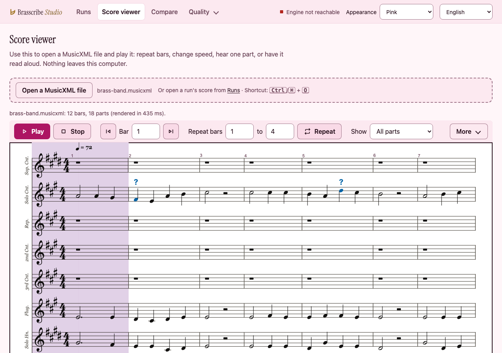 | 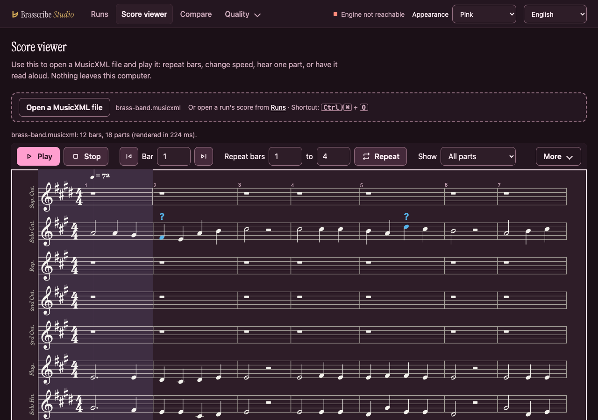 |

The unlock note on Android: 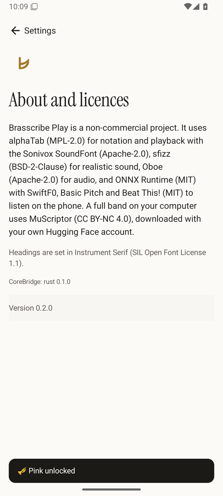
