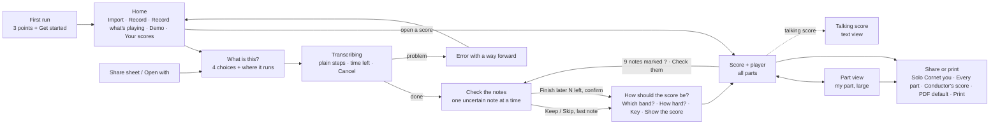

# Brasscribe design system

One product on four platforms, plus Studio. The brand lives in a few places:
- the **warm paper and ink palette**
- the **serif display headings**
- the **one button shape** (12 px corners)
- the **brass mark** at brand moments
- the **words**

Everything else is the platform's own controls, so each app feels native and familiar.

- Tokens: [`tokens/tokens.json`](tokens/tokens.json)
- Generated code: [`dist/`](dist/)
- Icon map: [`dist/icon-map.md`](dist/icon-map.md)
- Voice and naming: [`brand/brand.md`](brand/brand.md)
- Mockups: [`mockups/png/`](mockups/png/)
- Brasscribe Bandroom (the engine on your computer, in the menu bar or taskbar corner): [`server-app.md`](server-app.md)

| Home | What is this? | Transcribing | Review | Choose output | Score | Part | Share or print |
|---|---|---|---|---|---|---|---|
|  |  |  |  |  |  |  |  |

## 1. Rules that decide every doubt

1. **One primary button per screen.**
   - It is ink on light, paper on dark, 52 pt tall on phone, and uses radius `md`.
   - Everything else is secondary (tonal), outline or plain text.
   - In the player, the round Play button is the primary.
   - **On/off toggles are never ink-filled.** "On" is a tonal fill (`secondary`), a 1.5 px ink edge and a ✓ before the label; "off" is an outline. This keeps Count-in, Mute my part, Mute and Only this from looking like the primary.
2. **The score owns colour.**
   - Blue, orange, amber and purple mean uncertain, very uncertain, loop and cursor.
   - They appear nowhere else in Play, and UI chrome stays neutral.
   - Brass is the brand colour. It is used only for the mark, the icon, the display italic, the progress bar and onboarding, never inside the score or the review list.
3. **Uncertainty is shape plus colour**: a "?" above the note, and a boxed "?" below 0.4 confidence (visual-design-tokens.md §2). Never rings, diamonds or brackets.
4. **Tints never stack.**
   - Inside a loop, the loop tint replaces the ad lib tint and the cursor-bar tint; the ad lib text and dashed bar lines stay.
   - High contrast has no tints at all, only outlines.
5. **One decision per step.** What is this?, then check the notes, then choose the output. Nothing is re-transcribed until the user presses a button (WCAG 3.2.2).
6. **Labels are visible.** Icons sit next to words. The only icon-only controls are in the transport row and the toolbar, and each has an accessible name that matches its tooltip.
7. **Touch targets.** At least 44 pt everywhere on phone and tablet, and 48 pt for the player controls (transport, practice chips) and the review buttons. Previous/next bar gets a visible 48 pt hit area. A control is never clipped: rows wrap, or move into a sheet.
8. **Nothing technical in the body text.** Commands, addresses, ports and error codes go behind a **Details for the band's tech person** disclosure, collapsed by default.
9. **Leaving never loses work silently.** Cancel while transcribing and Finish later in Review both confirm, and say how to get back.

## 2. Layout

| Size class | Width | Structure | Margins | Primary action |
|---|---|---|---|---|
| Phone | < 600 | One column, back button at top left | 20 pt / 16 dp | Full width, at the bottom above the home indicator |
| Tablet | 600–1023 | Sidebar (library, or the review list) plus content; the player floats as a card | 24 | In the content, bottom right |
| Desktop | ≥ 1024 | Sidebar 280 plus content. Reading content is at most 720 wide; the score is full width. The player is docked at the bottom. | 24–40 | Bottom right of the content, after Cancel |

- **Reading column:** at most 720 px (`size.content-max`).
- **Score view:** always full width. It reflows to one part and one staff, scrolling sideways, above 200% zoom.
- **Text size:** at 200% text size, the player bar collapses to Play plus a "Transport" menu button, and the chips wrap or move into the menu.
- **Mockups:** phone mockups show the iOS idiom and desktop mockups the macOS idiom. Android and Windows use the same structure with their own bars (see §4).

## 3. The Play flow

**Focus rules**
- When transcription finishes, focus moves to the "Check N notes" heading and the change is announced.
- When a sheet closes, focus goes back to the button that opened it.

## 4. Navigation per platform

| | Apple (SwiftUI) | Android (Compose) | Windows (WinUI 3) | Studio (HTML) |
|---|---|---|---|---|
| Root | iPhone: `NavigationStack`. iPad and macOS: `NavigationSplitView`, with the library in the sidebar. | Single activity with Navigation Compose. On large screens, `NavigationSuiteScaffold` / `ListDetailPaneScaffold`. No bottom bar: Play has only two places, Home and a score. | `NavigationView` (`PaneDisplayMode="Left"`, compact below 1008 epx) with a `Frame` | Top bar (`<nav>` with `aria-current`): Runs, Score viewer, Compare, then a **Quality** menu for the maintainer pages; a **Menu** button below 768 px (so also at 200 % zoom) |
| Screen title | `.navigationTitle`, large on Home only | `TopAppBar`; `LargeTopAppBar` on Home | `TitleBar` with the app title plus the page `TextBlock` | `<h1>` plus `<title>` |
| Flow steps | `navigationDestination` push | `composable` routes | `Frame.Navigate` | hash routes |
| Sheets and dialogs | `.sheet` with `.presentationDetents([.medium, .large])`, `.confirmationDialog` | `ModalBottomSheet`, `AlertDialog` | `ContentDialog` | `<dialog>` |
| Back | System back plus the leading back button | System back gesture (predictive back) | `BackButton` in the title bar, and Alt+← | Browser back |

## 5. Components

Each component lists the native control to use, and where the brand shows.

| Component | Rule | SwiftUI | Compose | WinUI 3 | Studio HTML | Brand expression |
|---|---|---|---|---|---|---|
| **Primary button** | One per screen. The label is a verb. Min 52 pt on phone. | `Button` + `.buttonStyle(.borderedProminent)`, `.tint(Color.Brasscribe.primary)`, `.buttonBorderShape(.roundedRectangle(radius: 12))`, `.controlSize(.large)` | `Button(shape = BrasscribeButtonShape)` (colours from the scheme) | `Button Style="{StaticResource AccentButtonStyle}"` with `CornerRadius="{StaticResource BcRadiusMd}"` and `BcPrimaryBrush` | `<button class="primary">` | Ink or paper fill instead of the platform's blue or purple; 12 px corners everywhere |
| **Secondary / outline / plain** | Tonal for the second-most-likely action; outline in dialogs; plain for Cancel and Skip | `.bordered` / `.borderless` | `FilledTonalButton` / `OutlinedButton` / `TextButton` | `Button` (default), `HyperlinkButton` for plain | `.secondary` / `.outline` / `.plain` | Neutral warm greys (`secondary`, `border-strong`) |
| **List rows** | Min 60 high. Title (headline) plus one subtitle line. Chevron only when the row navigates. | `List` / `Form` `.insetGrouped`, `LabeledContent` | `ListItem` inside a `Surface(shape = medium)` | `ListView` with `ItemContainerStyle` for 60 epx rows; `SettingsCard` pattern | `<ul>` of `<a>`/`<button>` | 40 px icon well in `secondary`; hairline dividers |
| **Cards** | Group related content, never nest | `GroupBox` or `VStack` + `.background(.Brasscribe.surfaceRaised)` + `RoundedRectangle(16)` | `Card` / `OutlinedCard` | `Border` with `BcSurfaceRaisedBrush`, `CornerRadius=16` | `.card` | Elevation 1 only in light; hairline in dark |
| **Sheets and dialogs** | A title, one sentence, then actions. Destructive actions ask first. | `.sheet` / `.alert` | `ModalBottomSheet` / `AlertDialog` | `ContentDialog` (`PrimaryButtonText` is the verb) | `<dialog>` + `showModal()` | 24 px top corners; the display face for the sheet title on desktop |
| **"What is this?" chooser** | Four options, one sentence each, nothing pre-selected on the first run. The selection is remembered per song (3.3.7). | `Picker(.inline)` inside a `Form`, or custom `Button` rows with `.accessibilityAddTraits(.isSelected)` in a radio group | `Column(Modifier.selectableGroup())` of `Row(Modifier.selectable(role = Role.RadioButton))` cards | `RadioButtons` with a card `ItemTemplate` | `<fieldset>` + `<input type="radio">` inside `<label class="choice">` | Serif question, cards with a 2 px ink ring when chosen |
| **Progress with steps** | The current step in plain words as a heading, a percentage *and* the time left, all steps listed, Cancel always available. **Cancel confirms**: "Stop making this score? The recording stays in Your scores." [Stop] [Keep going]. Announce every 10% or 10 s at most. Percent is written "62%" (en) and "62 %" (nb). | `ProgressView(value:)` + `.accessibilityValue`; the step list is a `List`; `.confirmationDialog` for Cancel | `LinearProgressIndicator(progress = …)` + `semantics { liveRegion = Polite }`; `AlertDialog` for Cancel | `ProgressBar` + `AutomationProperties.LiveSetting="Polite"`; `ContentDialog` for Cancel | `<progress>` + `aria-live="polite"` | Brass bar fill: the one working brand moment. Reduced motion means a static bar that updates in steps. |
| **Review list** | One note at a time: bar, part, "Written G, minim" (en-GB; en-US "G, half note"; nb "Notert G, halvnote"), the level in words **plus the alternative** ("it could also be an A"), [Listen to this bar] and [Change note…] (48 pt), [Skip] (secondary) and the primary [Keep, go to next]. The remaining notes are sorted by part, then bar, with "+ N more". Leaving is **Finish later (N left)** / **Fortsett senere (N igjen)**, never "Done"; it confirms: "9 notes keep their ? marks. You can check them any time from the score." [Finish later] [Keep checking]. See `mockups/png/review-*` and `finish-later-*`. | `List(selection:)` in the sidebar + detail; accessibility rotor "Uncertain notes"; `.alert` for Finish later | `ListDetailPaneScaffold`; `LazyColumn` with a `CustomAccessibilityAction` for Keep; `AlertDialog` | `ListView` + detail; `AutomationProperties.Name` carries "uncertain"; `ContentDialog` | `<ol>` + `aria-current`; `<dialog>` | "?" / boxed "?" glyphs in the list; the ink focus ring on the note |
| **"How should the score be?" (choose output)** | Three questions on one screen, remembered per song: **Which band?** (Full brass band / Small band / Quartet, each with a player count), **How hard?** (Easier / As played, with the tip "Easier keeps the tune but avoids high notes and fast runs."), **Key** (− / + stepper around "D major · As recorded"). "You can change this later. Nothing is lost." Primary: **Show the score**. Nothing re-arranges until it is pressed (3.2.2). nb: Hvilket band? / Hvor vanskelig? / Toneart / Vis partituret. See `mockups/png/choose-output-*`. | `Form` with `Picker(.inline)`, `Picker(.segmented)`, `Stepper` | `selectableGroup` cards, `SingleChoiceSegmentedButtonRow`, two `FilledTonalIconButton`s | `RadioButtons`, `Segmented`, `NumberBox` with spin buttons or two `Button`s | `<fieldset>`s | Serif question as the screen title; the tip as an ⓘ line, not a tooltip |
| **Score toolbar** | **All parts ▾** (part picker with a chevron), **As written for B♭ / Concert pitch** (phone: "As written / Concert"; the instrument key comes from the selected part; tip "Written is what you read on your part. Concert is how it sounds on a piano."), zoom − % + (phone: floating +/− over the score), and a **View ▾** menu holding **Read aloud** (talking score) and **Show video**. **Share or print** sits in the title bar. Below the toolbar, a status line: **"9 notes marked ? · Check them"**, which re-opens Review (the only way back after Finish later). | `ToolbarItemGroup`; `Menu` for parts and View; `Picker(.segmented)` | `TopAppBar` actions + `SingleChoiceSegmentedButtonRow`; `DropdownMenu` for parts and View | `CommandBar` + `DropDownButton` (parts, View) + `Segmented` (Toolkit) or `RadioButtons` | `role="toolbar"` | Segments in warm greys; no colour |
| **Player bar** | Order: Play/Pause first (1.4.2), previous/next bar (48 pt hit areas), the position "Bar 13, beat 2" with the beat counter "1 2 3 4" right beside it (never flashing), the tempo "♩ = 102 (slowed from 136)", **Hear: Band / Recording** (desktop), then the practice controls: **Speed** (visible word + slider or chip), **Repeat bars [12] to [13]** plus **Stop repeating** when on (bar fields, not drag only: 2.5.7), **Count-in**, **Metronome**, **Mute my part** (headphones). The practice chips **wrap onto a second row and never clip**; on phone they are two rows of 48 pt chips (Speed · Repeat · Count-in / Metronome · Mute my part), or a **Practice ▾** sheet when the text size leaves no room. The same player is used in the score view and the part view. It never covers the focused note. | `.safeAreaInset(edge: .bottom)` with a `ControlGroup`; chips are `Toggle(.button)`; speed is a `Slider` with `.accessibilityAdjustableAction`; repeat uses two `Stepper`s | `Surface` docked with `bringIntoViewRequester`; `FlowRow` of `FilterChip`s; `Slider` + `semantics { setProgress }` | Bottom `Grid` with `AppBarButton`s, a `Slider`, `NumberBox` × 2 and `ToggleButton`s in a wrapping `ItemsRepeater` | `role="toolbar"`, `<input type=range>`, `<input type=number>`, `button[aria-pressed]`, `flex-wrap` | Round 56 pt ink Play is the only ink control; chips get a tonal fill and a ✓ when on |
| **Mute / only this, part picker** | Every part is listed with two **labelled** toggles: **Mute** (speaker-slash) and **Only this** (target icon; tip "Only this: hear this part alone."). nb **Lyd av** / **Bare denne**. Never "M"/"S", "Solo" (it collides with Solo Cornet and Solo Horn) or "Demp" (the physical mute in the bell). The user's own part says "your part" and is muted by **Mute my part**. The active part is bold with a leading bar, not just highlighted. 36 epx on desktop pointer, 44 pt on touch, 40 epx on Windows touch. | `Toggle(isOn:) { Label("Mute", systemImage:) }.toggleStyle(.button)` pairs in a `List` | `FilterChip(selected, label = { Text("Mute") }, leadingIcon)` pairs | `ToggleButton` pairs with icon + text | `button[aria-pressed]` with text | On = tonal fill + ✓, like every toggle |
| **Empty states** | One sentence that says what will appear, plus the action that fills it | `ContentUnavailableView` with an action | A centred `Column` with the icon, text and `Button` | `StackPanel` with the same | `<section>` | The mark in brass at 40 px, the display face for the line |
| **Errors with recovery** | Title = what happened. Body = why, as 1 or 2 bullets in plain words ("Streaming apps usually block recording", never "DRM"). Buttons = the way out: the most likely fix is the primary, bottom right on desktop after the secondary. The user's work is never lost, and they are told so. Commands, addresses and error codes go in a collapsed **Details for the band's tech person** disclosure. | Inline `ContentUnavailableView` or `.alert` for blocking errors; `DisclosureGroup` for details; `AccessibilityNotification.Announcement` | Full screen: `Column`; transient: `Snackbar` with an action; an expandable `ListItem` for details | `InfoBar` (`Severity=Error`) inline; `ContentDialog` when blocking; `Expander` for details | `role="alert"` region; `
` | Error colour only on the icon; the text stays in ink |
| **Settings** | Grouped: Sound, Display (theme, text size, high contrast, reduced motion, "follow playback"), Keyboard (remap or turn off single-key shortcuts: 2.1.4), Your computer (pairing), Models, About. | `Settings` scene (macOS) / `Form` | Preference-style `LazyColumn` of `ListItem`s | `SettingsCard` / `SettingsExpander` (Community Toolkit) | `<form>` sections | The display face for the page title only |
| **Onboarding / first run** | One screen with three points and [Get started]. No carousel. Permissions are asked when first needed, not up front. | `.sheet` on first launch | Start destination with `rememberSaveable` | First-run `Page` | – | Brass-tint hero, a 56 px mark, a serif headline with the brass italic |
| **Uncertainty legend** | Shown on Review, on the **score view** as the status line "9 notes marked ? · Check them" (the ? marks are tappable, 44 pt, and open Review at that note), in the part-view overflow menu, and in the **PDF footer**: "? = Brasscribe wasn't sure. Boxed ? = very unsure." Share or print has a **Show ? marks** switch (on until every note is checked). | `Label` with custom glyph views | `Row` with `Text` glyphs | `StackPanel` | inline `` | Same "?" glyph as the score |
| **Share or print** | Title **Share or print** / **Del eller skriv ut** ("Export" only in the desktop menu bar). What: **Solo Cornet (you)** (the user's own part, default) / **Every part** ("one PDF per player") / **Conductor's score**, the same labels on every platform (nb **Solokornett (deg)** / **Alle stemmer** / **Dirigentpartitur**). As: **PDF** (default, alone), Audio, then More formats (MusicXML, MIDI, talking score, braille). **Show ? marks** switch. Actions: phone **Print** (primary) · Share… · Save to Files; desktop Cancel · Save… · **Print…**. No ✕ when Cancel exists. | `.sheet` with `.presentationDetents([.large])`; `UIPrintInteractionController` / `NSPrintOperation`; `ShareLink` | `ModalBottomSheet`; `PrintManager`; `Intent.ACTION_SEND` | `ContentDialog`; `PrintManager` (WinRT); `DataTransferManager` | `<dialog>`; `window.print()` | Display face for the desktop dialog title |

**Focus.** On every platform the focus ring is 2 px in `focus` with a 2 px gap. `focus` is ink in light and paper in dark (white in high contrast), so a ring around a note can never be read as the uncertain blue or the very-uncertain orange/yellow. Keep the system focus ring wherever it exists: on Apple, `.focusEffect`; on Windows, `UseSystemFocusVisuals` plus the `FocusVisualPrimaryBrush` set to `BcFocusBrush`.

**Motion.**
- `fast` (120 ms) is for presses and toggles, `base` (200 ms) for sheets, and `slow` (320 ms) for screen changes, all on the standard curve.
- With reduced motion, transitions become cross-fades of at most 150 ms, the cursor jumps once per beat, and the score turns pages instead of scrolling.

## 6. Score view

- **Colours:** noteheads `ink`, staff `staff`, cursor `cursor` 3 px with the `cursor-tint` bar, loop `loop-tint` plus `loop-edge` brackets and the label "Loop 12–13", ad lib `adlib-tint` plus the italic text "ad lib." / "a tempo" and dashed bar lines, selection `selection-tint` plus a 1 px `selection-edge`, and the focus ring on the note.
- **Uncertainty marks:** the "?" and boxed "?" sit above the staff, outside the lines, at 1.6 staff spaces tall, in the note's colour.
- **Mockup rendering:** the mockups draw this with Bravura in [`mockups/mockup.js`](mockups/mockup.js). The apps get the same result by recolouring Verovio SVG or alphaTab output from the tokens and adding the "?" words directive.

## 7. Studio: the workbench variant

Studio uses the same tokens, the same mark and lockup ("Brasscribe *Studio*"), the same neutrals and the same "?" marks for uncertain notes (validator issues use the warning icon, never "?"). It shows more at once than Play, but it is read at the same comfortable size:

| | Play | Studio |
|---|---|---|
| Body | 17 pt / 16 dp / 18 epx | 16 px, line-height 1.5 (`studio-body`) |
| Tables | lists, not tables | 15 px, line-height 1.5, rows ≥ 44 px when they hold controls (`studio-table`) |
| Secondary text | `callout` / `caption` | 14 px (`studio-meta`); hints, metadata, legends, table headers |
| Identifiers | never shown | monospace 14 px (`studio-mono`) |
| Smallest text | `caption` | 14 px (`studio-meta`); nothing in Studio is smaller |
| Headings | platform styles | page title in the display face (`title-1`); h2 20 px (`studio-heading`); h3 17 px (`studio-subheading`) |
| Control height | 44–52 | 40 visible (`control-min-web`), 44 hit area (`touch-min-web`), 8 between targets (`target-gap-web`) |
| Radius | `md` 12 | `xs` 4 / `sm` 8 |
| Data colours | none | `model-1` … `model-4` (Okabe–Ito), always paired with a pattern or label |
| Display face | headings | only the wordmark and page titles |

Rules for every Studio screen:

- **Sizes in rem.** Text, spacing and control sizes are rem, so browser zoom to 200 % and the user's own font size work (WCAG 1.4.4). Only hairlines, focus rings and canvas strokes are px.
- **Reflow.** At 320 CSS px wide (1.4.10) nothing scrolls sideways except tables, the score and plots, each inside its own scroller. Text-spacing overrides (1.4.12: line-height 1.5, letter 0.12 em, word 0.16 em, paragraph 2 em) must not clip or overlap text, so no fixed heights on text.
- **One purpose, one primary.** Each view opens with its title and a single purpose line, and has one primary action.
- **Essentials first.** Status, the key numbers and the main action show; raw detail (hashes, manifests, per-stage files and logs, model lists, full tables) sits behind a disclosure (`details`), closed by default.
- **Plain labels.** Say what a thing does ("From the cache", "Repeat bars"). Where a term of art stays (profile, stem, round trip), an info tip (a toggle button with the explanation in words) explains it.
- **Few controls at once.** The score toolbar shows four groups, Play / Position / Repeat / View; speed, zoom, "Play bar" and the rest sit under **More**.
- **8 px rhythm.** Spacing is a multiple of `space-2` (8 px); edges align to the page gutter; headers hold the brand, the nav and one status, nothing else.
- Load `dist/web/brasscribe.css`, then `dist/web/studio-compat.css`. This maps Studio's current `--bg`, `--text`, `--ok`, `--m1`… variables, so the migration is a two-line change.

## 8. Brasscribe Bandroom: the engine on your computer

Bandroom installs the engine on a Mac or Windows PC, runs it in the background and lives in the menu bar or the taskbar corner. Its spec is [`server-app.md`](server-app.md): journeys, packaging, states, pairing, accessibility and the full nb/en copy deck. It follows every rule in §1, and these points are specific to it:
- **The same rules, in a small panel.** One primary per state (usually **Pair a phone**). Restart and Stop are outline buttons. Addresses, ports, versions and logs go only under **Details for the band's tech person**.
- **State is a shape.** The menu-bar and tray icon is the mark plus a badge shape per state, and the tooltip spells the state out. Status colours go on icons only.
- **Brass stays on the progress bar.** Health meters are neutral, and health is in words: Calm / Busy / Very busy, not percentages.
- **The QR code is always black on a white plate**, in every theme, with the six-digit code and a no-code "choose the computer on the phone, then Allow" path beside it.

## 9. Music stand

The score alone, for reading from a stand: one part, in pages, with a control layer that hides itself and a **Leave** that always stays. It follows the device's orientation, and a phone can lock it from inside. The way in is one **Music stand** button in the score toolbar, plus F, F11 on Windows, and full screen on the Mac. The spec, copy deck, WCAG mapping and platform plan are in [`music-stand.md`](music-stand.md).

