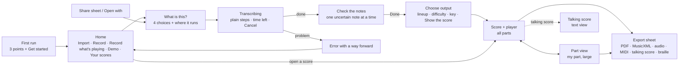

# Brasscribe design system

One product on four platforms, plus Studio. The brand lives in a few places:
- the **warm paper and ink palette**
- the **serif display headings**
- the **one button shape** (12 px corners)
- the **brass mark** at brand moments
- the **words**

Everything else is the platform's own controls, so each app feels native and familiar.

- Tokens: [`tokens/tokens.json`](tokens/tokens.json)
- Generated code: [`dist/`](dist/)
- Icon map: [`dist/icon-map.md`](dist/icon-map.md)
- Voice and naming: [`brand/brand.md`](brand/brand.md)
- Mockups: [`mockups/png/`](mockups/png/)

| Home | What is this? | Transcribing | Review | Score | Part | Export |
|---|---|---|---|---|---|---|
|  |  |  |  |  |  |  |

## 1. Rules that decide every doubt

1. **One primary button per screen.**
   - It is ink on light, paper on dark, 52 pt tall on phone, and uses radius `md`.
   - Everything else is secondary (tonal), outline or plain text.
   - In the player, the round Play button is the primary.
2. **The score owns colour.**
   - Blue, orange, amber and purple mean uncertain, very uncertain, loop and cursor.
   - They appear nowhere else in Play, and UI chrome stays neutral.
   - Brass is the brand colour. It is used only for the mark, the icon, the display italic, the progress bar and onboarding, never inside the score or the review list.
3. **Uncertainty is shape plus colour**: a "?" above the note, and a boxed "?" below 0.4 confidence (visual-design-tokens.md §2). Never rings, diamonds or brackets.
4. **Tints never stack.**
   - Inside a loop, the loop tint replaces the ad lib tint and the cursor-bar tint; the ad lib text and dashed bar lines stay.
   - High contrast has no tints at all, only outlines.
5. **One decision per step.** What is this?, then check the notes, then choose the output. Nothing is re-transcribed until the user presses a button (WCAG 3.2.2).
6. **Labels are visible.** Icons sit next to words. The only icon-only controls are in the transport row and the toolbar, and each has an accessible name that matches its tooltip.

## 2. Layout

| Size class | Width | Structure | Margins | Primary action |
|---|---|---|---|---|
| Phone | < 600 | One column, back button at top left | 20 pt / 16 dp | Full width, at the bottom above the home indicator |
| Tablet | 600–1023 | Sidebar (library, or the review list) plus content; the player floats as a card | 24 | In the content, bottom right |
| Desktop | ≥ 1024 | Sidebar 280 plus content. Reading content is at most 720 wide; the score is full width. The player is docked at the bottom. | 24–40 | Bottom right of the content, after Cancel |

- **Reading column:** at most 720 px (`size.content-max`).
- **Score view:** always full width. It reflows to one part and one staff, scrolling sideways, above 200% zoom.
- **Text size:** at 200% text size, the player bar collapses to Play plus a "Transport" menu button, and the chips wrap or move into the menu.
- **Mockups:** phone mockups show the iOS idiom and desktop mockups the macOS idiom. Android and Windows use the same structure with their own bars (see §4).

## 3. The Play flow

**Focus rules**
- When transcription finishes, focus moves to the "Check N notes" heading and the change is announced.
- When a sheet closes, focus goes back to the button that opened it.

## 4. Navigation per platform

| | Apple (SwiftUI) | Android (Compose) | Windows (WinUI 3) | Studio (HTML) |
|---|---|---|---|---|
| Root | iPhone: `NavigationStack`. iPad and macOS: `NavigationSplitView`, with the library in the sidebar. | Single activity with Navigation Compose. On large screens, `NavigationSuiteScaffold` / `ListDetailPaneScaffold`. No bottom bar: Play has only two places, Home and a score. | `NavigationView` (`PaneDisplayMode="Left"`, compact below 1008 epx) with a `Frame` | Top tab bar (`<nav>` with `aria-current`) |
| Screen title | `.navigationTitle`, large on Home only | `TopAppBar`; `LargeTopAppBar` on Home | `TitleBar` with the app title plus the page `TextBlock` | `<h1>` plus `<title>` |
| Flow steps | `navigationDestination` push | `composable` routes | `Frame.Navigate` | hash routes |
| Sheets and dialogs | `.sheet` with `.presentationDetents([.medium, .large])`, `.confirmationDialog` | `ModalBottomSheet`, `AlertDialog` | `ContentDialog` | `<dialog>` |
| Back | System back plus the leading back button | System back gesture (predictive back) | `BackButton` in the title bar, and Alt+← | Browser back |

## 5. Components

Each component lists the native control to use, and where the brand shows.

| Component | Rule | SwiftUI | Compose | WinUI 3 | Studio HTML | Brand expression |
|---|---|---|---|---|---|---|
| **Primary button** | One per screen. The label is a verb. Min 52 pt on phone. | `Button` + `.buttonStyle(.borderedProminent)`, `.tint(Color.Brasscribe.primary)`, `.buttonBorderShape(.roundedRectangle(radius: 12))`, `.controlSize(.large)` | `Button(shape = BrasscribeButtonShape)` (colours from the scheme) | `Button Style="{StaticResource AccentButtonStyle}"` with `CornerRadius="{StaticResource BcRadiusMd}"` and `BcPrimaryBrush` | `<button class="primary">` | Ink or paper fill instead of the platform's blue or purple; 12 px corners everywhere |
| **Secondary / outline / plain** | Tonal for the second-most-likely action; outline in dialogs; plain for Cancel and Skip | `.bordered` / `.borderless` | `FilledTonalButton` / `OutlinedButton` / `TextButton` | `Button` (default), `HyperlinkButton` for plain | `.secondary` / `.outline` / `.plain` | Neutral warm greys (`secondary`, `border-strong`) |
| **List rows** | Min 60 high. Title (headline) plus one subtitle line. Chevron only when the row navigates. | `List` / `Form` `.insetGrouped`, `LabeledContent` | `ListItem` inside a `Surface(shape = medium)` | `ListView` with `ItemContainerStyle` for 60 epx rows; `SettingsCard` pattern | `<ul>` of `<a>`/`<button>` | 40 px icon well in `secondary`; hairline dividers |
| **Cards** | Group related content, never nest | `GroupBox` or `VStack` + `.background(.Brasscribe.surfaceRaised)` + `RoundedRectangle(16)` | `Card` / `OutlinedCard` | `Border` with `BcSurfaceRaisedBrush`, `CornerRadius=16` | `.card` | Elevation 1 only in light; hairline in dark |
| **Sheets and dialogs** | A title, one sentence, then actions. Destructive actions ask first. | `.sheet` / `.alert` | `ModalBottomSheet` / `AlertDialog` | `ContentDialog` (`PrimaryButtonText` is the verb) | `<dialog>` + `showModal()` | 24 px top corners; the display face for the sheet title on desktop |
| **"What is this?" chooser** | Four options, one sentence each, nothing pre-selected on the first run. The selection is remembered per song (3.3.7). | `Picker(.inline)` inside a `Form`, or custom `Button` rows with `.accessibilityAddTraits(.isSelected)` in a radio group | `Column(Modifier.selectableGroup())` of `Row(Modifier.selectable(role = Role.RadioButton))` cards | `RadioButtons` with a card `ItemTemplate` | `<fieldset>` + `<input type="radio">` inside `<label class="choice">` | Serif question, cards with a 2 px ink ring when chosen |
| **Progress with steps** | The current step in plain words as a heading, a percentage *and* the time left, all steps listed, Cancel always available. Announce every 10% or 10 s at most. | `ProgressView(value:)` + `.accessibilityValue`; the step list is a `List` | `LinearProgressIndicator(progress = …)` + `semantics { liveRegion = Polite }` | `ProgressBar` + `AutomationProperties.LiveSetting="Polite"` | `<progress>` + `aria-live="polite"` | Brass bar fill: the one working brand moment. Reduced motion means a static bar that updates in steps. |
| **Review list** | One note at a time: bar, part, note name and duration, the level in words, [Listen], [Change note…], and the primary [Keep, go to next]. The remaining notes are listed below (phone) or in the sidebar (desktop). | `List(selection:)` in the sidebar + detail; accessibility rotor "Uncertain notes" | `ListDetailPaneScaffold`; `LazyColumn` with a `CustomAccessibilityAction` for Keep | `ListView` + detail; `AutomationProperties.Name` carries "uncertain" | `<ol>` + `aria-current` | "?" / boxed "?" glyphs in the list; the focus ring on the note |
| **Score toolbar** | Part picker, Written/Concert, zoom − % +, Talking score, Video. Export sits in the title bar. | `ToolbarItemGroup`; `Menu` for parts; `Picker(.segmented)` | `TopAppBar` actions + `SingleChoiceSegmentedButtonRow`; `DropdownMenu` for parts | `CommandBar` + `SplitButton` (parts) + `Segmented` (Toolkit) or `RadioButtons` | `role="toolbar"` | Segments in warm greys; no colour |
| **Player bar** | Order: Play/Pause first (1.4.2), then previous/next bar, the position "Bar 13, beat 2 of 64", Speed, Loop (bar fields, not drag only: 2.5.7), Count-in, Metronome, Mute my part, and the beat counter "1 2 3 4" (never flashing). It never covers the focused note. | `.safeAreaInset(edge: .bottom)` with a `ControlGroup`; speed is a `Slider` with `.accessibilityAdjustableAction`; loop uses two `Stepper`s | `BottomAppBar` or a `Surface` docked with `bringIntoViewRequester`; `Slider` + `semantics { setProgress }` | Bottom `Grid` with `AppBarButton`s, a `Slider`, `NumberBox` × 2 and `ToggleButton`s | `role="toolbar"`, `<input type=range>`, `<input type=number>` | Round 56 pt ink Play button; chips turn ink when on |
| **Mute / solo, part picker** | Every part is listed with M and S toggles. "Mute my part" is the play-along shortcut. The active part is bold with a leading bar, not just highlighted. | `Toggle(.button)` pairs in a `List` | `FilterChip` pairs / `IconToggleButton` | `ToggleButton` pairs | `button[aria-pressed]` | Pressed state = ink fill |
| **Empty states** | One sentence that says what will appear, plus the action that fills it | `ContentUnavailableView` with an action | A centred `Column` with the icon, text and `Button` | `StackPanel` with the same | `<section>` | The mark in brass at 40 px, the display face for the line |
| **Errors with recovery** | Title = what happened. Body = why, as 1 or 2 bullets. Buttons = the way out (the primary is the most likely fix). The user's work is never lost, and they are told so. | Inline `ContentUnavailableView` or `.alert` for blocking errors; `AccessibilityNotification.Announcement` | Full screen: `Column`; transient: `Snackbar` with an action | `InfoBar` (`Severity=Error`) inline; `ContentDialog` when blocking | `role="alert"` region | Error colour only on the icon; the text stays in ink |
| **Settings** | Grouped: Sound, Display (theme, text size, high contrast, reduced motion, "follow playback"), Keyboard (remap or turn off single-key shortcuts: 2.1.4), Your computer (pairing), Models, About. | `Settings` scene (macOS) / `Form` | Preference-style `LazyColumn` of `ListItem`s | `SettingsCard` / `SettingsExpander` (Community Toolkit) | `<form>` sections | The display face for the page title only |
| **Onboarding / first run** | One screen with three points and [Get started]. No carousel. Permissions are asked when first needed, not up front. | `.sheet` on first launch | Start destination with `rememberSaveable` | First-run `Page` | – | Brass-tint hero, a 56 px mark, a serif headline with the brass italic |
| **Uncertainty legend** | Shown on Review and in the part-view overflow menu | `Label` with custom glyph views | `Row` with `Text` glyphs | `StackPanel` | inline `` | Same "?" glyph as the score |

**Focus.** On every platform the focus ring is 2 px in `focus` with a 2 px gap. Keep the system focus ring wherever it exists: on Apple, `.focusEffect`; on Windows, `UseSystemFocusVisuals` plus the `FocusVisualPrimaryBrush` set to `BcFocusBrush`.

**Motion.**
- `fast` (120 ms) is for presses and toggles, `base` (200 ms) for sheets, and `slow` (320 ms) for screen changes, all on the standard curve.
- With reduced motion, transitions become cross-fades of at most 150 ms, the cursor jumps once per beat, and the score turns pages instead of scrolling.

## 6. Score view

- **Colours:** noteheads `ink`, staff `staff`, cursor `cursor` 3 px with the `cursor-tint` bar, loop `loop-tint` plus `loop-edge` brackets and the label "Loop 12–13", ad lib `adlib-tint` plus the italic text "ad lib." / "a tempo" and dashed bar lines, selection `selection-tint` plus a 1 px `selection-edge`, and the focus ring on the note.
- **Uncertainty marks:** the "?" and boxed "?" sit above the staff, outside the lines, at 1.6 staff spaces tall, in the note's colour.
- **Mockup rendering:** the mockups draw this with Bravura in [`mockups/mockup.js`](mockups/mockup.js). The apps get the same result by recolouring Verovio SVG or alphaTab output from the tokens and adding the "?" words directive.

## 7. Studio: the workbench variant

Studio uses the same tokens, the same mark and lockup ("Brasscribe *Studio*"), the same neutrals and the same "?" marks, but it is denser:

| | Play | Studio |
|---|---|---|
| Body | 17 pt / 16 dp / 18 epx | 14 px (`studio-body`) |
| Control height | 44–52 | 32 (≥ 24 for 2.5.8) |
| Radius | `md` 12 | `xs` 4 / `sm` 8 |
| Identifiers | never shown | monospace (`font.family.mono`) |
| Data colours | none | `model-1` … `model-4` (Okabe–Ito), always paired with a pattern or label |
| Display face | headings | only the wordmark and page titles |

- Load `dist/web/brasscribe.css`, then `dist/web/studio-compat.css`. This maps Studio's current `--bg`, `--text`, `--ok`, `--m1`… variables, so the migration is a two-line change.
