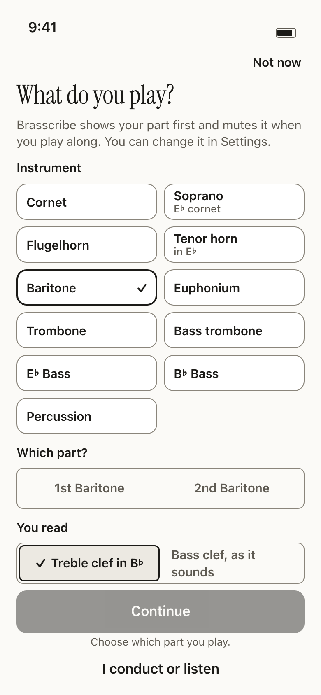
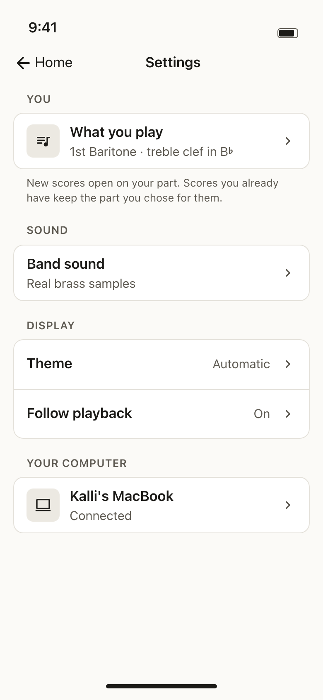
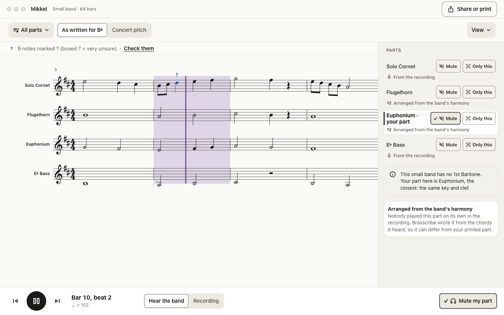
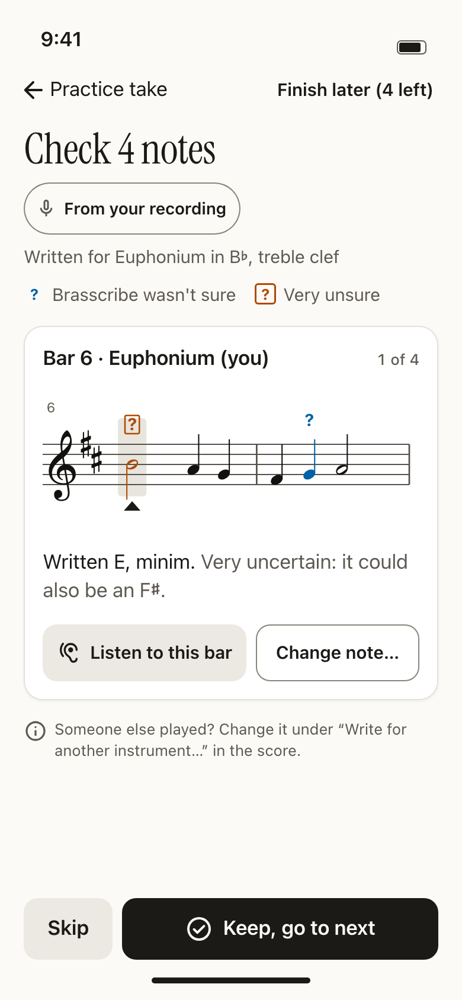

# My instrument: ask what the player plays, and write for it

The question from the owner: is Solo Cornet the right default for export and analysis? Should the player pick their own instrument and have Brasscribe adapt to it, and can the phone actually pick out the right notes for that instrument?

This plan answers the capability question with measurements, designs the UX, and lists every place in the stack that has to change and the order to build it in. It is a plan only. No production code has changed.

Line numbers refer to commit `b9ced99` (`main`). Where the quartet plan (`docs/plan/kvartett.md` on `docs/kvartett-plan`, built on `feat/kvartett`) already changes a line, this plan builds on its version and says so.

---

## Short answer

**Solo Cornet is the wrong default for anyone who isn't a solo cornet player.** It is hard-coded as "your part" in all three apps, and the arrangers always put the recorded lead on Solo Cornet. For a player who records themselves on a low-brass instrument, this is worse than a wrong label. The solo path throws most of their notes away before any model is at fault:

- The solo line is cut to a fixed window of MIDI 52–88 (E3–E6) in five places (`pipeline.rs:331-333`, `:359`, `:545`, and their Python twins).
- For the notes that survive, the arranger moves the line up an octave, or two, into Solo Cornet's range.

**The pitch tracker is not the limit.** On single-instrument brass recordings, the on-device rule (SwiftF0 as the spine, confirmed by Basic Pitch) finds 88–97 % of the notes for every brass instrument, tuba included, with essentially no octave errors. The fix is to take the note window and the part from the player's instrument.

| Recording | Where it runs | Your part is… |
|---|---|---|
| **A solo take** (you alone) | Phone, or Bandroom | **From your recording**, for every brass-band instrument, once the window and the part follow your instrument. Today this works only on cornet, flugelhorn and trumpet. |
| **Your section or quartet** | Bandroom | **From the recording** if you have the top line or the bass line. **Arranged from the band's harmony** if you have an inner part. |
| **Full band, or a soloist with band or orchestra** | Bandroom | **From the recording** if you are the soloist (after separation) or play the bass line. **Arranged** for every other part. |

**Recommendation.**
- Ask "What do you play?" once: instrument, which part, and for low brass which clef.
- Use the answer as "your part" everywhere.
- Write a solo take for that instrument.
- Say plainly on every part whether it came from the recording or was arranged.

One implementation agent can build this in 9 ordered steps (§9) after the connection, pairing and quartet branches merge. With no instrument chosen, every output stays byte-identical.

---

## 1. What Brasscribe can do for each player

### 1.1 What happens today to a baritone solo

The solo path is the same on the phone (Rust core, `arrangeLayersBand`) and in the engine's `solo` profile (Python `arrange_layers_song`). It runs in four steps:

1. SwiftF0, Basic Pitch and (on the engine only) MuScriptor each transcribe the take.
2. Each result is reduced to one line with `line(notes, 52, 88, top=True)`. Every note below E3 is dropped here: `core/brasscribe-core/src/pipeline.rs:331-333`, `eval/brasscribe_eval/arrange_layers_song.py:184-185`.
3. The notes SwiftF0 found are kept, with a confidence score from how many models agree. The kept line is filtered through the same window again (`pipeline.rs:359`, `arrange_layers_song.py:202`).
4. The line goes to the Solo Cornet part (`arranger.rs:501-502`, `arranger.py:371`). `_place_line` picks the octave for each phrase that best fits Solo Cornet's reading range, 55–79 sounding.

A euphonium or baritone line sits mostly in E2–B♭4. It loses about a quarter of its notes in step 2, and nearly every phrase is moved up an octave in step 4. The player gets a cornet part an octave above what they played. On a tuba nothing survives step 2.

The same window cuts the melody of the non-layered arrangers (`pipeline.rs:545`, `arrange_song.py:68`), and the solo benches use it too (`arrange_solo.py:29-33`, `solo_vote_bench.py:50,82`, `suites.py:172,246,255`, `separation_bench.py:35`, `confidence_bench.py:89`).

### 1.2 Measured: one instrument on its own

**Data.** ChoraleBricks v1.1.0 (`data/choralebricks/01_AudioAndAnnotations`). Every chorale voice is recorded separately on several instruments, with note annotations at sounding pitch. The measurement covers all 93 brass stems across the 10 chorales.

**Method.** Each stem went through the desktop SwiftF0 and Basic Pitch adapters (`ml/adapters/*/run.sh`). The solo rule was then applied as on the phone: SwiftF0 as the spine, with Basic Pitch confirming and also standing in for MuScriptor. It was run twice, once with today's window and once with the instrument's own range (`Instrument.pro`). Scoring used mir_eval onset F1 with 100 ms tolerance.

The scripts and raw results are in [`my-instrument/`](my-instrument/): `run_adapters.sh`, `measure.py`, `results.json`, `section.py`, `run_urmp.sh` and `measure_urmp.py`. Run them from the `eval` project with `uv run python …`. §7.1 turns them into a CI suite.

| Instrument (stems) | Played range (2–98 %) | Notes below E3 | SwiftF0 F1 | Basic Pitch F1 | Solo rule, today's window: F1 / recall | Solo rule, instrument's range: F1 / recall | Octave errors | Basic Pitch agrees | Solo Cornet moves an octave | Own reading range moves an octave |
|---|---|---|---|---|---|---|---|---|---|---|
| Trumpet (20) | A♯3–D5 | 0 % | 0.96 | 0.88 | 0.96 / 0.95 | 0.96 / 0.95 | 0.0 % | 98 % | 3 % | 3 % |
| Flugelhorn (20) | A♯3–D5 | 0 % | 0.96 | 0.96 | 0.95 / 0.93 | 0.96 / 0.93 | 0.0 % | 97 % | 1 % | 0 % |
| French horn (11) | E3–G4 | 0 % | 0.90 | 0.80 | 0.90 / 0.83 | 0.90 / 0.84 | 0.0 % | 89 % | 56 % | 0 % |
| Trombone (8) | F♯2–D4 | 54 % | 0.97 | 0.79 | **0.56 / 0.44** | 0.97 / 0.96 | 0.2 % | 88 % | 100 % | **44 %** |
| Baritone (24) | G2–E4 | 27 % | 0.97 | 0.87 | **0.78 / 0.70** | 0.97 / 0.97 | 0.0 % | 91 % | 92 % | **15 %** |
| Tuba (10) | F♯1–A2 | 100 % | 0.88 | 0.48 | **0.00 / 0.00** | 0.88 / 0.87 | 0.0 % | **55 %** | 100 % | **20 %** |

**What the columns say.**
- **The trackers are fine on every brass instrument.** SwiftF0 alone reaches 0.88–0.97 F1, with no octave errors to speak of. Basic Pitch is weaker in the low register (tuba 0.48), but it only confirms notes; it doesn't supply them.
- **Today's window is the whole problem for low brass.** With the instrument's range, trombone recall goes from 0.44 to 0.96, baritone from 0.70 to 0.97, and tuba from 0 to 0.87.
- **"Solo Cornet moves an octave"** is the share of *correct* notes (the annotations themselves) that today's placement writes in a different octave from the one played. For every low instrument it is almost all of them.
- **"Own reading range moves an octave"** is the same, placing into the player's own instrument's reading range. It is still 15–44 % for low brass, because the reading ranges in `instruments.py` are narrower than what players actually play (a chorale bass line sits below the trombone's reading floor of G2).
  - So a solo take must be written in the octave it was played in. Move a note only when it is outside the instrument's professional range, which almost always means a tracker octave error. `_place_line` is the right tool for arranging a line onto a part. It is the wrong tool for writing down the player's own notes.
- **"Basic Pitch agrees"** is the share of kept notes that Basic Pitch also found. On tuba it is only 55 %. The confidence model (`confidence.rs` `p_correct`) weighs model agreement, so correct tuba notes are likely to get "?" marks much more often than cornet notes. The real "?" rate was not measured here, and the model (`calibration.json`) has no feature for the register. It is a benchmark item (§7) and a possible recalibration.

**Cross-check on real instruments: URMP.** URMP (`data/urmp/Dataset`) has separately recorded real trumpet, French horn, tenor trombone and tuba tracks. They went through the same rule and scoring (`measure_urmp.py`). Tracks whose pitch contradicts their file tag are skipped, because URMP tags are sometimes wrong.

| Instrument (stems) | Played range | Notes below E3 | SwiftF0 F1 | Solo rule, today's window: F1 / recall | Solo rule, instrument's range: F1 / recall | Octave errors |
|---|---|---|---|---|---|---|
| Trumpet (22) | G3–F5 | 0 % | 0.97 | 0.96 / 0.94 | 0.96 / 0.94 | 0.0 % |
| French horn (5) | D3–A♯4 | 5 % | 0.97 | 0.93 / 0.89 | 0.95 / 0.93 | 0.0 % |
| Trombone (8) | F2–D4 | 43 % | 0.96 | **0.64 / 0.54** | 0.96 / 0.95 | 0.3 % |
| Tuba (5) | A♯1–G3 | 87 % | 0.94 | **0.21 / 0.12** | 0.93 / 0.91 | 0.9 % |

URMP gives the same picture on real trombones and tubas as ChoraleBricks did: the trackers are fine, and the window is the whole loss.

**Caveats. This is an honest measurement, not the phone.**
- **Proxy instruments.** URMP covers real trombone and tuba (above). There is no recording of a real euphonium, tenor horn or E♭ Bass. ChoraleBricks "Baritone" is the German Bariton, close to a euphonium, and was measured against the euphonium's range. French horn stands in for tenor horn. The trombone plays the chorale's bass line, which sits low for a tenor trombone. The tuba plays an octave below the notated chorale.
- **Recording conditions.** These are clean close-mic studio stems. A phone in a practice room adds room sound and noise. `docs/research/pitch-benchmark-notes.md` puts SwiftF0 at the top of its tracker benchmark under noise and reverb, but not on brass.
- **Runtime.** These are the desktop Python adapters, not the Core ML and TFLite conversions the phones run. `convert/swift-f0/parity.py` checks the conversion against the reference. The phone runtime was not measured here.
- **SwiftF0 has a floor.** The lowest pitch it reports is 46.875 Hz (`swift_f0.FMIN`), a quarter-tone above F♯1. Tuba and B♭ Bass pedal notes from F♯1 down cannot be tracked by the phone or the engine. This is a real model limit, not the window.
- **The octave-move columns are approximate.** The tick mapping (48 ticks per second) only estimates where the phrases break.

### 1.3 Measured: can the player's inner part be picked out of a section recording?

**Data.** ChoraleBricks brass4: 10 mono mixes of four players, with S = trumpet, A = flugelhorn, T = baritone, B = tuba. These are the cached MuScriptor medium and Basic Pitch outputs in `data/eval/choralebricks-brass4`.

**Method.** Extract one line per voice inside that seat's range:
- the top line for S and the bottom line for B
- A as the top line and T as the bottom line of what is left once S and B are taken

One pass, with no tuning.

| Source | S F1 | A F1 | T F1 | B F1 |
|---|---|---|---|---|
| MuScriptor medium on the mix | 0.92 | 0.83 | **0.31** | 0.69 |
| Basic Pitch on the mix | 0.36 | 0.38 | 0.25 | 0.30 |

**What it says.**
- The top line is safe, and the bass line is usable with "?" marks. This matches what the arrangers already take from the recording.
- The upper inner voice is surprisingly recoverable on this set.
- The lower inner voice is not.

Two things make a real section harder than this. The brass4 voices are four different timbres. And a cornet section in close harmony is one timbre, which no model separates (`docs/research/00-summary.md:69`, and `docs/research/11-overlaps-and-in-between-tones.md` for unisons and crossings).

**Decision.** Keep inner parts **arranged** in this change. "Follow my line" for an upper inner seat can come later, gated on a benchmark (§7.3). The arrangers already rebuild inner parts from the harmony's pitch classes, and the quartet's `voice_satb` will do it better.

### 1.4 The answer, per recording type and device

| | On the phone | Through Bandroom (the engine on your computer) |
|---|---|---|
| **Solo take, you alone** | Your notes, written down for your instrument: **From your recording**. Every brass-band instrument, once §4.2 lands. Tuba and B♭ Bass pedal notes below F♯1 are missed. Low brass is likely to show more "?" marks until the confidence model is recalibrated. | The same. MuScriptor also confirms notes, so there are fewer "?" marks. |
| **Your section, or your quartet** | Not on the phone. The phone runs only the solo path. | If you have the top line: **From the recording**. If you have the bass line: **From the recording**, with more "?" marks. If you have an inner part: **Arranged from the band's harmony**. |
| **Full band, or a soloist with band or orchestra** | Not on the phone. | If you are the soloist: **From the recording**, after separation (Mega-53). If your instrument isn't a cornet, Brasscribe can write the solo on your part (§4.4). If you play the bass line: **From the recording**. Every other part is **Arranged**. |

**The honest one-liner for the player.** When you record yourself, Brasscribe writes down *your* notes. When you record a band, only the tune and the bass line are written down from what was heard. Every other part, yours included, is arranged from the band's harmony, and Brasscribe says so on the part.

---

## 2. The model: seat, reading and where each part came from

### 2.1 Seat

The player's answer is a **seat**: one of the 18 parts of the contest band (`BRASS_BAND`, `instruments.py:143-163`), or **none** ("I conduct or listen").

**Ids.** Seats get stable ASCII ids, so they survive JSON, form fields and OpenAPI enums: `soprano-cornet`, `solo-cornet`, `repiano-cornet`, `2nd-cornet`, `3rd-cornet`, `flugelhorn`, `solo-horn`, `1st-horn`, `2nd-horn`, `1st-baritone`, `2nd-baritone`, `1st-trombone`, `2nd-trombone`, `bass-trombone`, `euphonium`, `eb-bass`, `bb-bass`, `percussion`. The part name, instrument, transposition, clef and ranges all come from `BRASS_BAND` and `instruments.rs`. Nothing new goes into instrument knowledge.

**How the player picks.** The first-run question asks for the instrument first, then which part:

| Instrument | Parts offered | Seat id |
|---|---|---|
| Cornet | Solo · Repiano · 2nd · 3rd | `solo-cornet`, `repiano-cornet`, `2nd-cornet`, `3rd-cornet` |
| Soprano cornet (E♭) | – | `soprano-cornet` |
| Flugelhorn | – | `flugelhorn` |
| Tenor horn (E♭) | Solo · 1st · 2nd | `solo-horn`, `1st-horn`, `2nd-horn` |
| Baritone | 1st · 2nd | `1st-baritone`, `2nd-baritone` |
| Euphonium | – | `euphonium` |
| Trombone | 1st · 2nd | `1st-trombone`, `2nd-trombone` |
| Bass trombone | – | `bass-trombone` |
| E♭ Bass · B♭ Bass | – | `eb-bass`, `bb-bass` |
| Percussion | – | `percussion` |

### 2.2 Reading: clef and transposition

The brass-band default is treble clef, transposed, for every part except the bass trombone, which reads bass clef at concert pitch (`instruments.py:89-108`).

Many euphonium, baritone, trombone and tuba players, in school bands, wind bands and churches, read bass clef at concert pitch instead. So those instruments get a second answer, **You read: Treble clef in B♭ / Bass clef, as it sounds**:
- Euphonium, baritone and trombone offer "Treble clef in B♭".
- The basses offer "Treble clef in E♭" or "Treble clef in B♭", matching the instrument.

This is `reads: "treble" | "bass" | null` (null = the brass-band default). The MusicXML writers already take a clef per part (`musicxml.py:34,287`, `notation/score.rs:27,652`). With `reads="bass"`, the player's part is written at concert pitch in bass clef, and no `<transpose>` element is emitted.

### 2.3 Seat → part, when the lineup lacks the seat

The small band has 8 parts and the quartet 4, so a seat often has no part of its own. Resolve it with one **explicit table** in core. **The table is authoritative.** These rules only explain how it was built, in order:
1. the same part
2. a part the player can play: the closest range
3. of those, a part in the same key, so the player can read it without transposing
4. then the same instrument family, and the same role (tune, bass or inner)

"Different key" below compares transpositions (`chromatic % 12`): B♭ parts (cornet, flugelhorn, baritone, trombone, euphonium, B♭ Bass), E♭ parts (soprano, tenor horn, E♭ Bass), and the bass trombone at concert pitch.

| Seat | Full band | Small band | Quartet |
|---|---|---|---|
| Soprano Cornet (E♭) | same | Solo Cornet *(different key)* | 1st Cornet *(different key)* |
| Solo Cornet | same | same | 1st Cornet |
| Repiano Cornet, 3rd Cornet | same | 2nd Cornet | 2nd Cornet |
| 2nd Cornet | same | same | same |
| Flugelhorn | same | same | 2nd Cornet |
| Solo Horn | same | same | Tenor Horn |
| 1st Horn, 2nd Horn | same | Solo Horn | Tenor Horn |
| 1st Baritone, 2nd Baritone | same | Euphonium | Euphonium |
| 1st Trombone | same | same | Euphonium |
| 2nd Trombone | same | 1st Trombone | Euphonium |
| Bass Trombone (concert, bass clef) | same | E♭ Bass *(different key)* | Euphonium *(different key)* |
| Euphonium | same | same | same |
| E♭ Bass | same | same | Euphonium *(different key)* |
| B♭ Bass | same | same | Euphonium |
| Percussion | same | none | none |

- **Core API.** `seat_part(lineup, seat) -> SeatPart { part: Option<String>, exact: bool, same_key: bool }`, in `instruments.py` and `instruments.rs`, and over FFI. It is one table for all three apps. The apps never keep their own copy.
- **Different key.** With `reads="bass"`, a different key doesn't matter: the part is shown in bass clef at concert pitch anyway. With treble reading, the app says so (§3.7).
- **The quartet's own names.** The quartet uses "1st Cornet" and "Tenor Horn" (kvartett §1.1, open question 1 there). If kvartett keeps the band names instead, the quartet column changes to Solo Cornet and Solo Horn, and the table stays the same.

### 2.4 Where each part came from

Every part is one of three things. The data values are internal. The UI words (§3.8) never say "transcribed" (`brand.md:78`).

| Value | When | UI label |
|---|---|---|
| `your-recording` | A solo take: the part carries the player's own line | **From your recording** |
| `recording` | The part follows a line heard in a band recording: the lead or solo layer, the bass layer (E♭ Bass, and B♭ Bass an octave below), the countermelody from the strings' top line, drums | **From the recording** |
| `arranged` | The part is voiced from harmony slots (`_voice_slot`, `_voice_layer`, `voice_satb`), or doubles the tune (Soprano Cornet at climaxes) | **Arranged from the band's harmony** |

**Derived, not stored.** The source of each part follows from the lineup's roles, the arranger that ran (layered or not), and which layers had notes. So it is a pure core function, `part_sources(composition_json) -> {part: source}`, and not a new field in `composition.json`. This keeps every existing output byte-identical. When a seat is set, `comp.arrangement` records `seat`, `reads` and `lead` like the other options (`score_model.py:162`), which is how the function knows a solo take was written for the seat.

"Made easier" (`difficulty` standard or easier) is shown as a second line, not as a fourth source. It changes the notes of any part.

### 2.5 Who plays the tune

`lead: "lineup" | "seat"`, with `"lineup"` as the default.
- **`"lineup"`** keeps the tune on the lineup's lead: Solo Cornet, or 1st Cornet in the quartet (kvartett `Lineup.lead`).
- **`"seat"`** writes the solo layer, or the melody, on the player's part: "Euphonium solo with band".
  - The countermelody normally on Euphonium moves to the next part that can carry it (Solo Horn, then 1st Baritone).
  - Soprano doubling is off when the lead is not a cornet.
- **The solo profile with a seat always uses `"seat"`.** For a solo take the question does not come up.

---

## 3. The UX

It follows `design/system.md` (rules §1, components §5), `design/brand/brand.md` (voice, words) and WCAG 2.2 AA. Mockups are in `design/mockups/my-instrument-*.html`, with PNGs in `design/mockups/png/my-instrument-*`.

| First run | Settings | Score: arranged vs from the recording | Review: your own take |
|---|---|---|---|
|  |  |  |  |

### 3.1 First run: "What do you play?"

- **Placement.** One new screen after **Get started** on the three-point first run (`system.md:114`). The first run stays one screen with three points. This is the one question it leads to, not a carousel.
- **Layout.**
  - A serif title, "What do you play?", and one sentence: "Brasscribe shows your part first and mutes it when you play along. You can change it in Settings."
  - The instruments, as a radio group of two-column tiles, each at least 56 pt tall. **Nothing is pre-selected** (the same rule as "What is this?", `system.md:104`).
  - After an instrument is chosen, **Which part?** appears under it, if the instrument has more than one part.
    - It is a radio group with **nothing selected**, so a 3rd cornet player is never quietly filed as Solo Cornet.
    - It is laid out as a segmented row, or as a vertical list at large text sizes.
  - For euphonium, baritone, trombones and basses, **You read** appears too, with the brass-band default selected. A default is safe here: a wrong clef is obvious on the first score and is changed in one tap.
- **Actions.**
  - Primary: **Continue**. It is inactive until an instrument, and a part where there is a choice, are chosen, and it says why: "Choose your instrument, or I conduct or listen".
  - Plain: **I conduct or listen**. This sets the seat to none, and scores open on every part.
  - Navbar: **Not now**. This skips without setting anything and behaves like today. Settings shows "Not set". Brasscribe doesn't ask again.
- **Changes.** None until Continue is pressed (3.2.2).
- **Redundant entry (3.3.7).** The answer is never asked again. Every later place pre-fills from it.

### 3.2 Settings

- A new first section, **You** / «Instrumentet ditt», above Sound (`system.md:113`). It has one row: **What you play**, with the value "1st Baritone · treble clef in B♭", or "Not set". The row opens the same picker as the first run.
- The caption says what changes and what doesn't: "New scores open on your part. Scores you already have keep the part you chose for them."
- **Changing the setting never re-arranges an existing score.** It changes the default for new scores, and "your part" in scores where the player never picked one.

### 3.3 Per score

- **Band takes.** The part picker (`All parts ▾`) gets **Make this my part** on each part. Picking it changes only the highlight, the mute target, the Review order and the Share scope, so it takes effect at once. It is saved with the score (Apple `Piece`, Android `SavedScore`, Windows `LibraryEntry`).
- **Solo takes.** On "How should the score be?" (Choose output), a friend may have played the take, so the question is **Who played this?**, pre-filled with the player's seat.
  - Changing it rewrites the part for another instrument. That re-arranges the score, so it happens only on **Show the score** (3.2.2), like every other Choose output answer.
  - From the score, the same change is **Write for another instrument…**, which opens Choose output.
- **Soloist recordings** (orchestra-with-soloist, or brass band with a solo). Choose output gets **Who plays the tune?** with two choices, "Solo Cornet (as usual)" and "You: Euphonium". It is shown only when the player's seat is not the lead and their instrument can carry a melody (`Role.MELODY`/`SOLO` in `instruments.py`).

### 3.4 Where "your part" shows

| Place | Today | With a seat |
|---|---|---|
| Score opens on | all parts; "your part" = Solo Cornet | all parts; "your part" = the seat's part (§2.3). Seat none: no "your part", and **Mute my part** is hidden. |
| Mixer row | Solo Cornet, bold with a bar, "your part" | the seat's part, and under it the source label (§3.6) |
| Part view (`Show one part`) | Solo Cornet | your part |
| **Mute my part** / play along | mutes Solo Cornet | mutes your part |
| Review **Yours (n)** | Solo Cornet's notes | your part's notes. When your part is arranged, it has no notes of its own (§3.6). |
| Share or print scope | **Solo Cornet (you)** (`system.md:116`, `brand.md:101`) | **<your part> (you)**, e.g. "Euphonium (you)" / «Eufonium (deg)», with kvartett §2.10's "<part> (you)" rule. Seat none: **Every part** is the default. |
| The key for your instrument (Choose output, Key) | "D major (concert) · E major for B♭ · F major for E♭ instruments" (hard-coded) | "D major (concert) · **E major on your part**". With bass clef reading: "D major, as it sounds". |
| Score toolbar pitch toggle | "As written for B♭" from the shown part | unchanged: it follows the *shown* part. On your part with bass clef reading it reads "As written (bass clef)". |
| PDF footer of an arranged part | – | "Arranged by Brasscribe from the band's harmony." |

### 3.5 A solo take is written for your instrument

With a seat set, a solo take gives **one part**: the seat's part ("1st Baritone"), in the player's clef and key, in the octave they played (§1.2).
- Nothing else is written. The empty band parts go away.
- Choose output hides **Which band?** and says so in one line: "A solo recording gives one part: yours." / «Et soloopptak gir én stemme: din.»
- The quartet stays disabled for solo takes, as kvartett §1.5 says.
- Without a seat, today's output stays: Solo Cornet in the chosen lineup, with empty parts. This keeps compatibility.

### 3.6 Say what is from the recording and what is arranged

- **Where.** A **source label** sits in the part header of the part view, under the part name in the mixer and part picker, on the Review note card, and in the PDF footer.
- **Form.** It is neutral chrome: an icon plus words, a hairline pill, and never a colour (the score owns colour, `system.md:30-33`).
  - Icons: record-mic for the recording, parts for arranged.
  - The label is text, so it isn't carried by colour or shape alone (1.4.1).
  - Tapping it (it is a button, 44 pt) opens one sentence of explanation.
- **Arranged parts in Review.** "Yours (0)" would look like a mistake. Instead the Review shows a notice in place of the list:
  - **Your part is arranged**
  - "Nobody played the Euphonium part on its own in the recording, so Brasscribe wrote it from the chords it heard. There are no notes of yours to check. The notes marked ? in the tune and bass line are the ones it follows."
  - Then [Check the other parts] (primary) and [Show my part] (secondary).
- **Marks.** The "?" marks keep their meaning and shape everywhere (`system.md:34`). A source label never uses "?".

### 3.7 Across lineups, the quartet included

- **The lineup lacks the seat.** The app shows the resolved part as "your part" with a one-line notice under the part name, announced politely when the score opens (4.1.3). Examples:
  - The same key: "This small band has no 1st Baritone. Your part here is Euphonium, the closest: the same key and clef."
  - A different key, treble reading: "The quartet has no E♭ Bass. Your part here is Euphonium, written for B♭."
  - Percussion: "The quartet has no percussion part. Brasscribe opens every part."
- **Choose output.** The **Which band?** cards say which part will be yours: "Small band · 8 players · your part: Euphonium". The player knows before pressing **Show the score**.

### 3.8 Copy deck

The Norwegian is written, not translated (`brand.md:69`). Part names come from one core table (see open question 2).

| Key | English | Bokmål |
|---|---|---|
| title | What do you play? | Hva spiller du? |
| body | Brasscribe shows your part first and mutes it when you play along. You can change it in Settings. | Brasscribe viser stemmen din først og slår av lyden på den når du spiller med. Du kan endre det i Innstillinger. |
| instrument group | Instrument | Instrument |
| which part | Which part? | Hvilken stemme? |
| reads | You read | Du leser |
| reads options | Treble clef in B♭ · Bass clef, as it sounds | G-nøkkel i B · F-nøkkel, klingende |
| continue | Continue | Fortsett |
| continue hint | Choose your instrument, or “I conduct or listen”. | Velg instrumentet ditt, eller «Jeg dirigerer eller lytter». |
| none | I conduct or listen | Jeg dirigerer eller lytter |
| skip | Not now | Ikke nå |
| settings section | You | Instrumentet ditt |
| settings row | What you play | Hva du spiller |
| settings not set | Not set | Ikke valgt |
| settings caption | New scores open on your part. Scores you already have keep the part you chose for them. | Nye partiturer åpner på stemmen din. Partiturer du har fra før, beholder stemmen du valgte. |
| make mine | Make this my part | Gjør til min stemme |
| who played | Who played this? | Hvem spilte? |
| who plays tune | Who plays the tune? · Solo Cornet (as usual) · You: Euphonium | Hvem spiller melodien? · Solokornett (som vanlig) · Deg: eufonium |
| solo one part | A solo recording gives one part: yours. | Et soloopptak gir én stemme: din. |
| write for another | Write for another instrument… | Skriv for et annet instrument … |
| source: yours | From your recording | Fra opptaket ditt |
| source: recording | From the recording | Fra opptaket |
| source: arranged | Arranged from the band's harmony | Arrangert ut fra harmoniene i bandet |
| explain: recording | Brasscribe wrote down the notes it heard for this part. | Brasscribe skrev ned tonene den hørte for denne stemmen. |
| explain: arranged | Nobody played this part on its own in the recording. Brasscribe wrote it from the chords it heard, so it can differ from your printed part. | Ingen spilte denne stemmen alene i opptaket. Brasscribe skrev den ut fra akkordene den hørte, så den kan avvike fra noten din. |
| review arranged title | Your part is arranged | Stemmen din er arrangert |
| review arranged body | Nobody played the {part} part on its own in the recording, so Brasscribe wrote it from the chords it heard. There are no notes of yours to check. | Ingen spilte {part} alene i opptaket, så Brasscribe skrev stemmen ut fra akkordene den hørte. Det er ingen toner av dine å sjekke. |
| review arranged actions | Check the other parts · Show my part | Sjekk de andre stemmene · Vis stemmen min |
| mapped, same key | This {lineup} has no {seat}. Your part here is {part}, the closest: the same key and clef. | {Det fulle bandet / Det lille bandet / Kvartetten} har ingen {seat}. Her er stemmen din {part}, den nærmeste: samme stemming og nøkkel. (One definite form per lineup, not a template on the lineup name.) |
| mapped, other key | The {lineup} has no {seat}. Your part here is {part}, written for {key}. | {Det fulle bandet / Det lille bandet / Kvartetten} har ingen {seat}. Her er stemmen din {part}, skrevet for {key}. |
| key on your part | {key} on your part | {key} på stemmen din |
| written for | Written for {instrument} in {key}, {clef} | Skrevet for {instrument} i {key}, {clef} |
| PDF footer | Arranged by Brasscribe from the band's harmony. | Arrangert av Brasscribe ut fra harmoniene i bandet. |
| old computer | Brasscribe on your computer is too old to write for your instrument. Update it to use this. | Brasscribe på datamaskinen er for gammel til å skrive for instrumentet ditt. Oppdater den for å bruke dette. |

### 3.9 Accessibility (WCAG 2.2 AA)

- **Semantics (1.3.1, 4.1.2).** The instrument tiles are one radio group with the group label "Instrument". Which part and You read are separate labelled groups.
  - SwiftUI: `.accessibilityAddTraits(.isSelected)` inside an `accessibilityElement(children: .contain)` group.
  - Compose: `selectableGroup` + `Role.RadioButton`.
  - WinUI: `RadioButtons`.
  - Studio: `fieldset`/`legend`.
- **Labels (2.5.3).** The accessible name contains the visible text: "Baritone", not "baritone horn in B flat".
- **Symbols.** Read ♭ as "flat": `accessibilityLabel` "E flat Bass" / «Ess-bass».
- **Target size (2.5.8).** Tiles and segments are at least 44 pt (48 on phone), with 8 pt between targets.
- **No change on selection (3.2.2).** Choosing an instrument reveals the next question, but saves nothing until Continue. The Choose output answers wait for **Show the score**. "Make this my part" only changes emphasis and the mute target.
- **Status messages (4.1.3).** The seat-mapping notice and "Your part is arranged" are announced politely once, when the score or the Review opens.
- **Consistent identification (3.2.4).** The three source labels are identical on every screen and platform, and in the PDF.
- **Colour (1.4.1, 1.4.11).** A source label is text plus an icon, with a 3:1 hairline border. The tokens pass in light, dark and high contrast.
- **Reflow and text size (1.4.10, 1.4.4).** At 200 % text size the two-column tiles become one column, and Which part becomes a vertical radio list.
- **Focus.** After Continue, focus moves to the Home title. After the Settings picker closes, focus returns to the What you play row (`system.md:79-81`).

---

## 4. Engine and arrangers

### 4.1 Options, end to end

**Three new options.** They are strings end to end, like `lineup` (kvartett §2.4).

| Option | Values | Default | Meaning |
|---|---|---|---|
| `seat` | the §2.1 ids | none | The player's seat. None keeps today's behaviour, byte for byte. |
| `reads` | `treble`, `bass` | none (brass-band default) | The clef the seat's part is written in |
| `lead` | `lineup`, `seat` | `lineup` (solo profile with a seat: `seat`) | Who plays the tune (§2.5) |

**Carried in.**
- Python `arrangement_options`, which also keeps the cache key of every default job
- `ARRANGEMENT_DEFAULTS`
- `JobCreate`
- the `--seat`, `--reads` and `--lead` flags of `arrange_layers_song` and `arrange_song`, which `stages._arrangement_flags` finds through `--help` (`stages.py:107-123`)
- the Rust `LayersOptions` and `SongOptions`
- the FFI `LayersSongOptions` and kvartett's `ArrangeOptions`
- the C JSON keys
- .NET

**Recorded.** They are written to `comp.arrangement`, like `lineup` (`arrange_layers_song.py:267-269`, `pipeline.rs:464-477`), only when they differ from the defaults.

### 4.2 Solo take with a seat (the capability fix)

1. **The line window.** It is the seat instrument's `pro` range, in place of `52, 88`: `pipeline.rs:331-333,359`, `arrange_layers_song.py:184-185,202`, `arrange_solo.py:29-33`. Without a seat, the window stays `52, 88`.
2. **Placement as played.** New `place_as_played(notes, part)` (Python + Rust). It keeps every note's octave while it is within the instrument's `pro` range, and moves a note outside it with `fit_octave`, which is almost always a tracker octave error. Each move adds a warning.
   - This replaces `_place_line` for the seat's line on a solo take only.
   - The **As played** / **Easier** difficulty still applies afterwards (`difficulty.py`, `apply_difficulty`). Easier may fold the line into the comfortable range, as it does now.
3. **One part.** The arrangement's lineup is `Lineup(seat_name, [BRASS_BAND.by_name(seat_part)])`. It uses the band's own part name, so `sounds/mapping.json`, the PartNames tables and `<midi-bank>` all resolve (kvartett §2.8). A new name would fall back silently.
4. **Reading.** With `reads="bass"`, the part is written in bass clef at concert pitch.
5. **Confidence.** Unchanged in this step (§7.2 measures it).

### 4.3 Band take with a seat

- **The seat changes no notes.** It only lets `part_sources` and the apps name "your part". The seat → part table (§2.3) runs in the apps through FFI.
- **`reads="bass"`** rewrites only the seat's part in the MusicXML: bass clef, concert pitch.

### 4.4 `lead="seat"`

**Layered** (`arrange_layers`, `arranger.py:347-426`, `arranger.rs:484-583`):
- **Solo layer.** It goes to `seat_part(lineup, seat)` instead of the lineup lead, placed with `_place_line` into that part's range. This is arranging a heard line onto a part, so the source stays `recording`.
- **Countermelody.** If the seat part is Euphonium, it moves to Solo Horn, else 1st Baritone.
- **Soprano doubling.** Off.
- **Dynamics.** `layer_of_part` maps the seat part to `solo`, and the lead to `strings`.

**Non-layered** (`arrange`, `arranger.py:165-209`, `arranger.rs:278-308`): the melody goes to the seat part.

**Quartet.** Solo → the seat part, and `voice_satb` voices the other three, with the lead as an inner voice. This depends on kvartett's `voice_satb` taking the soprano from any part. Do it last, or leave the quartet on `lead="lineup"` (open question 3).

### 4.5 Studio

- **API types.** Run `npm run gen:api`.
- **Run form** (`views/runs.ts:117-125`). Studio shows no arrangement options today, so add nothing there.
- **Run summary.** It shows `arrangement.seat`, `reads` and `lead` when they are present.
- **Score viewer part select** (`components/score.ts:82,110,132`). It shows the source per part from `part_sources`, which Studio gets from the engine (§5.4) or computes the same way in TypeScript.

---

## 5. Touch points

### 5.1 Music (Python reference) and the benches

| File:line | Change |
|---|---|
| `music/src/brasscribe_music/instruments.py:129-175` | `SEATS` (id → BRASS_BAND part name), `seat_part(lineup, seat)`, and the §2.3 table. After kvartett: the lineups dict it adds. |
| `music/src/brasscribe_music/arranger.py:102-127` | Leave `_place_line` alone. Add `place_as_played` next to it. |
| `arranger.py:165-209` `arrange` | the `lead` argument: melody to `seat_part` when `lead="seat"` |
| `arranger.py:226-238` `layer_of_part` | the seat part → `solo` when `lead="seat"` (after kvartett, which makes it lineup-aware) |
| `arranger.py:347-426` `arrange_layers` | `lead` and `seat` arguments: solo take → one part with `place_as_played`; lead=seat → the §4.4 changes at `:371`, `:387-398` (countermelody), `:403`, `:408`, `:418-420` (soprano) |
| `arranger.py` (new) | `part_sources(comp, arr)`, the §2.4 rules |
| `music/src/brasscribe_music/difficulty.py:28,132` | `SOLO_PART` → the arrangement's lead part: kvartett's `lineup.lead`, or the seat part when `lead="seat"` |
| `music/src/brasscribe_music/musicxml.py:34,56-57,287,536` | `PartSpec` clef and transposition from `reads` for the seat part |
| `eval/brasscribe_eval/arrange_layers_song.py:96-102,184-185,202,262-280` | `--seat`, `--reads`, `--lead`. The line window from the seat. Record the options in `comp.arrangement`. |
| `eval/brasscribe_eval/arrange_song.py:36-44,68,87` | the same flags, and the melody window from the seat when `lead="seat"` |
| `eval/brasscribe_eval/arrange_solo.py:29-33` | the window from a `--seat` flag |
| `eval/brasscribe_eval/suites.py` | the new `solo-instruments` and `seat-voices` suites (§7) |
| `eval/baselines.json` | the new keys |

### 5.2 Rust core, CLI and conformance

| File:line | Change |
|---|---|
| `core/brasscribe-core/src/instruments.rs:212-275` | `SEATS`, `seat_part`, the same table, and `Reads` |
| `core/brasscribe-core/src/pipeline.rs:171-181` `LayersOptions` | `seat: Option<String>`, `reads: Option<String>`, `lead: String` |
| `pipeline.rs:239-243` | parse and validate the seat (unknown → `Err`) |
| `pipeline.rs:331-333,359` | the line window from the seat instrument's `pro` range |
| `pipeline.rs:464-477` | record `seat`, `reads` and `lead` in `comp.arrangement` when set |
| `pipeline.rs:494-495,508-513` `arrange_composition` | pass `seat`, `reads` and `lead` to `arrange_layers_opts` and to `arrange_with`, so the phones' re-arrange after an edit keeps them |
| `pipeline.rs:535-545` `arrange_song` | `SongOptions { seat, lead }` (kvartett adds `SongOptions { lineup }`), and the melody window |
| `core/brasscribe-core/src/arranger.rs:199,289,501-502,553,574` | the same as Python: `place_as_played`, lead=seat, `part_sources` |
| `core/brasscribe-core/src/difficulty.rs:24,168` | `SOLO_PART` → the lead part |
| `core/brasscribe-core/src/notation/score.rs:27,226,652,1441` | clef and `<transpose>` from `reads` for the seat part |
| `core/brasscribe-core/src/talking_score.rs:811-831` | nothing new (seat names are BRASS_BAND names), but see open question 2 |
| `core/brasscribe-cli/src/main.rs` | `--seat`, `--reads` and `--lead` for `layers` and `song` |
| `core/conformance/brasscribe_conformance/cases.py` | solo cases: the chorale stems from §7.1 for each seat group (baritone, trombone, tuba, horn) × (no seat, seat, seat + bass clef). Mikkel with `--lead seat --seat euphonium`. A `seat_part` table fixture. |
| `core/conformance/brasscribe_conformance/reference.py:69-79` | pass `options` through (kvartett does the same) |

### 5.3 FFI and bindings

| File:line | Change |
|---|---|
| `core/brasscribe-ffi/src/lib.rs:143-164` `LayersSongOptions` | `seat: Option<String>`, `reads: Option<String>`, `lead: Option<String>`. Defaults in `:166-181` are `None`. |
| `lib.rs` (kvartett's new `ArrangeOptions`) | the same three fields, so the re-arrange after an edit keeps the seat |
| `lib.rs` (new) | `seat_part(lineup: String, seat: String) -> SeatPart`, `part_sources(composition_json: String) -> HashMap<String, String>`, and `seats() -> Vec<SeatInfo>` (id, English name, nb name, instrument, clef, offered readings) so the pickers come from one source |
| `core/brasscribe-ffi/src/c_api.rs:176-196` `options_of` | the JSON keys `seat`, `reads` and `lead`. New `bc_seat_part`, `bc_part_sources` and `bc_seats`. |
| `core/dotnet/Brasscribe.Core/BrasscribeCore.cs:28-35,173-199,320-329` | the record fields, the snake_case JSON and the P/Invoke |
| `core/scripts/bindings.sh` | regenerate the Swift, Kotlin and C bindings |

### 5.4 Engine and OpenAPI

| File:line | Change |
|---|---|
| `engine/src/brasscribe_engine/schemas.py:10,138-157` | `Seat = Literal[...]` (the §2.1 ids), `Reads = Literal["treble","bass"]`, `Lead = Literal["lineup","seat"]`, and the three `JobCreate` fields with descriptions |
| `engine/src/brasscribe_engine/profiles.py:36-56` | `ARRANGEMENT_DEFAULTS` gets `seat: None, reads: None, lead: "lineup"`, and `arrangement_options` validates them. Default jobs keep their cache keys, because only non-default values enter `opts`. |
| `profiles.py:152-178` `solo` | with a seat, `lead` becomes `"seat"` |
| `engine/src/brasscribe_engine/api.py:393,423-428` | pass the fields into params, and add the `Form(...)` fields for the upload route |
| `engine/src/brasscribe_engine/cli.py:42-43,230-232` | `--seat`, `--reads`, `--lead` |
| `engine/src/brasscribe_engine/stages.py:107-123` | no change: the flags are found through `--help` |
| `engine/openapi.json` | `pixi run openapi` |
| `engine/tests/` | a solo job with `seat=1st-baritone` gives one part named "1st Baritone" with notes below E3. `lead=seat` on orchestra-with-soloist puts the solo on Euphonium. An unknown seat → 422. |
| `engine/src/brasscribe_engine/talking_score.py:443-447` | nothing new |

### 5.5 Apple (`apps/apple`)

| File:line | Change |
|---|---|
| `App/AppModel.swift:47-91` | `seat`, `reads` (UserDefaults with `didSet`, the same pattern as `soloOnDevice` at `:87`) |
| `App/BrasscribePlayApp.swift:18,97,101`, `App/Views/HomeView.swift:222-256` | after **Get started**, push the new `WhatDoYouPlayView` before setting `firstRunDone` |
| `App/Views/SettingsView.swift:7-21` | a **You** section at the top with the What you play row |
| `App/PracticeModel.swift:84` | default `myPart` = `seatPart(lineup, seat)`, else none (no Solo Cornet fallback when the seat is "none"). Keep Solo Cornet only when the seat is not set, as today. |
| `App/PracticeModel.swift:32,56-58,206-207` | unchanged logic, the new default |
| `App/Piece.swift:7-23,53,68` | `myPart: String?` (the per-score override) |
| `App/Views/ScoreScreen.swift:221-226,511-516,625,648-653` | the mixer source label, "Make this my part" in the picker, the mapping notice |
| `App/Views/NotationView.swift:40`, `App/Views/PracticeSheets.swift:40,49,79,97,137,149,156-163,325,410-417` | the part view header and source label. The Share scope label is "<part> (you)", and the PDF footer is added for arranged parts. |
| `App/Views/ReviewView.swift:23-62,237-248,385` | "Yours" from the seat part. The **Your part is arranged** notice in place of an empty list. |
| `App/Views/OutputView.swift:86-90,154-161` | "Who played this?" (solo takes), "Who plays the tune?" (soloist recordings), "your part: X" on the lineup cards, "{key} on your part" in place of the hard-coded B♭/E♭ line |
| `App/OnDeviceSoloService.swift:56-67` | `o.seat`, `o.reads` (and `lead` follows) |
| `App/RustCoreBridge.swift:29-33` | kvartett's `arrangeMusicxmlWith` gets the seat options |
| `Packages/BrasscribeKit/Sources/TranscriptionKit/TranscriptionService.swift:16-22` | `OutputChoice` gets `seat`, `reads`, `lead` |
| `Packages/BrasscribeKit/Sources/TranscriptionKit/CompanionService.swift:173-181` | the form fields `seat`, `reads`, `lead` |
| `App/PartNames.swift:8` | take names from core `seats()` (open question 2) |
| `scripts/make-string-catalog.py` + `App/Localizable.xcstrings` | the §3.8 strings |
| `AppTests/` | defaults, override persistence, and seat none |

### 5.6 Android (`apps/android`)

| File:line | Change |
|---|---|
| `app/src/main/kotlin/no/brasscribe/play/AppContainer.kt:62-72` | the `seat` and `reads` prefs in "play" |
| `PlayViewModel.kt:41,144,182-183` | a `Screen.WHAT_DO_YOU_PLAY` between FIRST_RUN and HOME |
| `ui/HomeScreen.kt:213-252` | first run → the new screen (`ui/WhatDoYouPlayScreen.kt`) |
| `MainActivity.kt:75`, `ui/ProblemScreen.kt:104-130` (`SettingsScreen`) | the **You** section row |
| `ui/ScoreScreen.kt:89-91,140,442-455` | `defaultPart()` from `seatPart` over the bridge; "Make this my part" in `PartsSheet`; the source label; the mapping notice |
| `PlayViewModel.kt:612-613,723` | `SOLO_PART_NAME` stays only as the no-seat fallback |
| `ui/ReviewScreen.kt:91-99,219-220,263` | the Yours filter from the seat part, and the arranged notice. `:263` takes the arranged solo snippet from the actual lead part. |
| `ui/ExportScreen.kt:74-77,96,131`, `export/Exports.kt:26,65-70` | "<part> (you)", the PDF footer |
| `ui/OutputScreen.kt:74,91,123-133` | who played, who plays the tune, "your part: X", "{key} on your part" |
| `SavedScoreLibrary.kt:7-18,38-47,61` | a `part` property |
| `core-bridge/src/main/kotlin/no/brasscribe/play/core/RustCoreBridge.kt:64-78` | `seat`, `reads`, `lead` on `LayersSongOptions` |
| `PlayViewModel.kt:114-125,411,437-458`, `engine-client/src/main/kotlin/no/brasscribe/play/engine/Models.kt:56-74` | `OutputOptions` + `JobCreate` fields. Then `./gradlew :engine-client:syncOpenApi`. |
| `ui/PartNames.kt:12` | from core `seats()` |
| `app/src/main/res/values/strings.xml`, `values-nb/strings.xml` | the §3.8 strings, added at the end of each block |

### 5.7 Windows (`apps/windows/src`)

| File:line | Change |
|---|---|
| `Brasscribe.Play.Core/ViewModels/SettingsViewModel.cs:61-98` | `Seat`, `Reads`, following the `On…Changed` → `_store.Set` pattern |
| `ViewModels/MainViewModel.cs:76,225`, `Brasscribe.Play/Views/FirstRunPage.xaml(.cs)`, `MainWindow.xaml.cs:93` | the new `WhatDoYouPlayPage` after first run |
| `Brasscribe.Play/Dialogs/SettingsDialog.xaml:13` | a **You** section (`SettingsCard`) above Language |
| `ViewModels/ScoreViewModel.cs:151,267-297` | the default from `seatPart`. Today it takes the first part whose name *contains* "Solo", which already picks Solo Horn in some orders. |
| `ViewModels/ScoreViewModel.cs:250-264`, `Views/ScoreScreen.xaml:188-193,316-320`, `Views/ScoreScreen.xaml.cs:157-158` | the source label in the mixer, and "Make this my part" |
| `ViewModels/ExportViewModel.cs:13,49-82,111,131`, `Dialogs/ExportDialog.xaml:26-27` | "<part> (you)", the PDF footer |
| `ViewModels/ReviewViewModel.cs:63,135-138,177-225,414-416`, `Views/ReviewPage.xaml:32-39` | the Yours scope from the seat, and the arranged notice |
| `ViewModels/OutputOptionsViewModel.cs:43-73,201`, `MainViewModel.cs:270-275` | who played, who plays the tune, "{key} on your part" |
| `Brasscribe.Play.Core/Services/ScoreLibrary.cs:8-22,185` | `MyPart` on `LibraryEntry` |
| `Bridge/NativeCoreBridge.cs:134-180`, `Bridge/ICoreBridge.cs:35,57` | `seat`, `reads`, `lead` in the options JSON, and `SeatPart`/`PartSources`/`Seats` |
| `Engine/EngineModels.cs:16-31`, `ViewModels/TranscriptionViewModel.cs:187-189` | the `JobCreate` fields |
| `TalkingScore/MusicXmlTalkingScoreBuilder.cs:439`, `Playback/BrassSoundSet.cs:18` | names from core `seats()` |
| `tools/Strings/gen_resw.py` → `Strings/{en-US,nb-NO}/Resources.resw` | the §3.8 strings, then regenerate |

### 5.8 Design and site

- `design/system.md:104,107,113,114,116` and `design/brand/brand.md:101,126`: the first-run second step, the Settings **You** section, the source label component, and "<part> (you)". kvartett also edits `system.md:116`, so apply this on top of it.
- `design/mockups/my-instrument-*.html` and `render.mjs` (this change).
- `site/guide/index.html`, `site/nb/guide/index.html`: "Tell Brasscribe what you play".

---

## 6. Acceptance criteria

1. **No regressions without a seat.**
   - Every golden (`mikkel-golden`), every conformance case, every `band`/`minimal`/`quartet` output and every engine cache key stays byte-identical when no seat is set.
   - Step 1 of §9 is checked on its own before any behaviour changes.
2. **Python = Rust.** Every new conformance case (solo seats × readings, lead=seat, `seat_part` table) is identical in both.
3. **Solo takes are written for the player** (the `solo-instruments` suite, §7.1). On the ChoraleBricks stems, with a seat:
   - **Recall.** Solo-rule recall is at least 0.93 on baritone and trombone and 0.85 on tuba (today: 0.70, 0.44, 0). These thresholds are provisional: they come from the simplified rule in §1.2. Confirm them against the full-path baseline from step 2 of §9, which adds quantization.
   - **Octave.** No in-range played note is written in another octave (`place_as_played`). Every octave move is logged as a warning, and moves are at most 1 % of notes.
   - **One part.** The output has one part named by the seat, with the seat's transposition and clef, and the key signature for that transposition.
   - **Bass clef reading.** With `reads=bass`, the part is written in bass clef at concert pitch, with no `<transpose>`.
4. **Seat → part.**
   - `seat_part` returns the §2.3 table for every seat × lineup. One test walks it in Python, one in Rust, and each app asserts it gets the same answer through FFI for three spot cases.
   - Every resolved part resolves in `mapping.json`, the MIDI bank list and the nb name table.
5. **Source labels.**
   - For the Mikkel golden, `part_sources` gives recording for Solo Cornet, E♭ Bass, B♭ Bass, Euphonium (countermelody), Bass Trombone and Percussion, and arranged for the rest.
   - For a brass-band job it gives recording for the lead and basses, and arranged for the rest.
   - For a solo take with a seat it gives your-recording on the one part.
   - The apps show exactly the §3.8 strings, and never a colour-only label.
6. **Apps.** On all three:
   - The first run asks once. "Not now" leaves the behaviour as today.
   - Settings shows and changes the answer, and changing it doesn't re-arrange any existing score.
   - New scores open with "your part" = the seat part. **Mute my part**, Review **Yours** and the Share scope all follow it.
   - "Make this my part" persists per score.
   - The mapping notice appears for the small band and the quartet.
   - The arranged notice replaces an empty Yours list.
   - VoiceOver, TalkBack and Narrator read the radio groups, the source labels and the notices (§3.9).
   - The en and nb strings are complete, and no «Solokornett (deg)» remains hard-coded.
7. **Engine.**
   - `POST /v1/jobs` with `seat` on `solo` gives one part.
   - `lead=seat` on `orchestra-with-soloist` gives the solo on the seat part and the countermelody on Solo Horn.
   - An unknown seat or `reads` → 422.
   - An older engine that ignores the fields gets one "too old" message in the apps, not a silent Solo Cornet.
8. **Benchmarks** (§7) are recorded in `baselines.json`.

---

## 7. Benchmarks

### 7.1 `solo-instruments` (new, in CI, no models)

- **Fixtures.** Freeze the SwiftF0 and Basic Pitch MIDI of the 93 ChoraleBricks brass stems as `eval/fixtures/choralebricks-solo/<song>/<stem>.{sw,bp}.mid`, the same pattern as `choralebricks-brass4`. Add the reference note CSVs.
- **Metrics per instrument.** F1, recall, octave errors, notes moved, and "Basic Pitch agrees".
  - Run with and without the seat, so the table in §1.2 is regenerated on every change.
  - Run with the full solo-path code (`arrange_layers_song` with the seat), not the bench's copy of the rule.
- **Gate.** The §6.3 numbers.
- **Script.** Port `docs/plan/my-instrument/measure.py` and `measure_urmp.py` into `eval/brasscribe_eval/solo_instruments_bench.py`.

### 7.2 "?" rate on low brass (measure first, then decide)

- **Measure.** Run the real confidence path (`confidence.rs` `p_correct` through the Rust CLI, or `brasscribe_eval.confidence_bench`) on the solo fixtures. Report per instrument:
  - the share of *correct* notes that get "?" (false alarms)
  - the share of *wrong* notes that get "?" (hits)
- **Expectation.** With Basic Pitch agreeing on only 55 % of tuba notes, false alarms are expected to be several times the cornet rate.
- **Fix, if needed.** If the false-alarm rate on low brass is more than twice the trumpet rate, add the register (pitch relative to the seat's range) as a feature and recalibrate `calibration.json` on the solo fixtures, leaving songs out. This is a separate commit after step 3 of §9.

### 7.3 `seat-voices` (new, in CI, from the cached brass4 fixtures)

- **What.** The §1.3 table: per-voice line extraction by seat range from MuScriptor medium, Basic Pitch and their consensus on the brass4 mixes. It records how far "follow my line" in a section recording is from shippable.
- **Gate for a later change.** Voice F1 ≥ 0.85 for the seat's voice on brass4, plus a same-timbre check (two cornet stems mixed, from the solo fixtures) before any inner part is labelled **From the recording**.

### 7.4 Local only

Record one real take each on euphonium, tenor horn and E♭ bass with a phone in a practice room. Run them through the phone app and through Bandroom. Read the parts. This is the check for the room and phone conditions the fixtures don't cover.

---

## 8. Merge conflicts to expect

This builds on `feat/kvartett`, and it must land after it. The files below are also touched by the connection, pairing and sound branches (their agents are working now, so their diffs are not on `main` yet):

| File | Branch | Likelihood |
|---|---|---|
| `music/.../instruments.py`, `arranger.py`, `difficulty.py`, `musicxml.py`; `core/.../instruments.rs`, `arranger.rs`, `difficulty.rs`, `pipeline.rs`, `musicxml.rs`, `notation/score.rs`; `eval/.../arrange_layers_song.py`, `arrange_song.py` | `feat/kvartett` (all already changed there) | **certain**. Start from kvartett's lineup roles, don't merge by hand. |
| `core/brasscribe-ffi/src/lib.rs`, `c_api.rs`, `BrasscribeCore.cs`, the generated bindings | kvartett (`ArrangeOptions`, `bc_arrange_with`) | high. Regenerate bindings after rebasing. |
| `engine/openapi.json`, `apps/android/engine-client/openapi.json`, the Windows test fixture `openapi.json`, `studio/src/api/schema.d.ts` | engine presence and pairing, kvartett | high. Regenerate, don't merge. |
| `engine/.../schemas.py`, `api.py`, `profiles.py` | presence and pairing, kvartett | medium |
| `apps/apple/.../CompanionService.swift`, `AppModel.swift`, `SettingsView.swift` | `feat/apple-listen-stop-connection`, pairing | high (Settings holds "Your computer") |
| `apps/android/.../PlayViewModel.kt`, `AppContainer.kt`, `ui/ProblemScreen.kt` (Settings) | `feat/android-listen-stop-connection` | high |
| `apps/windows/.../MainViewModel.cs`, `SettingsViewModel.cs`, `SettingsDialog.xaml`, `MainWindow.xaml.cs` | `feat/windows-listen-stop-connection`, `feat/bandroom-windows` | high |
| `OutputView.swift`, `ui/OutputScreen.kt`, `OutputOptionsViewModel.cs`, the export sheets | kvartett (third card, the "(you)" labels) | high |
| String catalogs: `make-string-catalog.py` + `Localizable.xcstrings`, `values*/strings.xml`, `gen_resw.py` + `.resw` | every app UI branch | high. Add at the end of each block, then regenerate. |
| `PartNames.swift`, `PartNames.kt`, `MusicXmlTalkingScoreBuilder.cs`, `talking_score.rs` | kvartett (quartet names) | medium |
| `sounds/mapping.json`, `sounds/render.py` | `feat/band-sound-per-instrument` | low: seat parts use band names already mapped. A solo take is one part with one player. |
| `design/system.md`, `brand.md`, `design/mockups/render.mjs` | design branches, kvartett | medium |

---

## 9. Implementation steps

Build these once the connection, pairing and quartet branches are on `main`. Each step ends green before the next one starts. The commands are the ones in kvartett §6 (`pixi run test`, `cargo test --release`, the conformance run, `brasscribe bench ci --require-data`).

1. **Seats and part sources, no behaviour change.**
   - `SEATS`, `seat_part` and the §2.3 table in Python and Rust.
   - `part_sources` (§2.4).
   - Fixtures from the Python reference, and the table test from §6.4.
   - *Done when:* everything is byte-identical to `main`, and the new tests pass.
2. **The benchmark fixtures first.**
   - Freeze the ChoraleBricks solo MIDI (§7.1).
   - Add `solo_instruments_bench.py` and the `solo-instruments` suite, recording today's numbers as the baseline, and the `seat-voices` suite (§7.3).
   - *Done when:* `bench ci` reproduces §1.2 and §1.3.
3. **Solo take with a seat, in Python.**
   - `--seat` and `--reads` in `arrange_layers_song` and `arrange_solo`.
   - The window from the seat, `place_as_played`, the one-part lineup, and bass clef writing.
   - *Done when:* the §6.3 gates pass, and `pixi run test` passes.
   - Then measure the "?" rate (§7.2) and write it down. Recalibrating, if needed, is its own commit here.
4. **Rust port and conformance** for step 3, plus the CLI flags.
   - *Done when:* the conformance run is 100 % identical, old and new cases alike.
5. **`lead="seat"`** in Python and then Rust.
   - Layered and non-layered, with the countermelody move.
   - The quartet only if kvartett's `voice_satb` takes a soprano from any part. Otherwise leave the quartet on `lead="lineup"` and document it.
   - *Done when:* the Mikkel `--lead seat --seat euphonium` conformance case passes, and the default Mikkel golden is unchanged.
6. **FFI, engine and Studio.**
   - The option fields, `seat_part`, `part_sources` and `seats()` over UniFFI, C and .NET, then `bindings.sh`.
   - `JobCreate`, `profiles.py`, the CLI and `pixi run openapi`.
   - Studio: `gen:api` and the run summary.
   - *Done when:* `cargo test`, `dotnet test core/dotnet/Brasscribe.Core.Tests`, `pixi run test` and `(cd studio && npm test)` pass.
7. **Apple.** Rebase onto `main` first. Apply §5.5: the first run, Settings, the defaults, the per-score override, the source labels, Review, Share, Choose output, and the strings.
   - *Done when:* `(cd apps/apple && make test)` passes, and the screenshots are retaken.
8. **Android.** Apply §5.6, then `syncOpenApi`.
   - *Done when:* `./gradlew testDebugUnitTest lint` passes.
9. **Windows, then docs.**
   - Apply §5.7, then `gen_resw.py`.
   - Update `design/system.md` and `brand.md` (§5.8) and the site guide.
   - *Done when:* the Windows tests and the Axe.Windows checks pass.

Steps 1–6 hold no UI and can land while app branches are still moving. Steps 7–9 should each rebase just before they start.

---

## 10. Open questions for the owner

1. **Solo take naming.** Should a solo take by a 2nd Cornet player be printed as "2nd Cornet" (their seat, as proposed) or just "Cornet"? The seat keeps every name table working. The bare instrument reads more naturally for a practice take.
2. **One Norwegian name table.** The apps and core disagree:
   - `PartNames.swift` says "Sopran", "Solohorn", "1. horn".
   - Core `nb_part_name` says "Sopran-kornett", "Solo althorn", "1. althorn".
   - The seat picker needs one set, served from core. Which names do Norwegian bands print?
3. **Tune on your part in the quartet.** Is "Euphonium plays the tune, 1st Cornet takes an inner voice" worth the extra voicing work in the quartet, or is "Who plays the tune?" for the band lineups only enough?
