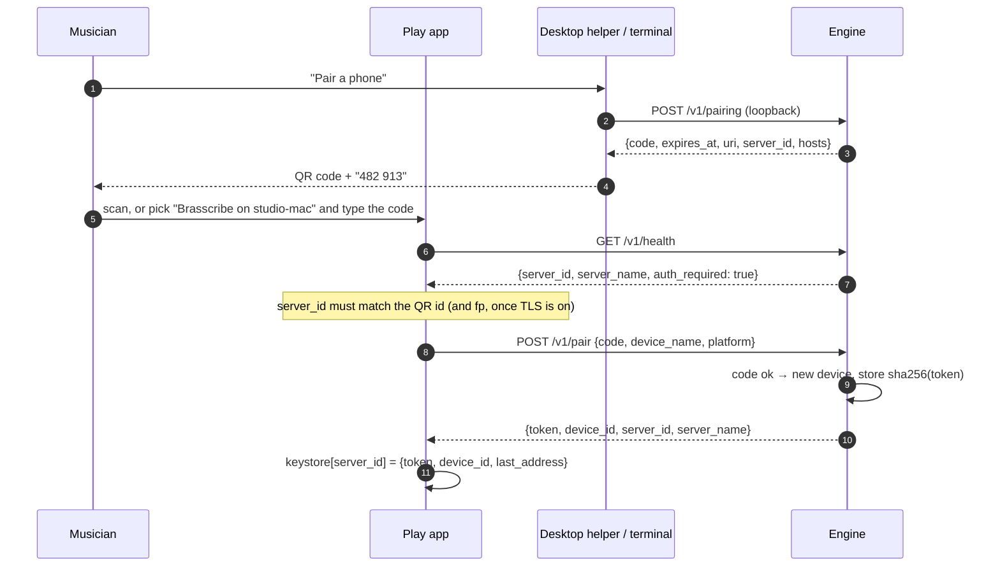
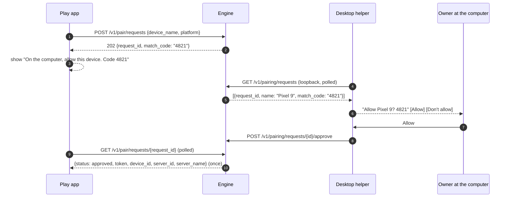
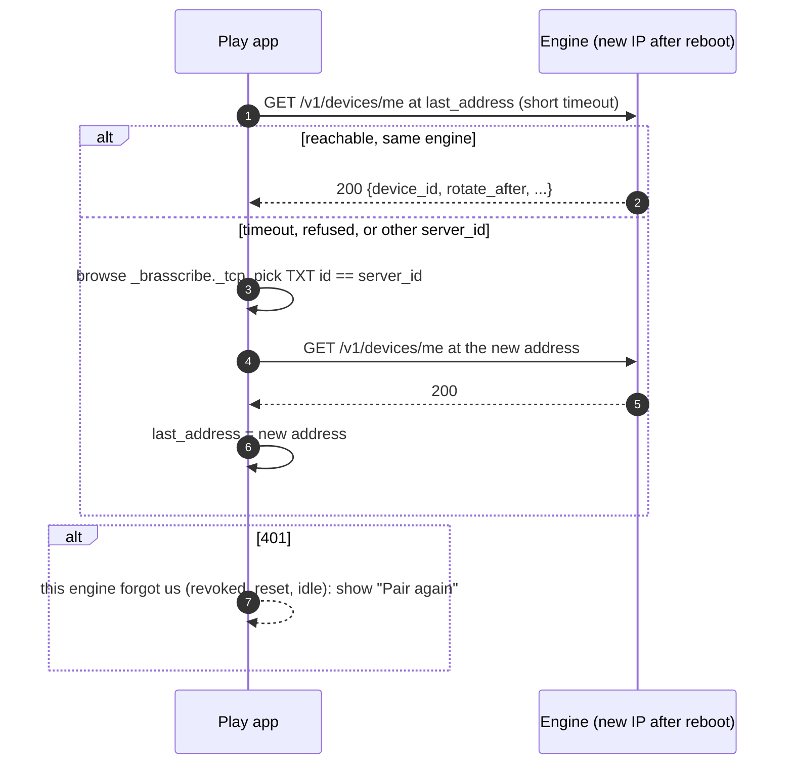

# Pairing and remote access

How the Play apps (Apple, Android, Windows) find the engine, pair with it once, and stay paired. Also how the engine could be reached from outside the home network, or run in the cloud, without making it less safe.

Read it together with `docs/plan/apps-plan.md` (§3 architecture, §7 licences) and `design/system.md` (rule 8: commands and addresses go under **Details for the band's tech person**).

---

## Short answer

**Why phones pair too often.** The engine handed every device one shared token and made a new one each time it started. Any restart (a reboot, closing the terminal, an update) logged every phone out. The apps also remembered the engine by its IP address. When the address changed, they lost the engine, and Windows and Android threw the token away or paired again.

**What changes.** Each device pairs once and gets its own long-lived credential. The credential survives engine restarts and address or port changes. It ends only when the owner revokes it, when the engine is reset, or when the device has not been used for 180 days. The engine gets a stable id, so an app can find the same engine again over mDNS under a new address. The engine side is implemented (see §4.8). Each app still needs to keep its credential in the platform keystore, match engines by id, and reconnect on its own.

**Cloud.** The same API works in three modes, and only the auth provider changes: home (LAN pairing), remote (a tailnet or tunnel to the home engine) and hosted (TLS, OIDC with the device authorization grant, DPoP-bound tokens, per-user tenancy). **Recommendation:** don't run a shared public service. The MuScriptor weights are CC BY-NC and gated per user, and two other weight sets have no licence at all (`apps-plan.md` §7). The recordings are copyrighted music. For outside access, use a tailnet to the home engine. For anyone without a GPU at home, use a self-hosted engine on the owner's own cloud GPU, with the owner's Hugging Face token. Both run the same code as the LAN mode.

---

## 1. How it works today

Line numbers refer to commit `f20ba42`, the state before this work.

- **Discovery.** `brasscribe serve --lan` advertises `_brasscribe._tcp` over mDNS. The service name is `Brasscribe on <host>` and the TXT record is `v`, `api` and `auth=pair` (`engine/src/brasscribe_engine/discovery.py:30-41`). The apps browse for it: Apple `EngineBrowser.swift` (NWBrowser), Android `EngineDiscovery.kt` (NsdManager), Windows `EngineDiscovery.cs`.
- **Pairing.** At start the engine creates a 6-digit code and prints it (`api.py:59`, `cli.py:126`). `POST /v1/pair {code, device_name}` returns `{token}` (`api.py:135-141`). The request carries `device_name`, and the engine ignores it.
- **Auth.** Loopback clients are trusted with no token (`api.py:87-89`). Every other request must carry `Authorization: Bearer <token>`, checked against **one** shared token (`api.py:91-96`).
- **Transport.** Plain HTTP on port 8765, with no TLS.
- **Rust core.** Not involved. `core/` is music logic only and has no networking.

## 2. Why re-pairing happens

| # | Cause | Where |
|---|---|---|
| 1 | **The token is new on every engine start.** `Pairing.token` is `secrets.token_urlsafe(24)`, created once per process, so every restart invalidates every paired device. `BRASSCRIBE_TOKEN` can pin it, but nobody sets it, and then every device shares one secret. | `api.py:58`, `api.py:84`, `config.py:11,40` |
| 2 | **A wrong guess can quietly retire the printed code.** After 5 wrong codes the engine picks a new code and prints nothing. The code on screen stops working, the user restarts the engine to get a new one, and cause 1 then logs out every other device. The scheme also doesn't stop brute force. Each code allows 5 tries, and an attacker with an unlimited request rate still gets through about 10⁶ guesses in well under an hour. | `api.py:67-69` |
| 3 | **Apps remember an IP address, not an engine.** Apple stores the resolved `http://<ipv4>:<port>` (`SettingsView.swift:112`). Android and Windows store `url` / `EngineAddress`. When DHCP gives the computer a new address, or the port changes, the app is pointed at nothing. The user must discover the engine again, and nothing tells the app it is the same engine. | `SettingsView.swift:112`, `AppContainer.kt:25-27`, `SettingsViewModel.cs:28` |
| 4 | **Windows drops the token when the address changes, and Android pairs on every Connect.** Windows clears `EngineToken` whenever the chosen engine's address differs from the stored one (`SettingsViewModel.cs:81`). Android calls `pair()` every time `health.authRequired` is true, which is always true on the LAN (`PlayViewModel.kt:696-698`). Windows also has the opposite bug. When the stored token is stale after a restart, `ConnectAsync` sees a non-empty token, skips pairing and reports "Connected", and then every call fails with 401 (`SettingsViewModel.cs:95`). | as cited |
| 5 | **mDNS names aren't stable ids.** The engine registers with `allow_name_change=True` (`discovery.py:55`). A second engine, or a stale record, gives `Brasscribe on host (2)`. Nothing in the TXT record identifies the engine. | `discovery.py:40,55` |
| 6 | **The token isn't kept in a keystore.** Apple uses `UserDefaults` (`AppModel.swift:50-51`), Android `SharedPreferences` (`AppContainer.kt:29-31`), Windows a plain `settings.json` (`WindowsServices.cs:127-137`). These stores do persist, so this is not why devices re-pair. It is a security gap, and backup restores or device migrations can carry the token to another device. | as cited |

Causes 1, 3 and 4 are the everyday ones. Cause 1 alone logs out every phone each time the computer reboots.

---

## 3. Design goals

1. A device pairs **once**. Only an explicit revoke on the computer, "Unpair" on the device, `brasscribe devices reset`, or 180 days unused ends it.
2. **The engine has a stable identity.** It survives restarts, IP and port changes, and renames. Clients pin it.
3. **Reconnecting is silent.** The app finds its engine by id over mDNS, falls back to the last known address, and never asks for a code while its credential is still valid.
4. **The owner sees and controls** the paired devices on the computer: name, platform, when paired, last seen.
5. **Nothing breaks for current clients.** Old clients keep working unchanged and simply benefit from cause 1 being fixed.
6. **Pairing is accessible** (WCAG 2.2 SC 3.3.8, accessible authentication). There is always a path that needs no transcription: scan a QR code, or approve the device on the computer.

---

## 4. Design A: pair once

### 4.1 Identities and credentials

| Thing | What it is | Where it lives | Lifetime |
|---|---|---|---|
| **Server id** | 128 random bits, hex. A routing identifier, **not proof of identity**. | `<state>/server.json` | Until `brasscribe devices reset` |
| **Server key** (next step) | TLS key pair, self-signed certificate. Its SPKI SHA-256 (base64url) is the **fingerprint**. | `<state>/tls/` (0600) | Same as the server id; regenerated on reset |
| **Device credential** | 256-bit random bearer token, one per device. The engine stores only the SHA-256. | device keystore; hash in `<state>/devices.json` (0600) | Until revoked, reset, or 180 days unused (`BRASSCRIBE_DEVICE_IDLE_DAYS`) |
| **Pairing code** | 6 digits, shown as `482 913`. The engine ignores spaces. | engine memory | Start code: until closed. Window opened on the computer: 10 min, single use, can be extended |

`<state>` is `BRASSCRIBE_STATE`, default `<data>/companion`. It is kept apart from caches, so clearing a cache never unpairs anyone. It is gitignored (under `data/`). Give each checkout that runs as a real server its own `BRASSCRIBE_STATE`. Otherwise worktrees split or share the device list without anyone noticing.

**Why one long-lived bearer, and not access plus refresh tokens.** On a LAN the engine is its own authorization server, and the token never leaves the two devices. A refresh token adds a second secret to store and a second failure mode, and gains nothing without an external issuer. Rotation (§4.6) limits how long a leaked token lives. In hosted mode (§5) real OAuth access and refresh tokens replace this. The API surface stays the same.

**Why no device public key yet.** Binding the token to a device key (DPoP, RFC 9449) is the right step once TLS is in place. Without TLS, a stolen token is the smaller problem, because the whole channel is open. It is planned as step E3.

### 4.2 The pairing payload (the QR code)

The canonical form, shared with the desktop helper (the tray or menu-bar app) and every client:

```
brasscribe://pair?v=1&id=<server_id>&name=<display name>&h=<ip:port>[,<ip:port>...]&code=<6 digits>[&fp=<spki sha256, base64url>]
```

| Key | Required | Meaning |
|---|---|---|
| `v` | yes | Payload version. `1` today. Clients reject unknown major versions. |
| `id` | yes | Server id, 32 hex characters. The client stores its credential under this key. |
| `name` | yes | Display name, e.g. `Brasscribe on studio-mac`. Percent-encoded. |
| `h` | no | Addresses to try, in order. Comma-separated `ip:port`, IPv6 as `[addr]:port`. When absent, the client uses mDNS and matches `id`. |
| `code` | no | Pairing code. Absent when pairing is closed. Then the payload only identifies the engine, and the client uses approve-on-the-computer (§4.4). |
| `fp` | no | TLS fingerprint. **When present, the client MUST pin it**: it connects over `https` and rejects any other key. It is absent while the engine serves plain HTTP. |

Unknown keys are ignored. `GET /v1/pairing` (loopback only) returns this URI, plus the same fields as JSON, for the desktop helper to render.

A client that scans the QR code does this:

1. Take the first `h` address that answers `GET /v1/health` with the same `server_id` (and, with `fp`, the pinned key).
2. `POST /v1/pair` with the code.
3. Store the result (§4.5).

A client that types the code gets the same result, starting from an mDNS pick.

### 4.3 First pairing with a code or QR code



### 4.4 Pairing with no code: approve on the computer

This is for musicians who can't read or type the code easily (3.3.8), and for pairing from across the room.



Limits:

- At most 3 requests wait at once. More returns 429.
- A request expires after 2 minutes.
- The token is handed out once, and the request is then forgotten.
- `request_id` is 192 random bits, so only the requester can collect the token.
- The match code lets the owner tell two phones apart. It is not a secret.

### 4.5 Silent reconnect

The client stores one record per engine, keyed by `server_id`:

```
{ server_id, server_name, device_id, token, fingerprint?, last_address, last_ok }
```

Only `token` is secret, but keep the whole record in the keystore. It's small, and it moves with the device the same way.



Client rules:

- **Match engines by `server_id`, never by address or mDNS name.** The id is in the TXT record (`id=`) and in `/v1/health`.
- **An address change never clears a credential.** A credential belongs to a `server_id`.
- **Ask for a code only after a 401** from `/v1/devices/me` (or any call). An unreachable engine means "can't reach your computer", not "pair again".
- When the engine shows up with a **different** `server_id` at the old address, it is a different engine, or the old one after a reset. Keep the old record, and show the new engine as a new one to pair.
- Keep several records, one per engine. A band laptop and a home desktop should both just work.

### 4.6 Rotation

- `GET /v1/devices/me` returns `rotate_after`, which is 30 days after pairing or the last rotation.
- After that time, on a successful connection, the client calls `POST /v1/devices/me/rotate`. It writes the new token to the keystore **before** using it.
- The previous token keeps working until the new one is first used, or for 10 minutes. A response lost in transit therefore never locks the device out.

### 4.7 Revoke and reset

| Who | How | Effect |
|---|---|---|
| Owner, at the computer | desktop helper list → Remove; `DELETE /v1/devices/{id}` (loopback); `brasscribe devices revoke <id>` | That device gets 401 and must pair again |
| The device itself | Settings → Your computer → Unpair; `DELETE /v1/devices/me` | Same, from the phone |
| Owner, full reset | `brasscribe devices reset` | All devices forgotten, new server id; every app sees a new engine |
| Nobody | 180 days unused | Entry dropped |

The CLI edits the state files directly. A running engine re-reads `devices.json` when the file changes on disk, so a revoke takes effect at once.

### 4.8 What the engine does now

This is implemented in `engine/src/brasscribe_engine/companion.py`, `api.py` and `cli.py`, and tested in `engine/tests/test_companion.py`.

| Endpoint | Who | Purpose |
|---|---|---|
| `GET /v1/health` | anyone | adds `server_id`, `server_name` |
| `POST /v1/pair` | anyone with the code | unchanged shape; response adds `device_id`, `server_id`, `server_name` (all strings: Apple decodes it as `[String: String]`). A request that carries a valid bearer re-issues that device's token instead of adding a duplicate. 429 + `Retry-After` while locked |
| `POST /v1/pair/requests`, `GET /v1/pair/requests/{id}` | anyone | approve-on-the-computer |
| `GET /v1/devices/me`, `POST /v1/devices/me/rotate`, `DELETE /v1/devices/me` | paired device | check, rotate, unpair |
| `GET /v1/devices`, `DELETE /v1/devices/{id}` | loopback only | list, revoke |
| `GET/POST/DELETE /v1/pairing` | loopback only | show, open or extend, close the pairing window; returns the §4.2 payload |
| `GET /v1/pairing/requests`, `POST /v1/pairing/requests/{id}/approve\|deny` | loopback only | approve-on-the-computer |

Other changes:

- **Wrong codes.** Five wrong codes lock pairing for 30 s, then 60 s, 120 s and so on, up to 15 min. The code on screen never changes.
- **mDNS.** The TXT record carries `id=<server_id>`.
- **Static token.** `BRASSCRIBE_TOKEN` still works, as a static token for scripts.
- **Device names.** Names are cleaned: no control characters, one line, at most 64 characters.

**Not done yet: TLS (§4.9).** Until it is, the server id can be spoofed by anyone on the LAN, and a token crosses the network in the clear. Both were already true of the old shared token.

### 4.9 TLS on the LAN (next engine step)

- **Key and certificate.** On first start, generate an ECDSA P-256 key and a self-signed certificate (CN = server name, SAN = `brasscribe.local`, valid 20 years; clients ignore the validity dates and hostname and check the pin). Store them under `<state>/tls/`. `brasscribe devices reset` regenerates them.
- **Fingerprint.** `fp` = base64url(SHA-256(SubjectPublicKeyInfo)). Because the pin is on the public key, a new certificate with the same key keeps working.
- **Serving.** `serve --lan` listens with TLS on the same port. Plain HTTP on loopback stays for Studio. For one release, a plain-HTTP LAN listener is kept behind `--allow-http-lan`, so old clients have a migration window.
- **Getting the pin.** The client gets the pin from the QR code. When the user types the code instead, the client pins on first use (TOFU): it shows the first 4 groups of the fingerprint in the pairing confirmation, and the computer shows the same.
- **Dependency.** This needs `cryptography` in the engine environment, which means a pixi re-lock across six platforms. That is why it is a separate step.
- **Platform notes.**
  - Apple: the `URLSessionDelegate` does SPKI pinning. `NSAllowsLocalNetworking` already covers the local network.
  - Android: a custom `X509TrustManager` pins SPKI, set on OkHttp.
  - Windows: `HttpClientHandler.ServerCertificateCustomValidationCallback`.

---

## 5. Design B: the same engine, reachable from outside

### 5.1 Three modes, one API

| | **Home** (today) | **Remote** (home engine, from anywhere) | **Hosted** (cloud) |
|---|---|---|---|
| Who runs it | the band's computer | the band's computer | the owner's own cloud account |
| Reach | LAN, mDNS | tailnet (Tailscale or WireGuard) or a relay | public HTTPS |
| TLS | self-signed, pinned `fp` | tailnet (WireGuard) plus pinned `fp` | real certificate (ACME) |
| Who is a user | the owner | the owner | OIDC accounts, per-user tenancy |
| Device credential | §4 per-device token | §4 per-device token | OAuth access and refresh tokens from the device authorization grant, DPoP-bound |
| Loopback trust | on (Studio) | **off** | **off** |
| Owner endpoints | loopback | loopback on the machine itself | an admin role in the token |

The engine gets a `--mode home|remote|hosted` switch, which picks an **auth provider**:

```python
class AuthProvider(Protocol):
    def authenticate(self, request) -> Principal | None      # device token / JWT+DPoP / loopback
    def is_owner(self, principal) -> bool                     # manage devices, see every job
    def tenant(self, principal) -> str                        # "owner" at home; user id when hosted
```

Every route already depends on `auth`. That dependency turns into `principal = Depends(provider.authenticate)`. Jobs, uploads and runs get a `tenant` column, and every lookup filters on it. At home the tenant is always `"owner"`, so nothing changes.

**Most important rule: loopback trust must be off in the remote and hosted modes.** Anything that forwards traffic from the same machine makes every request look local. That includes `tailscale serve`, `cloudflared`, Caddy, a sidecar or an SSH tunnel. With loopback trust on, the whole API, device management included, is then open to anyone who reaches the proxy. The owner endpoints also stop depending on "is loopback" in those modes, and use the admin role or a local Unix socket instead.

### 5.2 Remote access to the home engine (recommended)

This is the cheapest path and needs no new auth.

- **Tailscale (or Headscale, or plain WireGuard).**
  - Install it on the computer and the phones. Run `brasscribe serve --mode remote --host <tailnet IP>`, which binds the engine to the tailnet address and not to all interfaces.
  - The phone reaches it at its MagicDNS name. The pairing payload `h` lists that address as well as the LAN addresses, so one QR code works in both places.
  - Tailnet ACLs limit which devices can reach port 8765.
  - **Don't** put the engine behind `tailscale serve` or `funnel` while loopback trust is on.
- **Relay (for people who can't install a VPN).**
  - A small relay with a public TLS endpoint. The engine keeps an outbound WebSocket to it, and the relay forwards bytes.
  - With end-to-end TLS pinned to `fp`, the relay sees only ciphertext. That makes it far less trusted than a proxy that terminates TLS.
  - It costs a small VM and adds one more service to run. Only build it if Tailscale turns out to be a real barrier.
- **Not recommended:** opening port 8765 on the router. It exposes a GPU job runner to internet scanners.

### 5.3 Hosted mode

**Recommendation: host one engine per owner, not a shared multi-tenant service.** The reasons:

- **Model licences.** MuScriptor weights are CC BY-NC 4.0 and gated on Hugging Face, and each user accepts the licence with their own account (`apps-plan.md` §7). A shared service would re-host them and serve them to people who never accepted the licence. BS-RoFormer SW and Mega-53 have **no stated licence**. Running them for other people is riskier than personal use. We don't re-host any of these.
- **Recordings.** They are copyrighted recordings. A service that stores other people's uploads of commercial music takes on takedown and retention duties, and a non-commercial hobby project shouldn't carry those.
- **Cost.** A GPU that sits idle waiting for occasional jobs is the main cost. One owner can turn it off when it's not in use.

So hosted mode means: **the owner deploys the same container to their own cloud account**. The weights are fetched on first start with the owner's `HF_TOKEN`, into a private volume. The owner adds the band's members as users. What follows is written so that a later multi-tenant service would not need a redesign. Nothing here assumes one user.

**TLS.** Terminate TLS at a managed load balancer or at Caddy, with ACME certificates. HSTS on. TLS 1.2 or newer. Proxy to the engine over a private network, never over the public internet. Loopback trust off (§5.1).

**Identity.**

- Use an OIDC provider: Auth0, Entra ID, Google, or Zitadel or Keycloak to self-host.
- Native apps sign in with the **OAuth 2.0 device authorization grant (RFC 8628)** on TV-like or shared devices. On phones, use **authorization code + PKCE** in the system browser (`ASWebAuthenticationSession`, Custom Tabs, `WebAuthenticationBroker`). The device code flow fits the desktop helper and Windows kiosk setups. It shows a short user code and a URL, the same shape as the LAN pairing code, so the UI can be reused.
- **Passkeys** at the identity provider meet 3.3.8 with no memorised secret.
- Access tokens last 10 minutes. Refresh tokens rotate and are revoked when reused. The engine validates the JWT against the provider's JWKS (issuer, audience, expiry) and reads `sub`, which is the tenant, and a `role`, which is the owner or admin.

**Tokens bound to the device.** Use **DPoP (RFC 9449)**. Each app makes a non-exportable key (Secure Enclave, StrongBox or TEE, Windows CNG or TPM) and signs a proof for each request. A stolen access token is then useless on its own. mTLS would also work, but client certificates are awkward on phones and break behind many load balancers, so DPoP is the better fit. The same device key can later bind the LAN token (step E3).

**Rate limits and size limits.** Set these at the load balancer or proxy, and again in the engine:

- Auth endpoints: 10 per minute per IP.
- API: 60 requests per minute per user.
- Jobs: 2 running per user, plus a daily quota of processed audio minutes.
- **Upload cap: 100 MB and 20 min of audio.** Stream the upload to disk and reject it once it is over the cap. Today there is no cap (`api.py:160-180` at `f20ba42`).
- Check the audio container and codec with `ffprobe` before queueing.

**Tenant isolation, from facts in today's code:**

- **Uploads.** `audio_id` is the first 16 hex characters of the file's SHA-256, deduplicated across all users (`api.py:172`). One user could check whether another user uploaded a given song. Scope the key by tenant: `hmac(tenant_key, sha256)`.
- **Jobs.** `GET /v1/jobs` lists every job for every caller (`api.py:250-251`). Filter it by tenant, and return 404, not 403, for other tenants' job ids.
- **Caches.** The content-addressed cache is shared across users. That saves GPU time but leaks "this exact recording was processed before". Per tenant by default; a shared cache only for derived, non-audio stages, if ever.

**Job isolation.** The audio is untrusted, and the decoders parse attacker-controlled bytes.

- Run model stages in **worker containers**: no network, read-only root, a scratch volume per job, cgroup CPU, memory and time limits, seccomp default, non-root. Get the GPU with the NVIDIA container toolkit.
- Adapters are already subprocesses with argv lists and no shell (`stages.py:33`). Keep it that way: no `shell=True`, and no user strings in argv except paths the engine made. The user's filename is display metadata only and never becomes a path (`api.py:170` already takes `.name`).
- The API process never decodes audio itself.

**Storage.**

- Encrypt at rest: provider-managed keys on volumes and buckets, which is enough for one owner.
- Uploads and runs get a **retention period**: delete source audio 7 days after the job finishes, keep scores until the user deletes them.
- `DELETE /v1/runs/{id}` already exists. Add "delete my account", which removes everything the tenant owns.
- No backups of source audio.

**Secrets.** Keep `HF_TOKEN`, the OIDC client secret (if any) and the TLS keys in the platform's secret manager (AWS Secrets Manager, GCP Secret Manager, Azure Key Vault or Fly secrets), mounted at runtime. Never put them in the image or in `pixi.toml`. The LAN state files stay 0600.

**Logging without PII.** Log request id, route template, status, duration, tenant hash and job id. **Never** log tokens, `Authorization` headers, filenames, song titles, device names, IP addresses beyond /24, or audio content. Adapter stderr goes to the job log, which has the same retention as the job, and not to the platform log.

**GPU hosting and cost.** Prices are rough, as of late 2026; check before you commit.

| Option | Fit | Rough cost |
|---|---|---|
| Serverless GPU (Modal, RunPod serverless, Beam) with scale to zero | Best for occasional jobs; pay per GPU-second; cold start 10–60 s with weights on a volume | A few cents to a few tens of cents per song, nothing when idle |
| On-demand VM with an L4, T4 or A10-class GPU, stopped when idle | Simple, same container as home | about $0.5–1.5 per hour while running; storage a few $/month |
| Always-on GPU VM | Only if many users | several hundred $/month; not worth it here |
| CPU only | The engine runs, slowly (Basic Pitch and SwiftF0 are fine; the separation models are slow) | cheapest, but a song takes minutes to tens of minutes |

The split to use: the API and job queue on a small always-on CPU instance or a platform like Fly.io, and the heavy stages dispatched to a serverless GPU worker running the same adapter image.

### 5.4 Threat model (STRIDE-lite)

| Threat | Where | Today (`f20ba42`) | With this design |
|---|---|---|---|
| **E: a local proxy makes remote traffic look like loopback** | remote and hosted | Everything trusted, including (after this change) device management | Loopback trust off outside home mode (§5.1). Owner actions need the admin role or a local socket. **Top risk: build E1 before recommending any tunnel.** |
| S: a fake engine on the LAN collects tokens | home | Possible: plain HTTP, no identity | Pinned `fp` from the QR code or TOFU (§4.9). Until then, `server_id` only routes and doesn't authenticate |
| S: guessing the pairing code | home | ~10⁶ tries, unlimited rate, code quietly replaced (§2 cause 2) | Lockout with backoff; windows opened on the computer are single use and last 10 min |
| D: locking out pairing on purpose | home | n/a | A LAN attacker can keep pairing locked (5 wrong codes every lock period). Accepted: it's a LAN nuisance, and approve-on-the-computer is still available. Pending requests are capped at 3 |
| S: spamming approval prompts on the computer | home | n/a | 3 pending at most, 2 min expiry, match code shown on both screens |
| I: a token sniffed on the LAN | home | shared token, plain HTTP | per-device token (limited blast radius, revocable); TLS next; DPoP later |
| I: a token copied from app storage or a backup | device | UserDefaults, SharedPreferences, plain JSON | Keychain (`ThisDeviceOnly`), Android Keystore-wrapped, Credential Locker (§7) |
| I: one user sees another's uploads or jobs | hosted | global `audio_id` dedup; `/v1/jobs` lists all | tenant-scoped ids, filtered listings, 404 for others' ids |
| T/E: a crafted audio file exploits a decoder | hosted (and home) | decoders run as the engine user | sandboxed worker, no network, resource limits |
| D: large uploads or job floods | hosted | no size cap, no quota | proxy and engine caps, per-user quotas, rate limits |
| R: who removed a device, who ran a job | all | nothing recorded | event log with device id, action and time, no content |
| I: PII in logs | hosted | n/a | log allowlist (§5.3) |
| Licence: weights served to people who never accepted them | hosted | n/a | one engine per owner with the owner's HF token; no shared service (§5.3) |

---

## 6. Migration

1. **Engine (done in this change).** Old clients keep working:
   - Their stored token is now per device and survives restarts, so cause 1 is gone for them with no app update.
   - Windows and Apple, whose stored token was invalidated by a restart before this change, need to pair **once more** after the engine update. From then on they stay paired.
   - Existing Android builds call `pair` on every Connect tap, and each call adds a device entry. Unused entries age out after 180 days, and the owner can remove them. The fixed Android client only pairs after a 401.
2. **Clients, step 1 (§7).** Keystore storage, keyed by `server_id`, with a one-time move from the old store. Rediscovery by id. Pair only on 401. Rotation.
3. **Desktop helper.** Uses `/v1/pairing`, `/v1/devices` and `/v1/pairing/requests` over loopback.
4. **TLS (E2).** The engine serves TLS on the LAN, plus an HTTP listener for one release behind `--allow-http-lan`. Clients from step 2 read `fp` and pin it. Older clients are asked to update.
5. **Remote mode (E1), then hosted mode (E4 onward)**, only when someone needs them.

---

## 7. Implementation list

### Engine

| Step | Work | Status |
|---|---|---|
| E0 | Stable server id; per-device hashed credentials; rotation with grace; `/v1/devices*`, `/v1/pairing*`, `/v1/pair/requests*`; lockout instead of silent code replacement; mDNS `id`; `brasscribe devices`; tests | **done** |
| E1 | `--mode home\|remote\|hosted`; loopback trust off outside home; owner endpoints via a local Unix socket or an admin role; `h` in the payload includes the tailnet address | next |
| E2 | Persistent TLS key and self-signed certificate under `<state>/tls`; `fp` in `/v1/pairing` and the QR code; TLS on the LAN listener; `--allow-http-lan` for one release; add `cryptography` to the engine environment | next |
| E3 | Optional device public key at pairing (`jwk` in `PairRequest`); DPoP proofs checked on LAN requests too | later |
| E4 | `AuthProvider` with an OIDC/JWT + DPoP provider; tenant column on uploads, jobs and runs; tenant-scoped `audio_id`; filtered listings | hosted only |
| E5 | Upload caps and `ffprobe` check; per-user quotas; sandboxed GPU worker image; retention job; log allowlist | hosted only |
| E6 | Container image and deploy recipe (API on CPU, serverless GPU worker), `HF_TOKEN` from the secret manager | hosted only |

### Rust core

Nothing. `core/` has no networking or storage, and credential handling stays native per platform. It would be a reasonable home for the payload parser later (`brasscribe://pair` → struct) if three copies drift apart.

### Apple (SwiftUI, `apps/apple`)

- A1. Move `companionToken` from `UserDefaults` (`AppModel.swift:50-51`) to the Keychain: `kSecClassGenericPassword`, service `no.brasscribe.engine`, account = `server_id`, `kSecAttrAccessibleAfterFirstUnlockThisDeviceOnly`. Move the old value once, then delete it.
- A2. Store the record from §4.5, keyed by `server_id`. The saved "companion URL" becomes `last_address`.
- A3. `EngineBrowser` reads the TXT `id` and matches it. On launch: try `/v1/devices/me` at `last_address`, then mDNS by id (§4.5).
- A4. Pair only on 401. Send `platform` (`ios` or `macos`). Scan QR codes (`brasscribe://pair`) with VisionKit `DataScannerViewController`, and register the URL scheme.
- A5. Approve-on-the-computer path in Settings → Your computer, showing the match code.
- A6. Rotation when `rotate_after` has passed. Unpair button (`DELETE /v1/devices/me`).
- A7. When E2 lands: SPKI pinning in the `URLSession` delegate.
- `CompanionService.pair` decodes `[String: String]` (`CompanionService.swift:127`). Replace it with a `Decodable` struct. The engine keeps `PairResponse` all strings until every client has updated.

### Android (Kotlin, `apps/android`)

- D1. Move `token` out of `SharedPreferences` (`AppContainer.kt:29-31`). Encrypt it with an AES-GCM key held in the Android Keystore (StrongBox when available), and keep the ciphertext in DataStore. `EncryptedSharedPreferences` is deprecated. Exclude it from backup (`android:dataExtractionRules`).
- D2. Store the record keyed by `server_id`. `EngineDiscovery` reads the TXT `id` (`NsdServiceInfo.attributes["id"]`).
- D3. `PlayViewModel.connect` (`PlayViewModel.kt:696-698`): call `/v1/devices/me` with the stored token first, and pair only on 401. Send `platform = "android"`.
- D4. QR scanning (CameraX + ML Kit barcode, or the system code scanner) and a `brasscribe://pair` intent filter. Approve-on-the-computer path.
- D5. Rotation and Unpair. When E2 lands: an OkHttp `CertificatePinner` does not fit self-signed certificates, so use a custom `X509TrustManager` that checks the SPKI hash.
- Contract: after `./gradlew :engine-client:syncOpenApi`, `EngineContractTest` fails until:
  - the new operationIds are in `EngineApi.OPERATIONS` or `NOT_USED`: `getThisDevice`, `rotateDeviceToken`, `unpairThisDevice`, `requestPairing` and `pollPairingRequest` go in OPERATIONS once implemented; `listDevices`, `revokeDevice`, `getPairing`, `openPairing`, `closePairing`, `listPairingRequests` and `decidePairingRequest` go in NOT_USED, since they are loopback-only
  - `Health` gets `serverId` and `serverName`
  - `PairRequest` gets `platform`
  - `PairResponse` gets `deviceId`, `serverId` and `serverName`.

### Windows (WinUI / C#, `apps/windows`)

- W1. Move `EngineToken` out of `settings.json` (`WindowsServices.cs:127-137`) into `Windows.Security.Credentials.PasswordVault`, resource `Brasscribe engine`, user name = `server_id`. The app runs unpackaged. If PasswordVault isn't available there, use DPAPI (`ProtectedData`, CurrentUser) for the stored blob.
- W2. `UseEngine` (`SettingsViewModel.cs:81`): keep the token when the `server_id` matches, whatever the address.
- W3. `ConnectAsync` (`SettingsViewModel.cs:95`): check with `/v1/devices/me`. On 401, clear the token and ask for a code. Today a stale token is reported as "Connected".
- W4. `EngineDiscovery` reads the TXT `id`. Rediscovery on launch. Send `platform = "windows"`. Approve-on-the-computer path. Rotation. Unpair.
- W5. When E2 lands: `ServerCertificateCustomValidationCallback` pins SPKI.
- Contract: after refreshing `tests/.../Fixtures/openapi.json`, `OpenApiContractTests` fails until `Health`, `PairRequest` and `PairResponse` get the new properties.

### Desktop helper (tray / menu bar)

- Shows `GET /v1/pairing` as a QR code (the `uri`) and as the code in large type (`482 913`), with the time left. "More time" calls `POST /v1/pairing {extend: true}`.
- Lists `GET /v1/devices` (name, platform, last seen), with Remove.
- Polls `GET /v1/pairing/requests` and shows "Allow <name>? <match code>".
- Everything else, such as addresses and the server id, goes under **Details for the band's tech person**.

### Studio

No change. Studio runs on loopback. Regenerate `studio/src/api/schema.d.ts` (`npm run gen:api`) the next time Studio touches the API.
