# 14. macOS responsiveness audit (Brasscribe Play)

Owner feedback: the Mac app "doesn't resize as a user would expect, and some screens expand to full height".
This audit renders every macOS screen at the window sizes people actually use and compares the result
with the macOS Human Interface Guidelines and [design/system.md](../../design/system.md) §2.

## How it was measured

- **Harness:** `apps/apple/AppTests/LayoutHarness.swift` and `ResponsiveLayoutTests.swift`, in the macOS
  app unit-test target. Each screen is built the way `RootView` builds it on the Mac (the library in a
  `NavigationSplitView` sidebar, the screen in the detail column's `NavigationStack`), hosted in an
  `NSHostingView` inside a borderless window that is never ordered front, and drawn with
  `cacheDisplay(in:to:)`. Nothing appears on screen. When the macOS unit tests run, the test host now
  starts an app with no window and no Dock icon (`App/AppEntry.swift`). The layout tests use their own
  score library in the temporary folder, and don't browse the network for engines.
- **Fixture:** Old Hundredth (`apps/fixtures/old-hundredth`), with the band sounds staged, the connection
  staged as "Connected to Brasscribe on Studio Mac", and the lived-in library from the `home-full`
  screenshot scene.
- **Sizes:** each screen's own minimum, then 900×600, 1024×700, 1280×800, 1512×900 (the visible area of
  a MacBook), 1920×1080 and 2560×1400. These are window sizes. The unified toolbar (52 pt) isn't drawn
  by a borderless window, so the content is rendered at W × (H − 52).
- **Minimum:** the window's content minimum is what SwiftUI hands the window (`NSHostingView` with
  `.minSize`, then `NSWindow.contentMinSize`), read from the window each screen renders in. A window never goes below that
  minimum, so when a requested size is smaller, the render is taken at the size the window grows to.
  That's the behaviour the owner sees.
- **Sheets** open at their ideal size (`fittingSize`), clamped to their minimum and maximum. That's how
  a SwiftUI sheet sizes itself on macOS.
- **Regenerating:** `TEST_RUNNER_BRASSCRIBE_RESPONSIVE_SHOTS=1 xcodebuild … test -only-testing:BrasscribePlayTests_macOS/ResponsiveLayoutTests`
  writes the thumbnails and `measurements.json` to `apps/apple/docs/responsive/`. Without the variable,
  the test renders and measures but writes nothing.

### Limits of the harness

- On macOS 26 the sidebar and the inspector float in Liquid Glass, which only the window server draws.
  The harness draws their SwiftUI content onto a flat grey panel in the same place.
- Toolbar items aren't drawn: the window toolbar (Settings, Share or print, Check the notes, Finish
  later) and the `.cancellationAction` / `.confirmationAction` buttons a macOS sheet shows along its
  bottom edge (Change note's Cancel/Save, Read aloud's Done).
- System alerts and confirmation dialogs (Edit title, Delete, Stop making this score?, Finish checking
  later?) are `NSAlert`s. AppKit sizes them, so they aren't audited here.
- The pairing "waiting for the computer to allow this Mac" state lives in a view's private state and
  can't be reached from a test yet. The match code is rendered on its own, and the pairing ways appear
  in `settings-pairing`.
- Read aloud's row text is empty in the render (the part is chosen in `onAppear`). The layout is still
  representative.
- Accessibility frames aren't available off screen, so the checks read geometry probes (`layoutProbe`).
- A real window was compared with the harness using the committed `docs/screenshots/macos-score-light.png`.
  Both show the same inspector overflow and the same wrapping of the player bar.

## Expected behaviour

From the macOS HIG (Layout, Windows, Sheets, Split views) and design/system.md §2:

| Kind | Expected |
|---|---|
| Window minimum | One stable minimum for the whole window, big enough that no control clips: about 800 × 560 (sidebar 240 plus a 560 pt detail). It shouldn't change from screen to screen. |
| Forms, cards, empty states, problem screens | Hug their content, top-aligned in a reading column of at most 720 pt (Home 920). No stretching to the window height. |
| Actions of a page | Follow the content, trailing-aligned in the same column (system.md: "Bottom right of the content, after Cancel"). A bottom bar only when the content scrolls under it. |
| Score, lists, the stand | Fill the window. The score is full width. Side panels (the inspector) scroll and never set the window's height. |
| Sidebar | 240–340 pt. It collapses when the window is too narrow for sidebar plus detail, rather than squeezing the detail. |
| Sheets | Size to their content, with a sensible minimum (about 480 pt wide) and a maximum (about 680 pt wide and the screen height minus a margin). Longer content scrolls inside. A title and a way to close. |

## Findings (the audit, before the fixes)

| # | Where | Finding | Expected |
|---|---|---|---|
| **F1** | Score (all parts, one part) | **The score asks for a window of at least 1291 × 855 (the part view 1291 × 935).** On macOS the inspector's `PartsPanel` isn't in a scroll view, so all 18 part rows plus the Sound section count toward the window's minimum height. The ~1051 pt of detail width comes from the inspector (320) plus the practice bar's minimum. Opening a score grows the window to that size, beyond a 1280 × 800 display and taller than a MacBook's visible area (900). **This is the "expands to full height" the owner reports.** Wherever the window is shorter, the inspector is cut off at the bottom (Sound section, My part). | The inspector scrolls. The score screen's minimum is set by the notation and the player bar only, well below the window minimum. |
| **F2** | Every screen | **The window has no real minimum height,** and a minimum width that changes: Home 583 × 68, What is this? 500 × 136, Transcribing 427 × 128, Choose output 588 × 128, Review 688 × 132, Problem 399 × 184, stand 151 × 124. At those sizes controls clip or wrap mid-word ("Can-cel", "Co…", "Keep, / go to / next"). | One window minimum (about 800 × 560), set once at the root, with nothing clipped at it. |
| **F3** | Moving between screens | The minimum changes on every screen (583 → 1291 → 151), so the window jumps in size when a score opens and never shrinks back. | A stable minimum. Content adapts to the window, not the other way round. |
| **F4** | What is this?, Choose output, Transcribing, Review, Problem screens | **Page actions are pinned to the window bottom** with `safeAreaInset(.bottom)`. On a 1080 or 1400 window they sit 600–1000 pt below the content. On Problem screens they're full-width buttons (max 480) in the window's bottom-right corner, not under the reading column. | Actions follow the content, trailing-aligned inside the reading column. A pinned bar only when the content is taller than the window. |
| **F5** | Home, wide | The way-in grid (`adaptive(minimum: 220)`) makes three columns for two cards, leaving an empty third. | Two equal columns (or the two cards fill the row). |
| **F6** | Sidebar | The sidebar never collapses. At 900 wide it keeps 288 of the 900 pt, and at the 583 minimum the detail is 295 pt. | Collapse the sidebar when the detail would get narrower than its minimum (about 560). The sidebar button brings it back. |
| **F7** | Settings sheet | The ideal size is **744 × 1023** (1194 when pairing), taller than a 900 window and the MacBook visible area. On the Mac it has **no title and no Done button** (the toolbar is iOS only), so Escape is the only way out. | About 560–640 wide. Height fits the content up to the screen minus a margin, then scrolls. Title "Settings" and a Done button. |
| **F8** | Share or print sheet | A fixed `frame(width: 620, height: 720)`: it doesn't shrink on a small screen and doesn't hug shorter content. | Width 560–680. Height to the content, with a maximum. The actions stay at the bottom. |
| **F9** | Change note sheet | `minHeight: 360` plus a `Spacer()`: the content is ~170 pt, and the lower half is empty. | Hug the content. |
| **F10** | First run sheet | `minHeight: 640`: a gap of ~300 pt between the three points and Get started. | Hug the content. The button follows the points. |
| **F11** | Record what's playing sheet | The form is ~190 pt in a 360 minimum, with blank space below. Record with the microphone is a fixed 420 × 360 with centred content (acceptable). | Hug the content. |
| **F12** | Read aloud sheet | A list in a 480 × 560 minimum sheet. It fills and scrolls (correct). | — |
| **F13** | Music stand | A 151 × 124 minimum. In landscape at ≥ 900 wide the stand goes two-up even with one page, so the page sits in the left half and the right half is empty. In the harness the page is also clipped on its left edge at 900–2560 (part names cut). **Confirm this in the macOS VM before fixing:** it may come from the harness's resize order. | Centre a single page. Two-up only when there are two pages. The stand minimum is the window minimum. |
| **F14** | Review | The note list is a fixed 280, and the detail capped at 720 and centred (correct). The list fills the height (correct). The actions are pinned at the bottom (F4). Keep wraps at the minimum (F2). | F2 and F4. |
| **F15** | Score inspector | "Only this" wraps onto two lines at the 320 inspector width (also visible in the real screenshot). | Keep it on one line (icon + label, or a slightly wider inspector minimum). |
| **F16** | What is this? | Cards in the same grid row have different heights. | Equal heights per row. |

What is already right: the score and the stand fill the window at every size, Home and the flow screens
cap their column (920 and 720) and top-align, and Review's list fills the height.

## Fixes

Every finding is fixed, and each fix has a check in `ResponsiveLayoutTests.check(_:)`. The check runs
on every render, so the fixes can't regress quietly. The screens mark a few landmarks with
`layoutProbe` (their column, their actions, the parts column, the stand's pages), which the test
reads back. The modifier records only while unit tests run, and does nothing in the app.

| # | Fix | Check in the harness |
|---|---|---|
| F1 | On the Mac the parts sit in a column of the score screen's own (`SidePanel`, 320 pt), not an `.inspector`: inside a split view the inspector added its width, and more, to the window's minimum. The column scrolls. Where the score and the column don't both fit (below 820 pt of detail), the column steps aside and Parts opens the parts in a sheet. | Every screen's window minimum equals the global one, the score's with every part included. The parts column is never taller than the window and never runs off it, and it shows at 1280. |
| F2, F3 | One minimum for the main window: 900 × 600 (`WindowFit.minimumWindow`). SwiftUI gets it as the root's minimum content size (`LibrarySplit`), and AppKit gets it as the window's `minSize` (`MacLaunch.fit`). On the Mac, button labels keep one line at their full width (`OneLineLabel`), and a row of actions that doesn't fit stacks, trailing (`ActionRow`). | The window minimum is 900 × 548 content on every screen. Every landmark lies inside the window at every size, the minimum included. |
| F4 | On the Mac a flow page's actions follow its content, trailing in its column: What is this?, Choose output, Transcribing, Review, the problem screens (`PageActions.followContent`, `bottomActions`). iPhone and iPad keep the bottom band. The problem screens' actions form a row with the way forward last, on the right. Only the score's player stays docked. | At 1920 × 1080 and 2560 × 1400 each page's actions lie inside its column, end with it, and sit more than 200 pt above the window's bottom. |
| F5 | Home's two ways in are two equal columns on the Mac. | The two cards are the same width, and the second ends where the drop area does. |
| F6 | The sidebar steps aside below 1000 pt and comes back above it. It changes only when the width crosses the line, so a sidebar the user opened or closed stays that way. The toolbar's sidebar button still works. The stand keeps the sidebar aside. | The sidebar is shown exactly when the window is at least 1000 wide, and never on the stand. |
| F7 | Settings on the Mac has the title "Settings" above the form and a Done button (the default action) below it. It opens 520–680 wide, as tall as its form up to 90 % of the screen's visible height, and scrolls inside. | It opens 520–680 wide, no taller than 90 % of the screen, and has a Done button. |
| F8 | Share or print: 560–680 wide, and as tall as its content up to 90 % of the screen. | No fixed height, and no minimum taller than the content. |
| F9, F10, F11 | Change note, First run and both recording sheets hug their content: no minimum height, no `Spacer`. | No minimum height, and the sheet isn't held taller than its content. |
| F12 | — | — |
| F13 | A spread shows two pages only when there are two. When the music fits one page, the stand engraves it again at the full width, centred (`MusicStand.settleSpread`). A new window size tries the spread again. The left-edge clip came from the half-width spread, and it's gone with it. | While the window is resized the stand stays open, shows one page when there is one, and centres it without cutting its left edge. |
| F14 | See F2 and F4. On a narrow Review, the "Space listens · K keeps" hint hides instead of truncating. | See F4. |
| F15 | The parts' Mute and Only this toggles keep one line; the part's name wraps instead. | Every Only this toggle is at most 36 pt tall. |
| F16 | The What is this? cards stretch to their grid row's height. | Cards in the same row are the same height. |
| P3 | The Practice menu chip (phone, AX3 "Øving") no longer shows a ✓, since it opens a menu and isn't a switch. It shows a chevron instead, and keeps the tonal fill when something inside is on. | — (iPhone) |

### How the harness changed for the checks

- The window minimum is read from the same off-screen window the screen renders in. Measuring it in a
  second, throwaway window made the stand's view disappear, and a disappearing stand leaves itself.
- A window that is never shown gets no display pass, so after the sidebar comes or goes the split
  view lays out the detail again only at the next resize. The harness nudges the size by one point,
  as a live resize would. Check this in the macOS VM (resize across 1000, and zoom).
- The stand is opened from the score, as the toolbar button does (`ScoreOrStand`).

## Screens × sizes (after the fixes)

"Asked for" is the window size requested. "Got" is the window the content allows (a window grows to
its minimum, now 900 × 600 on every screen). Click a thumbnail for the larger image. The audit's
thumbnails, from before the fixes, are in the history of `apps/apple/docs/responsive/` (commit
"docs(apple): audit macOS window and sheet sizing").

### Home, empty

Window content minimum reported by SwiftUI: **900 × 548** (a window of 900 × 600).

| Asked for | Got (window) | Render | Notes |
|---|---|---|---|
| min | 900 × 600 |  | The window minimum, 900 × 600. The sidebar has stepped aside. |
| 900 × 600 | 900 × 600 | [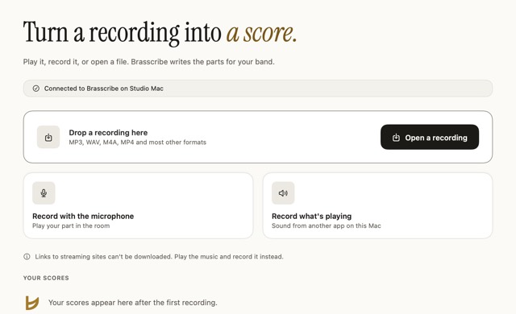](../../apps/apple/docs/responsive/home-empty-900x600.jpg) |  |
| 1024 × 700 | 1024 × 700 | [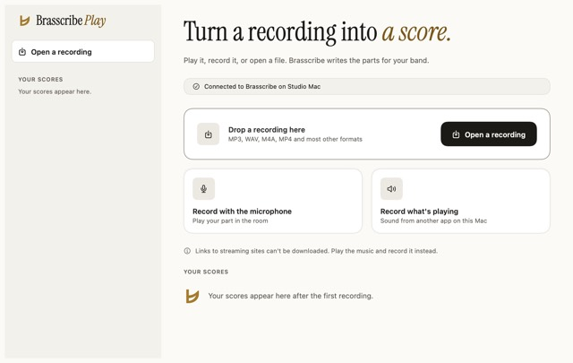](../../apps/apple/docs/responsive/home-empty-1024x700.jpg) | The sidebar is back (≥ 1000 wide) and the column fits beside it. |
| 1280 × 800 | 1280 × 800 | [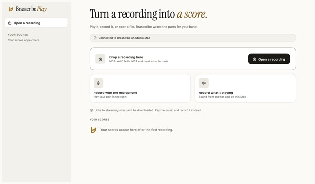](../../apps/apple/docs/responsive/home-empty-1280x800.jpg) |  |
| 1512 × 900 | 1512 × 900 | [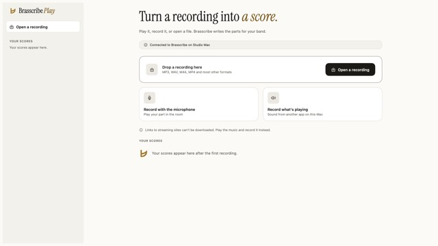](../../apps/apple/docs/responsive/home-empty-1512x900.jpg) |  |
| 1920 × 1080 | 1920 × 1080 | [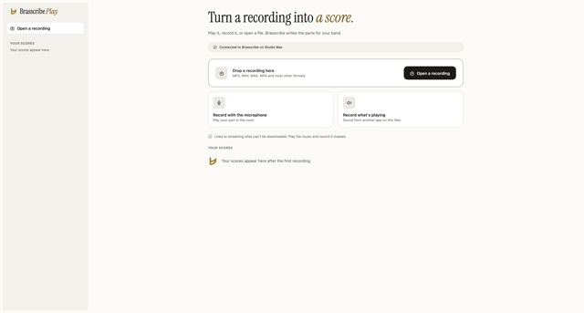](../../apps/apple/docs/responsive/home-empty-1920x1080.jpg) |  |
| 2560 × 1400 | 2560 × 1400 | [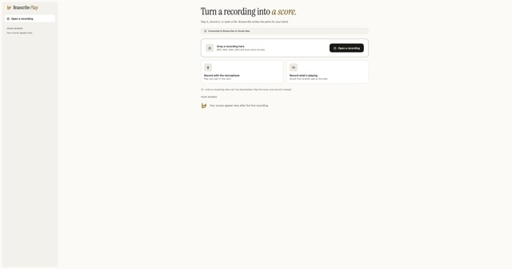](../../apps/apple/docs/responsive/home-empty-2560x1400.jpg) | 920 pt column, centred and top-aligned. The two ways in fill the row. |

### Home, with scores

Window content minimum reported by SwiftUI: **900 × 548** (a window of 900 × 600).

| Asked for | Got (window) | Render | Notes |
|---|---|---|---|
| min | 900 × 600 | [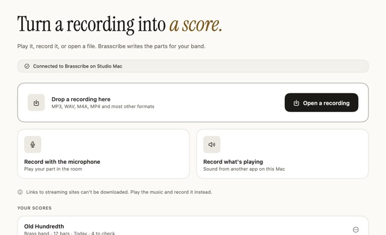](../../apps/apple/docs/responsive/home-scores-min.jpg) |  |
| 900 × 600 | 900 × 600 |  |  |
| 1024 × 700 | 1024 × 700 | [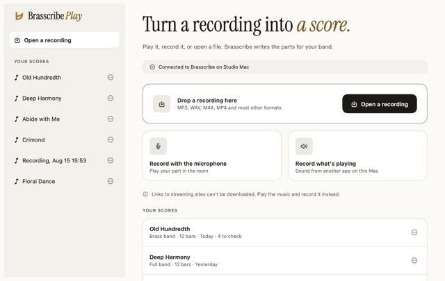](../../apps/apple/docs/responsive/home-scores-1024x700.jpg) |  |
| 1280 × 800 | 1280 × 800 | [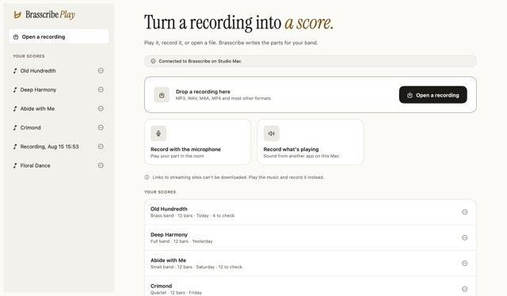](../../apps/apple/docs/responsive/home-scores-1280x800.jpg) |  |
| 1512 × 900 | 1512 × 900 | [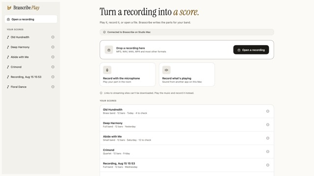](../../apps/apple/docs/responsive/home-scores-1512x900.jpg) |  |
| 1920 × 1080 | 1920 × 1080 | [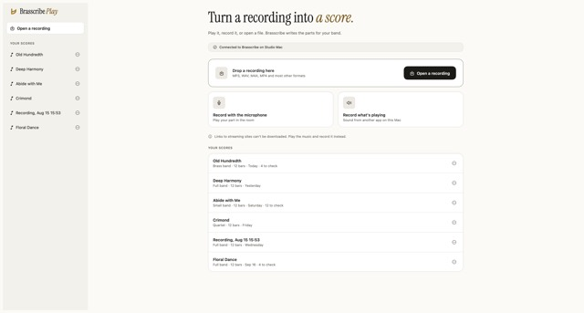](../../apps/apple/docs/responsive/home-scores-1920x1080.jpg) |  |
| 2560 × 1400 | 2560 × 1400 | [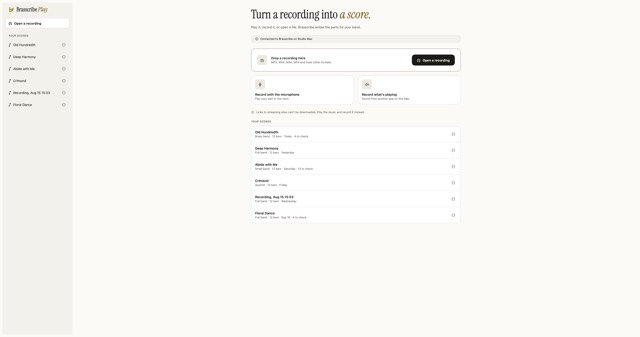](../../apps/apple/docs/responsive/home-scores-2560x1400.jpg) | The column is capped and the list hugs its rows. |

### Home, offline

Window content minimum reported by SwiftUI: **900 × 548** (a window of 900 × 600).

| Asked for | Got (window) | Render | Notes |
|---|---|---|---|
| min | 900 × 600 | [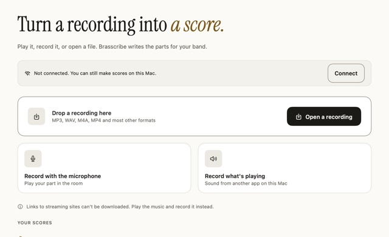](../../apps/apple/docs/responsive/home-offline-min.jpg) |  |
| 1280 × 800 | 1280 × 800 |  |  |

### Home, needs pairing

Window content minimum reported by SwiftUI: **900 × 548** (a window of 900 × 600).

| Asked for | Got (window) | Render | Notes |
|---|---|---|---|
| min | 900 × 600 |  |  |
| 1280 × 800 | 1280 × 800 | [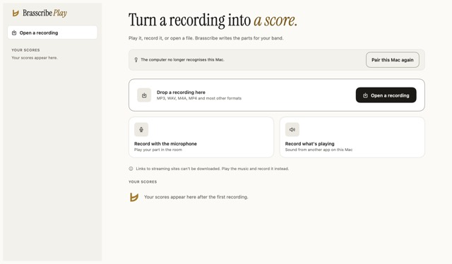](../../apps/apple/docs/responsive/home-needs-pairing-1280x800.jpg) |  |

### What is this?

Window content minimum reported by SwiftUI: **900 × 548** (a window of 900 × 600).

| Asked for | Got (window) | Render | Notes |
|---|---|---|---|
| min | 900 × 600 | [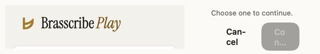](../../apps/apple/docs/responsive/source-min.jpg) | Cancel and Continue follow the cards, on one line. |
| 900 × 600 | 900 × 600 | [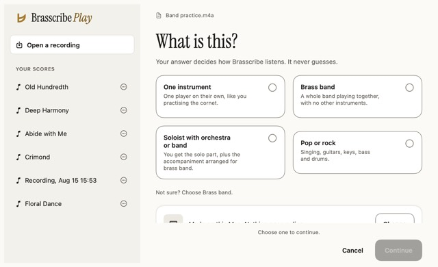](../../apps/apple/docs/responsive/source-900x600.jpg) |  |
| 1024 × 700 | 1024 × 700 | [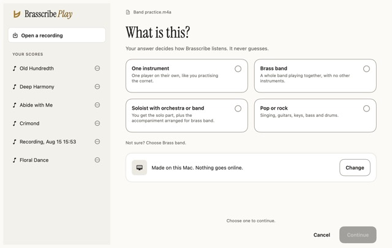](../../apps/apple/docs/responsive/source-1024x700.jpg) |  |
| 1280 × 800 | 1280 × 800 | [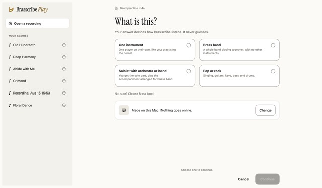](../../apps/apple/docs/responsive/source-1280x800.jpg) |  |
| 1512 × 900 | 1512 × 900 | [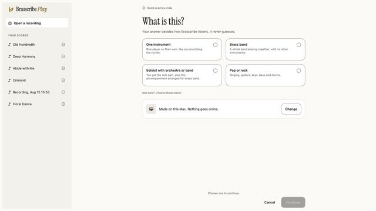](../../apps/apple/docs/responsive/source-1512x900.jpg) |  |
| 1920 × 1080 | 1920 × 1080 | [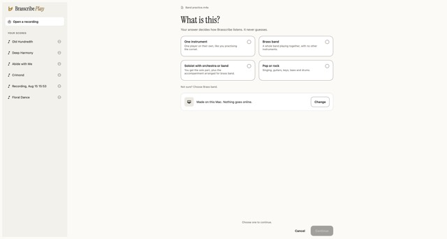](../../apps/apple/docs/responsive/source-1920x1080.jpg) | The actions sit under "Made on this Mac", not at the window bottom. |
| 2560 × 1400 | 2560 × 1400 | [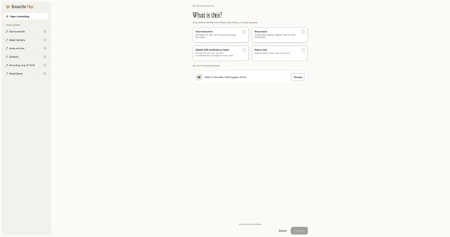](../../apps/apple/docs/responsive/source-2560x1400.jpg) | 720 pt column, top-aligned. Cards in a row are the same height. |

### Transcribing

Window content minimum reported by SwiftUI: **900 × 548** (a window of 900 × 600).

| Asked for | Got (window) | Render | Notes |
|---|---|---|---|
| min | 900 × 600 |  |  |
| 900 × 600 | 900 × 600 | [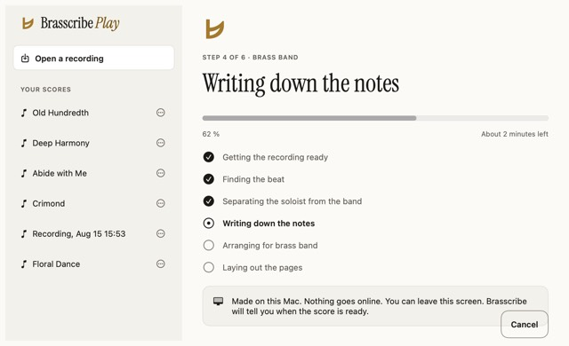](../../apps/apple/docs/responsive/transcribing-900x600.jpg) |  |
| 1024 × 700 | 1024 × 700 | [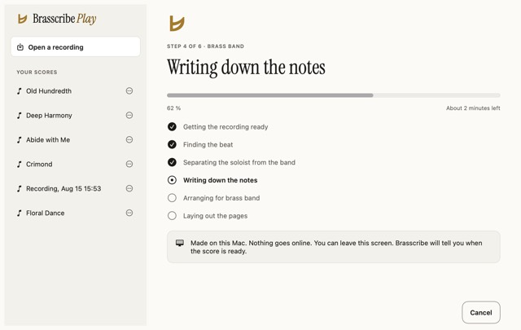](../../apps/apple/docs/responsive/transcribing-1024x700.jpg) |  |
| 1280 × 800 | 1280 × 800 | [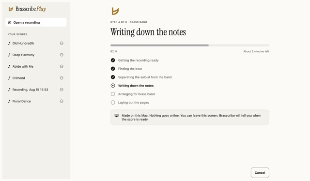](../../apps/apple/docs/responsive/transcribing-1280x800.jpg) |  |
| 1512 × 900 | 1512 × 900 | [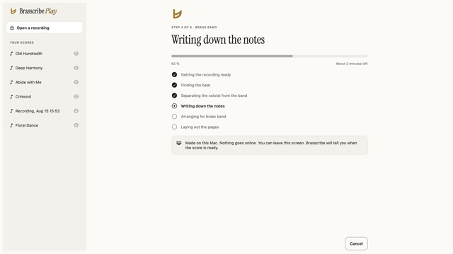](../../apps/apple/docs/responsive/transcribing-1512x900.jpg) |  |
| 1920 × 1080 | 1920 × 1080 | [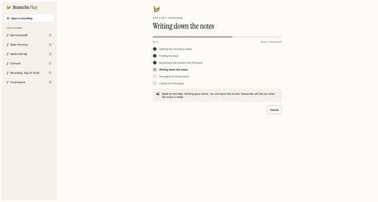](../../apps/apple/docs/responsive/transcribing-1920x1080.jpg) | Cancel follows the notice. |
| 2560 × 1400 | 2560 × 1400 | [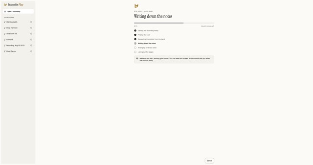](../../apps/apple/docs/responsive/transcribing-2560x1400.jpg) |  |

### Choose output

Window content minimum reported by SwiftUI: **900 × 548** (a window of 900 × 600).

| Asked for | Got (window) | Render | Notes |
|---|---|---|---|
| min | 900 × 600 | [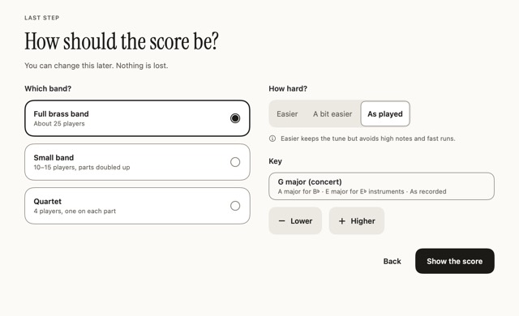](../../apps/apple/docs/responsive/output-min.jpg) | Everything fits at the minimum. Back and Show the score follow the choices. |
| 900 × 600 | 900 × 600 | [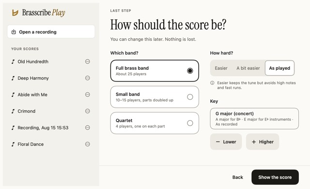](../../apps/apple/docs/responsive/output-900x600.jpg) |  |
| 1024 × 700 | 1024 × 700 | [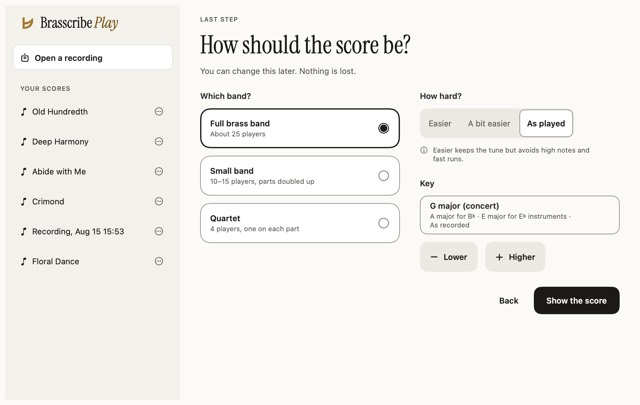](../../apps/apple/docs/responsive/output-1024x700.jpg) |  |
| 1280 × 800 | 1280 × 800 | [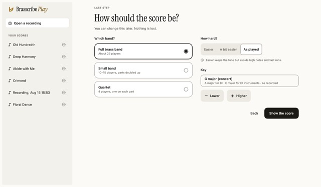](../../apps/apple/docs/responsive/output-1280x800.jpg) |  |
| 1512 × 900 | 1512 × 900 | [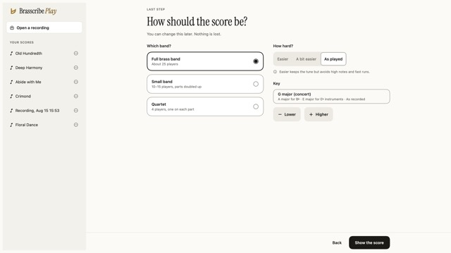](../../apps/apple/docs/responsive/output-1512x900.jpg) |  |
| 1920 × 1080 | 1920 × 1080 | [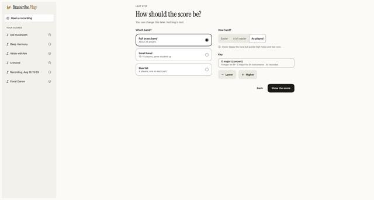](../../apps/apple/docs/responsive/output-1920x1080.jpg) |  |
| 2560 × 1400 | 2560 × 1400 | [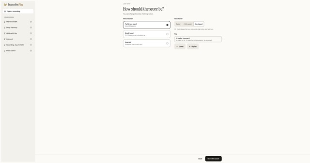](../../apps/apple/docs/responsive/output-2560x1400.jpg) | 880 pt column, with the actions following it. |

### Score, all parts

Window content minimum reported by SwiftUI: **900 × 548** (a window of 900 × 600).

| Asked for | Got (window) | Render | Notes |
|---|---|---|---|
| min | 900 × 600 |  | At 900 × 600 the sidebar steps aside, and the parts column (320) sits beside the score. The player wraps onto three rows. |
| 900 × 600 | 900 × 600 | [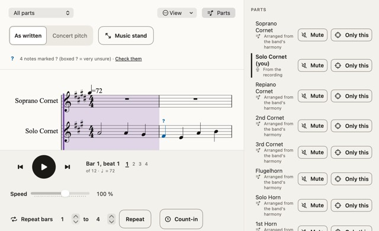](../../apps/apple/docs/responsive/score-all-900x600.jpg) |  |
| 1024 × 700 | 1024 × 700 | [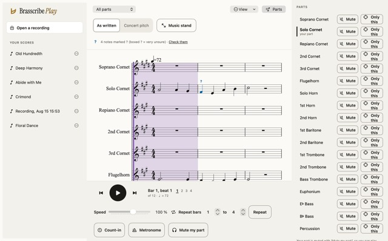](../../apps/apple/docs/responsive/score-all-1024x700.jpg) | With the sidebar shown, the score is too narrow for the parts column as well, so the column steps aside. Parts opens the parts in a sheet. |
| 1280 × 800 | 1280 × 800 | [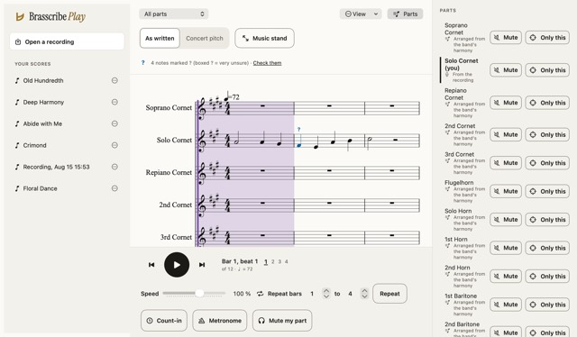](../../apps/apple/docs/responsive/score-all-1280x800.jpg) | Sidebar, score and parts column. |
| 1512 × 900 | 1512 × 900 | [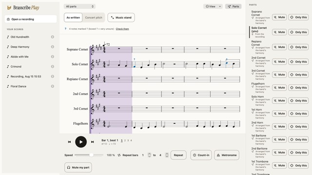](../../apps/apple/docs/responsive/score-all-1512x900.jpg) |  |
| 1920 × 1080 | 1920 × 1080 | [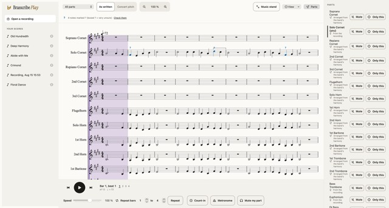](../../apps/apple/docs/responsive/score-all-1920x1080.jpg) |  |
| 2560 × 1400 | 2560 × 1400 | [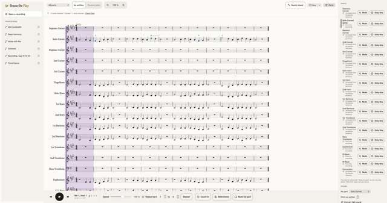](../../apps/apple/docs/responsive/score-all-2560x1400.jpg) | The score fills the window. |

### Score, one part

Window content minimum reported by SwiftUI: **900 × 548** (a window of 900 × 600).

| Asked for | Got (window) | Render | Notes |
|---|---|---|---|
| min | 900 × 600 | [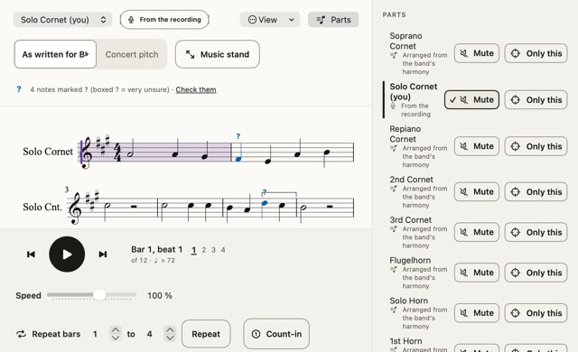](../../apps/apple/docs/responsive/score-part-min.jpg) | The same minimum as every other screen. |
| 900 × 600 | 900 × 600 |  |  |
| 1024 × 700 | 1024 × 700 | [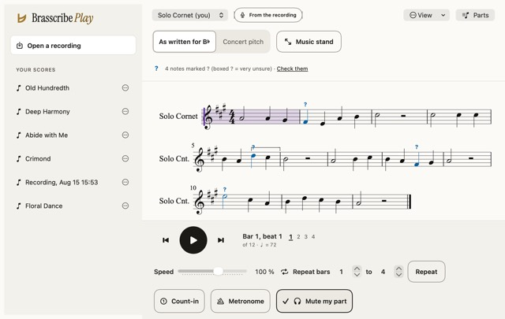](../../apps/apple/docs/responsive/score-part-1024x700.jpg) |  |
| 1280 × 800 | 1280 × 800 | [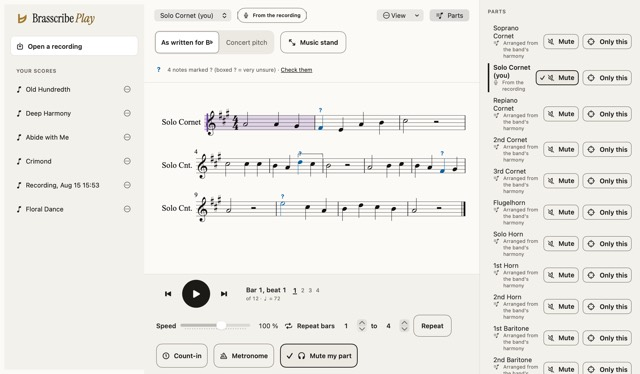](../../apps/apple/docs/responsive/score-part-1280x800.jpg) |  |
| 1512 × 900 | 1512 × 900 | [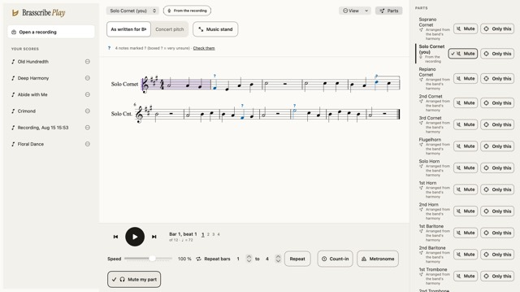](../../apps/apple/docs/responsive/score-part-1512x900.jpg) | Fits a MacBook's visible area. |
| 1920 × 1080 | 1920 × 1080 | [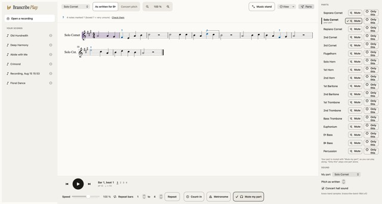](../../apps/apple/docs/responsive/score-part-1920x1080.jpg) |  |
| 2560 × 1400 | 2560 × 1400 | [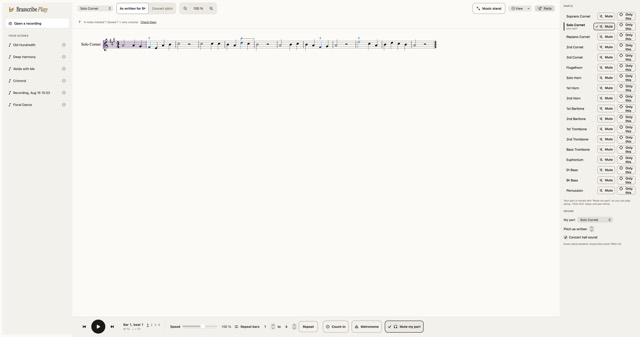](../../apps/apple/docs/responsive/score-part-2560x1400.jpg) |  |

### The music stand

Window content minimum reported by SwiftUI: **900 × 548** (a window of 900 × 600).

| Asked for | Got (window) | Render | Notes |
|---|---|---|---|
| min | 900 × 600 | [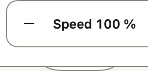](../../apps/apple/docs/responsive/stand-min.jpg) | The window minimum. The sidebar stays aside for the stand. |
| 900 × 600 | 900 × 600 | [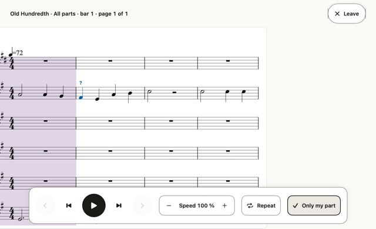](../../apps/apple/docs/responsive/stand-900x600.jpg) |  |
| 1024 × 700 | 1024 × 700 | [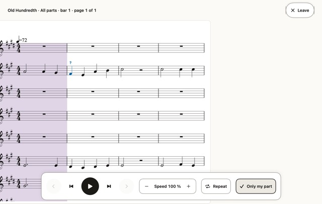](../../apps/apple/docs/responsive/stand-1024x700.jpg) |  |
| 1280 × 800 | 1280 × 800 | [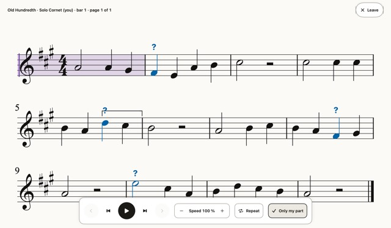](../../apps/apple/docs/responsive/stand-1280x800.jpg) |  |
| 1512 × 900 | 1512 × 900 | [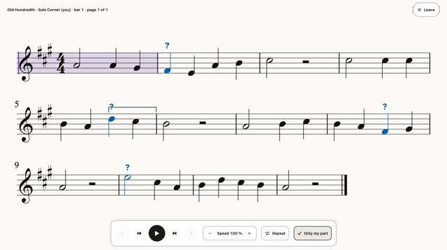](../../apps/apple/docs/responsive/stand-1512x900.jpg) |  |
| 1920 × 1080 | 1920 × 1080 | [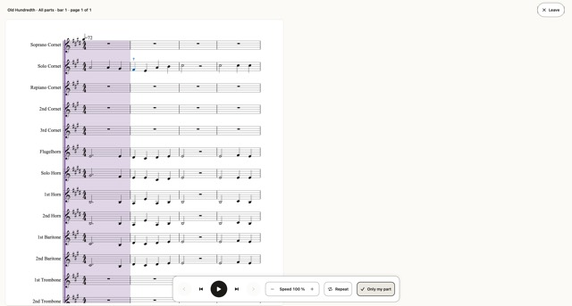](../../apps/apple/docs/responsive/stand-1920x1080.jpg) | One page takes the full width, centred, instead of half of a spread. |
| 2560 × 1400 | 2560 × 1400 | [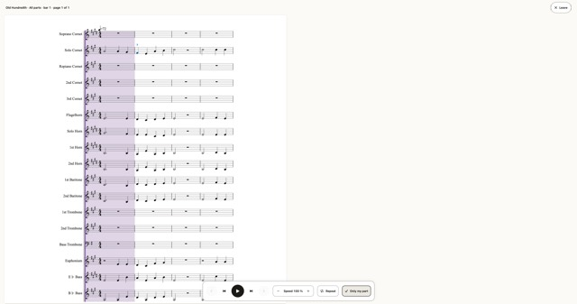](../../apps/apple/docs/responsive/stand-2560x1400.jpg) | One page, full width. |

### Review (Check the notes)

Window content minimum reported by SwiftUI: **900 × 548** (a window of 900 × 600).

| Asked for | Got (window) | Render | Notes |
|---|---|---|---|
| min | 900 × 600 | [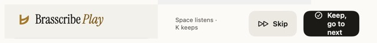](../../apps/apple/docs/responsive/review-min.jpg) | The sidebar steps aside. Skip and Keep follow the note. |
| 900 × 600 | 900 × 600 | [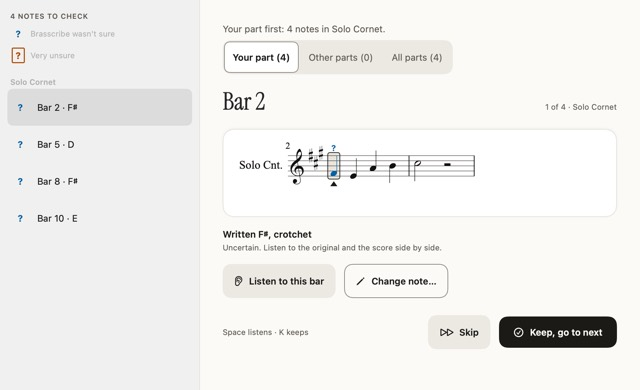](../../apps/apple/docs/responsive/review-900x600.jpg) |  |
| 1024 × 700 | 1024 × 700 | [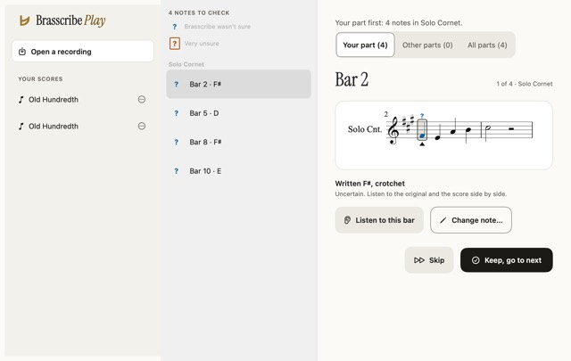](../../apps/apple/docs/responsive/review-1024x700.jpg) | The keys hint hides where there's no room beside the buttons. |
| 1280 × 800 | 1280 × 800 | [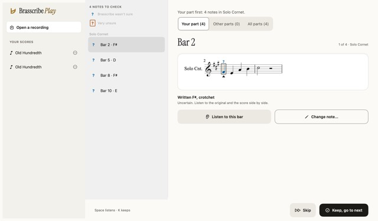](../../apps/apple/docs/responsive/review-1280x800.jpg) |  |
| 1512 × 900 | 1512 × 900 | [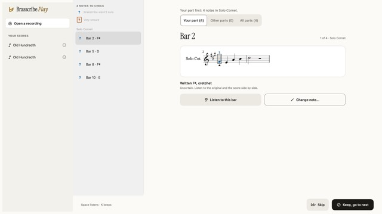](../../apps/apple/docs/responsive/review-1512x900.jpg) |  |
| 1920 × 1080 | 1920 × 1080 | [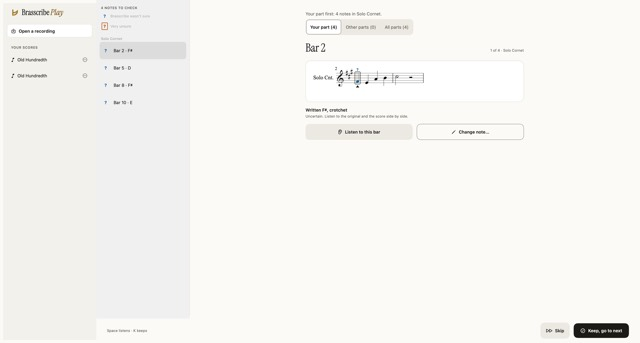](../../apps/apple/docs/responsive/review-1920x1080.jpg) | Skip and Keep sit under the note, in the column. |
| 2560 × 1400 | 2560 × 1400 | [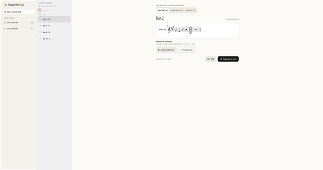](../../apps/apple/docs/responsive/review-2560x1400.jpg) |  |

### Problem: nothing was heard

Window content minimum reported by SwiftUI: **900 × 548** (a window of 900 × 600).

| Asked for | Got (window) | Render | Notes |
|---|---|---|---|
| min | 900 × 600 | [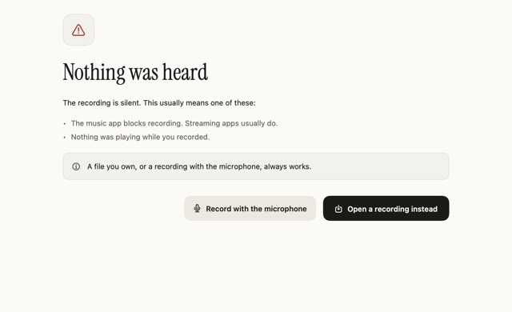](../../apps/apple/docs/responsive/problem-silence-min.jpg) | The actions form a row under the text, with the way forward last and on the right. |
| 900 × 600 | 900 × 600 | [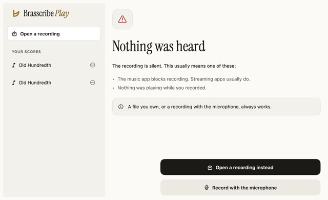](../../apps/apple/docs/responsive/problem-silence-900x600.jpg) |  |
| 1024 × 700 | 1024 × 700 | [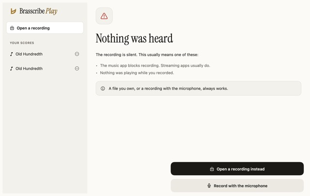](../../apps/apple/docs/responsive/problem-silence-1024x700.jpg) |  |
| 1280 × 800 | 1280 × 800 | [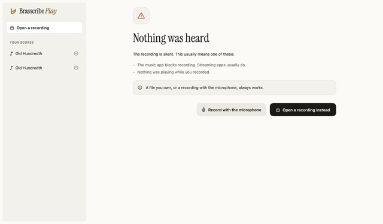](../../apps/apple/docs/responsive/problem-silence-1280x800.jpg) |  |
| 1512 × 900 | 1512 × 900 | [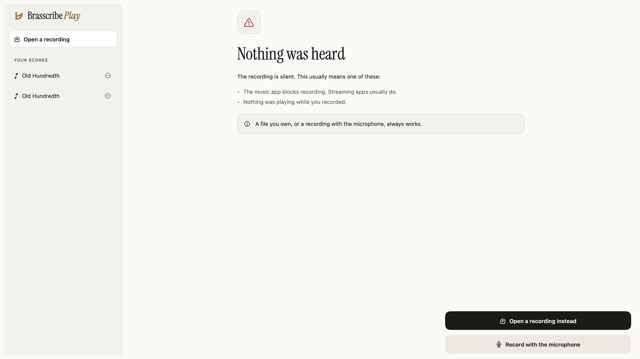](../../apps/apple/docs/responsive/problem-silence-1512x900.jpg) |  |
| 1920 × 1080 | 1920 × 1080 | [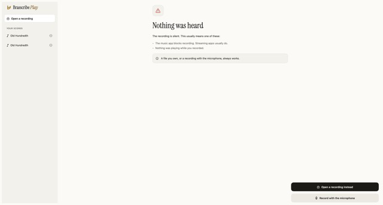](../../apps/apple/docs/responsive/problem-silence-1920x1080.jpg) | The actions follow the text, inside the column. |
| 2560 × 1400 | 2560 × 1400 | [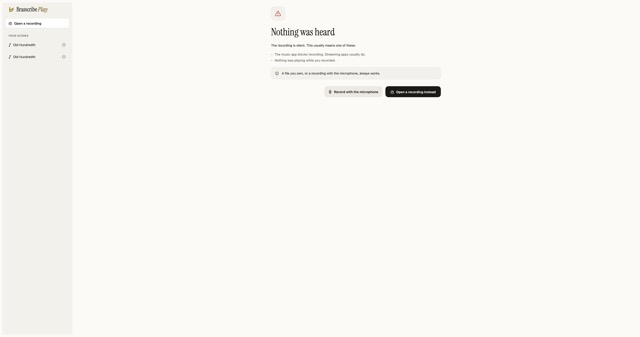](../../apps/apple/docs/responsive/problem-silence-2560x1400.jpg) |  |

### Problem: copy-protected

Window content minimum reported by SwiftUI: **900 × 548** (a window of 900 × 600).

| Asked for | Got (window) | Render | Notes |
|---|---|---|---|
| min | 900 × 600 | [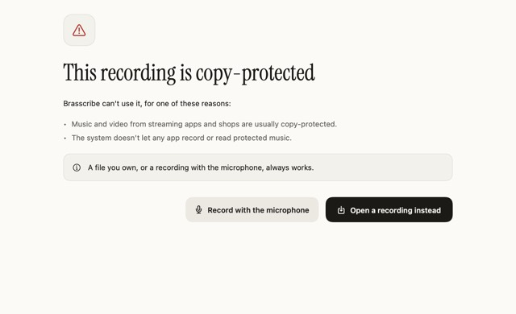](../../apps/apple/docs/responsive/problem-copy-protected-min.jpg) |  |
| 1280 × 800 | 1280 × 800 | [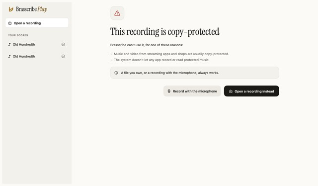](../../apps/apple/docs/responsive/problem-copy-protected-1280x800.jpg) |  |

### Problem: can't open the file

Window content minimum reported by SwiftUI: **900 × 548** (a window of 900 × 600).

| Asked for | Got (window) | Render | Notes |
|---|---|---|---|
| min | 900 × 600 | [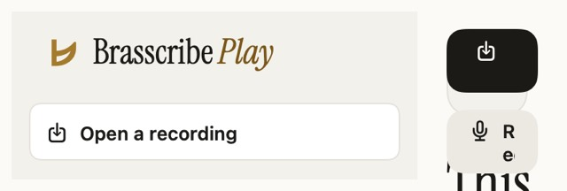](../../apps/apple/docs/responsive/problem-cant-open-min.jpg) |  |
| 1280 × 800 | 1280 × 800 | [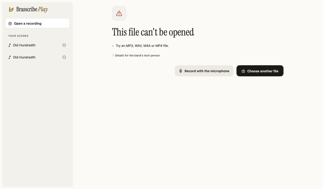](../../apps/apple/docs/responsive/problem-cant-open-1280x800.jpg) |  |

## Sheets (after the fixes)

A sheet opens at its ideal size, within its minimum and maximum (sizes in pt; ∞ = no limit). The
maximum height is 90 % of the visible height of the screen the test ran on. The buttons a macOS sheet
shows along its bottom edge (Change note's Cancel and Save) aren't drawn (see Limits).

| Sheet | Min | Ideal (opens at) | Max | Render |
|---|---|---|---|---|
| settings | 520 × 360 | 600 × 786 | 680 × 786 | [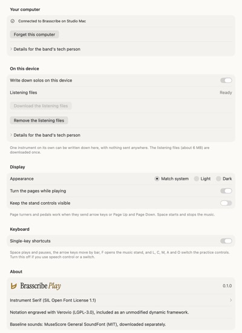](../../apps/apple/docs/responsive/sheet-settings.jpg) |
| settings-pairing | 520 × 360 | 600 × 786 | 680 × 786 | [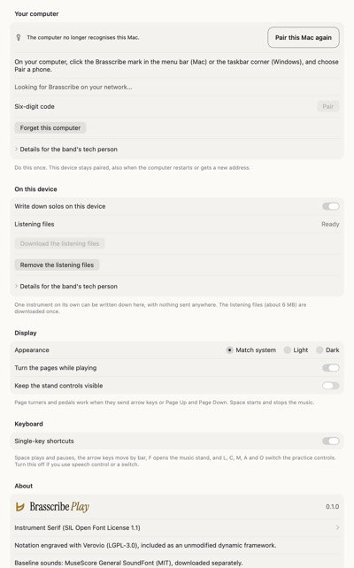](../../apps/apple/docs/responsive/sheet-settings-pairing.jpg) |
| export | 560 × 1 | 620 × 756 | 680 × 786 | [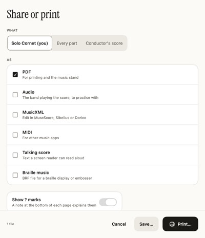](../../apps/apple/docs/responsive/sheet-export.jpg) |
| talking-score | 480 × 560 | 480 × 560 | ∞ × ∞ | [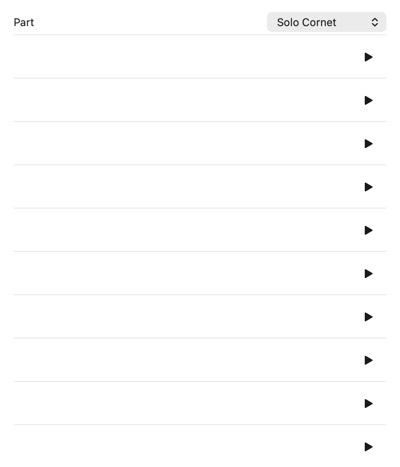](../../apps/apple/docs/responsive/sheet-talking-score.jpg) |
| change-note | 420 × 1 | 480 × 186 | 560 × 786 | [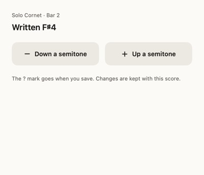](../../apps/apple/docs/responsive/sheet-change-note.jpg) |
| first-run | 520 × 1 | 600 × 619 | 680 × 786 | [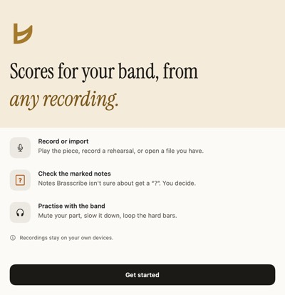](../../apps/apple/docs/responsive/sheet-first-run.jpg) |
| record-mic | 420 × 1 | 460 × 210 | 560 × 786 | [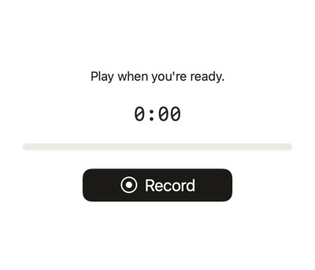](../../apps/apple/docs/responsive/sheet-record-mic.jpg) |
| record-capture | 480 × 1 | 540 × 286 | 640 × 786 | [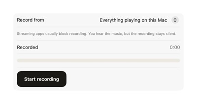](../../apps/apple/docs/responsive/sheet-record-capture.jpg) |
| match-code | 40 × 64 | 185 × 116 | ∞ × 116 | [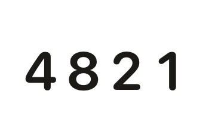](../../apps/apple/docs/responsive/sheet-match-code.jpg) |

## Next

- Resize and zoom XCUITests in the macOS VM (never on a Mac someone is using): resize across the
  1000 pt sidebar line and down to the minimum on each screen, zoom from a small window, and confirm
  that the detail lays out again at once after the sidebar comes or goes.
- The pairing "waiting for the computer" state can't be reached from a test yet.
